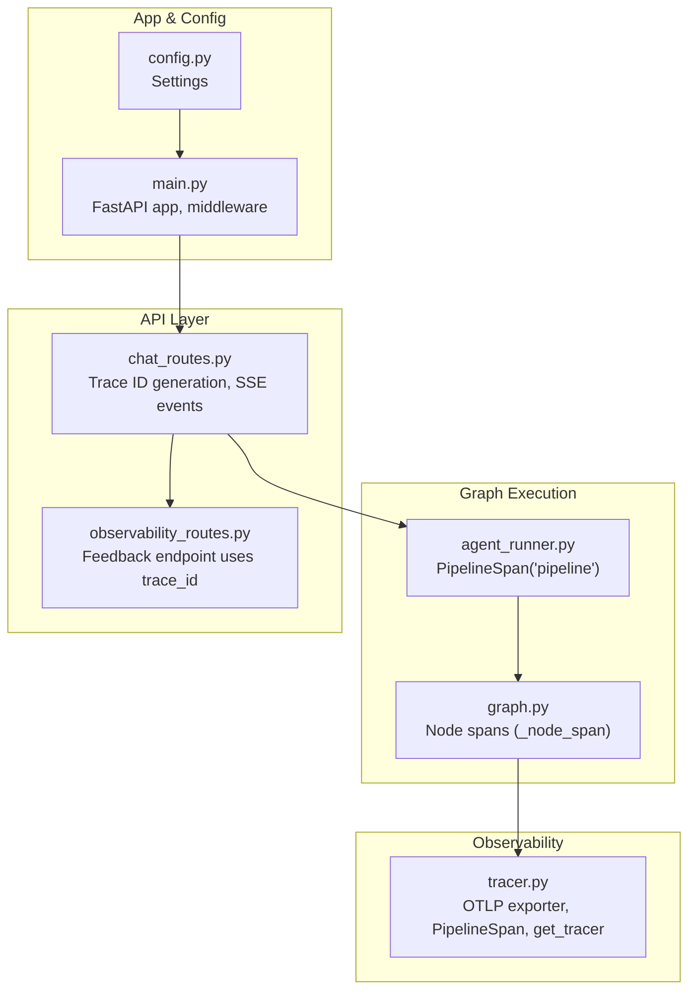
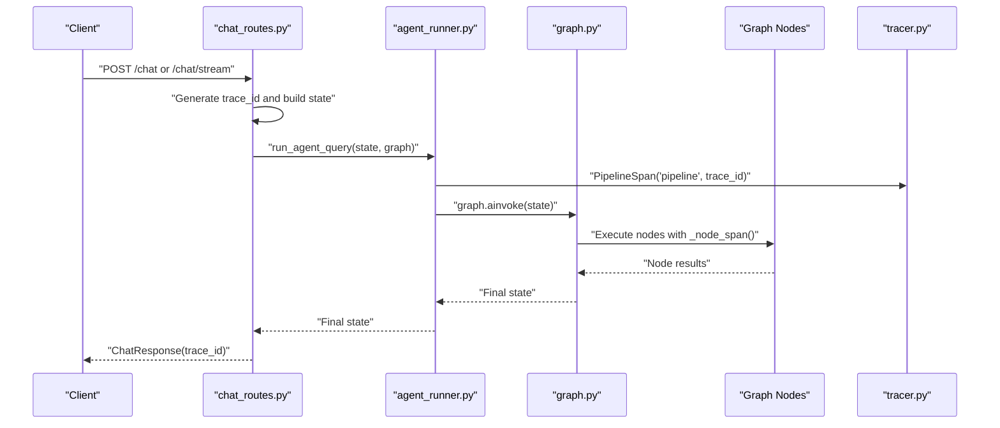
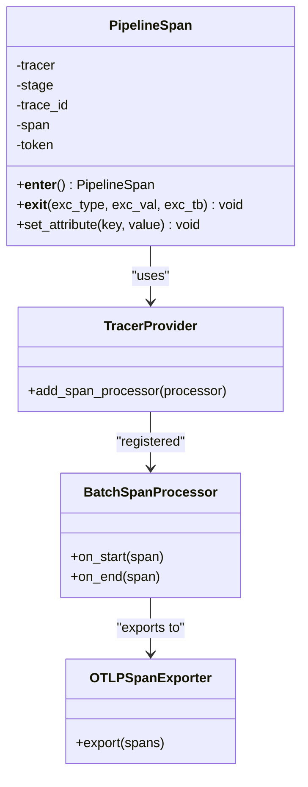
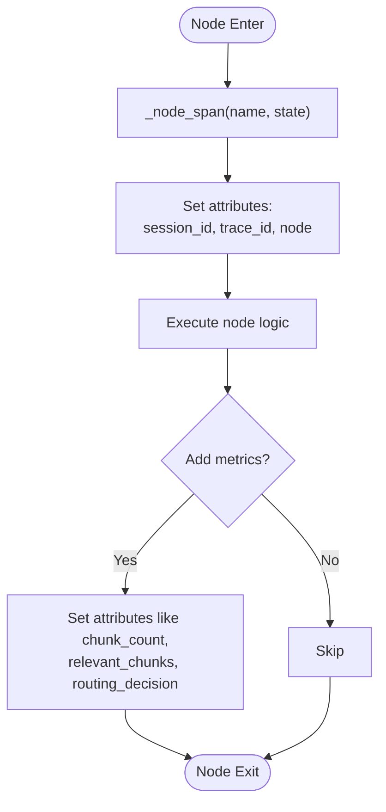
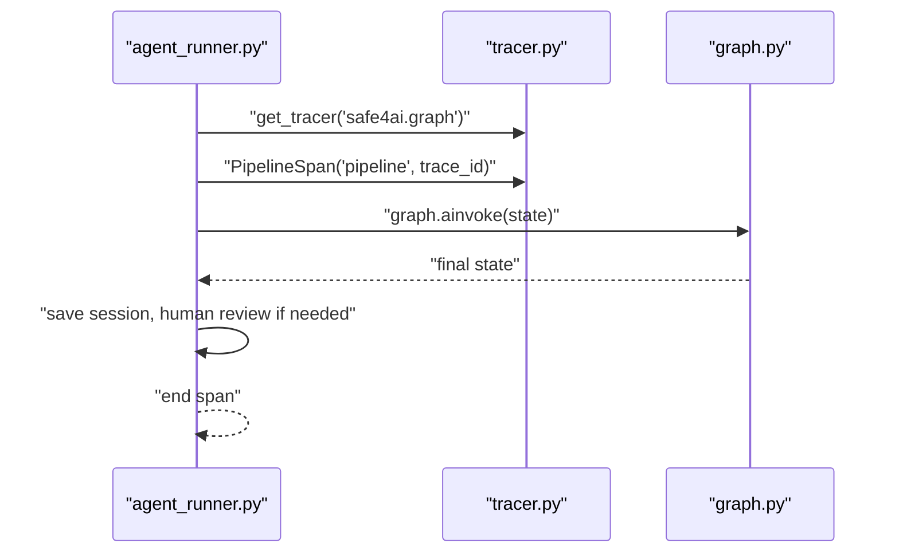
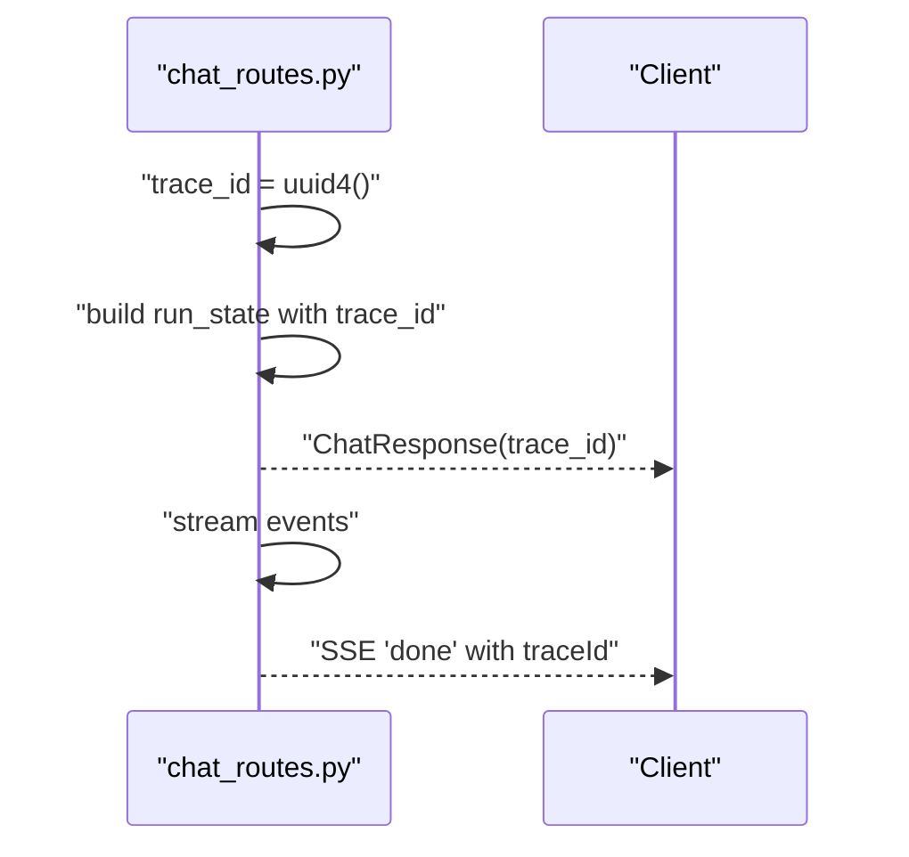
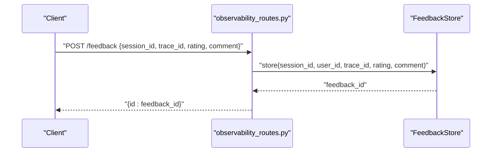
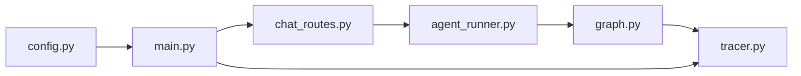

# Distributed Tracing

<cite>
**Referenced Files in This Document**
- [tracer.py](file://safe4ai-pilot/observability/tracer.py)
- [graph.py](file://safe4ai-pilot/app/agents/graph.py)
- [agent_runner.py](file://safe4ai-pilot/app/services/agent_runner.py)
- [chat_routes.py](file://safe4ai-pilot/app/api/chat_routes.py)
- [observability_routes.py](file://safe4ai-pilot/app/api/observability_routes.py)
- [test_tracer.py](file://safe4ai-pilot/tests/test_tracer.py)
- [models.py](file://safe4ai-pilot/app/models.py)
- [main.py](file://safe4ai-pilot/app/main.py)
- [config.py](file://safe4ai-pilot/app/config.py)
</cite>

## Table of Contents
1. [Introduction](#introduction)
2. [Project Structure](#project-structure)
3. [Core Components](#core-components)
4. [Architecture Overview](#architecture-overview)
5. [Detailed Component Analysis](#detailed-component-analysis)
6. [Dependency Analysis](#dependency-analysis)
7. [Performance Considerations](#performance-considerations)
8. [Troubleshooting Guide](#troubleshooting-guide)
9. [Conclusion](#conclusion)
10. [Appendices](#appendices)

## Introduction
This document explains the Private AI system’s distributed tracing implementation with OpenTelemetry and Jaeger visualization. It focuses on how the PipelineSpan context manager tracks each stage of the AI pipeline, how spans are propagated across microservices, and how to interpret traces in Jaeger. It also provides practical guidance for adding custom spans, extracting trace IDs for log correlation, implementing distributed tracing middleware, and troubleshooting performance bottlenecks.

## Project Structure
The tracing implementation spans several modules:
- Observability: OpenTelemetry initialization, exporter configuration, and the PipelineSpan context manager
- Graph and Agent Runner: Node-level spans and pipeline-level spans around the LangGraph execution
- API: Endpoint orchestration that generates a top-level trace ID and returns it to clients
- Observability Routes: Feedback and cost endpoints that use trace IDs for correlation
- Tests: Unit tests validating the tracer and PipelineSpan behavior

**Diagram sources**
- [tracer.py:1-75](file://safe4ai-pilot/observability/tracer.py#L1-L75)
- [graph.py:1-342](file://safe4ai-pilot/app/agents/graph.py#L1-L342)
- [agent_runner.py:1-55](file://safe4ai-pilot/app/services/agent_runner.py#L1-L55)
- [chat_routes.py:1-245](file://safe4ai-pilot/app/api/chat_routes.py#L1-L245)
- [observability_routes.py:1-57](file://safe4ai-pilot/app/api/observability_routes.py#L1-L57)
- [main.py:1-154](file://safe4ai-pilot/app/main.py#L1-L154)
- [config.py:1-28](file://safe4ai-pilot/app/config.py#L1-L28)

**Section sources**
- [tracer.py:1-75](file://safe4ai-pilot/observability/tracer.py#L1-L75)
- [graph.py:1-342](file://safe4ai-pilot/app/agents/graph.py#L1-L342)
- [agent_runner.py:1-55](file://safe4ai-pilot/app/services/agent_runner.py#L1-L55)
- [chat_routes.py:1-245](file://safe4ai-pilot/app/api/chat_routes.py#L1-L245)
- [observability_routes.py:1-57](file://safe4ai-pilot/app/api/observability_routes.py#L1-L57)
- [main.py:1-154](file://safe4ai-pilot/app/main.py#L1-L154)
- [config.py:1-28](file://safe4ai-pilot/app/config.py#L1-L28)

## Core Components
- OpenTelemetry provider and exporter
  - OTLP gRPC exporter configured via environment variable for the endpoint
  - BatchSpanProcessor for efficient export
- PipelineSpan context manager
  - Validates stage names against a strict set
  - Sets standardized attributes: trace_id, stage
  - Propagates context into the current OpenTelemetry context
  - Records exceptions on exit when present
- Node-level spans in the graph
  - Uses a dedicated tracer for graph nodes
  - Inherits context from the pipeline span
  - Adds node-specific attributes (e.g., chunk_count, relevant_chunks)
- Trace ID lifecycle
  - Generated at the API boundary and passed through state
  - Returned to clients in responses and SSE events
  - Used by observability endpoints for correlation

**Section sources**
- [tracer.py:14-75](file://safe4ai-pilot/observability/tracer.py#L14-L75)
- [graph.py:21-32](file://safe4ai-pilot/app/agents/graph.py#L21-L32)
- [chat_routes.py:126-142](file://safe4ai-pilot/app/api/chat_routes.py#L126-L142)
- [models.py:49-95](file://safe4ai-pilot/app/models.py#L49-L95)

## Architecture Overview
The tracing architecture integrates OpenTelemetry across the API boundary, the graph execution, and downstream observability endpoints.

**Diagram sources**
- [chat_routes.py:109-142](file://safe4ai-pilot/app/api/chat_routes.py#L109-L142)
- [agent_runner.py:26-33](file://safe4ai-pilot/app/services/agent_runner.py#L26-L33)
- [graph.py:39-341](file://safe4ai-pilot/app/agents/graph.py#L39-L341)
- [tracer.py:34-75](file://safe4ai-pilot/observability/tracer.py#L34-L75)

## Detailed Component Analysis

### PipelineSpan Context Manager
PipelineSpan wraps a single stage of the pipeline with a span, sets essential attributes, and propagates the context. It ensures exceptions are recorded and the span is ended cleanly.

**Diagram sources**
- [tracer.py:34-75](file://safe4ai-pilot/observability/tracer.py#L34-L75)

Key behaviors:
- Stage validation prevents invalid stages
- Standard attributes include trace_id and stage
- Context propagation via OpenTelemetry context
- Exception recording on exit

**Section sources**
- [tracer.py:34-75](file://safe4ai-pilot/observability/tracer.py#L34-L75)
- [test_tracer.py:26-76](file://safe4ai-pilot/tests/test_tracer.py#L26-L76)

### Node-Level Spans in the Graph
Each graph node creates a child span inheriting context from the pipeline span. These spans capture session and trace identifiers and node-specific metrics.

**Diagram sources**
- [graph.py:24-32](file://safe4ai-pilot/app/agents/graph.py#L24-L32)
- [graph.py:87-107](file://safe4ai-pilot/app/agents/graph.py#L87-L107)
- [graph.py:109-137](file://safe4ai-pilot/app/agents/graph.py#L109-L137)
- [graph.py:139-174](file://safe4ai-pilot/app/agents/graph.py#L139-L174)
- [graph.py:176-231](file://safe4ai-pilot/app/agents/graph.py#L176-L231)
- [graph.py:233-252](file://safe4ai-pilot/app/agents/graph.py#L233-L252)
- [graph.py:254-284](file://safe4ai-pilot/app/agents/graph.py#L254-L284)

**Section sources**
- [graph.py:21-32](file://safe4ai-pilot/app/agents/graph.py#L21-L32)
- [graph.py:87-107](file://safe4ai-pilot/app/agents/graph.py#L87-L107)
- [graph.py:109-137](file://safe4ai-pilot/app/agents/graph.py#L109-L137)
- [graph.py:139-174](file://safe4ai-pilot/app/agents/graph.py#L139-L174)
- [graph.py:176-231](file://safe4ai-pilot/app/agents/graph.py#L176-L231)
- [graph.py:233-252](file://safe4ai-pilot/app/agents/graph.py#L233-L252)
- [graph.py:254-284](file://safe4ai-pilot/app/agents/graph.py#L254-L284)

### PipelineSpan Usage in Agent Runner
The agent runner wraps the entire graph execution in a pipeline-level span, setting session and user attributes, and saving the final state afterward.

**Diagram sources**
- [agent_runner.py:26-33](file://safe4ai-pilot/app/services/agent_runner.py#L26-L33)
- [tracer.py:72-75](file://safe4ai-pilot/observability/tracer.py#L72-L75)
- [graph.py:39-341](file://safe4ai-pilot/app/agents/graph.py#L39-L341)

**Section sources**
- [agent_runner.py:26-33](file://safe4ai-pilot/app/services/agent_runner.py#L26-L33)

### Trace ID Lifecycle and Return to Clients
The API generates a trace ID early in the request lifecycle and returns it to clients. The SSE stream also emits the trace ID upon completion.

**Diagram sources**
- [chat_routes.py:126-142](file://safe4ai-pilot/app/api/chat_routes.py#L126-L142)
- [chat_routes.py:226-233](file://safe4ai-pilot/app/api/chat_routes.py#L226-L233)

**Section sources**
- [chat_routes.py:126-142](file://safe4ai-pilot/app/api/chat_routes.py#L126-L142)
- [chat_routes.py:226-233](file://safe4ai-pilot/app/api/chat_routes.py#L226-L233)

### Feedback Endpoint Correlation
The feedback endpoint accepts a trace_id alongside session_id and user context, enabling correlation between user feedback and trace data.

**Diagram sources**
- [observability_routes.py:26-35](file://safe4ai-pilot/app/api/observability_routes.py#L26-L35)

**Section sources**
- [observability_routes.py:19-35](file://safe4ai-pilot/app/api/observability_routes.py#L19-L35)

## Dependency Analysis
The tracing stack depends on OpenTelemetry SDK components and FastAPI middleware. The graph depends on the tracer for node spans, while the agent runner depends on PipelineSpan for the pipeline-level span.

**Diagram sources**
- [config.py:1-28](file://safe4ai-pilot/app/config.py#L1-L28)
- [main.py:1-154](file://safe4ai-pilot/app/main.py#L1-L154)
- [chat_routes.py:1-245](file://safe4ai-pilot/app/api/chat_routes.py#L1-L245)
- [agent_runner.py:1-55](file://safe4ai-pilot/app/services/agent_runner.py#L1-L55)
- [graph.py:1-342](file://safe4ai-pilot/app/agents/graph.py#L1-L342)
- [tracer.py:1-75](file://safe4ai-pilot/observability/tracer.py#L1-L75)

**Section sources**
- [config.py:1-28](file://safe4ai-pilot/app/config.py#L1-L28)
- [main.py:1-154](file://safe4ai-pilot/app/main.py#L1-L154)
- [chat_routes.py:1-245](file://safe4ai-pilot/app/api/chat_routes.py#L1-L245)
- [agent_runner.py:1-55](file://safe4ai-pilot/app/services/agent_runner.py#L1-L55)
- [graph.py:1-342](file://safe4ai-pilot/app/agents/graph.py#L1-L342)
- [tracer.py:1-75](file://safe4ai-pilot/observability/tracer.py#L1-L75)

## Performance Considerations
- Span overhead: BatchSpanProcessor reduces network overhead; keep attributes concise
- Attribute cardinality: Prefer low-cardinality attributes; avoid per-item arrays in attributes
- Sampling: Use OpenTelemetry sampling strategies at the collector or SDK level to reduce load
- Exporter endpoint: Ensure OTEL_EXPORTER_OTLP_ENDPOINT points to a reachable collector
- Network timeouts: Configure appropriate timeouts for external LLM and vector DB calls to avoid long-running spans

[No sources needed since this section provides general guidance]

## Troubleshooting Guide
- Verify OTLP exporter configuration
  - Confirm OTEL_EXPORTER_OTLP_ENDPOINT environment variable is set appropriately
  - Ensure the endpoint supports gRPC and is reachable from the service
- Validate span creation and attributes
  - Check that PipelineSpan is used for each stage and that attributes include trace_id and stage
  - Confirm node spans inherit context and include node-specific attributes
- Correlate logs with traces
  - Extract trace_id from ChatResponse or SSE 'done' event
  - Use the trace_id to search in Jaeger UI
- Debug exceptions
  - Exceptions raised within spans are recorded automatically
  - Inspect error attributes and node-level spans for failure points
- Validate stage names
  - PipelineSpan raises on invalid stages; confirm stage names match the allowed set

**Section sources**
- [tracer.py:27-31](file://safe4ai-pilot/observability/tracer.py#L27-L31)
- [tracer.py:37-39](file://safe4ai-pilot/observability/tracer.py#L37-L39)
- [chat_routes.py:137-142](file://safe4ai-pilot/app/api/chat_routes.py#L137-L142)
- [chat_routes.py:226-233](file://safe4ai-pilot/app/api/chat_routes.py#L226-L233)

## Conclusion
The Private AI system integrates OpenTelemetry with a clear pipeline and node-span model. PipelineSpan and node spans provide granular visibility into each stage of the AI pipeline, while the trace_id enables end-to-end correlation across services. By following the best practices outlined here, teams can effectively monitor performance, troubleshoot issues, and maintain observability as the system scales.

[No sources needed since this section summarizes without analyzing specific files]

## Appendices

### Practical How-Tos

- Add a custom span in a new pipeline stage
  - Use the tracer returned by get_tracer to start a span for the stage
  - Set attributes such as stage, trace_id, and any metrics
  - Record exceptions and end the span on completion

- Extract trace IDs for log correlation
  - From API responses: read the trace_id field in ChatResponse
  - From SSE streams: read the traceId field in the final 'done' event

- Implement distributed tracing middleware
  - Use FastAPI’s HTTP middleware to propagate trace context headers if needed
  - Ensure the middleware initializes OpenTelemetry before any traced code executes

- Interpret Jaeger traces
  - Filter by service name and operation (node name)
  - Use trace_id to isolate a single request
  - Look for error spans and high-latency nodes to identify bottlenecks

- Best practices for sampling and attributes
  - Prefer head-based sampling at the collector for accurate trace filtering
  - Tag only essential attributes; avoid high-cardinality fields
  - Keep stage names consistent with the allowed set to prevent validation errors

**Section sources**
- [tracer.py:72-75](file://safe4ai-pilot/observability/tracer.py#L72-L75)
- [chat_routes.py:137-142](file://safe4ai-pilot/app/api/chat_routes.py#L137-L142)
- [chat_routes.py:226-233](file://safe4ai-pilot/app/api/chat_routes.py#L226-L233)
- [main.py:78-96](file://safe4ai-pilot/app/main.py#L78-L96)