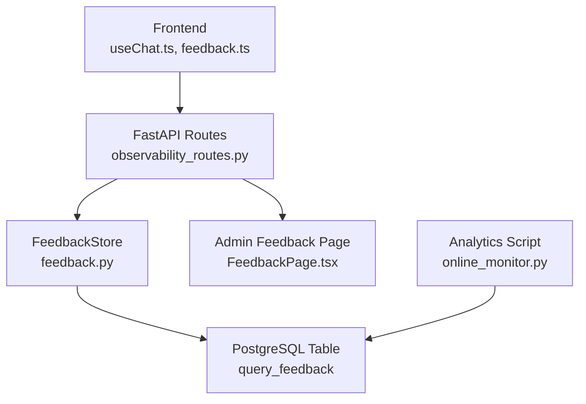
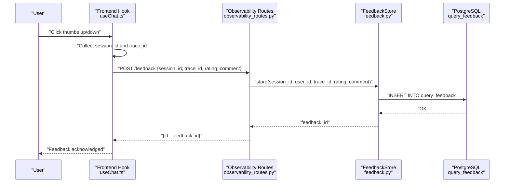
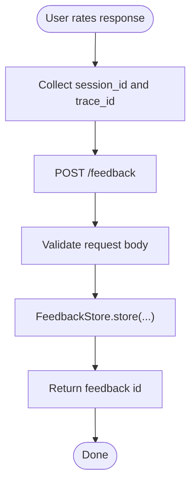
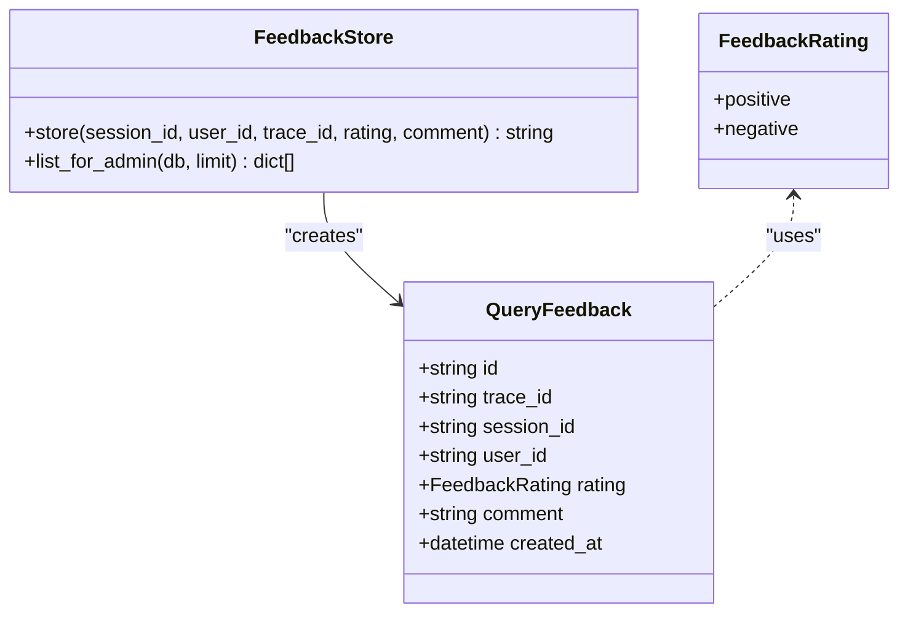
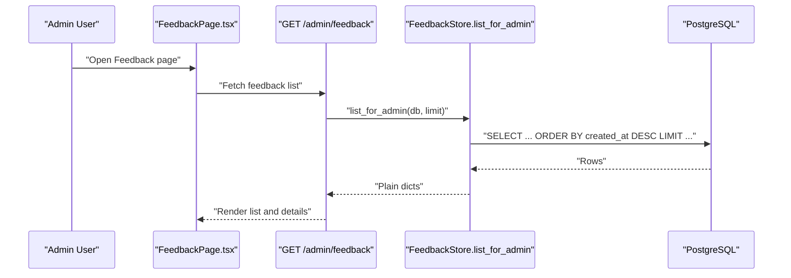
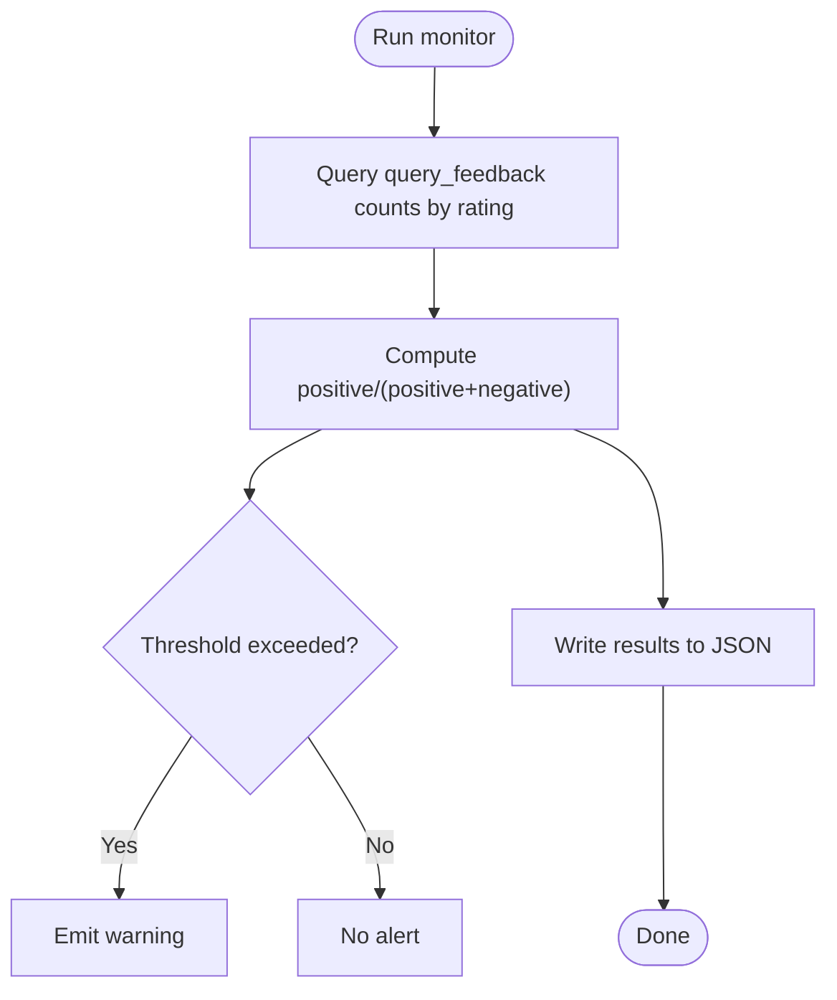
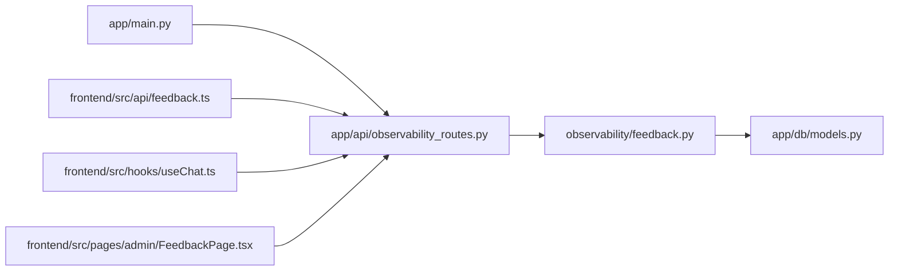

# Feedback Collection and Analytics

<cite>
**Referenced Files in This Document**
- [feedback.py](file://safe4ai-pilot/observability/feedback.py)
- [observability_routes.py](file://safe4ai-pilot/app/api/observability_routes.py)
- [models.py](file://safe4ai-pilot/app/db/models.py)
- [useChat.ts](file://safe4ai-pilot/frontend/src/hooks/useChat.ts)
- [feedback.ts](file://safe4ai-pilot/frontend/src/api/feedback.ts)
- [FeedbackPage.tsx](file://safe4ai-pilot/frontend/src/pages/admin/FeedbackPage.tsx)
- [FeedbackListItem.tsx](file://safe4ai-pilot/frontend/src/components/admin/FeedbackListItem.tsx)
- [online_monitor.py](file://safe4ai-pilot/evaluation/online_monitor.py)
- [test_feedback.py](file://safe4ai-pilot/tests/test_feedback.py)
- [main.py](file://safe4ai-pilot/app/main.py)
</cite>

## Table of Contents
1. [Introduction](#introduction)
2. [Project Structure](#project-structure)
3. [Core Components](#core-components)
4. [Architecture Overview](#architecture-overview)
5. [Detailed Component Analysis](#detailed-component-analysis)
6. [Dependency Analysis](#dependency-analysis)
7. [Performance Considerations](#performance-considerations)
8. [Troubleshooting Guide](#troubleshooting-guide)
9. [Privacy and Compliance](#privacy-and-compliance)
10. [Conclusion](#conclusion)
11. [Appendices](#appendices)

## Introduction
This document explains the feedback collection and analytics system for the Private AI pilot. It covers how users provide feedback on query responses, how feedback is stored and categorized, and how administrators can inspect and analyze feedback. It also describes automated analytics, dashboards, and integration points with customer support workflows. Privacy and compliance considerations are addressed to ensure responsible handling of feedback data.

## Project Structure
The feedback system spans three layers:
- Frontend: collects user ratings and optional comments, and displays administrative feedback views.
- Backend API: validates and persists feedback, exposes administrative endpoints, and integrates with analytics.
- Observability and persistence: stores feedback records and supports analytics queries.

**Diagram sources**
- [useChat.ts:95-102](file://safe4ai-pilot/frontend/src/hooks/useChat.ts#L95-L102)
- [feedback.ts:13-18](file://safe4ai-pilot/frontend/src/api/feedback.ts#L13-L18)
- [observability_routes.py:26-45](file://safe4ai-pilot/app/api/observability_routes.py#L26-L45)
- [feedback.py:16-71](file://safe4ai-pilot/observability/feedback.py#L16-L71)
- [models.py:146-156](file://safe4ai-pilot/app/db/models.py#L146-L156)
- [FeedbackPage.tsx:10-175](file://safe4ai-pilot/frontend/src/pages/admin/FeedbackPage.tsx#L10-L175)
- [online_monitor.py:87-109](file://safe4ai-pilot/evaluation/online_monitor.py#L87-L109)

**Section sources**
- [main.py:98-101](file://safe4ai-pilot/app/main.py#L98-L101)
- [observability_routes.py:16-57](file://safe4ai-pilot/app/api/observability_routes.py#L16-L57)
- [feedback.py:16-71](file://safe4ai-pilot/observability/feedback.py#L16-L71)
- [models.py:146-156](file://safe4ai-pilot/app/db/models.py#L146-L156)

## Core Components
- Feedback submission mechanism:
  - Frontend hook captures user ratings and posts them via the API with session and trace identifiers.
  - Backend route validates the request and delegates persistence to the FeedbackStore.
- Feedback storage and retrieval:
  - FeedbackStore writes a record to the query_feedback table and returns a generated identifier.
  - Administrative listing returns recent feedback rows for inspection.
- Analytics integration:
  - An offline monitor reads feedback counts to compute a user feedback ratio metric.
- Admin dashboard:
  - A dedicated page lists feedback, filters by rating, and shows details for triage.

**Section sources**
- [useChat.ts:95-102](file://safe4ai-pilot/frontend/src/hooks/useChat.ts#L95-L102)
- [feedback.ts:13-18](file://safe4ai-pilot/frontend/src/api/feedback.ts#L13-L18)
- [observability_routes.py:26-45](file://safe4ai-pilot/app/api/observability_routes.py#L26-L45)
- [feedback.py:16-71](file://safe4ai-pilot/observability/feedback.py#L16-L71)
- [online_monitor.py:87-109](file://safe4ai-pilot/evaluation/online_monitor.py#L87-L109)
- [FeedbackPage.tsx:10-175](file://safe4ai-pilot/frontend/src/pages/admin/FeedbackPage.tsx#L10-L175)

## Architecture Overview
The feedback lifecycle connects user actions to persistent storage and analytics:

**Diagram sources**
- [useChat.ts:95-102](file://safe4ai-pilot/frontend/src/hooks/useChat.ts#L95-L102)
- [feedback.ts:13-18](file://safe4ai-pilot/frontend/src/api/feedback.ts#L13-L18)
- [observability_routes.py:26-35](file://safe4ai-pilot/app/api/observability_routes.py#L26-L35)
- [feedback.py:22-49](file://safe4ai-pilot/observability/feedback.py#L22-L49)
- [models.py:146-156](file://safe4ai-pilot/app/db/models.py#L146-L156)

## Detailed Component Analysis

### Feedback Submission Mechanism
- Frontend:
  - The chat hook sends a rating event along with the current session and trace identifiers.
  - The submission API call includes optional comment payload.
- Backend:
  - The route validates the request body against a Pydantic model and requires an authenticated user.
  - It delegates persistence to FeedbackStore and returns a feedback identifier.

**Diagram sources**
- [useChat.ts:95-102](file://safe4ai-pilot/frontend/src/hooks/useChat.ts#L95-L102)
- [feedback.ts:13-18](file://safe4ai-pilot/frontend/src/api/feedback.ts#L13-L18)
- [observability_routes.py:26-35](file://safe4ai-pilot/app/api/observability_routes.py#L26-L35)
- [feedback.py:22-49](file://safe4ai-pilot/observability/feedback.py#L22-L49)

**Section sources**
- [useChat.ts:95-102](file://safe4ai-pilot/frontend/src/hooks/useChat.ts#L95-L102)
- [feedback.ts:13-18](file://safe4ai-pilot/frontend/src/api/feedback.ts#L13-L18)
- [observability_routes.py:19-35](file://safe4ai-pilot/app/api/observability_routes.py#L19-L35)

### Feedback Storage and Categorization
- Data model:
  - FeedbackRating enum defines positive/negative categories.
  - QueryFeedback table stores identifiers, trace/session/user linkage, rating, optional comment, and timestamps.
- Persistence:
  - FeedbackStore generates a UUID, constructs a record, commits to the database, and logs metadata.

**Diagram sources**
- [models.py:41-43](file://safe4ai-pilot/app/db/models.py#L41-L43)
- [models.py:146-156](file://safe4ai-pilot/app/db/models.py#L146-L156)
- [feedback.py:16-71](file://safe4ai-pilot/observability/feedback.py#L16-L71)

**Section sources**
- [models.py:41-43](file://safe4ai-pilot/app/db/models.py#L41-L43)
- [models.py:146-156](file://safe4ai-pilot/app/db/models.py#L146-L156)
- [feedback.py:16-71](file://safe4ai-pilot/observability/feedback.py#L16-L71)

### Administrative Feedback Dashboard
- Listing and filtering:
  - Admin endpoint returns recent feedback rows ordered by creation time.
  - The admin page renders a list with up/down filters and selected item details.
- Detail view:
  - Displays user identity, session and trace identifiers, rating, and optional comment.
  - Includes a “suspected cause” guidance area for triage.

**Diagram sources**
- [FeedbackPage.tsx:10-175](file://safe4ai-pilot/frontend/src/pages/admin/FeedbackPage.tsx#L10-L175)
- [feedback.ts:30-43](file://safe4ai-pilot/frontend/src/api/feedback.ts#L30-L43)
- [observability_routes.py:38-45](file://safe4ai-pilot/app/api/observability_routes.py#L38-L45)
- [feedback.py:51-70](file://safe4ai-pilot/observability/feedback.py#L51-L70)

**Section sources**
- [FeedbackPage.tsx:10-175](file://safe4ai-pilot/frontend/src/pages/admin/FeedbackPage.tsx#L10-L175)
- [FeedbackListItem.tsx:1-30](file://safe4ai-pilot/frontend/src/components/admin/FeedbackListItem.tsx#L1-L30)
- [feedback.ts:30-43](file://safe4ai-pilot/frontend/src/api/feedback.ts#L30-L43)
- [observability_routes.py:38-45](file://safe4ai-pilot/app/api/observability_routes.py#L38-L45)
- [feedback.py:51-70](file://safe4ai-pilot/observability/feedback.py#L51-L70)

### Automated Feedback Processing and Insights
- Offline analytics:
  - The monitor script computes a user feedback ratio by aggregating positive and negative counts over a configurable window.
- Integration points:
  - Admin stats and dashboards can leverage the same data source to present trends and ratios.

**Diagram sources**
- [online_monitor.py:87-109](file://safe4ai-pilot/evaluation/online_monitor.py#L87-L109)
- [online_monitor.py:112-175](file://safe4ai-pilot/evaluation/online_monitor.py#L112-L175)

**Section sources**
- [online_monitor.py:87-109](file://safe4ai-pilot/evaluation/online_monitor.py#L87-L109)
- [online_monitor.py:112-175](file://safe4ai-pilot/evaluation/online_monitor.py#L112-L175)

### Practical Examples
- Feedback dashboard creation:
  - Use the admin feedback endpoint to populate a list with filters and pagination.
  - Render a detail panel with user, session, trace, rating, and comment.
- Sentiment analysis integration:
  - Extend the backend to optionally tag feedback with sentiment scores derived from the comment text.
  - Store sentiment metadata alongside the feedback record for richer analytics.
- Trend analysis over time:
  - Aggregate feedback counts by day/week to produce a time series.
  - Combine with latency and retrieval metrics to correlate user satisfaction with system performance.

[No sources needed since this section provides general guidance]

## Dependency Analysis
- Router registration:
  - The observability router is included in the main application.
- Route dependencies:
  - Feedback submission requires an authenticated user and a validated request body.
  - Admin listing requires admin role.
- Persistence dependencies:
  - FeedbackStore depends on SQLAlchemy session and the QueryFeedback model.

**Diagram sources**
- [main.py:98-101](file://safe4ai-pilot/app/main.py#L98-L101)
- [observability_routes.py:16-57](file://safe4ai-pilot/app/api/observability_routes.py#L16-L57)
- [feedback.py:16-71](file://safe4ai-pilot/observability/feedback.py#L16-L71)
- [models.py:146-156](file://safe4ai-pilot/app/db/models.py#L146-L156)
- [feedback.ts:13-18](file://safe4ai-pilot/frontend/src/api/feedback.ts#L13-L18)
- [useChat.ts:95-102](file://safe4ai-pilot/frontend/src/hooks/useChat.ts#L95-L102)
- [FeedbackPage.tsx:10-175](file://safe4ai-pilot/frontend/src/pages/admin/FeedbackPage.tsx#L10-L175)

**Section sources**
- [main.py:98-101](file://safe4ai-pilot/app/main.py#L98-L101)
- [observability_routes.py:26-45](file://safe4ai-pilot/app/api/observability_routes.py#L26-L45)
- [feedback.py:16-71](file://safe4ai-pilot/observability/feedback.py#L16-L71)
- [models.py:146-156](file://safe4ai-pilot/app/db/models.py#L146-L156)

## Performance Considerations
- Database indexing:
  - The query_feedback table includes an index on trace_id to optimize trace-scoped analytics.
- Query efficiency:
  - Admin listing orders by creation time and applies a limit to keep responses fast.
- Frontend caching:
  - The admin page refreshes periodically to surface new feedback without manual reloads.

[No sources needed since this section provides general guidance]

## Troubleshooting Guide
- Submission failures:
  - Verify that the request includes session_id, trace_id, and a valid rating value.
  - Ensure the user is authenticated for feedback submission.
- Missing feedback in admin view:
  - Confirm the limit and ordering behavior; adjust refetch intervals if needed.
- Analytics gaps:
  - Check database connectivity and that POSTGRES_URL is configured for the monitor script.

**Section sources**
- [observability_routes.py:26-35](file://safe4ai-pilot/app/api/observability_routes.py#L26-L35)
- [FeedbackPage.tsx:10-175](file://safe4ai-pilot/frontend/src/pages/admin/FeedbackPage.tsx#L10-L175)
- [online_monitor.py:119-122](file://safe4ai-pilot/evaluation/online_monitor.py#L119-L122)

## Privacy and Compliance
- Data minimization:
  - Feedback records include identifiers sufficient for tracing and triage but avoid embedding sensitive personal data in comments.
- Anonymization:
  - Consider deidentifying user_id in dashboards and reports; retain only aggregated metrics.
- Access control:
  - Admin-only endpoints restrict visibility of feedback to authorized personnel.
- Retention and deletion:
  - Align feedback retention with organizational policies; provide mechanisms to purge or anonymize old records.

[No sources needed since this section provides general guidance]

## Conclusion
The feedback system provides a robust foundation for capturing user satisfaction signals, persisting them securely, and enabling administrative oversight and automated analytics. By integrating feedback with operational metrics and ensuring strong privacy controls, teams can continuously improve the system’s quality and reliability.

[No sources needed since this section summarizes without analyzing specific files]

## Appendices

### API Definitions
- Submit feedback
  - Method: POST
  - Endpoint: /feedback
  - Body fields: session_id, trace_id, rating, comment (optional)
  - Response: feedback identifier
- List feedback (admin)
  - Method: GET
  - Endpoint: /admin/feedback
  - Response: array of feedback entries with user, session, trace, rating, comment, and timestamp

**Section sources**
- [observability_routes.py:19-35](file://safe4ai-pilot/app/api/observability_routes.py#L19-L35)
- [observability_routes.py:38-45](file://safe4ai-pilot/app/api/observability_routes.py#L38-L45)

### Testing References
- Unit tests validate FeedbackStore behavior, including unique feedback IDs, optional comments, and admin listing projection.

**Section sources**
- [test_feedback.py:19-122](file://safe4ai-pilot/tests/test_feedback.py#L19-L122)