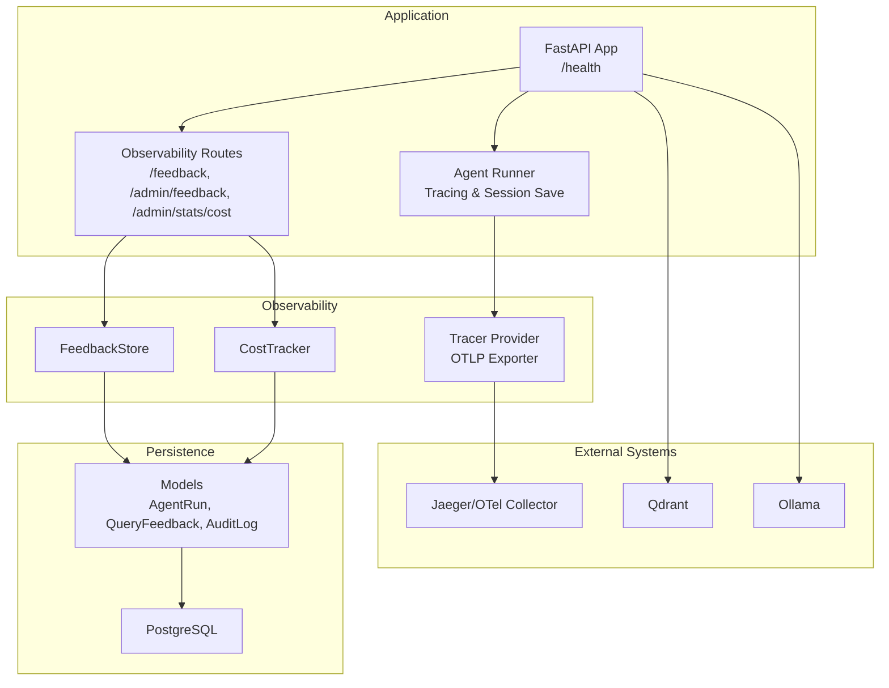
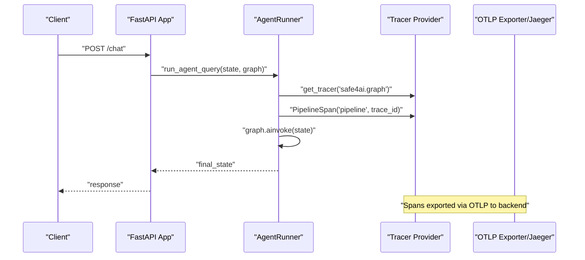
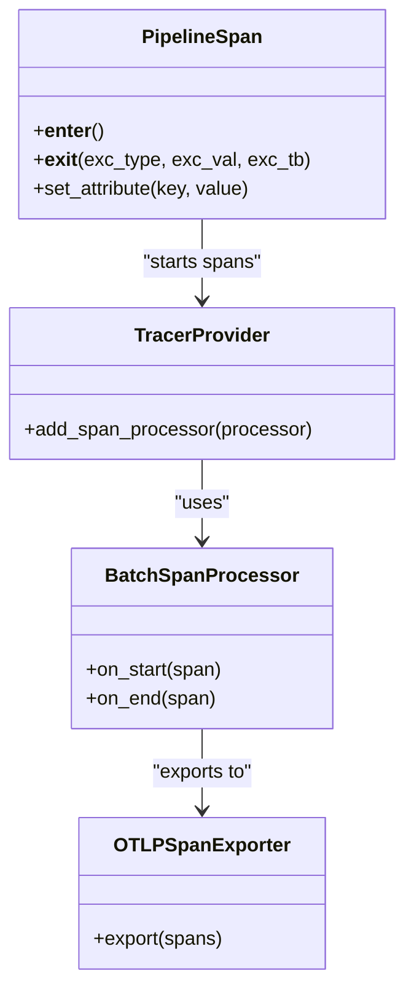
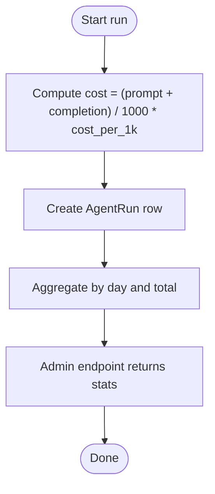
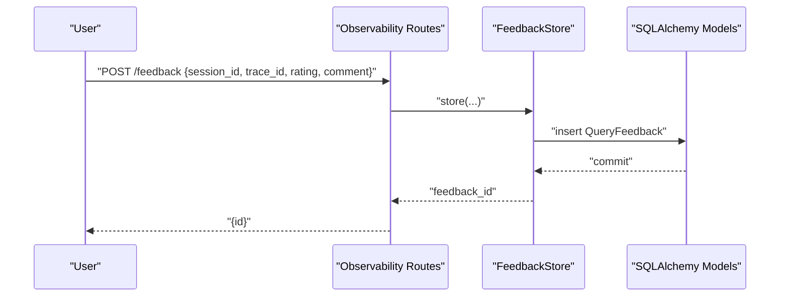
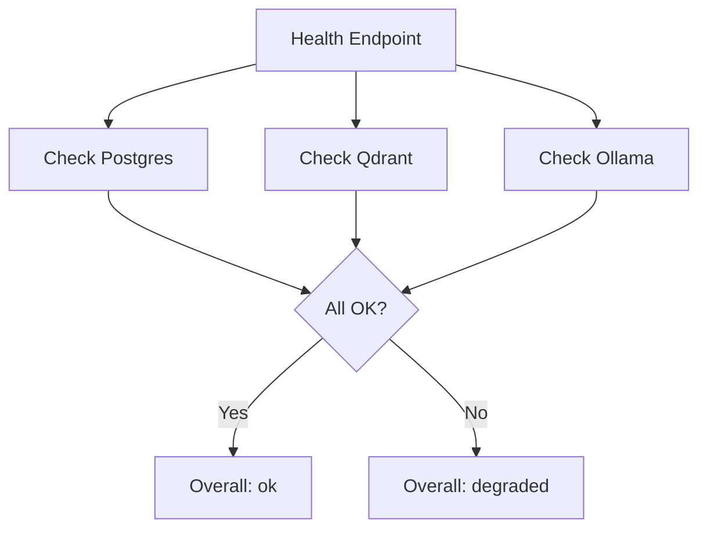
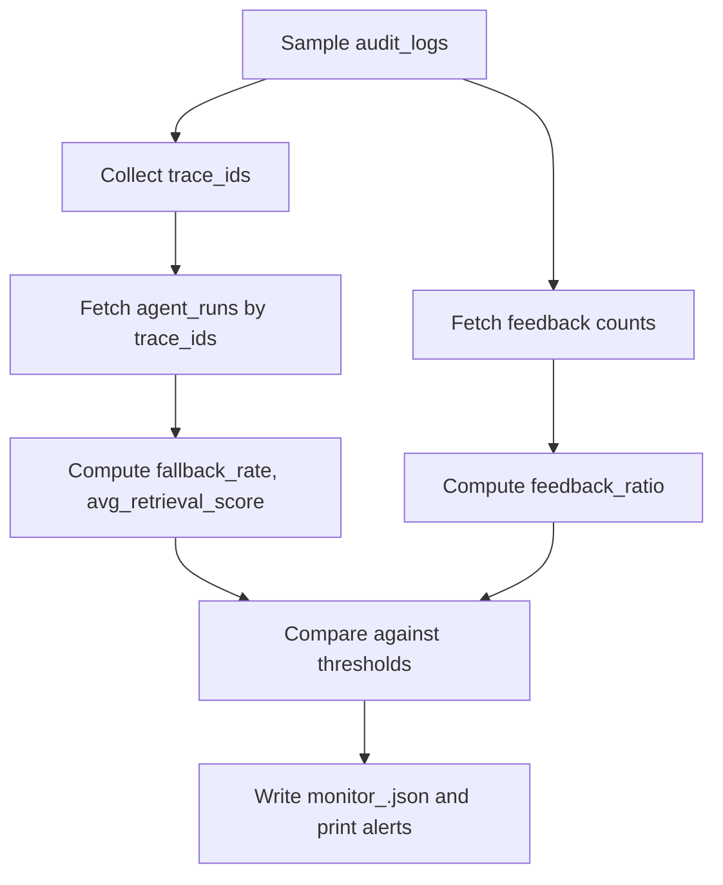
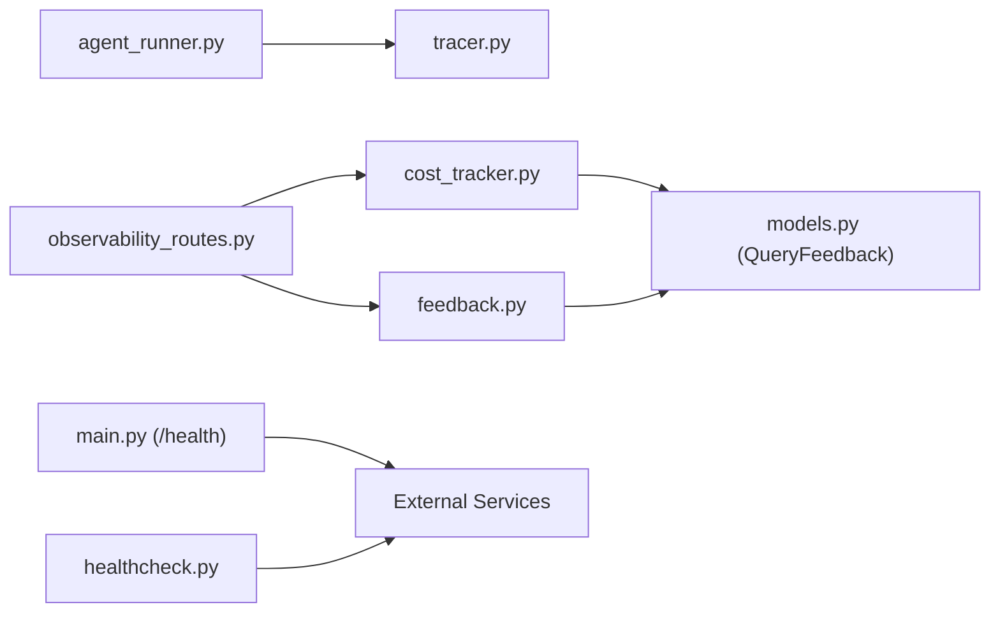

# Observability and Monitoring

<cite>
**Referenced Files in This Document**
- [tracer.py](file://safe4ai-pilot/observability/tracer.py)
- [cost_tracker.py](file://safe4ai-pilot/observability/cost_tracker.py)
- [feedback.py](file://safe4ai-pilot/observability/feedback.py)
- [observability_routes.py](file://safe4ai-pilot/app/api/observability_routes.py)
- [models.py](file://safe4ai-pilot/app/db/models.py)
- [config.py](file://safe4ai-pilot/app/config.py)
- [main.py](file://safe4ai-pilot/app/main.py)
- [healthcheck.py](file://safe4ai-pilot/scripts/healthcheck.py)
- [online_monitor.py](file://safe4ai-pilot/evaluation/online_monitor.py)
- [agent_runner.py](file://safe4ai-pilot/app/services/agent_runner.py)
- [conversation.py](file://safe4ai-pilot/app/services/conversation.py)
</cite>

## Table of Contents
1. [Introduction](#introduction)
2. [Project Structure](#project-structure)
3. [Core Components](#core-components)
4. [Architecture Overview](#architecture-overview)
5. [Detailed Component Analysis](#detailed-component-analysis)
6. [Dependency Analysis](#dependency-analysis)
7. [Performance Considerations](#performance-considerations)
8. [Troubleshooting Guide](#troubleshooting-guide)
9. [Conclusion](#conclusion)
10. [Appendices](#appendices)

## Introduction
This document explains the observability and monitoring capabilities of the Private AI system with a focus on distributed tracing, performance metrics, cost tracking, and system health monitoring. It details how OpenTelemetry is integrated for distributed tracing across microservices, how LLM usage and computational costs are tracked, how user feedback is collected and exposed for admin insights, and how health checks and dashboards enable operational visibility. Practical guidance is provided for setting up monitoring alerts, interpreting trace data, analyzing performance metrics, integrating with external monitoring tools, troubleshooting using observability data, optimizing performance, and planning capacity using cost tracking.

## Project Structure
The observability stack is implemented across several modules:
- Distributed tracing: OpenTelemetry-based tracer and pipeline span wrapper
- Cost tracking: Token usage aggregation and cost computation
- Feedback collection: User ratings and comments linked to traces and sessions
- Admin APIs: Endpoints for feedback listing and cost statistics
- Health monitoring: Application health endpoint and a dedicated healthcheck script
- Evaluation and alerting: Online monitoring script that computes key metrics and emits warnings
- Data models: SQLAlchemy models backing cost, feedback, and audit logs

**Diagram sources**
- [main.py:118-147](file://safe4ai-pilot/app/main.py#L118-L147)
- [observability_routes.py:26-56](file://safe4ai-pilot/app/api/observability_routes.py#L26-L56)
- [tracer.py:27-31](file://safe4ai-pilot/observability/tracer.py#L27-L31)
- [cost_tracker.py:37-60](file://safe4ai-pilot/observability/cost_tracker.py#L37-L60)
- [feedback.py:30-49](file://safe4ai-pilot/observability/feedback.py#L30-L49)
- [models.py:126-148](file://safe4ai-pilot/app/db/models.py#L126-L148)

**Section sources**
- [main.py:118-147](file://safe4ai-pilot/app/main.py#L118-L147)
- [observability_routes.py:16-56](file://safe4ai-pilot/app/api/observability_routes.py#L16-L56)
- [tracer.py:14-31](file://safe4ai-pilot/observability/tracer.py#L14-L31)
- [cost_tracker.py:16-60](file://safe4ai-pilot/observability/cost_tracker.py#L16-L60)
- [feedback.py:16-49](file://safe4ai-pilot/observability/feedback.py#L16-L49)
- [models.py:126-148](file://safe4ai-pilot/app/db/models.py#L126-L148)

## Core Components
- Distributed tracing with OpenTelemetry:
  - Tracer provider configured with batch span processor exporting to an OTLP endpoint
  - PipelineSpan context manager wraps each pipeline stage with attributes for trace correlation
- Cost tracking:
  - Cost per 1K tokens configurable; computes USD cost per run and aggregates daily stats
- Feedback collection:
  - Stores user ratings and optional comments associated with trace/session/user
- Admin endpoints:
  - Submit feedback, list recent feedback, and fetch cost statistics
- Health monitoring:
  - Application health endpoint checks Postgres, Qdrant, and Ollama
  - Dedicated healthcheck script for CI/system checks
- Evaluation and alerting:
  - Online monitor samples audit logs, correlates with agent runs, and computes fallback rate, average retrieval score, and feedback ratio

**Section sources**
- [tracer.py:14-74](file://safe4ai-pilot/observability/tracer.py#L14-L74)
- [cost_tracker.py:16-109](file://safe4ai-pilot/observability/cost_tracker.py#L16-L109)
- [feedback.py:16-70](file://safe4ai-pilot/observability/feedback.py#L16-L70)
- [observability_routes.py:26-56](file://safe4ai-pilot/app/api/observability_routes.py#L26-L56)
- [main.py:118-147](file://safe4ai-pilot/app/main.py#L118-L147)
- [healthcheck.py:12-53](file://safe4ai-pilot/scripts/healthcheck.py#L12-L53)
- [online_monitor.py:112-178](file://safe4ai-pilot/evaluation/online_monitor.py#L112-L178)

## Architecture Overview
The system instruments the agent pipeline with a top-level “pipeline” span and child spans for each stage. Spans are exported via OTLP to a backend (e.g., Jaeger). Admin endpoints expose feedback and cost statistics for dashboards. Health endpoints and scripts provide system status.

**Diagram sources**
- [agent_runner.py:26-32](file://safe4ai-pilot/app/services/agent_runner.py#L26-L32)
- [tracer.py:46-65](file://safe4ai-pilot/observability/tracer.py#L46-L65)

**Section sources**
- [agent_runner.py:26-32](file://safe4ai-pilot/app/services/agent_runner.py#L26-L32)
- [tracer.py:46-65](file://safe4ai-pilot/observability/tracer.py#L46-L65)

## Detailed Component Analysis

### Distributed Tracing with OpenTelemetry
- Tracer provider and exporter:
  - Configured with an OTLP gRPC exporter and batch span processor
  - Endpoint defaults to an environment variable; defaults to a common local port
- PipelineSpan:
  - Starts a span named after the stage, attaches it to the current context, and records exceptions on exit
  - Enforces a fixed set of valid stages to ensure consistent span naming
- Integration in the agent pipeline:
  - A top-level “pipeline” span wraps the entire graph invocation
  - Attributes include trace_id, session_id, and user_id for cross-service correlation

**Diagram sources**
- [tracer.py:27-31](file://safe4ai-pilot/observability/tracer.py#L27-L31)
- [tracer.py:46-69](file://safe4ai-pilot/observability/tracer.py#L46-L69)

**Section sources**
- [tracer.py:14-31](file://safe4ai-pilot/observability/tracer.py#L14-L31)
- [tracer.py:46-69](file://safe4ai-pilot/observability/tracer.py#L46-L69)
- [agent_runner.py:26-32](file://safe4ai-pilot/app/services/agent_runner.py#L26-L32)

### Cost Tracking and LLM Expense Monitoring
- Cost calculation:
  - Uses a configurable cost per 1K tokens; total cost computed from prompt and completion token counts
- Recording runs:
  - Creates an AgentRun row with timestamps, status, cost, and optional error fields
- Aggregation:
  - Provides daily breakdown and totals over a sliding window; optionally filtered by user via session ownership
- Admin exposure:
  - GET endpoint returns cost statistics for dashboards and reporting

**Diagram sources**
- [cost_tracker.py:22-25](file://safe4ai-pilot/observability/cost_tracker.py#L22-L25)
- [cost_tracker.py:37-60](file://safe4ai-pilot/observability/cost_tracker.py#L37-L60)
- [cost_tracker.py:74-109](file://safe4ai-pilot/observability/cost_tracker.py#L74-L109)
- [observability_routes.py:48-56](file://safe4ai-pilot/app/api/observability_routes.py#L48-L56)

**Section sources**
- [cost_tracker.py:16-109](file://safe4ai-pilot/observability/cost_tracker.py#L16-L109)
- [observability_routes.py:48-56](file://safe4ai-pilot/app/api/observability_routes.py#L48-L56)
- [config.py:17](file://safe4ai-pilot/app/config.py#L17)

### Feedback Collection and User Satisfaction Metrics
- Storage:
  - Stores QueryFeedback with trace_id, session_id, user_id, rating, and optional comment
- Admin access:
  - Lists recent feedback entries for moderation and analytics
- Frontend integration:
  - Admin UI components consume feedback data for dashboards and insights

**Diagram sources**
- [observability_routes.py:26-35](file://safe4ai-pilot/app/api/observability_routes.py#L26-L35)
- [feedback.py:30-49](file://safe4ai-pilot/observability/feedback.py#L30-L49)
- [models.py:139-148](file://safe4ai-pilot/app/db/models.py#L139-L148)

**Section sources**
- [feedback.py:16-70](file://safe4ai-pilot/observability/feedback.py#L16-L70)
- [observability_routes.py:38-45](file://safe4ai-pilot/app/api/observability_routes.py#L38-L45)
- [models.py:139-148](file://safe4ai-pilot/app/db/models.py#L139-L148)

### Health Checks and System Status
- Application health endpoint:
  - Probes Postgres, Qdrant, and Ollama and returns an aggregated status
- Dedicated healthcheck script:
  - Designed for CI and system verification; exits non-zero on failures

**Diagram sources**
- [main.py:118-147](file://safe4ai-pilot/app/main.py#L118-L147)
- [healthcheck.py:12-53](file://safe4ai-pilot/scripts/healthcheck.py#L12-L53)

**Section sources**
- [main.py:118-147](file://safe4ai-pilot/app/main.py#L118-L147)
- [healthcheck.py:12-53](file://safe4ai-pilot/scripts/healthcheck.py#L12-L53)

### Online Monitoring and Alerting
- Sampling and correlation:
  - Samples recent audit logs and correlates with agent runs by trace_id
- Metrics computed:
  - Fallback rate (fraction of answers indicating insufficient information)
  - Average retrieval score (mean of max retrieval scores)
  - User feedback ratio (positive vs negative)
- Alerts:
  - Emits warnings when thresholds are exceeded and writes daily summaries

**Diagram sources**
- [online_monitor.py:42-109](file://safe4ai-pilot/evaluation/online_monitor.py#L42-L109)
- [online_monitor.py:112-178](file://safe4ai-pilot/evaluation/online_monitor.py#L112-L178)

**Section sources**
- [online_monitor.py:112-178](file://safe4ai-pilot/evaluation/online_monitor.py#L112-L178)

## Dependency Analysis
- Tracing:
  - Agent runner depends on the tracer module to wrap the pipeline execution
  - PipelineSpan sets attributes for trace_id, session_id, and user_id for cross-service correlation
- Persistence:
  - CostTracker and FeedbackStore persist to AgentRun and QueryFeedback respectively
  - Admin routes depend on CostTracker and FeedbackStore to serve statistics and lists
- Health:
  - Health endpoint and healthcheck script probe external services and database connectivity

**Diagram sources**
- [agent_runner.py:26-32](file://safe4ai-pilot/app/services/agent_runner.py#L26-L32)
- [tracer.py:46-65](file://safe4ai-pilot/observability/tracer.py#L46-L65)
- [observability_routes.py:48-56](file://safe4ai-pilot/app/api/observability_routes.py#L48-L56)
- [cost_tracker.py:37-60](file://safe4ai-pilot/observability/cost_tracker.py#L37-L60)
- [feedback.py:30-49](file://safe4ai-pilot/observability/feedback.py#L30-L49)
- [models.py:126-148](file://safe4ai-pilot/app/db/models.py#L126-L148)
- [main.py:118-147](file://safe4ai-pilot/app/main.py#L118-L147)
- [healthcheck.py:12-53](file://safe4ai-pilot/scripts/healthcheck.py#L12-L53)

**Section sources**
- [agent_runner.py:26-32](file://safe4ai-pilot/app/services/agent_runner.py#L26-L32)
- [observability_routes.py:48-56](file://safe4ai-pilot/app/api/observability_routes.py#L48-L56)
- [cost_tracker.py:37-60](file://safe4ai-pilot/observability/cost_tracker.py#L37-L60)
- [feedback.py:30-49](file://safe4ai-pilot/observability/feedback.py#L30-L49)
- [models.py:126-148](file://safe4ai-pilot/app/db/models.py#L126-L148)
- [main.py:118-147](file://safe4ai-pilot/app/main.py#L118-L147)
- [healthcheck.py:12-53](file://safe4ai-pilot/scripts/healthcheck.py#L12-L53)

## Performance Considerations
- Tracing overhead:
  - BatchSpanProcessor reduces export overhead; ensure collector capacity matches throughput
- Cost tracking:
  - Cost aggregation is O(n) over runs; consider partitioning or materialized views for large datasets
- Feedback and audit logs:
  - Online monitor samples audit logs; tune sample_rate and look-back window for accuracy vs performance
- Health probes:
  - Keep timeouts reasonable to avoid masking slow services

[No sources needed since this section provides general guidance]

## Troubleshooting Guide
- No traces in backend:
  - Verify OTLP endpoint environment variable and network connectivity
  - Confirm PipelineSpan is used around each stage and that exceptions are recorded
- Health endpoint shows degraded:
  - Inspect Postgres connectivity, Qdrant readiness, and Ollama tags endpoint
  - Use the healthcheck script for deterministic CI checks
- High fallback rate or low retrieval scores:
  - Investigate retrieval quality and reranking; review recent feedback ratios
- Unexpected cost spikes:
  - Validate cost_per_1k_tokens configuration and token counting logic

**Section sources**
- [tracer.py:27-31](file://safe4ai-pilot/observability/tracer.py#L27-L31)
- [tracer.py:60-65](file://safe4ai-pilot/observability/tracer.py#L60-L65)
- [main.py:118-147](file://safe4ai-pilot/app/main.py#L118-L147)
- [healthcheck.py:12-53](file://safe4ai-pilot/scripts/healthcheck.py#L12-L53)
- [online_monitor.py:146-155](file://safe4ai-pilot/evaluation/online_monitor.py#L146-L155)
- [config.py:17](file://safe4ai-pilot/app/config.py#L17)

## Conclusion
The Private AI system integrates OpenTelemetry for distributed tracing, tracks LLM usage and costs, collects user feedback, and exposes health and statistics endpoints. Together, these components enable robust observability, operational insights, and automated alerting. By correlating traces across services, monitoring cost trends, and acting on feedback and health signals, operators can maintain system reliability and optimize performance and capacity.

[No sources needed since this section summarizes without analyzing specific files]

## Appendices

### Practical Examples

- Setting up monitoring alerts
  - Use the online monitor thresholds to trigger alerts:
    - Fallback rate exceeding a percentage threshold
    - Average retrieval score below a minimum
  - Configure external alerting to watch logs and artifacts produced by the online monitor

- Interpreting trace data
  - Correlate requests across microservices using the shared trace_id
  - Drill down into pipeline stages to identify bottlenecks or errors
  - Use exception recording in spans to surface failures quickly

- Analyzing performance metrics
  - Compute latency percentiles from audit logs and agent runs
  - Track traffic volume, unique users, and average cost per query via admin stats endpoints
  - Visualize trends in dashboards using the admin endpoints’ JSON responses

- Integrating with external monitoring tools and logging systems
  - Export OpenTelemetry spans to a backend (e.g., Jaeger) via OTLP
  - Ship application logs to centralized logging systems
  - Wire health endpoint outputs and online monitor artifacts into monitoring dashboards

- Troubleshooting techniques using observability data
  - Reproduce issues with the same trace_id and inspect the full pipeline span tree
  - Cross-reference feedback entries with traces to understand user sentiment
  - Use health endpoint and healthcheck script to isolate infrastructure problems

- Performance optimization based on metrics
  - Reduce fallback rate by tuning retrieval and reranking
  - Optimize token usage to lower cost while maintaining quality
  - Scale infrastructure based on observed latency and throughput trends

- Capacity planning using cost tracking
  - Monitor daily cost aggregations and trends
  - Set budget alerts and reserve capacity for peak periods

[No sources needed since this section provides general guidance]