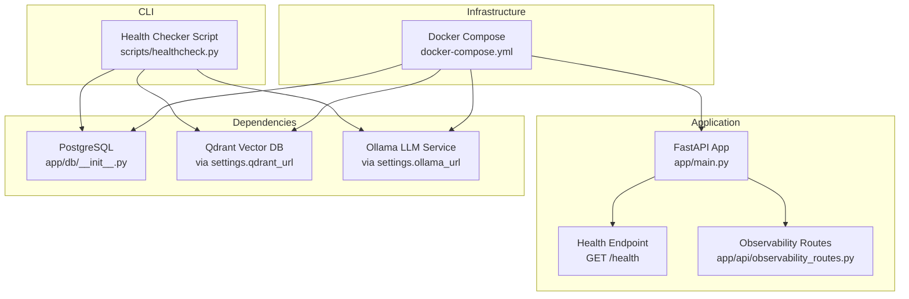
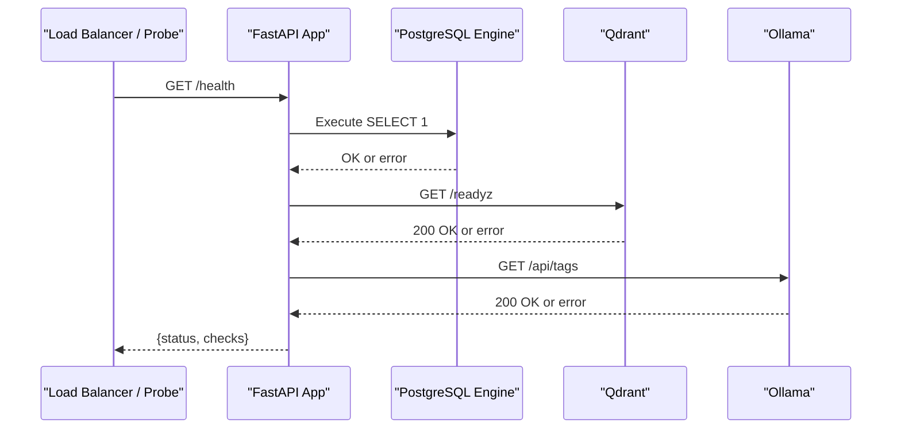
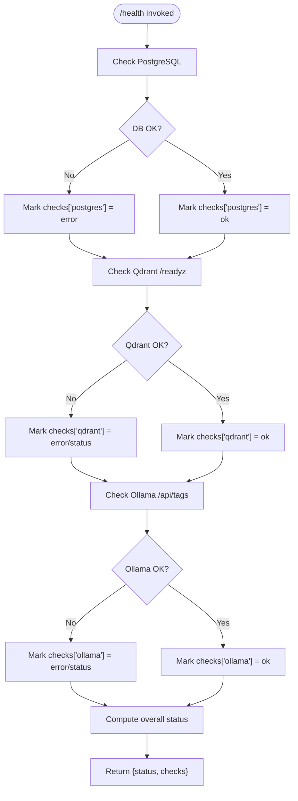
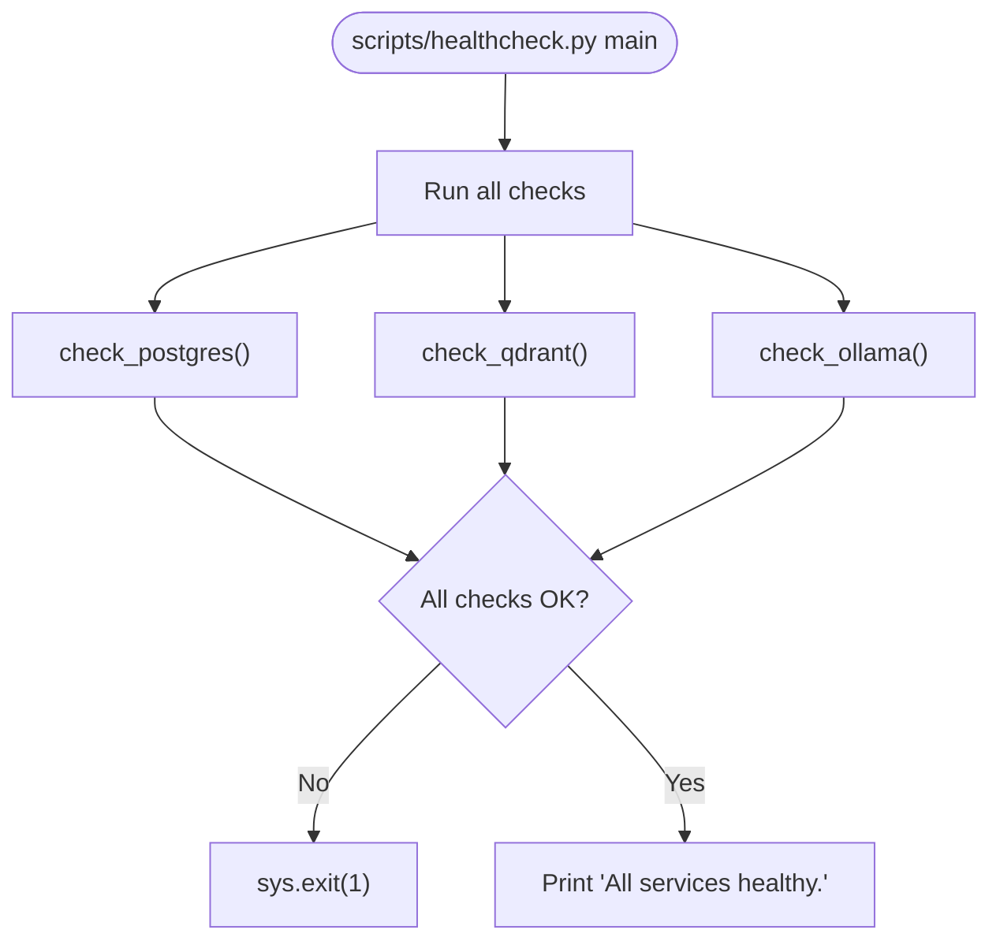
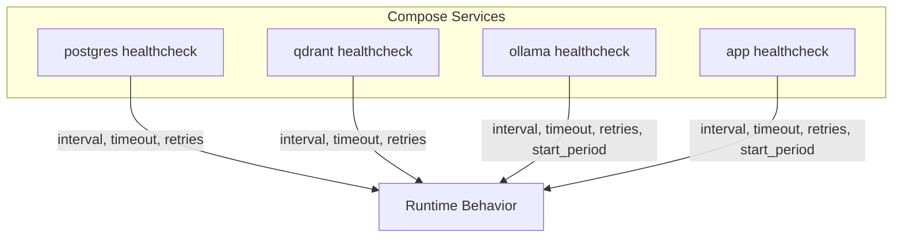
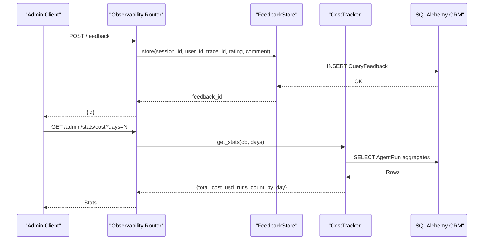
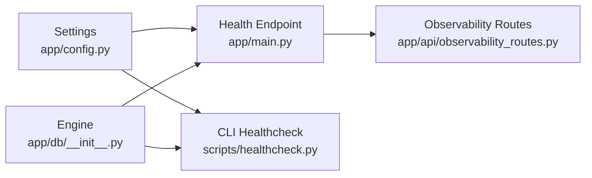

# System Health and Status Monitoring

<cite>
**Referenced Files in This Document**
- [app/main.py](file://app/main.py)
- [scripts/healthcheck.py](file://scripts/healthcheck.py)
- [docker-compose.yml](file://docker-compose.yml)
- [app/config.py](file://app/config.py)
- [app/db/__init__.py](file://app/db/__init__.py)
- [tests/test_health.py](file://tests/test_health.py)
- [tests/test_security_headers.py](file://tests/test_security_headers.py)
- [observability/tracer.py](file://observability/tracer.py)
- [observability/cost_tracker.py](file://observability/cost_tracker.py)
- [observability/feedback.py](file://observability/feedback.py)
- [app/api/observability_routes.py](file://app/api/observability_routes.py)
</cite>

## Table of Contents
1. [Introduction](#introduction)
2. [Project Structure](#project-structure)
3. [Core Components](#core-components)
4. [Architecture Overview](#architecture-overview)
5. [Detailed Component Analysis](#detailed-component-analysis)
6. [Dependency Analysis](#dependency-analysis)
7. [Performance Considerations](#performance-considerations)
8. [Troubleshooting Guide](#troubleshooting-guide)
9. [Conclusion](#conclusion)
10. [Appendices](#appendices)

## Introduction
This document explains the Private AI system’s health and status monitoring capabilities. It covers how the application exposes health endpoints for load balancers and monitoring systems, how health checks validate database connectivity, vector store availability, and LLM service responsiveness, and how to configure health check intervals, failure thresholds, and alerting. It also provides practical guidance for integrating health checks with Kubernetes probes, Docker health monitoring, and external monitoring systems like Prometheus. Finally, it outlines proactive maintenance triggers, automated recovery procedures, capacity monitoring for scaling decisions, and graceful degradation strategies.

## Project Structure
The health monitoring implementation spans the FastAPI application, a dedicated CLI health checker, Docker Compose health checks, and observability APIs and utilities.

**Diagram sources**
- [app/main.py:118-147](file://app/main.py#L118-L147)
- [scripts/healthcheck.py:12-53](file://scripts/healthcheck.py#L12-L53)
- [docker-compose.yml:75-103](file://docker-compose.yml#L75-L103)
- [app/db/__init__.py:8](file://app/db/__init__.py#L8)
- [app/config.py:8-12](file://app/config.py#L8-L12)

**Section sources**
- [app/main.py:118-147](file://app/main.py#L118-L147)
- [scripts/healthcheck.py:12-53](file://scripts/healthcheck.py#L12-L53)
- [docker-compose.yml:75-103](file://docker-compose.yml#L75-L103)
- [app/config.py:8-12](file://app/config.py#L8-L12)
- [app/db/__init__.py:8](file://app/db/__init__.py#L8)

## Core Components
- Application health endpoint: A FastAPI route that validates database connectivity, vector store readiness, and LLM service availability, returning an overall status and per-check details.
- CLI health checker: A standalone script that performs the same validations and exits with a non-zero status if any dependency fails.
- Docker Compose health checks: Container-level health checks for Postgres, Qdrant, Ollama, and the application itself.
- Observability routes and utilities: Feedback submission, administrative feedback listing, cost statistics, tracing, and cost tracking.

Key behaviors:
- Health endpoint returns a top-level status (“ok” or “degraded”) and a dictionary of individual check outcomes.
- CLI health checker prints human-readable results and exits non-zero on failure.
- Docker Compose health checks define intervals, timeouts, retries, and start periods for each service.

**Section sources**
- [app/main.py:118-147](file://app/main.py#L118-L147)
- [scripts/healthcheck.py:12-53](file://scripts/healthcheck.py#L12-L53)
- [docker-compose.yml:12-16](file://docker-compose.yml#L12-L16)
- [docker-compose.yml:25-29](file://docker-compose.yml#L25-L29)
- [docker-compose.yml:39-44](file://docker-compose.yml#L39-L44)
- [docker-compose.yml:98-103](file://docker-compose.yml#L98-L103)

## Architecture Overview
The health monitoring architecture integrates runtime checks inside the application with external orchestration and CLI verification.

**Diagram sources**
- [app/main.py:118-147](file://app/main.py#L118-L147)
- [app/db/__init__.py:8](file://app/db/__init__.py#L8)
- [app/config.py:8-12](file://app/config.py#L8-L12)

## Detailed Component Analysis

### Application Health Endpoint
The health endpoint aggregates three checks:
- Database: Executes a simple SQL statement against the configured PostgreSQL engine.
- Vector store: Calls the Qdrant readiness endpoint.
- LLM service: Calls the Ollama tags endpoint.

It sets the overall status to “ok” only if all checks succeed; otherwise “degraded”.

**Diagram sources**
- [app/main.py:118-147](file://app/main.py#L118-L147)

**Section sources**
- [app/main.py:118-147](file://app/main.py#L118-L147)
- [tests/test_health.py:43-48](file://tests/test_health.py#L43-L48)
- [tests/test_security_headers.py:51-64](file://tests/test_security_headers.py#L51-L64)

### CLI Health Checker
The CLI health checker performs the same validations as the application endpoint but prints results and exits with a non-zero status if any check fails. It uses the same configuration sources for service URLs and database engine.

**Diagram sources**
- [scripts/healthcheck.py:49-53](file://scripts/healthcheck.py#L49-L53)
- [scripts/healthcheck.py:12-53](file://scripts/healthcheck.py#L12-L53)

**Section sources**
- [scripts/healthcheck.py:12-53](file://scripts/healthcheck.py#L12-L53)

### Docker Compose Health Checks
Docker Compose defines health checks for each service:
- Postgres: Uses a database readiness probe.
- Qdrant: Uses TCP socket probing.
- Ollama: Uses a CLI-based probe and a pre-run model pull job.
- Application: Calls the /health endpoint.

These checks specify interval, timeout, retries, and start period to tune sensitivity and convergence.

**Diagram sources**
- [docker-compose.yml:12-16](file://docker-compose.yml#L12-L16)
- [docker-compose.yml:25-29](file://docker-compose.yml#L25-L29)
- [docker-compose.yml:39-44](file://docker-compose.yml#L39-L44)
- [docker-compose.yml:98-103](file://docker-compose.yml#L98-L103)

**Section sources**
- [docker-compose.yml:12-16](file://docker-compose.yml#L12-L16)
- [docker-compose.yml:25-29](file://docker-compose.yml#L25-L29)
- [docker-compose.yml:39-44](file://docker-compose.yml#L39-L44)
- [docker-compose.yml:98-103](file://docker-compose.yml#L98-L103)

### Observability Routes and Utilities
The observability routes support feedback collection and cost statistics for administrators. These complement health monitoring by enabling operational insights and remediation.

**Diagram sources**
- [app/api/observability_routes.py:26-56](file://app/api/observability_routes.py#L26-L56)
- [observability/feedback.py:22-49](file://observability/feedback.py#L22-L49)
- [observability/cost_tracker.py:62-109](file://observability/cost_tracker.py#L62-L109)

**Section sources**
- [app/api/observability_routes.py:26-56](file://app/api/observability_routes.py#L26-L56)
- [observability/feedback.py:22-49](file://observability/feedback.py#L22-L49)
- [observability/cost_tracker.py:62-109](file://observability/cost_tracker.py#L62-L109)

## Dependency Analysis
The health checks depend on configuration values for service endpoints and database connectivity. The application’s engine is configured with connection pooling and pre-ping enabled, while the CLI uses the same engine and settings.

**Diagram sources**
- [app/config.py:8-12](file://app/config.py#L8-L12)
- [app/db/__init__.py:8](file://app/db/__init__.py#L8)
- [app/main.py:118-147](file://app/main.py#L118-L147)
- [scripts/healthcheck.py:8-9](file://scripts/healthcheck.py#L8-L9)

**Section sources**
- [app/config.py:8-12](file://app/config.py#L8-L12)
- [app/db/__init__.py:8](file://app/db/__init__.py#L8)
- [app/main.py:118-147](file://app/main.py#L118-L147)
- [scripts/healthcheck.py:8-9](file://scripts/healthcheck.py#L8-L9)

## Performance Considerations
- Timeout tuning: Health checks use short timeouts to prevent blocking load balancers and probes. Adjust timeouts in the application and CLI checks according to network conditions and service latency.
- Concurrency: The application health endpoint executes independent checks concurrently via asynchronous HTTP clients; ensure upstream services can handle concurrent readiness probes.
- Overhead: Keep health checks lightweight; they should not trigger heavy computations or data scans.
- Caching and warm-up: The application pre-warms the LLM service to reduce cold-start latency during initial queries.

[No sources needed since this section provides general guidance]

## Troubleshooting Guide
Common issues and resolutions:
- Database failures:
  - Verify the PostgreSQL URL and credentials in settings.
  - Confirm the vector extension is available and the database is initialized.
- Vector store failures:
  - Ensure the Qdrant service is reachable and the readiness endpoint responds.
  - Check firewall rules and container networking.
- LLM service failures:
  - Confirm Ollama is healthy and the model list endpoint responds.
  - Validate model availability and pull jobs completed.
- Security headers:
  - The health endpoint must include standard security headers; verify middleware configuration.
- Observability routes:
  - Administrative endpoints require proper roles; confirm authentication and permissions.

Operational steps:
- Use the CLI health checker to validate dependencies outside the application.
- Inspect Docker Compose health statuses for containers.
- Review application logs for detailed error messages from health checks.

**Section sources**
- [tests/test_health.py:43-48](file://tests/test_health.py#L43-L48)
- [tests/test_security_headers.py:51-64](file://tests/test_security_headers.py#L51-L64)
- [docker-compose.yml:12-16](file://docker-compose.yml#L12-L16)
- [docker-compose.yml:25-29](file://docker-compose.yml#L25-L29)
- [docker-compose.yml:39-44](file://docker-compose.yml#L39-L44)
- [docker-compose.yml:98-103](file://docker-compose.yml#L98-L103)

## Conclusion
The Private AI system provides robust health monitoring through an application endpoint, a dedicated CLI checker, and container-level health checks. Together with observability routes and utilities, operators can track system status, diagnose failures, and maintain reliability. By tuning intervals, timeouts, and thresholds, and integrating with Kubernetes and external monitoring systems, teams can achieve proactive maintenance, automated recovery, and informed scaling decisions.

[No sources needed since this section summarizes without analyzing specific files]

## Appendices

### Health Check Configuration Reference
- Application endpoint:
  - Path: GET /health
  - Behavior: Validates PostgreSQL, Qdrant, and Ollama; returns overall status and per-check details.
- CLI health checker:
  - Script: scripts/healthcheck.py
  - Behavior: Same validations as the application endpoint; exits non-zero on failure.
- Docker Compose:
  - Postgres: Interval, timeout, retries, and start period defined.
  - Qdrant: Interval, timeout, retries, and start period defined.
  - Ollama: Interval, timeout, retries, and start period defined; includes model pre-pull job.
  - Application: Calls /health with interval, timeout, retries, and start period.

**Section sources**
- [app/main.py:118-147](file://app/main.py#L118-L147)
- [scripts/healthcheck.py:49-53](file://scripts/healthcheck.py#L49-L53)
- [docker-compose.yml:12-16](file://docker-compose.yml#L12-L16)
- [docker-compose.yml:25-29](file://docker-compose.yml#L25-L29)
- [docker-compose.yml:39-44](file://docker-compose.yml#L39-L44)
- [docker-compose.yml:98-103](file://docker-compose.yml#L98-L103)

### Integrating with Kubernetes Probes
- Configure livenessProbe and readinessProbe to call the /health endpoint.
- Set appropriate initialDelaySeconds, periodSeconds, timeoutSeconds, and failureThreshold based on service startup and expected latencies.
- Use the same security headers and CORS policies as the application.

[No sources needed since this section provides general guidance]

### Integrating with Docker Health Monitoring
- Use the built-in health checks in docker-compose.yml for Postgres, Qdrant, Ollama, and the application.
- Adjust interval, timeout, retries, and start_period to match your environment.

**Section sources**
- [docker-compose.yml:12-16](file://docker-compose.yml#L12-L16)
- [docker-compose.yml:25-29](file://docker-compose.yml#L25-L29)
- [docker-compose.yml:39-44](file://docker-compose.yml#L39-L44)
- [docker-compose.yml:98-103](file://docker-compose.yml#L98-L103)

### Integrating with External Monitoring Systems (Prometheus)
- Expose metrics endpoints for Prometheus scraping (e.g., application metrics, cost metrics).
- Use the health endpoint as a synthetic probe target to monitor service availability.
- Combine health status with tracing and cost statistics for comprehensive dashboards.

[No sources needed since this section provides general guidance]

### Proactive Maintenance and Automated Recovery
- Pre-warm the LLM service at startup to reduce cold-start delays.
- Schedule periodic cleanup tasks and stuck job recovery.
- Monitor cost trends and adjust model usage or scaling to control expenses.

**Section sources**
- [app/main.py:58-60](file://app/main.py#L58-L60)
- [observability/cost_tracker.py:62-109](file://observability/cost_tracker.py#L62-L109)

### Capacity Monitoring and Scaling Decisions
- Track cost statistics and usage patterns to inform auto-scaling policies.
- Use health status and performance metrics to trigger scale-out or scale-in events.

**Section sources**
- [observability/cost_tracker.py:62-109](file://observability/cost_tracker.py#L62-L109)

### Graceful Degradation Strategies
- Return “degraded” status when partial dependencies fail.
- Disable expensive operations (e.g., vector retrieval or LLM generation) when dependent services are unavailable.
- Provide fallback responses and log detailed diagnostics for operators.

**Section sources**
- [app/main.py:146](file://app/main.py#L146)