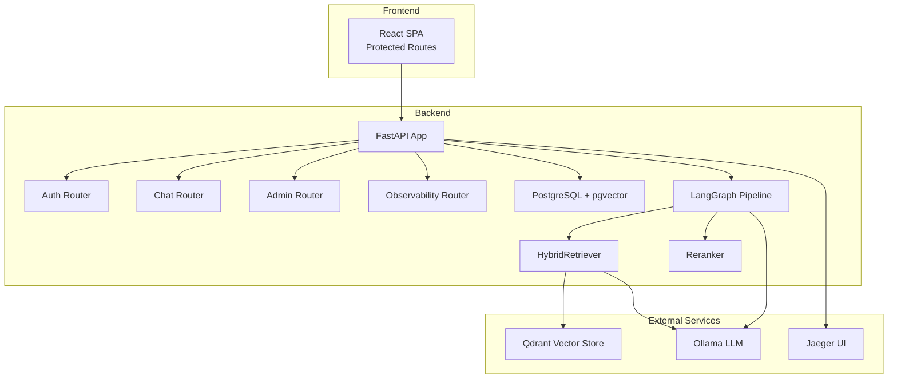
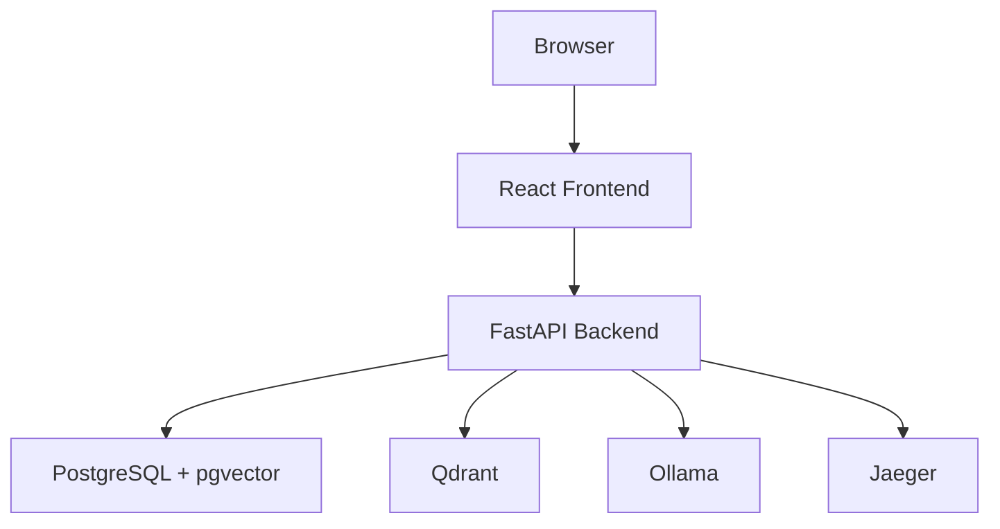
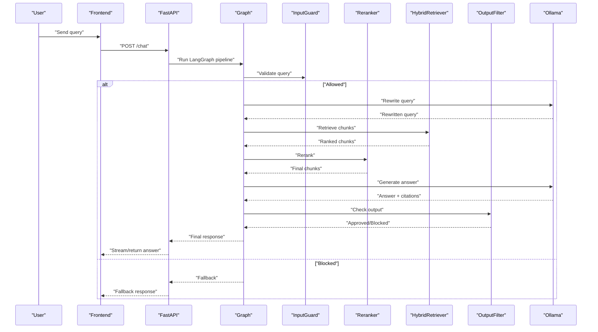
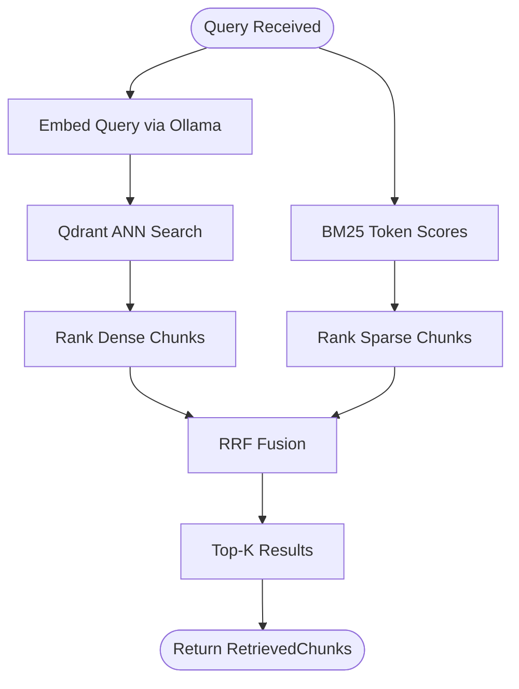
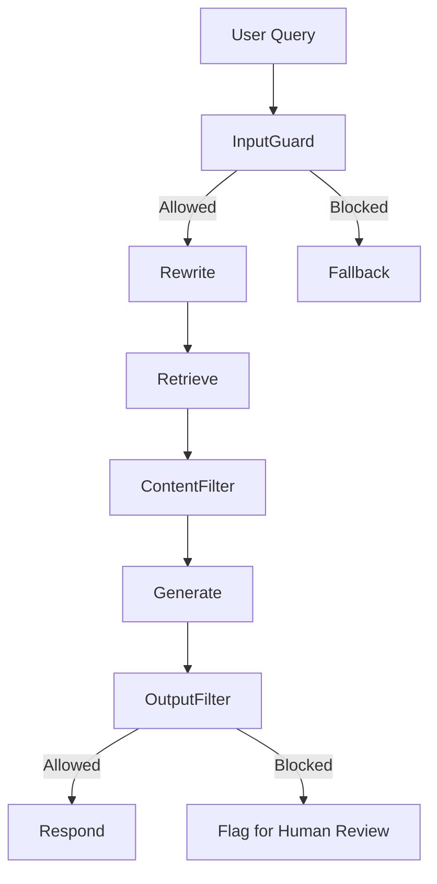
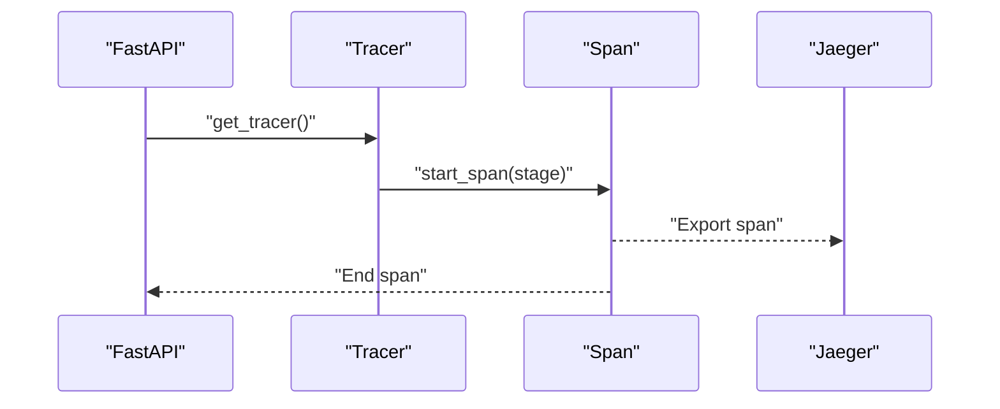
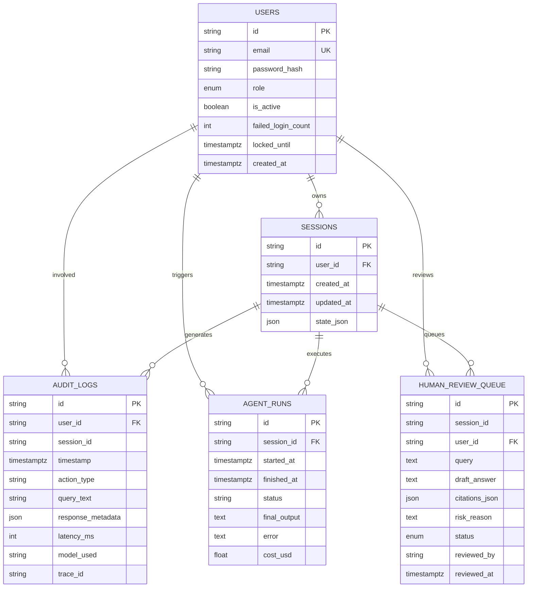
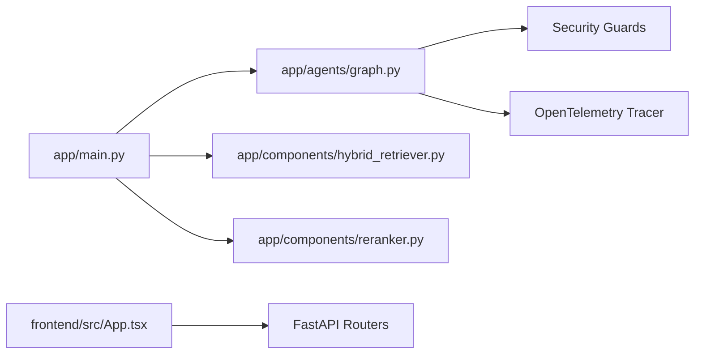

# Project Overview

<cite>
**Referenced Files in This Document**
- [README.md](file://safe4ai-pilot/README.md)
- [architecture.md](file://safe4ai-pilot/docs/architecture.md)
- [main.py](file://safe4ai-pilot/app/main.py)
- [App.tsx](file://safe4ai-pilot/frontend/src/App.tsx)
- [hybrid_retriever.py](file://safe4ai-pilot/app/components/hybrid_retriever.py)
- [input_guard.py](file://safe4ai-pilot/app/security/input_guard.py)
- [content_filter.py](file://safe4ai-pilot/app/security/content_filter.py)
- [output_filter.py](file://safe4ai-pilot/app/security/output_filter.py)
- [graph.py](file://safe4ai-pilot/app/agents/graph.py)
- [models.py](file://safe4ai-pilot/app/models.py)
- [models.py](file://safe4ai-pilot/app/db/models.py)
- [tracer.py](file://safe4ai-pilot/observability/tracer.py)
</cite>

## Table of Contents
1. [Introduction](#introduction)
2. [Project Structure](#project-structure)
3. [Core Components](#core-components)
4. [Architecture Overview](#architecture-overview)
5. [Detailed Component Analysis](#detailed-component-analysis)
6. [Dependency Analysis](#dependency-analysis)
7. [Performance Considerations](#performance-considerations)
8. [Troubleshooting Guide](#troubleshooting-guide)
9. [Conclusion](#conclusion)
10. [Appendices](#appendices)

## Introduction
Private AI assistant is a compliance-first AI system designed for regulated environments. Its mission is to deliver secure, auditable, and explainable AI assistance by enforcing strict safety and governance controls at every step. The system emphasizes complete auditability via persistent audit trails, robust security guards to prevent misuse and protect sensitive data, and a hybrid retrieval mechanism that combines dense and sparse vector search for reliable, grounded answers.

Target audiences:
- Compliance officers who need transparent, traceable AI interactions
- Security professionals who demand strong input/output filters and access controls
- AI developers who want a modular, observable, and extensible RAG pipeline

## Project Structure
The project is organized into a FastAPI backend, a React frontend, and supporting infrastructure:
- Backend: FastAPI application with routers for authentication, chat, admin, and observability; SQLAlchemy ORM with PostgreSQL and pgvector; LangGraph pipeline orchestrating the RAG workflow
- Frontend: React SPA with protected routes for chat and admin dashboards
- Data stores: PostgreSQL for audit, sessions, and metadata; Qdrant for hybrid vector retrieval; pgvector for semantic caching
- LLM runtime: Ollama for embeddings and generation
- Observability: OpenTelemetry tracing integrated with Jaeger UI

**Diagram sources**
- [main.py:98-101](file://safe4ai-pilot/app/main.py#L98-L101)
- [App.tsx:25-91](file://safe4ai-pilot/frontend/src/App.tsx#L25-L91)
- [hybrid_retriever.py:13-28](file://safe4ai-pilot/app/components/hybrid_retriever.py#L13-L28)
- [graph.py:39-46](file://safe4ai-pilot/app/agents/graph.py#L39-L46)

**Section sources**
- [README.md:1-133](file://safe4ai-pilot/README.md#L1-L133)
- [architecture.md:1-45](file://safe4ai-pilot/docs/architecture.md#L1-L45)
- [main.py:63-101](file://safe4ai-pilot/app/main.py#L63-L101)
- [App.tsx:25-91](file://safe4ai-pilot/frontend/src/App.tsx#L25-L91)

## Core Components
- Private AI assistant: The end-to-end RAG system that enforces security guards, performs hybrid retrieval, and ensures grounded, auditable responses
- Audit trail: Persistent records of user actions, queries, responses, latency, and trace identifiers stored in relational tables
- Security guards: Input guard (sanitization and injection detection), content filter (PII removal from retrieved chunks), and output filter (PII hallucination and length checks)
- Hybrid retrieval: Combines dense vector similarity with sparse BM25 ranking for robust document retrieval
- Observability: OpenTelemetry tracing with Jaeger integration for end-to-end visibility

Practical examples:
- Compliance officer reviews audit logs to verify that no PII was exposed in responses
- Security professional configures blocked terms to prevent sensitive topics from entering retrieval
- AI developer monitors trace spans to troubleshoot latency or grounding issues

**Section sources**
- [architecture.md:20-45](file://safe4ai-pilot/docs/architecture.md#L20-L45)
- [models.py:38-95](file://safe4ai-pilot/app/models.py#L38-L95)
- [models.py:111-124](file://safe4ai-pilot/app/db/models.py#L111-L124)
- [input_guard.py:24-49](file://safe4ai-pilot/app/security/input_guard.py#L24-L49)
- [content_filter.py:24-63](file://safe4ai-pilot/app/security/content_filter.py#L24-L63)
- [output_filter.py:30-60](file://safe4ai-pilot/app/security/output_filter.py#L30-L60)
- [hybrid_retriever.py:13-143](file://safe4ai-pilot/app/components/hybrid_retriever.py#L13-L143)
- [tracer.py:34-75](file://safe4ai-pilot/observability/tracer.py#L34-L75)

## Architecture Overview
High-level architecture:
- FastAPI backend exposes REST endpoints for authentication, chat, admin, and observability
- React frontend provides user and admin interfaces with route protection
- PostgreSQL with pgvector stores users, sessions, audit logs, agent runs, and semantic cache
- Qdrant serves hybrid vector retrieval for document chunks
- Ollama powers embeddings and generation
- Jaeger visualizes OpenTelemetry traces

**Diagram sources**
- [README.md:3-36](file://safe4ai-pilot/README.md#L3-L36)
- [main.py:118-147](file://safe4ai-pilot/app/main.py#L118-L147)

## Detailed Component Analysis

### Private AI Assistant Workflow
The assistant follows a structured pipeline with security guards and observability:
- intake: validate and sanitize query
- rewrite: improve grounding via prompt rewriting
- retrieve: hybrid retrieval (dense + sparse)
- grade: relevance assessment
- decompose: split complex queries
- generate: produce grounded answer with citations
- output_filter: PII and length checks
- quality_gate: routing decision with self-correction guard
- respond/fallback: finalize or escalate

**Diagram sources**
- [graph.py:51-298](file://safe4ai-pilot/app/agents/graph.py#L51-L298)
- [input_guard.py:27-48](file://safe4ai-pilot/app/security/input_guard.py#L27-L48)
- [hybrid_retriever.py:56-142](file://safe4ai-pilot/app/components/hybrid_retriever.py#L56-L142)
- [output_filter.py:31-59](file://safe4ai-pilot/app/security/output_filter.py#L31-L59)

**Section sources**
- [architecture.md:20-28](file://safe4ai-pilot/docs/architecture.md#L20-L28)
- [graph.py:39-342](file://safe4ai-pilot/app/agents/graph.py#L39-L342)

### Hybrid Retrieval
Hybrid retrieval combines dense vectors (Qdrant) and sparse BM25 scoring to improve recall and precision. Results are fused using Reciprocal Rank Fusion (RRF).

**Diagram sources**
- [hybrid_retriever.py:42-142](file://safe4ai-pilot/app/components/hybrid_retriever.py#L42-L142)

**Section sources**
- [architecture.md:3-18](file://safe4ai-pilot/docs/architecture.md#L3-L18)
- [hybrid_retriever.py:13-143](file://safe4ai-pilot/app/components/hybrid_retriever.py#L13-L143)

### Security Guards
The system enforces three layers of safety:
- Input guard: strips HTML/control characters, enforces length limits, detects prompt injection patterns
- Content filter: removes retrieved chunks containing PII or blocked terms
- Output filter: blocks answers with hallucinated PII and flags suspiciously long outputs

**Diagram sources**
- [input_guard.py:24-49](file://safe4ai-pilot/app/security/input_guard.py#L24-L49)
- [content_filter.py:24-63](file://safe4ai-pilot/app/security/content_filter.py#L24-L63)
- [output_filter.py:30-60](file://safe4ai-pilot/app/security/output_filter.py#L30-L60)

**Section sources**
- [architecture.md:30-35](file://safe4ai-pilot/docs/architecture.md#L30-L35)
- [input_guard.py:24-49](file://safe4ai-pilot/app/security/input_guard.py#L24-L49)
- [content_filter.py:24-63](file://safe4ai-pilot/app/security/content_filter.py#L24-L63)
- [output_filter.py:30-60](file://safe4ai-pilot/app/security/output_filter.py#L30-L60)

### Observability and Tracing
OpenTelemetry tracing captures spans for each pipeline stage and integrates with Jaeger for visualization. The backend exposes health checks for core services.

**Diagram sources**
- [tracer.py:34-75](file://safe4ai-pilot/observability/tracer.py#L34-L75)
- [main.py:118-147](file://safe4ai-pilot/app/main.py#L118-L147)

**Section sources**
- [tracer.py:1-75](file://safe4ai-pilot/observability/tracer.py#L1-L75)
- [main.py:118-147](file://safe4ai-pilot/app/main.py#L118-L147)

### Data Models and Audit Trail
The backend persists sessions, audit logs, agent runs, and human review queue items in PostgreSQL. The audit trail captures user actions, queries, response metadata, latency, model used, and trace identifiers.

**Diagram sources**
- [models.py:45-175](file://safe4ai-pilot/app/db/models.py#L45-L175)

**Section sources**
- [models.py:111-124](file://safe4ai-pilot/app/db/models.py#L111-L124)
- [models.py:49-95](file://safe4ai-pilot/app/models.py#L49-L95)

## Dependency Analysis
Key dependencies and relationships:
- FastAPI app initializes the LangGraph pipeline and shared components (HybridRetriever, Reranker) at startup
- Frontend routes are protected by authentication and admin checks
- Security guards are integrated into the graph nodes
- Observability spans are attached to each graph node

**Diagram sources**
- [main.py:28-60](file://safe4ai-pilot/app/main.py#L28-L60)
- [graph.py:39-46](file://safe4ai-pilot/app/agents/graph.py#L39-L46)
- [App.tsx:25-91](file://safe4ai-pilot/frontend/src/App.tsx#L25-L91)

**Section sources**
- [main.py:28-60](file://safe4ai-pilot/app/main.py#L28-L60)
- [graph.py:39-46](file://safe4ai-pilot/app/agents/graph.py#L39-L46)
- [App.tsx:11-23](file://safe4ai-pilot/frontend/src/App.tsx#L11-L23)

## Performance Considerations
- Hybrid retrieval balances dense and sparse scoring; tune top-k and rerank parameters to balance latency and accuracy
- Pre-warming Ollama reduces cold-start latency for the first queries
- Conversation summarization thresholds help manage memory growth in long sessions
- Health checks monitor PostgreSQL, Qdrant, and Ollama availability

[No sources needed since this section provides general guidance]

## Troubleshooting Guide
Common operational checks:
- Verify backend health endpoints for database, vector store, and LLM connectivity
- Confirm CORS and secure headers are applied
- Monitor trace exports to Jaeger for pipeline visibility
- Use admin dashboards to inspect audit logs and human review queue

**Section sources**
- [main.py:118-147](file://safe4ai-pilot/app/main.py#L118-L147)
- [README.md:104-128](file://safe4ai-pilot/README.md#L104-L128)

## Conclusion
Private AI assistant delivers a secure, auditable, and observable AI platform tailored for regulated environments. Through hybrid retrieval, layered security guards, and comprehensive audit trails, it ensures compliance, transparency, and reliability. Developers can extend and integrate new components while maintaining strong governance and observability.

[No sources needed since this section summarizes without analyzing specific files]

## Appendices
- Deployment quick start and verification steps are documented in the project’s README and deployment guide
- Architecture decisions around dual vector stores and dual routers are explained in the architecture document

**Section sources**
- [README.md:1-133](file://safe4ai-pilot/README.md#L1-L133)
- [architecture.md:1-45](file://safe4ai-pilot/docs/architecture.md#L1-L45)