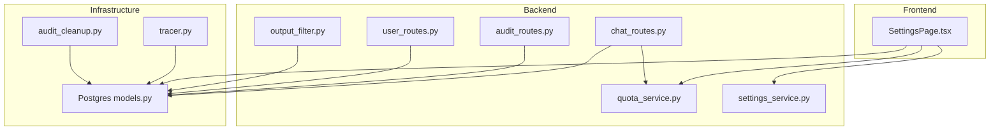
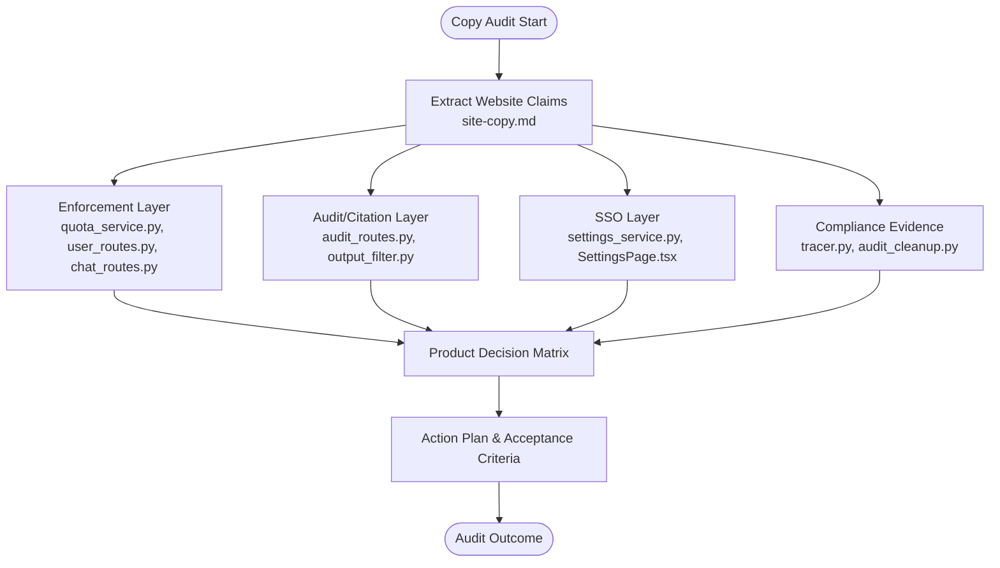
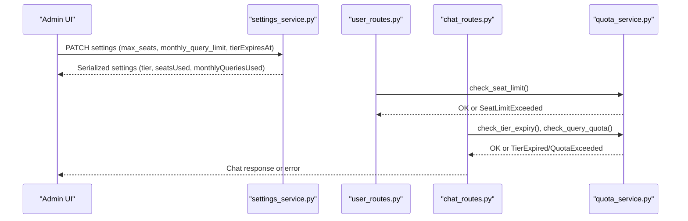
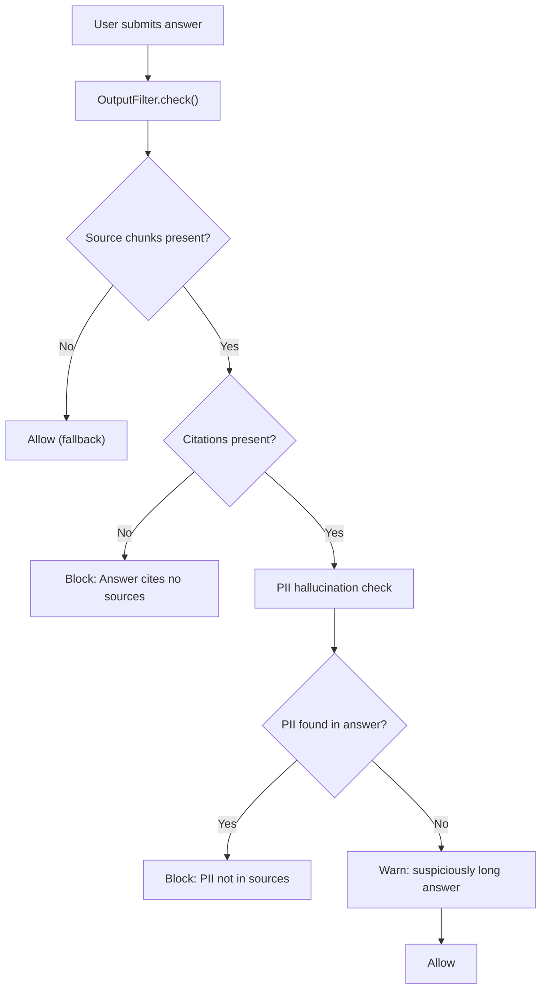
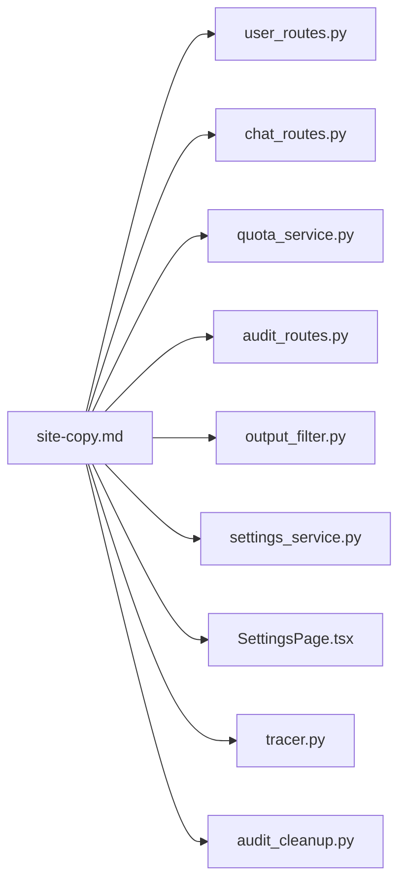

# Product Readiness Copy Audit

<cite>
**Referenced Files in This Document**
- [site-copy.md](file://site-copy.md)
- [SettingsPage.tsx](file://safe4ai-pilot/frontend/src/pages/admin/SettingsPage.tsx)
- [audit_routes.py](file://safe4ai-pilot/app/api/audit_routes.py)
- [output_filter.py](file://safe4ai-pilot/app/security/output_filter.py)
- [audit_cleanup.py](file://safe4ai-pilot/scripts/audit_cleanup.py)
- [user_routes.py](file://safe4ai-pilot/app/api/user_routes.py)
- [chat_routes.py](file://safe4ai-pilot/app/api/chat_routes.py)
- [quota_service.py](file://safe4ai-pilot/app/services/quota_service.py)
- [settings_service.py](file://safe4ai-pilot/app/services/settings_service.py)
- [tracer.py](file://safe4ai-pilot/observability/tracer.py)
- [models.py](file://safe4ai-pilot/app/db/models.py)
</cite>

## Update Summary
**Changes Made**
- Removed references to product-readiness-copy-audit.md and site-copy-gap-analysis.md as these files were removed from the codebase
- Updated documentation structure to reflect streamlined approach focusing on core implementation details
- Maintained all functional analysis while removing dependency on dropped documentation files

## Table of Contents
1. [Introduction](#introduction)
2. [Project Structure](#project-structure)
3. [Core Components](#core-components)
4. [Architecture Overview](#architecture-overview)
5. [Detailed Component Analysis](#detailed-component-analysis)
6. [Dependency Analysis](#dependency-analysis)
7. [Performance Considerations](#performance-considerations)
8. [Troubleshooting Guide](#troubleshooting-guide)
9. [Conclusion](#conclusion)

## Introduction
This document presents a product readiness audit comparing the marketing copy from the website with the current application implementation in the safe4ai-pilot codebase. Its goal is to reconcile commercial claims with actual enforcement and behavior, identifying gaps that must be addressed to make the product offer honest and defensible across Evaluation, Team, and Enterprise tiers. The audit focuses on four pillars: tier enforcement (seats, queries, expiry), audit and citation integrity, identity and access controls (SSO), and compliance evidence (immutable archives and tamper-evident exports).

## Project Structure
The repository is organized into:
- Frontend (React admin UI) under safe4ai-pilot/frontend/src/pages/admin
- Backend (FastAPI) under safe4ai-pilot/app
- Observability under safe4ai-pilot/observability
- Scripts under safe4ai-pilot/scripts
- Design assets under design/

The audit centers on the admin settings UI, audit endpoints, chat endpoints, quota enforcement services, and supporting models and exporters.

**Diagram sources**
- [SettingsPage.tsx:1-352](file://safe4ai-pilot/frontend/src/pages/admin/SettingsPage.tsx#L1-L352)
- [audit_routes.py:1-169](file://safe4ai-pilot/app/api/audit_routes.py#L1-L169)
- [chat_routes.py:1-361](file://safe4ai-pilot/app/api/chat_routes.py#L1-L361)
- [user_routes.py:1-119](file://safe4ai-pilot/app/api/user_routes.py#L1-L119)
- [quota_service.py:1-155](file://safe4ai-pilot/app/services/quota_service.py#L1-L155)
- [settings_service.py:1-635](file://safe4ai-pilot/app/services/settings_service.py#L1-L635)
- [output_filter.py:1-74](file://safe4ai-pilot/app/security/output_filter.py#L1-L74)
- [models.py:1-214](file://safe4ai-pilot/app/db/models.py#L1-L214)
- [tracer.py:1-76](file://safe4ai-pilot/observability/tracer.py#L1-L76)
- [audit_cleanup.py:1-132](file://safe4ai-pilot/scripts/audit_cleanup.py#L1-L132)

**Section sources**
- [site-copy.md:1-133](file://site-copy.md#L1-L133)

## Core Components
- Tier enforcement: seat caps, monthly query limits, and evaluation expiry are enforced via quota_service and checked in user creation and chat endpoints.
- Audit and citation integrity: audit logs are exported via admin endpoints; output filtering currently checks PII and length but not citation presence.
- Identity and access: SSO toggle exists in settings but no IdP integration; provider mode changes are not audited.
- Compliance evidence: retention is configurable; immutable archive and tamper-evident CSV are not yet implemented.

**Section sources**
- [quota_service.py:87-155](file://safe4ai-pilot/app/services/quota_service.py#L87-L155)
- [user_routes.py:68-101](file://safe4ai-pilot/app/api/user_routes.py#L68-L101)
- [chat_routes.py:138-150](file://safe4ai-pilot/app/api/chat_routes.py#L138-L150)
- [audit_routes.py:64-122](file://safe4ai-pilot/app/api/audit_routes.py#L64-L122)
- [output_filter.py:26-74](file://safe4ai-pilot/app/security/output_filter.py#L26-L74)
- [settings_service.py:48-64](file://safe4ai-pilot/app/services/settings_service.py#L48-L64)
- [SettingsPage.tsx:277-295](file://safe4ai-pilot/frontend/src/pages/admin/SettingsPage.tsx#L277-L295)

## Architecture Overview
The audit compares website claims with backend enforcement across four areas:

**Diagram sources**
- [site-copy.md:106-121](file://site-copy.md#L106-L121)

## Detailed Component Analysis

### Tier Enforcement: Seats, Queries, Expiry
- Current state:
  - Seat enforcement: implemented via seat limit checks during user creation and serialized in settings.
  - Monthly query enforcement: implemented via monthly counter and preflight checks in chat endpoints.
  - Expiry enforcement: evaluation expiry check is implemented and enforced in chat preflight.
- Website claims:
  - Evaluation: up to 5 seats, 5,000 queries/month.
  - Team: up to 50 seats, unlimited queries.
- Findings:
  - Seat and query enforcement align with website claims for Evaluation and Team tiers.
  - Pricing copy conflicts: Evaluation is described as either 5,000 or 10,000 queries/month; the audit recommends resolving this conflict.

**Diagram sources**
- [settings_service.py:421-438](file://safe4ai-pilot/app/services/settings_service.py#L421-L438)
- [settings_service.py:517-628](file://safe4ai-pilot/app/services/settings_service.py#L517-L628)
- [user_routes.py:68-101](file://safe4ai-pilot/app/api/user_routes.py#L68-L101)
- [chat_routes.py:138-150](file://safe4ai-pilot/app/api/chat_routes.py#L138-L150)
- [quota_service.py:87-155](file://safe4ai-pilot/app/services/quota_service.py#L87-L155)

**Section sources**
- [quota_service.py:43-155](file://safe4ai-pilot/app/services/quota_service.py#L43-L155)
- [user_routes.py:68-101](file://safe4ai-pilot/app/api/user_routes.py#L68-L101)
- [chat_routes.py:138-150](file://safe4ai-pilot/app/api/chat_routes.py#L138-L150)
- [settings_service.py:48-64](file://safe4ai-pilot/app/services/settings_service.py#L48-L64)
- [settings_service.py:517-628](file://safe4ai-pilot/app/services/settings_service.py#L517-L628)

### Audit and Citation Integrity
- Current state:
  - Audit CSV export exists and is served by admin endpoints.
  - Output guard checks PII and suspicious length but does not enforce citation presence.
  - Retention is configurable; cleanup deletes old rows without archiving.
- Website claims:
  - CSV exportable, signed, tamper-evident.
  - Output guard rejects responses without at least one citation.
- Findings:
  - Citation requirement is not enforced; copy should be corrected or feature implemented.
  - Tamper-evident and immutable archive claims are not yet implemented.

**Diagram sources**
- [output_filter.py:26-74](file://safe4ai-pilot/app/security/output_filter.py#L26-L74)

**Section sources**
- [audit_routes.py:64-122](file://safe4ai-pilot/app/api/audit_routes.py#L64-L122)
- [output_filter.py:15-74](file://safe4ai-pilot/app/security/output_filter.py#L15-L74)
- [audit_cleanup.py:35-86](file://safe4ai-pilot/scripts/audit_cleanup.py#L35-L86)

### Single Sign-On (SSO)
- Current state:
  - SSO-only toggle exists in settings UI and backend.
  - No IdP/OIDC/SAML integration is implemented.
- Website claims:
  - Team tier includes SSO (SAML, OIDC).
- Findings:
  - Until OIDC/SAML flows are implemented, SSO should be removed from Team copy or clearly marked as planned.

**Section sources**
- [SettingsPage.tsx:277-282](file://safe4ai-pilot/frontend/src/pages/admin/SettingsPage.tsx#L277-L282)
- [settings_service.py:48-64](file://safe4ai-pilot/app/services/settings_service.py#L48-L64)

### Observability Export
- Current state:
  - OpenTelemetry exporter is configured via environment variable and defaults to Jaeger.
- Website claims:
  - Ship to Jaeger, Tempo, Honeycomb, or your own stack.
- Findings:
  - UI/docs for selecting backends are missing; implement configurable exporter endpoint.

**Section sources**
- [tracer.py:27-32](file://safe4ai-pilot/observability/tracer.py#L27-L32)
- [site-copy.md:73-77](file://site-copy.md#L73-L77)

### Provider Mode Toggle Auditing
- Current state:
  - Provider mode changes are saved but not explicitly audited.
- Website claims:
  - Provider toggle is audited.
- Findings:
  - Add explicit AuditLog entry for provider mode changes with old/new values.

**Section sources**
- [settings_service.py:421-438](file://safe4ai-pilot/app/services/settings_service.py#L421-L438)
- [site-copy.md:116](file://site-copy.md#L116)

### RBAC Roles
- Current state:
  - Roles are admin, pilot_user; site-copy lists admin, pilot_user.
- Findings:
  - Align copy or add pilot_user role to match website.

**Section sources**
- [models.py:25-28](file://safe4ai-pilot/app/db/models.py#L25-L28)

## Dependency Analysis
The audit reveals dependencies between website claims and backend enforcement:

**Diagram sources**
- [site-copy.md:106-121](file://site-copy.md#L106-L121)
- [user_routes.py:68-101](file://safe4ai-pilot/app/api/user_routes.py#L68-L101)
- [chat_routes.py:138-150](file://safe4ai-pilot/app/api/chat_routes.py#L138-L150)
- [quota_service.py:87-155](file://safe4ai-pilot/app/services/quota_service.py#L87-L155)
- [audit_routes.py:64-122](file://safe4ai-pilot/app/api/audit_routes.py#L64-L122)
- [output_filter.py:26-74](file://safe4ai-pilot/app/security/output_filter.py#L26-L74)
- [settings_service.py:421-438](file://safe4ai-pilot/app/services/settings_service.py#L421-L438)
- [SettingsPage.tsx:277-295](file://safe4ai-pilot/frontend/src/pages/admin/SettingsPage.tsx#L277-L295)
- [tracer.py:27-32](file://safe4ai-pilot/observability/tracer.py#L27-L32)
- [audit_cleanup.py:35-86](file://safe4ai-pilot/scripts/audit_cleanup.py#L35-L86)

## Performance Considerations
- Current implementation relies on database-backed counters for seat and query enforcement. These are efficient for small to medium deployments but should be monitored for contention.
- Audit CSV export streams rows; consider pagination and compression for large datasets.
- OpenTelemetry exporter batching is configured; ensure exporter endpoint reliability and throughput.

## Troubleshooting Guide
Common issues and remedies derived from the audit:
- Evaluation seat limit exceeded: verify max_seats configuration and active seat count.
- Monthly query quota reached: confirm monthly_query_limit and current count.
- Evaluation expired: ensure tier_expires_at is properly set and enforced.
- Output guard not rejecting answers without citations: implement citation presence check.
- CSV not tamper-evident: add signature/hash chain to export metadata.
- SSO toggle not functioning: implement OIDC/SAML flow or remove claim from Team copy.
- Provider mode change not audited: add AuditLog entry for provider changes.

**Section sources**
- [quota_service.py:87-155](file://safe4ai-pilot/app/services/quota_service.py#L87-L155)
- [output_filter.py:26-74](file://safe4ai-pilot/app/security/output_filter.py#L26-L74)
- [audit_routes.py:64-122](file://safe4ai-pilot/app/api/audit_routes.py#L64-L122)
- [settings_service.py:48-64](file://safe4ai-pilot/app/services/settings_service.py#L48-L64)
- [SettingsPage.tsx:277-295](file://safe4ai-pilot/frontend/src/pages/admin/SettingsPage.tsx#L277-L295)

## Conclusion
The application is close to being market-ready for the Evaluation tier with seat, query, and expiry enforcement. However, several gaps must be addressed to make the offer honest and defensible:
- Align output guard behavior with website claims (citation presence) or update copy accordingly.
- Implement tamper-evident audit exports and immutable archive for Enterprise-grade compliance.
- Replace placeholder SSO claim in Team tier with real OIDC/SAML integration or remove the claim.
- Resolve pricing copy inconsistencies (5,000 vs 10,000 queries/month for Evaluation).
- Add provider mode change auditing to meet website assertions.

The acceptance criteria in the audit define clear gates for moving forward with implementation and validation.