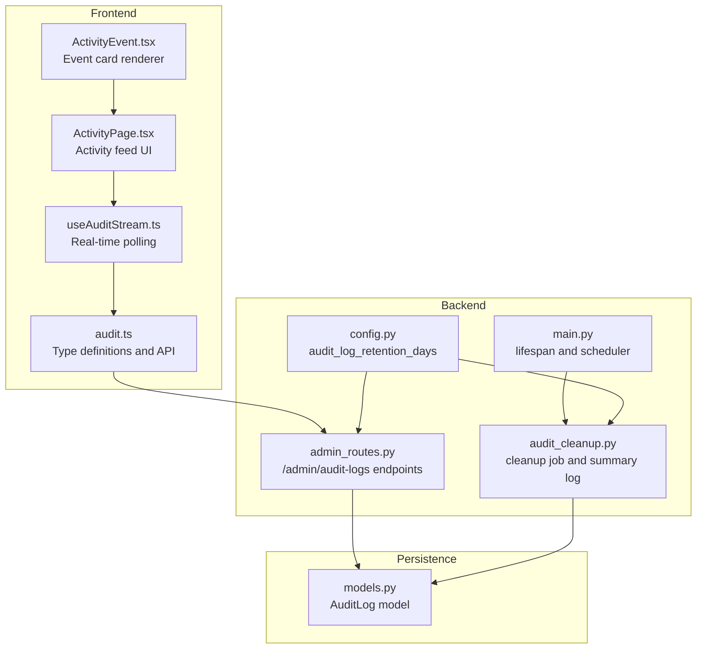
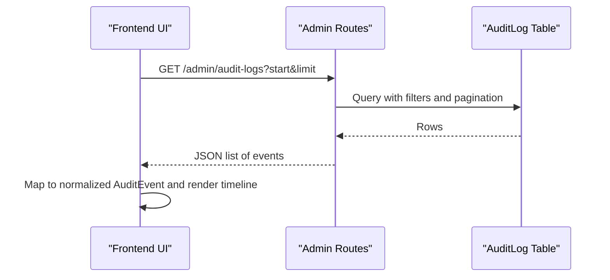
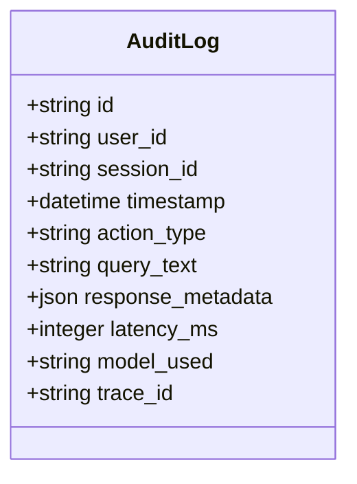
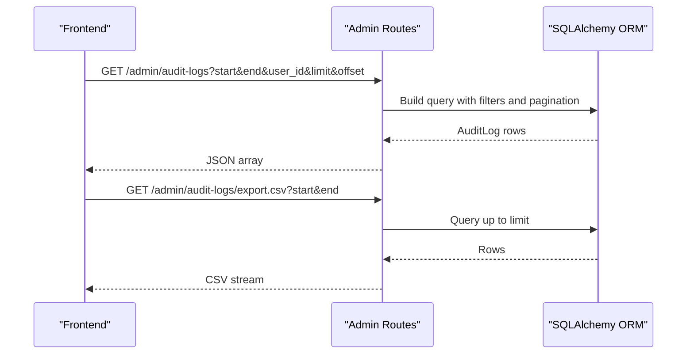
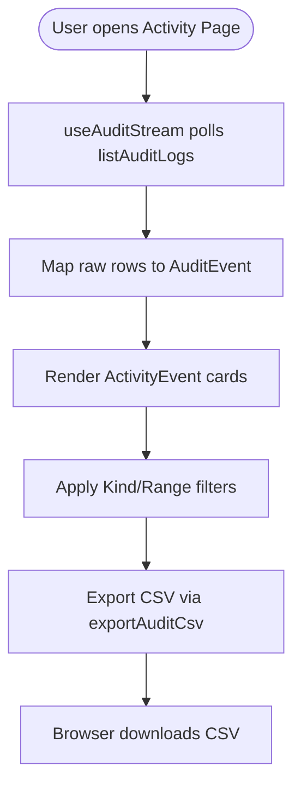
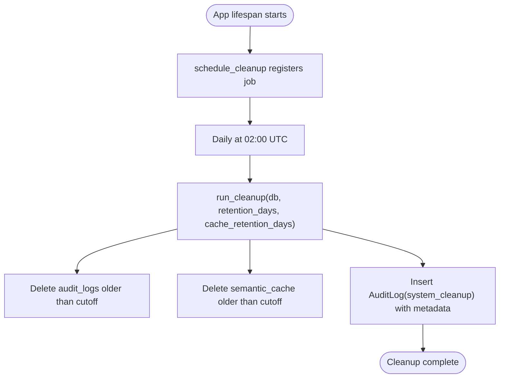
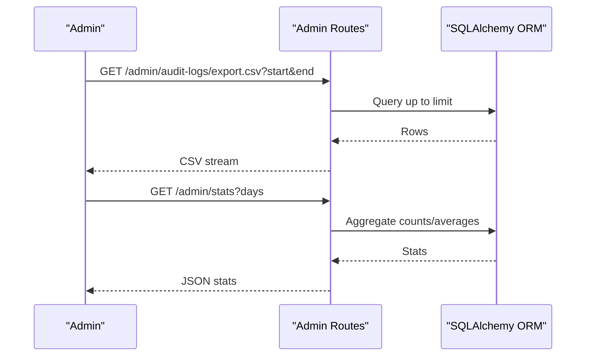
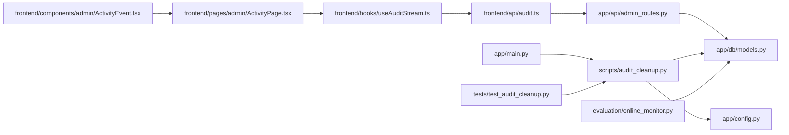

# Audit Logging and Compliance Tracking

<cite>
**Referenced Files in This Document**
- [audit.ts](file://safe4ai-pilot/frontend/src/api/audit.ts)
- [ActivityEvent.tsx](file://safe4ai-pilot/frontend/src/components/admin/ActivityEvent.tsx)
- [ActivityPage.tsx](file://safe4ai-pilot/frontend/src/pages/admin/ActivityPage.tsx)
- [useAuditStream.ts](file://safe4ai-pilot/frontend/src/hooks/useAuditStream.ts)
- [admin_routes.py](file://safe4ai-pilot/app/api/admin_routes.py)
- [models.py](file://safe4ai-pilot/app/db/models.py)
- [audit_cleanup.py](file://safe4ai-pilot/scripts/audit_cleanup.py)
- [config.py](file://safe4ai-pilot/app/config.py)
- [main.py](file://safe4ai-pilot/app/main.py)
- [online_monitor.py](file://safe4ai-pilot/evaluation/online_monitor.py)
- [test_audit_cleanup.py](file://safe4ai-pilot/tests/test_audit_cleanup.py)
</cite>

## Table of Contents
1. [Introduction](#introduction)
2. [Project Structure](#project-structure)
3. [Core Components](#core-components)
4. [Architecture Overview](#architecture-overview)
5. [Detailed Component Analysis](#detailed-component-analysis)
6. [Dependency Analysis](#dependency-analysis)
7. [Performance Considerations](#performance-considerations)
8. [Troubleshooting Guide](#troubleshooting-guide)
9. [Conclusion](#conclusion)
10. [Appendices](#appendices)

## Introduction
This document explains the audit logging and compliance tracking system that ensures complete traceability of all system activities and user interactions. It covers event capture, retention policies, compliance reporting, dashboard integration, and automated monitoring. It also provides practical guidance on configuring audit policies, querying logs, generating compliance reports, and optimizing performance and storage.

## Project Structure
The audit system spans backend APIs, database models, frontend dashboards, and maintenance scripts:
- Backend API exposes endpoints to list and export audit logs and integrates with admin dashboards.
- Database stores structured audit records with fields for user identity, action type, query text, latency, model, and trace identifiers.
- Frontend provides a real-time activity feed and filtering for administrators.
- Maintenance scripts manage data retention and produce summary audit logs for cleanup operations.

**Diagram sources**
- [audit.ts:1-54](file://safe4ai-pilot/frontend/src/api/audit.ts#L1-L54)
- [useAuditStream.ts:1-17](file://safe4ai-pilot/frontend/src/hooks/useAuditStream.ts#L1-L17)
- [ActivityPage.tsx:1-147](file://safe4ai-pilot/frontend/src/pages/admin/ActivityPage.tsx#L1-L147)
- [ActivityEvent.tsx:1-83](file://safe4ai-pilot/frontend/src/components/admin/ActivityEvent.tsx#L1-L83)
- [admin_routes.py:359-432](file://safe4ai-pilot/app/api/admin_routes.py#L359-L432)
- [config.py:16-17](file://safe4ai-pilot/app/config.py#L16-L17)
- [main.py:28-61](file://safe4ai-pilot/app/main.py#L28-L61)
- [audit_cleanup.py:35-84](file://safe4ai-pilot/scripts/audit_cleanup.py#L35-L84)
- [models.py:118-131](file://safe4ai-pilot/app/db/models.py#L118-L131)

**Section sources**
- [audit.ts:1-54](file://safe4ai-pilot/frontend/src/api/audit.ts#L1-L54)
- [admin_routes.py:359-432](file://safe4ai-pilot/app/api/admin_routes.py#L359-L432)
- [models.py:118-131](file://safe4ai-pilot/app/db/models.py#L118-L131)
- [config.py:16-17](file://safe4ai-pilot/app/config.py#L16-L17)
- [main.py:28-61](file://safe4ai-pilot/app/main.py#L28-L61)
- [audit_cleanup.py:35-84](file://safe4ai-pilot/scripts/audit_cleanup.py#L35-L84)
- [ActivityPage.tsx:1-147](file://safe4ai-pilot/frontend/src/pages/admin/ActivityPage.tsx#L1-L147)
- [ActivityEvent.tsx:1-83](file://safe4ai-pilot/frontend/src/components/admin/ActivityEvent.tsx#L1-L83)
- [useAuditStream.ts:1-17](file://safe4ai-pilot/frontend/src/hooks/useAuditStream.ts#L1-L17)

## Core Components
- AuditLog data model defines the audit trail schema, including user/session identifiers, timestamps, action type, query text, latency, model, and trace ID.
- Admin API endpoints provide paginated listing and CSV export of audit logs with optional filters by time range and user.
- Frontend audit API maps raw database rows to a normalized event type and supports CSV export.
- Retention and cleanup: configurable retention windows and a scheduled cleanup job that removes stale entries and writes a summary audit log.
- Real-time dashboard: a continuously polled activity feed with filtering and export.

**Section sources**
- [models.py:118-131](file://safe4ai-pilot/app/db/models.py#L118-L131)
- [admin_routes.py:359-432](file://safe4ai-pilot/app/api/admin_routes.py#L359-L432)
- [audit.ts:3-53](file://safe4ai-pilot/frontend/src/api/audit.ts#L3-L53)
- [config.py:16-17](file://safe4ai-pilot/app/config.py#L16-L17)
- [audit_cleanup.py:35-84](file://safe4ai-pilot/scripts/audit_cleanup.py#L35-L84)
- [ActivityPage.tsx:1-147](file://safe4ai-pilot/frontend/src/pages/admin/ActivityPage.tsx#L1-L147)
- [useAuditStream.ts:1-17](file://safe4ai-pilot/frontend/src/hooks/useAuditStream.ts#L1-L17)

## Architecture Overview
The audit system follows a layered pattern:
- Data capture occurs at service boundaries (e.g., ingestion and query flows) and is persisted to the AuditLog table.
- Admin endpoints expose read and export capabilities.
- Frontend consumes the API to render a live activity timeline.
- A background job enforces retention and writes a system cleanup summary event.

**Diagram sources**
- [admin_routes.py:359-432](file://safe4ai-pilot/app/api/admin_routes.py#L359-L432)
- [models.py:118-131](file://safe4ai-pilot/app/db/models.py#L118-L131)
- [audit.ts:34-50](file://safe4ai-pilot/frontend/src/api/audit.ts#L34-L50)
- [ActivityPage.tsx:32-51](file://safe4ai-pilot/frontend/src/pages/admin/ActivityPage.tsx#L32-L51)

## Detailed Component Analysis

### Audit Trail Data Model
The AuditLog entity captures:
- Identity: user_id, session_id
- Timing: timestamp
- Action: action_type, query_text
- Outcome: response_metadata, latency_ms, model_used
- Observability: trace_id

**Diagram sources**
- [models.py:118-131](file://safe4ai-pilot/app/db/models.py#L118-L131)

**Section sources**
- [models.py:118-131](file://safe4ai-pilot/app/db/models.py#L118-L131)

### Admin Audit Log API
Endpoints:
- List audit logs with optional start/end time, user filter, pagination, and limit.
- Export CSV for a given time window.

**Diagram sources**
- [admin_routes.py:359-432](file://safe4ai-pilot/app/api/admin_routes.py#L359-L432)

**Section sources**
- [admin_routes.py:359-432](file://safe4ai-pilot/app/api/admin_routes.py#L359-L432)

### Frontend Audit API and Dashboard
- Normalized event type and mapping from raw rows.
- Real-time polling with 30-second intervals and pagination.
- Activity timeline with kind and time-range filters and CSV export.

**Diagram sources**
- [audit.ts:34-53](file://safe4ai-pilot/frontend/src/api/audit.ts#L34-L53)
- [useAuditStream.ts:5-16](file://safe4ai-pilot/frontend/src/hooks/useAuditStream.ts#L5-L16)
- [ActivityPage.tsx:1-147](file://safe4ai-pilot/frontend/src/pages/admin/ActivityPage.tsx#L1-L147)
- [ActivityEvent.tsx:1-83](file://safe4ai-pilot/frontend/src/components/admin/ActivityEvent.tsx#L1-L83)

**Section sources**
- [audit.ts:3-53](file://safe4ai-pilot/frontend/src/api/audit.ts#L3-L53)
- [useAuditStream.ts:1-17](file://safe4ai-pilot/frontend/src/hooks/useAuditStream.ts#L1-L17)
- [ActivityPage.tsx:1-147](file://safe4ai-pilot/frontend/src/pages/admin/ActivityPage.tsx#L1-L147)
- [ActivityEvent.tsx:1-83](file://safe4ai-pilot/frontend/src/components/admin/ActivityEvent.tsx#L1-L83)

### Retention Policies and Cleanup
- Configurable retention windows for audit logs and semantic cache.
- Daily scheduled cleanup deletes stale entries and writes a summary audit log with deletion counts.

**Diagram sources**
- [main.py:58-61](file://safe4ai-pilot/app/main.py#L58-L61)
- [audit_cleanup.py:86-116](file://safe4ai-pilot/scripts/audit_cleanup.py#L86-L116)
- [audit_cleanup.py:35-84](file://safe4ai-pilot/scripts/audit_cleanup.py#L35-L84)
- [config.py:16-17](file://safe4ai-pilot/app/config.py#L16-L17)

**Section sources**
- [config.py:16-17](file://safe4ai-pilot/app/config.py#L16-L17)
- [audit_cleanup.py:35-84](file://safe4ai-pilot/scripts/audit_cleanup.py#L35-L84)
- [audit_cleanup.py:86-116](file://safe4ai-pilot/scripts/audit_cleanup.py#L86-L116)
- [main.py:58-61](file://safe4ai-pilot/app/main.py#L58-L61)

### Compliance Reporting and Monitoring
- Export CSV for time-bound reporting.
- Sampling utility for online monitoring and evaluation workflows.
- Stats endpoint aggregates query volume, latency, and cache metrics for operational insights.

**Diagram sources**
- [admin_routes.py:395-432](file://safe4ai-pilot/app/api/admin_routes.py#L395-L432)
- [admin_routes.py:439-468](file://safe4ai-pilot/app/api/admin_routes.py#L439-L468)
- [online_monitor.py:42-61](file://safe4ai-pilot/evaluation/online_monitor.py#L42-L61)

**Section sources**
- [admin_routes.py:395-432](file://safe4ai-pilot/app/api/admin_routes.py#L395-L432)
- [admin_routes.py:439-468](file://safe4ai-pilot/app/api/admin_routes.py#L439-L468)
- [online_monitor.py:42-61](file://safe4ai-pilot/evaluation/online_monitor.py#L42-L61)

## Dependency Analysis
- Frontend depends on the admin audit API for data and on React Query for caching/pagination.
- Backend depends on SQLAlchemy for persistence and FastAPI for routing.
- Cleanup job depends on APScheduler and configuration settings.
- Evaluation and testing modules depend on the audit log schema for sampling and assertions.

**Diagram sources**
- [audit.ts:1-54](file://safe4ai-pilot/frontend/src/api/audit.ts#L1-L54)
- [useAuditStream.ts:1-17](file://safe4ai-pilot/frontend/src/hooks/useAuditStream.ts#L1-L17)
- [ActivityPage.tsx:1-147](file://safe4ai-pilot/frontend/src/pages/admin/ActivityPage.tsx#L1-L147)
- [ActivityEvent.tsx:1-83](file://safe4ai-pilot/frontend/src/components/admin/ActivityEvent.tsx#L1-L83)
- [admin_routes.py:359-432](file://safe4ai-pilot/app/api/admin_routes.py#L359-L432)
- [models.py:118-131](file://safe4ai-pilot/app/db/models.py#L118-L131)
- [audit_cleanup.py:35-84](file://safe4ai-pilot/scripts/audit_cleanup.py#L35-L84)
- [config.py:16-17](file://safe4ai-pilot/app/config.py#L16-L17)
- [main.py:58-61](file://safe4ai-pilot/app/main.py#L58-L61)
- [test_audit_cleanup.py:45-83](file://safe4ai-pilot/tests/test_audit_cleanup.py#L45-L83)
- [online_monitor.py:42-61](file://safe4ai-pilot/evaluation/online_monitor.py#L42-L61)

**Section sources**
- [audit.ts:1-54](file://safe4ai-pilot/frontend/src/api/audit.ts#L1-L54)
- [admin_routes.py:359-432](file://safe4ai-pilot/app/api/admin_routes.py#L359-L432)
- [models.py:118-131](file://safe4ai-pilot/app/db/models.py#L118-L131)
- [audit_cleanup.py:35-84](file://safe4ai-pilot/scripts/audit_cleanup.py#L35-L84)
- [config.py:16-17](file://safe4ai-pilot/app/config.py#L16-L17)
- [main.py:58-61](file://safe4ai-pilot/app/main.py#L58-L61)
- [test_audit_cleanup.py:45-83](file://safe4ai-pilot/tests/test_audit_cleanup.py#L45-L83)
- [online_monitor.py:42-61](file://safe4ai-pilot/evaluation/online_monitor.py#L42-L61)

## Performance Considerations
- Pagination and limits: The API enforces a maximum page size to prevent oversized responses.
- Indexing: The AuditLog timestamp column is indexed to accelerate time-range queries.
- Real-time polling: Frontend polls every 30 seconds; adjust interval based on required freshness vs. load.
- Export limits: CSV exports are capped to a fixed number of rows to avoid memory pressure.
- Cleanup cadence: Daily cleanup reduces long-range scans and keeps the database size manageable.

[No sources needed since this section provides general guidance]

## Troubleshooting Guide
- No events appear in the activity feed:
  - Verify the API endpoint returns data and the frontend mapping is applied.
  - Confirm the real-time hook is fetching and that the page index and limit are reasonable.
- Export yields no rows:
  - Check the selected time range and confirm the export endpoint filters align with the chosen period.
- Cleanup not running:
  - Ensure the lifespan initializes the scheduler and that the configured retention values are set appropriately.
  - Validate that the summary audit log is inserted after cleanup runs.
- Tests fail:
  - Confirm the mocked database execution returns expected rowcounts and that the summary log is committed.

**Section sources**
- [admin_routes.py:359-432](file://safe4ai-pilot/app/api/admin_routes.py#L359-L432)
- [audit.ts:34-53](file://safe4ai-pilot/frontend/src/api/audit.ts#L34-L53)
- [useAuditStream.ts:5-16](file://safe4ai-pilot/frontend/src/hooks/useAuditStream.ts#L5-L16)
- [ActivityPage.tsx:32-51](file://safe4ai-pilot/frontend/src/pages/admin/ActivityPage.tsx#L32-L51)
- [audit_cleanup.py:86-116](file://safe4ai-pilot/scripts/audit_cleanup.py#L86-L116)
- [audit_cleanup.py:35-84](file://safe4ai-pilot/scripts/audit_cleanup.py#L35-L84)
- [test_audit_cleanup.py:45-83](file://safe4ai-pilot/tests/test_audit_cleanup.py#L45-L83)

## Conclusion
The audit logging and compliance tracking system provides a robust foundation for traceability, governance, and reporting. It combines a structured data model, admin-friendly dashboards, configurable retention, and automated maintenance to support ongoing compliance needs. Administrators can monitor activity in real time, export historical data, and rely on scheduled cleanup to maintain performance and storage efficiency.

[No sources needed since this section summarizes without analyzing specific files]

## Appendices

### Audit Event Categorization
- query: User queries and retrievals.
- upload: Document ingestion/indexing actions.
- feedback: User-provided ratings/comments.
- login: Authentication events.
- fallback: Automatic fallback scenarios.

**Section sources**
- [audit.ts:3-32](file://safe4ai-pilot/frontend/src/api/audit.ts#L3-L32)

### Configuring Audit Policies
- Retention windows:
  - Set the number of days to retain audit logs and semantic cache entries.
- Export and reporting:
  - Use the CSV export endpoint to download time-windowed datasets for compliance reviews.
- Dashboard filters:
  - Narrow by event kind and time range for targeted investigations.

**Section sources**
- [config.py:16-17](file://safe4ai-pilot/app/config.py#L16-L17)
- [admin_routes.py:395-432](file://safe4ai-pilot/app/api/admin_routes.py#L395-L432)
- [ActivityPage.tsx:10-29](file://safe4ai-pilot/frontend/src/pages/admin/ActivityPage.tsx#L10-L29)

### Querying Audit Logs
- Programmatic access:
  - Use the list endpoint with start, end, user_id, limit, and offset parameters.
- Sampling for monitoring:
  - Sample recent audit logs for evaluation and online monitoring tasks.

**Section sources**
- [admin_routes.py:359-432](file://safe4ai-pilot/app/api/admin_routes.py#L359-L432)
- [online_monitor.py:42-61](file://safe4ai-pilot/evaluation/online_monitor.py#L42-L61)

### Generating Compliance Reports
- Download CSV for a defined period.
- Combine with stats for operational metrics.
- Archive immutable copies per retention policy.

**Section sources**
- [admin_routes.py:395-432](file://safe4ai-pilot/app/api/admin_routes.py#L395-L432)
- [admin_routes.py:439-468](file://safe4ai-pilot/app/api/admin_routes.py#L439-L468)
- [ActivityPage.tsx:109-112](file://safe4ai-pilot/frontend/src/pages/admin/ActivityPage.tsx#L109-L112)

### Relationship to Security Monitoring and Governance
- Audit logs support security monitoring by recording user actions, authentication events, and system fallbacks.
- They enable governance by providing evidence of access, activity, and remediation actions (e.g., cleanup summaries).
- Trace IDs connect events across sessions for end-to-end auditing.

**Section sources**
- [models.py:118-131](file://safe4ai-pilot/app/db/models.py#L118-L131)
- [audit_cleanup.py:64-76](file://safe4ai-pilot/scripts/audit_cleanup.py#L64-L76)

### Optimizing Audit Performance and Storage
- Keep retention windows aligned with compliance requirements.
- Use pagination and export limits to control resource usage.
- Schedule cleanup during off-peak hours.
- Monitor database indexing effectiveness on timestamp filters.

**Section sources**
- [admin_routes.py:371-378](file://safe4ai-pilot/app/api/admin_routes.py#L371-L378)
- [audit_cleanup.py:86-116](file://safe4ai-pilot/scripts/audit_cleanup.py#L86-L116)
- [config.py:16-17](file://safe4ai-pilot/app/config.py#L16-L17)