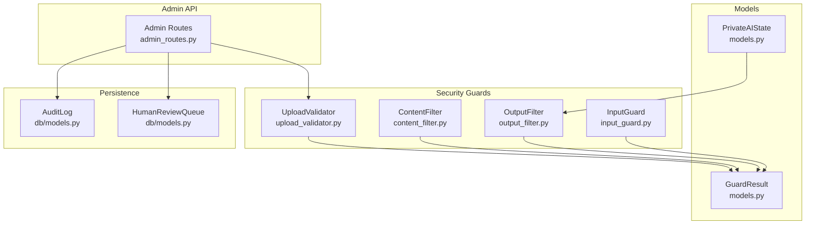
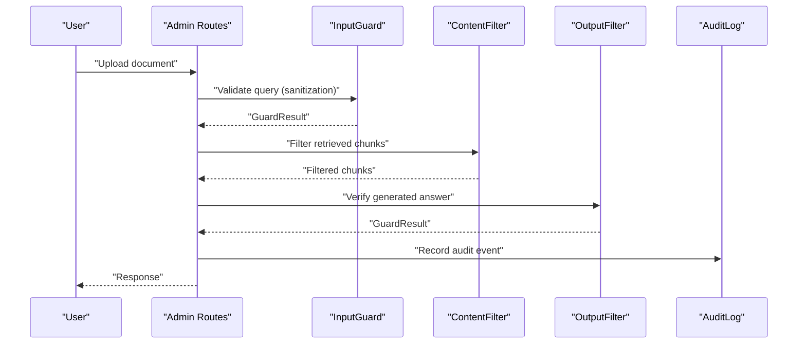
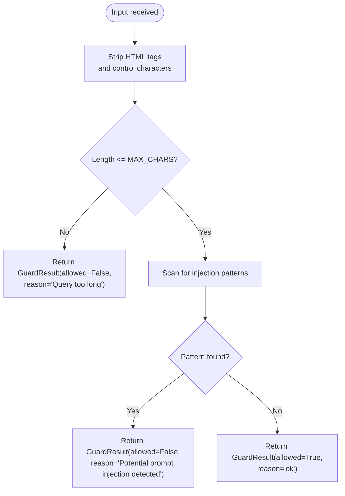
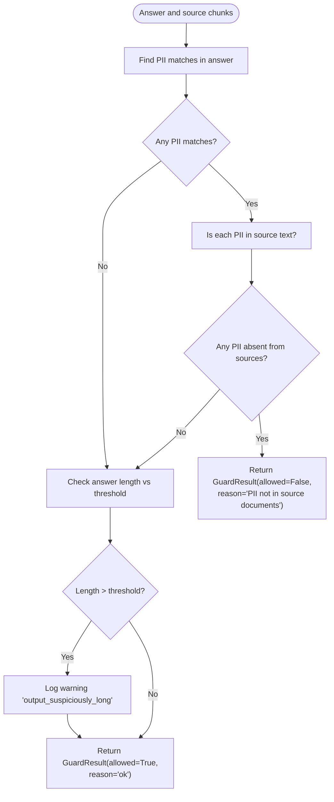
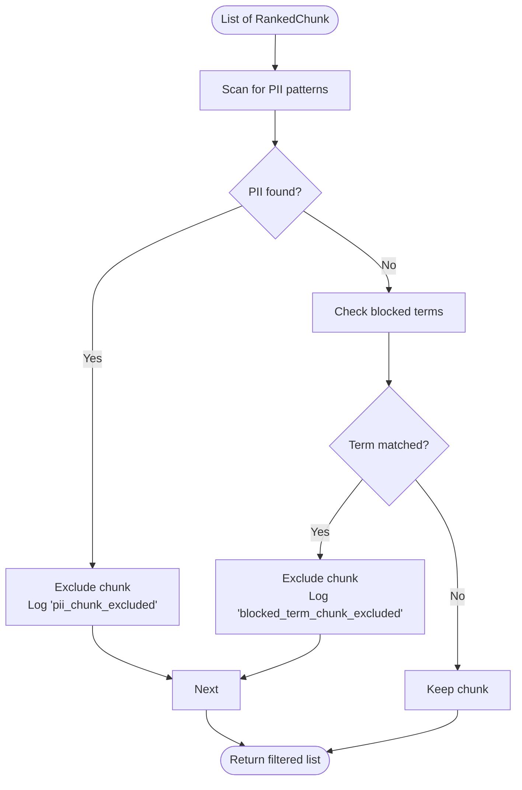
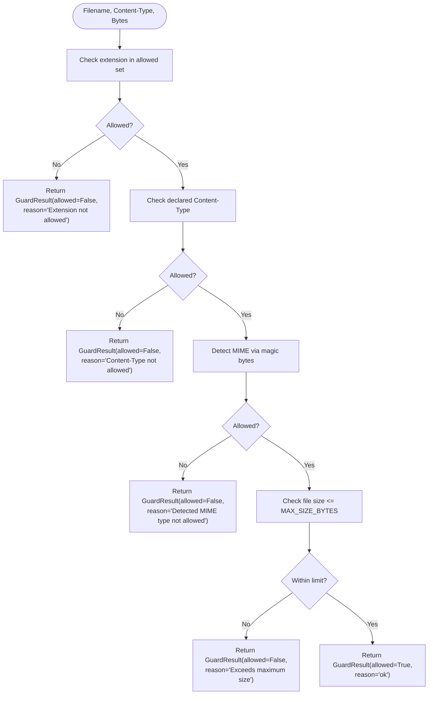
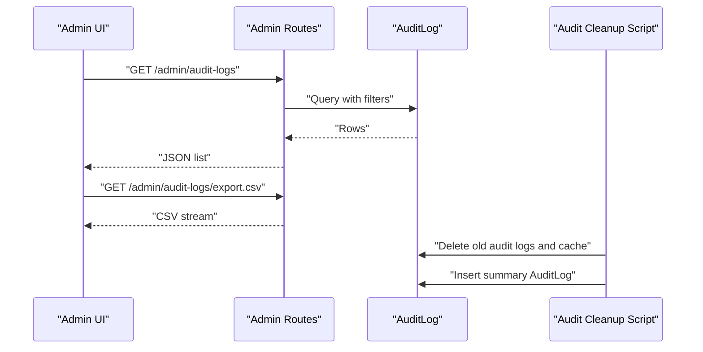
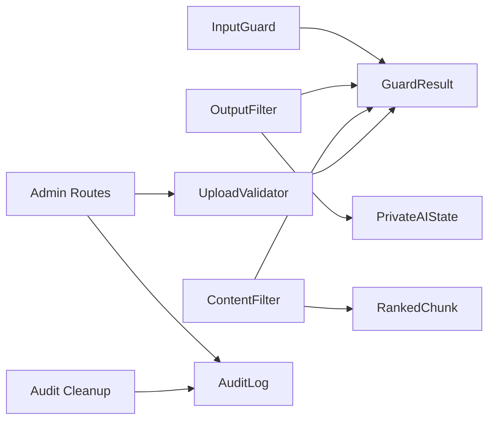

# Content Filtering and Moderation

<cite>
**Referenced Files in This Document**
- [content_filter.py](file://safe4ai-pilot/app/security/content_filter.py)
- [input_guard.py](file://safe4ai-pilot/app/security/input_guard.py)
- [output_filter.py](file://safe4ai-pilot/app/security/output_filter.py)
- [upload_validator.py](file://safe4ai-pilot/app/security/upload_validator.py)
- [models.py](file://safe4ai-pilot/app/models.py)
- [config.py](file://safe4ai-pilot/app/config.py)
- [admin_routes.py](file://safe4ai-pilot/app/api/admin_routes.py)
- [db/models.py](file://safe4ai-pilot/app/db/models.py)
- [audit_cleanup.py](file://safe4ai-pilot/scripts/audit_cleanup.py)
- [test_security_guards.py](file://safe4ai-pilot/tests/test_security_guards.py)
- [test_audit_cleanup.py](file://safe4ai-pilot/tests/test_audit_cleanup.py)
</cite>

## Table of Contents
1. [Introduction](#introduction)
2. [Project Structure](#project-structure)
3. [Core Components](#core-components)
4. [Architecture Overview](#architecture-overview)
5. [Detailed Component Analysis](#detailed-component-analysis)
6. [Dependency Analysis](#dependency-analysis)
7. [Performance Considerations](#performance-considerations)
8. [Troubleshooting Guide](#troubleshooting-guide)
9. [Conclusion](#conclusion)
10. [Appendices](#appendices)

## Introduction
This document describes the content filtering and moderation system designed to prevent inappropriate content generation and maintain content safety standards. It explains policy enforcement, content classification, and automated moderation workflows implemented in the backend security guards and integrated with audit logging and administrative oversight. It also covers filtering criteria, thresholds, decision-making algorithms, and practical guidance for tuning sensitivity, managing false positives/negatives, and implementing appeals processes.

## Project Structure
The content safety stack is implemented in the backend Python service under the safe4ai-pilot module. Key components include:
- Security guards for input sanitization, output verification, content filtering, and upload validation
- Data models for guarded results and pipeline state
- Admin APIs for document ingestion, audit log management, and human review queue
- Database models for audit logs and human review queue
- Cleanup scripts for audit log retention and semantic cache pruning

**Diagram sources**
- [input_guard.py:24-48](file://safe4ai-pilot/app/security/input_guard.py#L24-L48)
- [output_filter.py:30-59](file://safe4ai-pilot/app/security/output_filter.py#L30-L59)
- [content_filter.py:24-62](file://safe4ai-pilot/app/security/content_filter.py#L24-L62)
- [upload_validator.py:24-72](file://safe4ai-pilot/app/security/upload_validator.py#L24-L72)
- [models.py:38-41](file://safe4ai-pilot/app/models.py#L38-L41)
- [models.py:49-95](file://safe4ai-pilot/app/models.py#L49-L95)
- [admin_routes.py:63-114](file://safe4ai-pilot/app/api/admin_routes.py#L63-L114)
- [db/models.py:111-124](file://safe4ai-pilot/app/db/models.py#L111-L124)
- [db/models.py:162-175](file://safe4ai-pilot/app/db/models.py#L162-L175)

**Section sources**
- [input_guard.py:1-49](file://safe4ai-pilot/app/security/input_guard.py#L1-L49)
- [output_filter.py:1-60](file://safe4ai-pilot/app/security/output_filter.py#L1-L60)
- [content_filter.py:1-63](file://safe4ai-pilot/app/security/content_filter.py#L1-L63)
- [upload_validator.py:1-73](file://safe4ai-pilot/app/security/upload_validator.py#L1-L73)
- [models.py:1-95](file://safe4ai-pilot/app/models.py#L1-L95)
- [admin_routes.py:1-540](file://safe4ai-pilot/app/api/admin_routes.py#L1-L540)
- [db/models.py:1-175](file://safe4ai-pilot/app/db/models.py#L1-L175)

## Core Components
- InputGuard: Sanitizes and validates user queries prior to LLM interaction, rejecting potentially malicious or oversized inputs.
- OutputFilter: Verifies LLM-generated answers for PII hallucinations and suspicious length, blocking unsafe outputs.
- ContentFilter: Removes document chunks containing PII and blocks sections matching configured terms; supports audit logging of exclusions.
- UploadValidator: Enforces allowed file extensions, declared and detected MIME types, and file size limits.
- GuardResult: Unified decision model returned by all guards indicating allowed/disallowed and reason.
- PrivateAIState: Pipeline state capturing retrieval, grading, generation context, and observability metrics used by moderation steps.

**Section sources**
- [input_guard.py:24-48](file://safe4ai-pilot/app/security/input_guard.py#L24-L48)
- [output_filter.py:30-59](file://safe4ai-pilot/app/security/output_filter.py#L30-L59)
- [content_filter.py:24-62](file://safe4ai-pilot/app/security/content_filter.py#L24-L62)
- [upload_validator.py:24-72](file://safe4ai-pilot/app/security/upload_validator.py#L24-L72)
- [models.py:38-41](file://safe4ai-pilot/app/models.py#L38-L41)
- [models.py:49-95](file://safe4ai-pilot/app/models.py#L49-L95)

## Architecture Overview
The moderation architecture integrates guards at three stages:
- Pre-generation: InputGuard validates and sanitizes user queries.
- Post-generation: OutputFilter checks answers for PII hallucinations and length anomalies.
- Retrieval-stage: ContentFilter removes chunks with PII and blocks sections by configured terms.
- Ingestion-stage: UploadValidator enforces file constraints before documents are ingested.

**Diagram sources**
- [admin_routes.py:63-114](file://safe4ai-pilot/app/api/admin_routes.py#L63-L114)
- [input_guard.py:27-48](file://safe4ai-pilot/app/security/input_guard.py#L27-L48)
- [content_filter.py:28-58](file://safe4ai-pilot/app/security/content_filter.py#L28-L58)
- [output_filter.py:31-59](file://safe4ai-pilot/app/security/output_filter.py#L31-L59)
- [db/models.py:111-124](file://safe4ai-pilot/app/db/models.py#L111-L124)

## Detailed Component Analysis

### InputGuard
- Purpose: Prevent prompt injection and excessive input sizes.
- Sanitization: Strips HTML tags and control characters, retains printable characters and whitespace.
- Validation: Enforces maximum character count and scans for injection patterns.
- Decision: Returns a GuardResult indicating allowed or blocked with a reason.

**Diagram sources**
- [input_guard.py:27-48](file://safe4ai-pilot/app/security/input_guard.py#L27-L48)

**Section sources**
- [input_guard.py:24-48](file://safe4ai-pilot/app/security/input_guard.py#L24-L48)

### OutputFilter
- Purpose: Detect PII hallucinations and flag suspiciously long outputs.
- Detection: Identifies known PII patterns in the answer; compares against combined source chunk content.
- Thresholds: Blocks if PII appears without presence in sources; warns if answer exceeds a length threshold.
- Decision: Returns a GuardResult indicating allowed or blocked with a reason.

**Diagram sources**
- [output_filter.py:31-59](file://safe4ai-pilot/app/security/output_filter.py#L31-L59)

**Section sources**
- [output_filter.py:30-59](file://safe4ai-pilot/app/security/output_filter.py#L30-L59)

### ContentFilter
- Purpose: Remove sensitive chunks and block sections matching configured terms.
- PII detection: Uses compiled regex patterns for SSN, credit cards, and passport numbers.
- Blocked terms: Filters chunks whose content contains any configured term (case-insensitive substring match).
- Logging: Emits warnings for excluded chunks with identifiers for auditability.

**Diagram sources**
- [content_filter.py:28-58](file://safe4ai-pilot/app/security/content_filter.py#L28-L58)

**Section sources**
- [content_filter.py:24-62](file://safe4ai-pilot/app/security/content_filter.py#L24-L62)

### UploadValidator
- Purpose: Enforce ingestion constraints for uploaded files.
- Checks: Allowed extensions, declared MIME type, detected MIME type via magic bytes, and file size limit.
- Safe filename: Generates a random UUID-based filename to avoid relying on client-provided names.
- Decision: Returns a GuardResult indicating allowed or blocked with a reason.

**Diagram sources**
- [upload_validator.py:25-68](file://safe4ai-pilot/app/security/upload_validator.py#L25-L68)

**Section sources**
- [upload_validator.py:24-72](file://safe4ai-pilot/app/security/upload_validator.py#L24-L72)

### Audit Logging and Administrative Oversight
- AuditLog model captures user actions, queries, latency, model used, and trace identifiers.
- Admin routes expose endpoints to list and export audit logs, manage users, and operate the human review queue.
- Cleanup script removes old audit logs and semantic cache entries according to retention settings and writes a summary audit event.

**Diagram sources**
- [admin_routes.py:346-418](file://safe4ai-pilot/app/api/admin_routes.py#L346-L418)
- [db/models.py:111-124](file://safe4ai-pilot/app/db/models.py#L111-L124)
- [audit_cleanup.py:35-83](file://safe4ai-pilot/scripts/audit_cleanup.py#L35-L83)

**Section sources**
- [db/models.py:111-124](file://safe4ai-pilot/app/db/models.py#L111-L124)
- [admin_routes.py:346-418](file://safe4ai-pilot/app/api/admin_routes.py#L346-L418)
- [audit_cleanup.py:35-83](file://safe4ai-pilot/scripts/audit_cleanup.py#L35-L83)

## Dependency Analysis
- Guards depend on shared GuardResult for consistent decision modeling.
- ContentFilter relies on RankedChunk for chunk metadata and content.
- OutputFilter uses PrivateAIState’s generation_context snapshot to compare against source content.
- Admin routes integrate UploadValidator during document ingestion and persist audit events.
- Cleanup script reads retention settings from configuration and writes summary logs.

**Diagram sources**
- [models.py:38-41](file://safe4ai-pilot/app/models.py#L38-L41)
- [models.py:22-28](file://safe4ai-pilot/app/models.py#L22-L28)
- [models.py:49-95](file://safe4ai-pilot/app/models.py#L49-L95)
- [admin_routes.py:63-114](file://safe4ai-pilot/app/api/admin_routes.py#L63-L114)
- [db/models.py:111-124](file://safe4ai-pilot/app/db/models.py#L111-L124)
- [audit_cleanup.py:35-83](file://safe4ai-pilot/scripts/audit_cleanup.py#L35-L83)

**Section sources**
- [models.py:38-41](file://safe4ai-pilot/app/models.py#L38-L41)
- [models.py:22-28](file://safe4ai-pilot/app/models.py#L22-L28)
- [models.py:49-95](file://safe4ai-pilot/app/models.py#L49-L95)
- [admin_routes.py:63-114](file://safe4ai-pilot/app/api/admin_routes.py#L63-L114)
- [db/models.py:111-124](file://safe4ai-pilot/app/db/models.py#L111-L124)
- [audit_cleanup.py:35-83](file://safe4ai-pilot/scripts/audit_cleanup.py#L35-L83)

## Performance Considerations
- Regex scanning: PII and injection patterns are precompiled; keep patterns minimal and targeted to reduce overhead.
- String operations: OutputFilter concatenates source content once per check; consider caching combined source text for repeated checks.
- Memory: UploadValidator reads files in chunks; tune chunk size to balance throughput and memory usage.
- Logging: Structured logging emits warnings for filtered content; ensure log volume aligns with operational capacity.

[No sources needed since this section provides general guidance]

## Troubleshooting Guide
Common issues and resolutions:
- Input rejected due to length: Increase the maximum character limit if legitimate queries exceed current thresholds.
- Prompt injection flagged: Review injection patterns and adjust heuristics; whitelist benign phrases carefully.
- PII hallucination blocked: Verify source documents include the relevant context; improve retrieval quality.
- Blocked by blocked terms: Adjust ContentFilter’s blocked terms list; consider phrase-based matching for precision.
- Upload rejected: Confirm file extension, declared MIME type, and detected MIME type; ensure file size is within limits.
- Audit logs missing: Verify retention settings and cleanup schedules; confirm database connectivity and permissions.

**Section sources**
- [input_guard.py:27-48](file://safe4ai-pilot/app/security/input_guard.py#L27-L48)
- [output_filter.py:31-59](file://safe4ai-pilot/app/security/output_filter.py#L31-L59)
- [content_filter.py:28-58](file://safe4ai-pilot/app/security/content_filter.py#L28-L58)
- [upload_validator.py:25-68](file://safe4ai-pilot/app/security/upload_validator.py#L25-L68)
- [config.py:14-18](file://safe4ai-pilot/app/config.py#L14-L18)
- [audit_cleanup.py:86-115](file://safe4ai-pilot/scripts/audit_cleanup.py#L86-L115)

## Conclusion
The content filtering and moderation system employs layered guards to sanitize inputs, verify outputs, filter sensitive content, and validate uploads. Together with robust audit logging and administrative tools, it provides a strong foundation for content safety. Tuning thresholds, refining patterns, and integrating human review enable continuous improvement in accuracy and reliability.

[No sources needed since this section summarizes without analyzing specific files]

## Appendices

### Filtering Criteria and Thresholds
- InputGuard
  - Maximum characters: enforced via a constant threshold
  - Injection patterns: predefined regex set for common prompt-injection attempts
- OutputFilter
  - PII patterns: predefined regex set for SSN, credit cards, and passports
  - Length threshold: suspicious length warning threshold
- ContentFilter
  - PII patterns: predefined regex set for SSN, credit cards, and passports
  - Blocked terms: configurable list of terms to exclude
- UploadValidator
  - Allowed extensions: set of permitted file suffixes
  - Allowed MIME types: declared and detected types
  - Maximum size: derived from configuration setting

**Section sources**
- [input_guard.py:25-48](file://safe4ai-pilot/app/security/input_guard.py#L25-L48)
- [output_filter.py:13-19](file://safe4ai-pilot/app/security/output_filter.py#L13-L19)
- [content_filter.py:13-17](file://safe4ai-pilot/app/security/content_filter.py#L13-L17)
- [upload_validator.py:13-21](file://safe4ai-pilot/app/security/upload_validator.py#L13-L21)
- [config.py:18](file://safe4ai-pilot/app/config.py#L18)

### Configuring Content Policies
- Define acceptable content categories by adjusting blocked terms in ContentFilter.
- Tune input length and injection pattern thresholds in InputGuard.
- Adjust PII detection thresholds and length thresholds in OutputFilter.
- Configure upload constraints via allowed extensions, MIME types, and maximum size in UploadValidator.

**Section sources**
- [content_filter.py:24-26](file://safe4ai-pilot/app/security/content_filter.py#L24-L26)
- [input_guard.py:25](file://safe4ai-pilot/app/security/input_guard.py#L25)
- [output_filter.py:13-19](file://safe4ai-pilot/app/security/output_filter.py#L13-L19)
- [upload_validator.py:13-21](file://safe4ai-pilot/app/security/upload_validator.py#L13-L21)

### Handling Filtered Content Scenarios
- InputGuard: Return a GuardResult with a clear reason; surface user-friendly messaging in the UI.
- OutputFilter: Block responses containing hallucinated PII; log warnings for long outputs.
- ContentFilter: Exclude PII-containing chunks and log exclusions; optionally escalate for human review.
- UploadValidator: Reject uploads with reasons; provide guidance on supported formats and sizes.

**Section sources**
- [input_guard.py:40-48](file://safe4ai-pilot/app/security/input_guard.py#L40-L48)
- [output_filter.py:46-59](file://safe4ai-pilot/app/security/output_filter.py#L46-L59)
- [content_filter.py:33-38](file://safe4ai-pilot/app/security/content_filter.py#L33-L38)
- [upload_validator.py:41-68](file://safe4ai-pilot/app/security/upload_validator.py#L41-L68)

### Relationship Between Filtering and Audit Logging, Notifications, and Oversight
- Audit logging: Capture moderation decisions and system actions for compliance and monitoring.
- Notifications: Surface moderation outcomes to administrators and users where appropriate.
- Administrative oversight: Use admin endpoints to review audit logs, manage users, and handle human review queue items.

**Section sources**
- [db/models.py:111-124](file://safe4ai-pilot/app/db/models.py#L111-L124)
- [admin_routes.py:346-418](file://safe4ai-pilot/app/api/admin_routes.py#L346-L418)
- [db/models.py:162-175](file://safe4ai-pilot/app/db/models.py#L162-L175)

### Tuning Sensitivity and Managing False Positives/Negatives
- False positives (legitimate content blocked):
  - Refine regex patterns and injection heuristics.
  - Expand whitelists for benign phrases carefully.
  - Increase thresholds where appropriate.
- False negatives (inappropriate content allowed):
  - Strengthen regex patterns and heuristics.
  - Reduce thresholds.
  - Improve retrieval quality to support accurate PII source comparison.

**Section sources**
- [input_guard.py:9-18](file://safe4ai-pilot/app/security/input_guard.py#L9-L18)
- [output_filter.py:22-27](file://safe4ai-pilot/app/security/output_filter.py#L22-L27)
- [content_filter.py:13-17](file://safe4ai-pilot/app/security/content_filter.py#L13-L17)

### Appeals Processes
- Human review queue: Flag answers requiring human review and route them to the queue for admin approval or rejection.
- Audit trail: Maintain records of review decisions for accountability and future tuning.

**Section sources**
- [db/models.py:162-175](file://safe4ai-pilot/app/db/models.py#L162-L175)
- [admin_routes.py:466-530](file://safe4ai-pilot/app/api/admin_routes.py#L466-L530)

### Tests and Validation
- Unit tests validate guard behavior for PII detection, blocked terms, and upload constraints.
- Audit cleanup tests verify deletion and summary logging behavior.

**Section sources**
- [test_security_guards.py:132-166](file://safe4ai-pilot/tests/test_security_guards.py#L132-L166)
- [test_audit_cleanup.py:19-84](file://safe4ai-pilot/tests/test_audit_cleanup.py#L19-L84)