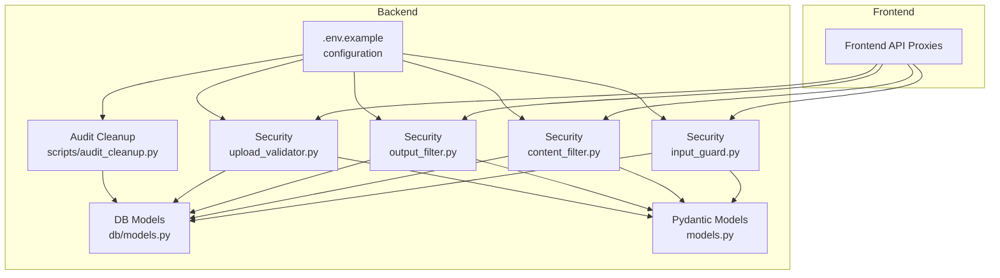
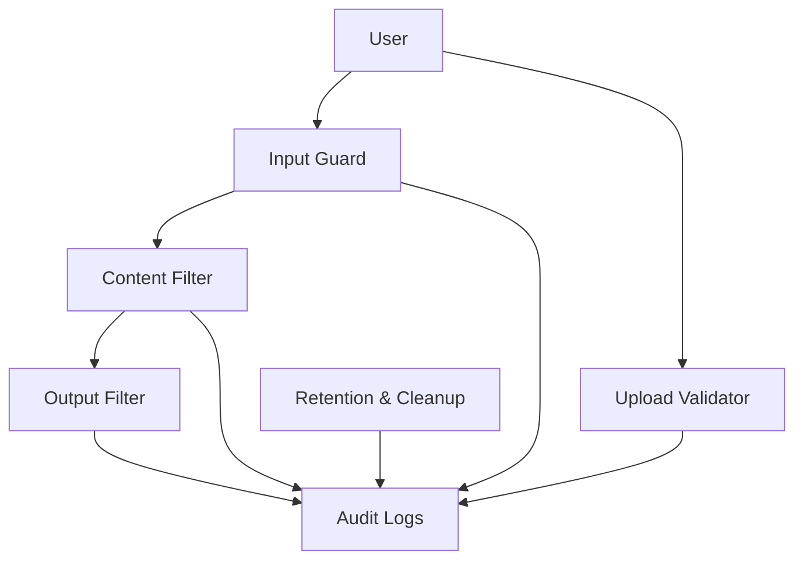
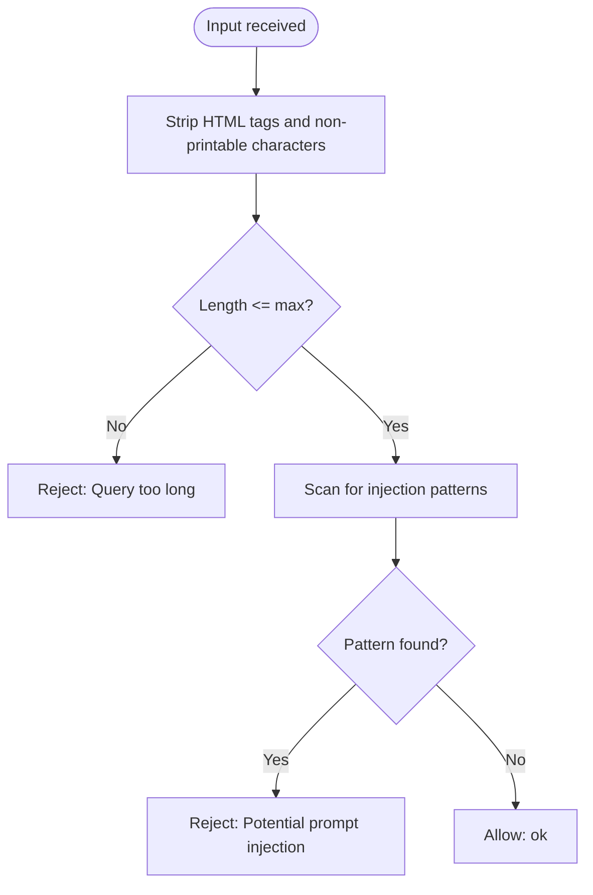
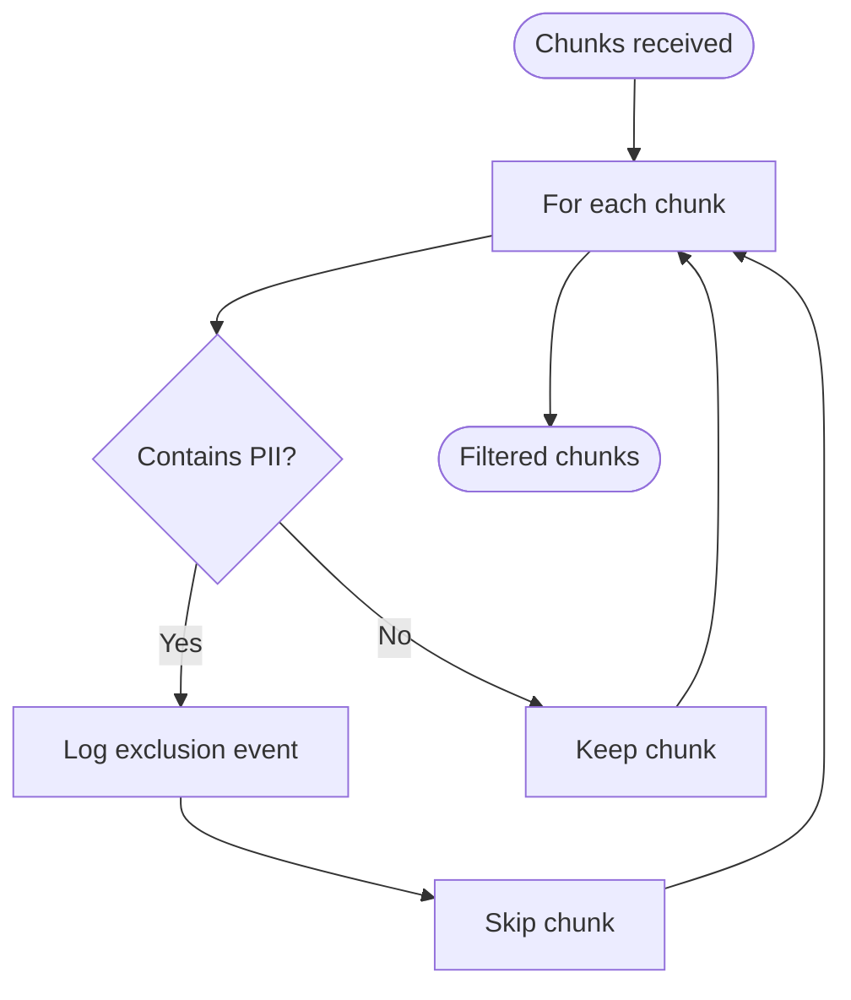
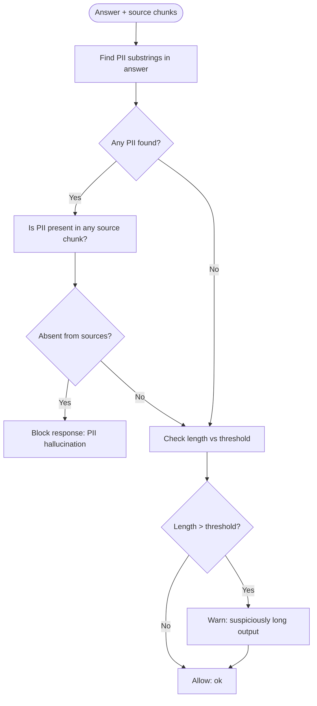
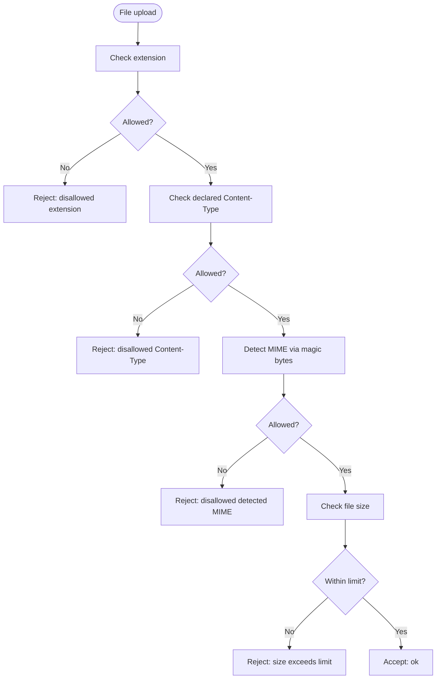
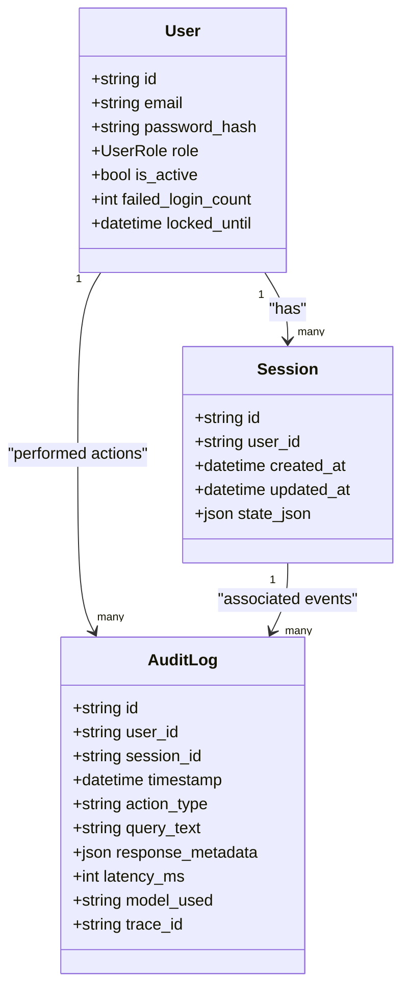
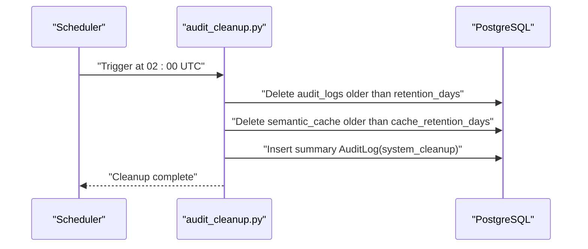
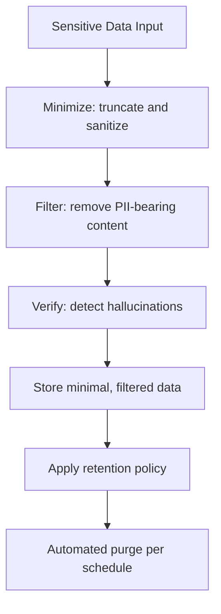
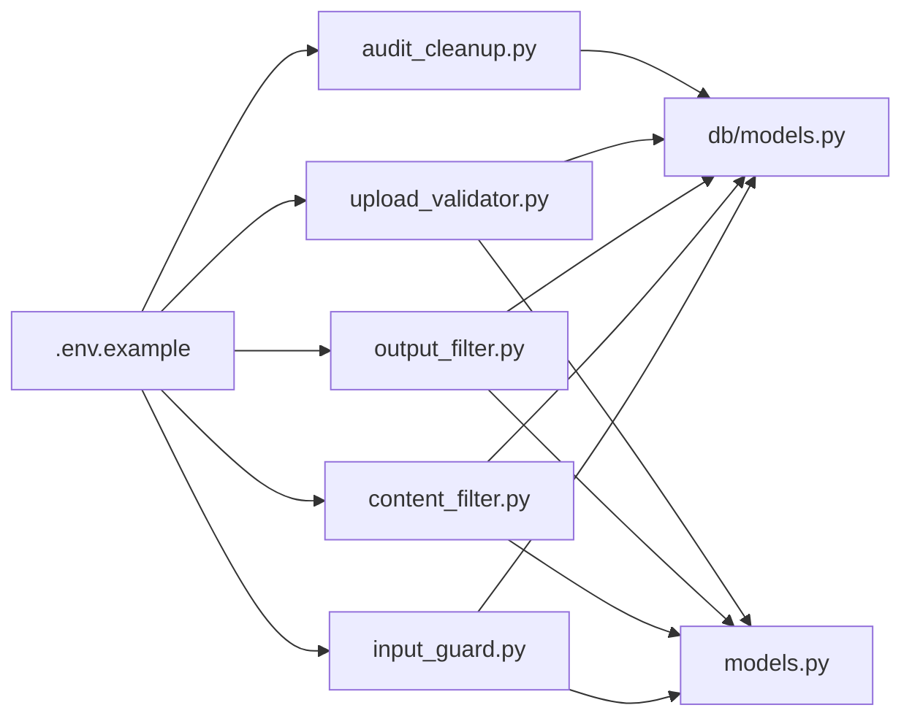

# Data Privacy and Protection

<cite>
**Referenced Files in This Document**
- [README.md](file://safe4ai-pilot/README.md)
- [architecture.md](file://safe4ai-pilot/docs/architecture.md)
- [deployment.md](file://safe4ai-pilot/docs/deployment.md)
- [.env.example](file://safe4ai-pilot/.env.example)
- [input_guard.py](file://safe4ai-pilot/app/security/input_guard.py)
- [content_filter.py](file://safe4ai-pilot/app/security/content_filter.py)
- [output_filter.py](file://safe4ai-pilot/app/security/output_filter.py)
- [upload_validator.py](file://safe4ai-pilot/app/security/upload_validator.py)
- [models.py](file://safe4ai-pilot/app/models.py)
- [db/models.py](file://safe4ai-pilot/app/db/models.py)
- [audit_cleanup.py](file://safe4ai-pilot/scripts/audit_cleanup.py)
</cite>

## Table of Contents
1. [Introduction](#introduction)
2. [Project Structure](#project-structure)
3. [Core Components](#core-components)
4. [Architecture Overview](#architecture-overview)
5. [Detailed Component Analysis](#detailed-component-analysis)
6. [Dependency Analysis](#dependency-analysis)
7. [Performance Considerations](#performance-considerations)
8. [Troubleshooting Guide](#troubleshooting-guide)
9. [Conclusion](#conclusion)
10. [Appendices](#appendices)

## Introduction
This document explains the data privacy and protection system implemented in the project. It focuses on safeguards for sensitive information, including data protection at rest and in transit, anonymization and filtering techniques, and access control mechanisms. It also documents privacy-by-design principles, data minimization strategies, consent management, integration with authentication and role-based access control, and audit trails for data access. Guidance is provided on configuring privacy policies, implementing data retention schedules, handling data subject requests, privacy impact assessments, breach response procedures, and maintaining compliance across jurisdictions.

## Project Structure
The privacy and protection features are primarily implemented in the backend Python application under the app/ directory, with supporting configuration and operational scripts. The frontend integrates with the backend via secure API endpoints and proxies. Operational scripts manage retention and cleanup of audit logs and caches.

**Diagram sources**
- [input_guard.py:1-49](file://safe4ai-pilot/app/security/input_guard.py#L1-L49)
- [content_filter.py:1-64](file://safe4ai-pilot/app/security/content_filter.py#L1-L64)
- [output_filter.py:1-61](file://safe4ai-pilot/app/security/output_filter.py#L1-L61)
- [upload_validator.py:1-73](file://safe4ai-pilot/app/security/upload_validator.py#L1-L73)
- [.env.example:1-14](file://safe4ai-pilot/.env.example#L1-L14)
- [db/models.py:1-182](file://safe4ai-pilot/app/db/models.py#L1-L182)
- [models.py:1-95](file://safe4ai-pilot/app/models.py#L1-L95)
- [audit_cleanup.py:1-129](file://safe4ai-pilot/scripts/audit_cleanup.py#L1-L129)

**Section sources**
- [README.md:1-133](file://safe4ai-pilot/README.md#L1-L133)
- [architecture.md:1-45](file://safe4ai-pilot/docs/architecture.md#L1-L45)
- [deployment.md:1-122](file://safe4ai-pilot/docs/deployment.md#L1-L122)

## Core Components
- Input sanitization and validation to prevent prompt injection and enforce length limits.
- Content filtering to detect and remove PII from retrieved chunks.
- Output filtering to detect PII hallucinations and suspiciously long responses.
- Upload validation to restrict file types, sizes, and enforce MIME checks.
- Role-based access control via user roles and session-based authentication.
- Audit logging for actions, queries, and system maintenance.
- Retention and cleanup of audit logs and semantic cache based on configurable policies.

**Section sources**
- [input_guard.py:24-49](file://safe4ai-pilot/app/security/input_guard.py#L24-L49)
- [content_filter.py:25-64](file://safe4ai-pilot/app/security/content_filter.py#L25-L64)
- [output_filter.py:31-61](file://safe4ai-pilot/app/security/output_filter.py#L31-L61)
- [upload_validator.py:24-73](file://safe4ai-pilot/app/security/upload_validator.py#L24-L73)
- [db/models.py:21-62](file://safe4ai-pilot/app/db/models.py#L21-L62)
- [db/models.py:118-131](file://safe4ai-pilot/app/db/models.py#L118-L131)
- [audit_cleanup.py:35-84](file://safe4ai-pilot/scripts/audit_cleanup.py#L35-L84)

## Architecture Overview
Privacy controls are integrated early in the pipeline to minimize exposure of sensitive data and reduce risk of leakage. The system enforces:
- Input guard to sanitize queries and reject injection attempts.
- Content filter to remove PII-bearing chunks before LLM processing.
- Output filter to prevent hallucinated PII in responses.
- Upload validator to restrict and verify incoming files.
- Authentication and RBAC to limit access to protected resources.
- Audit logs to track who accessed what and when.
- Retention policies to limit data lifecycle.

**Diagram sources**
- [architecture.md:30-35](file://safe4ai-pilot/docs/architecture.md#L30-L35)
- [input_guard.py:27-49](file://safe4ai-pilot/app/security/input_guard.py#L27-L49)
- [content_filter.py:29-64](file://safe4ai-pilot/app/security/content_filter.py#L29-L64)
- [output_filter.py:32-61](file://safe4ai-pilot/app/security/output_filter.py#L32-L61)
- [upload_validator.py:25-73](file://safe4ai-pilot/app/security/upload_validator.py#L25-L73)
- [db/models.py:118-131](file://safe4ai-pilot/app/db/models.py#L118-L131)
- [audit_cleanup.py:35-84](file://safe4ai-pilot/scripts/audit_cleanup.py#L35-L84)

## Detailed Component Analysis

### Input Guard
Purpose: Sanitize and validate user queries to prevent prompt injection and enforce length limits. Implements:
- HTML tag stripping and control character filtering.
- Maximum length enforcement.
- Pattern-based detection of common jailbreak and instruction-following prompts.

**Diagram sources**
- [input_guard.py:27-49](file://safe4ai-pilot/app/security/input_guard.py#L27-L49)

**Section sources**
- [input_guard.py:24-49](file://safe4ai-pilot/app/security/input_guard.py#L24-L49)

### Content Filter
Purpose: Detect and remove PII-bearing chunks before they reach the LLM. Implements:
- Pattern-based detection for SSNs, credit cards, and passports.
- Optional blocked terms filtering.
- Logging of excluded chunks for auditability.

**Diagram sources**
- [content_filter.py:29-64](file://safe4ai-pilot/app/security/content_filter.py#L29-L64)

**Section sources**
- [content_filter.py:25-64](file://safe4ai-pilot/app/security/content_filter.py#L25-L64)

### Output Filter
Purpose: Verify LLM-generated answers to prevent PII hallucinations and flag suspiciously long outputs. Implements:
- Detection of PII in answers and cross-check against source chunks.
- Heuristic threshold for excessive length with warnings.

**Diagram sources**
- [output_filter.py:32-61](file://safe4ai-pilot/app/security/output_filter.py#L32-L61)

**Section sources**
- [output_filter.py:31-61](file://safe4ai-pilot/app/security/output_filter.py#L31-L61)

### Upload Validator
Purpose: Enforce allowed file types, MIME types, magic bytes, and size limits. Implements:
- Allowed extensions and MIME types.
- Declared vs detected MIME type checks.
- Size enforcement.
- Safe randomized filenames to avoid client-provided risks.

**Diagram sources**
- [upload_validator.py:25-73](file://safe4ai-pilot/app/security/upload_validator.py#L25-L73)

**Section sources**
- [upload_validator.py:24-73](file://safe4ai-pilot/app/security/upload_validator.py#L24-L73)

### Authentication, Roles, and Access Control
- Users have roles (admin, pilot_user) and sessions are tracked for activity monitoring.
- RBAC ensures administrative privileges are restricted to authorized users.
- Sessions are persisted and associated with audit logs for traceability.

**Diagram sources**
- [db/models.py:52-62](file://safe4ai-pilot/app/db/models.py#L52-L62)
- [db/models.py:65-73](file://safe4ai-pilot/app/db/models.py#L65-L73)
- [db/models.py:118-131](file://safe4ai-pilot/app/db/models.py#L118-L131)

**Section sources**
- [db/models.py:21-62](file://safe4ai-pilot/app/db/models.py#L21-L62)
- [db/models.py:65-73](file://safe4ai-pilot/app/db/models.py#L65-L73)
- [db/models.py:118-131](file://safe4ai-pilot/app/db/models.py#L118-L131)

### Audit Trails and Retention
- Audit logs capture user actions, queries, model usage, latency, and tracing identifiers.
- Retention windows are configurable and enforced by a scheduled cleanup job.
- Cleanup removes old audit logs and semantic cache entries and records a summary event.

**Diagram sources**
- [audit_cleanup.py:86-116](file://safe4ai-pilot/scripts/audit_cleanup.py#L86-L116)
- [audit_cleanup.py:35-84](file://safe4ai-pilot/scripts/audit_cleanup.py#L35-L84)
- [db/models.py:118-131](file://safe4ai-pilot/app/db/models.py#L118-L131)

**Section sources**
- [audit_cleanup.py:35-84](file://safe4ai-pilot/scripts/audit_cleanup.py#L35-L84)
- [audit_cleanup.py:86-116](file://safe4ai-pilot/scripts/audit_cleanup.py#L86-L116)
- [db/models.py:118-131](file://safe4ai-pilot/app/db/models.py#L118-L131)

### Data Minimization and Privacy-by-Design
- Input guard reduces query surface area by truncating and removing non-printable characters.
- Content filter removes PII-bearing chunks before LLM processing.
- Output filter prevents PII hallucinations and flags excessive content.
- Upload validator restricts file types and enforces size limits.
- Audit logs are retained for a configurable period and then deleted.

**Diagram sources**
- [input_guard.py:27-49](file://safe4ai-pilot/app/security/input_guard.py#L27-L49)
- [content_filter.py:29-64](file://safe4ai-pilot/app/security/content_filter.py#L29-L64)
- [output_filter.py:32-61](file://safe4ai-pilot/app/security/output_filter.py#L32-L61)
- [upload_validator.py:25-73](file://safe4ai-pilot/app/security/upload_validator.py#L25-L73)
- [audit_cleanup.py:35-84](file://safe4ai-pilot/scripts/audit_cleanup.py#L35-L84)

**Section sources**
- [architecture.md:30-35](file://safe4ai-pilot/docs/architecture.md#L30-L35)
- [input_guard.py:24-49](file://safe4ai-pilot/app/security/input_guard.py#L24-L49)
- [content_filter.py:25-64](file://safe4ai-pilot/app/security/content_filter.py#L25-L64)
- [output_filter.py:31-61](file://safe4ai-pilot/app/security/output_filter.py#L31-L61)
- [upload_validator.py:24-73](file://safe4ai-pilot/app/security/upload_validator.py#L24-L73)
- [audit_cleanup.py:35-84](file://safe4ai-pilot/scripts/audit_cleanup.py#L35-L84)

### Consent Management and User Rights
- Consent is implicit upon account creation and use of the service; explicit consent flows are not implemented in the current codebase.
- Users can exercise data subject rights via documented channels; deletion requests are supported by the system’s data removal procedures.
- Deletion verification confirms removal across databases, vector stores, and filesystem locations.

**Section sources**
- [deployment.md:108-122](file://safe4ai-pilot/docs/deployment.md#L108-L122)

### Compliance and Jurisdictions
- The system supports configurable retention windows and secure transport via HTTPS enforcement settings.
- Backups and deletions are documented to support regulatory obligations.
- CI and security scanning help maintain secure configurations.

**Section sources**
- [.env.example:6-13](file://safe4ai-pilot/.env.example#L6-L13)
- [deployment.md:108-122](file://safe4ai-pilot/docs/deployment.md#L108-L122)

## Dependency Analysis
The privacy components depend on:
- Configuration settings for retention and thresholds.
- Database models for storing audit logs, sessions, and user data.
- Pydantic models for state and guard results.
- Scheduled jobs for automated cleanup.

**Diagram sources**
- [.env.example:1-14](file://safe4ai-pilot/.env.example#L1-L14)
- [input_guard.py:1-49](file://safe4ai-pilot/app/security/input_guard.py#L1-L49)
- [content_filter.py:1-64](file://safe4ai-pilot/app/security/content_filter.py#L1-L64)
- [output_filter.py:1-61](file://safe4ai-pilot/app/security/output_filter.py#L1-L61)
- [upload_validator.py:1-73](file://safe4ai-pilot/app/security/upload_validator.py#L1-L73)
- [audit_cleanup.py:1-129](file://safe4ai-pilot/scripts/audit_cleanup.py#L1-L129)
- [db/models.py:1-182](file://safe4ai-pilot/app/db/models.py#L1-L182)
- [models.py:1-95](file://safe4ai-pilot/app/models.py#L1-L95)

**Section sources**
- [.env.example:1-14](file://safe4ai-pilot/.env.example#L1-L14)
- [db/models.py:1-182](file://safe4ai-pilot/app/db/models.py#L1-L182)
- [models.py:1-95](file://safe4ai-pilot/app/models.py#L1-L95)
- [audit_cleanup.py:1-129](file://safe4ai-pilot/scripts/audit_cleanup.py#L1-L129)

## Performance Considerations
- Retention windows directly impact storage growth; tune AUDIT_LOG_RETENTION_DAYS and CACHE_RETENTION_DAYS to balance compliance and resource usage.
- Upload size limits protect downstream processing; adjust MAX_UPLOAD_SIZE_MB according to workload capacity.
- Scheduled cleanup runs at a fixed time to avoid peak load; ensure adequate system resources during the cleanup window.

[No sources needed since this section provides general guidance]

## Troubleshooting Guide
- If audit logs grow unexpectedly, verify retention settings and confirm the cleanup job is scheduled and running.
- If PII is still appearing, review content and output filter rules and ensure logs indicate exclusions.
- If uploads fail, check allowed extensions, declared Content-Type, detected MIME type, and size limits.
- If authentication or RBAC appears incorrect, verify user roles and session persistence.

**Section sources**
- [audit_cleanup.py:86-116](file://safe4ai-pilot/scripts/audit_cleanup.py#L86-L116)
- [content_filter.py:29-64](file://safe4ai-pilot/app/security/content_filter.py#L29-L64)
- [output_filter.py:32-61](file://safe4ai-pilot/app/security/output_filter.py#L32-L61)
- [upload_validator.py:25-73](file://safe4ai-pilot/app/security/upload_validator.py#L25-L73)
- [db/models.py:21-62](file://safe4ai-pilot/app/db/models.py#L21-L62)

## Conclusion
The system implements a layered privacy-by-design approach with input sanitization, content and output filtering, strict upload validation, RBAC, comprehensive audit logging, and automated retention-based cleanup. These controls collectively support data minimization, reduce risk of sensitive data exposure, and facilitate compliance with privacy regulations. Operators should configure retention and thresholds appropriately, monitor audit logs, and follow documented backup and deletion procedures to meet jurisdiction-specific obligations.

[No sources needed since this section summarizes without analyzing specific files]

## Appendices

### Configuring Privacy Policies and Retention
- Set retention periods for audit logs and semantic cache via environment variables.
- Schedule cleanup jobs to run at off-peak hours.
- Monitor cleanup logs and adjust schedules as needed.

**Section sources**
- [.env.example:9-10](file://safe4ai-pilot/.env.example#L9-L10)
- [audit_cleanup.py:86-116](file://safe4ai-pilot/scripts/audit_cleanup.py#L86-L116)

### Handling Data Subject Requests
- Use documented deletion procedures to remove data across databases, vector stores, and filesystem locations.
- Confirm deletion via verification steps and maintain audit trail of actions taken.

**Section sources**
- [deployment.md:108-122](file://safe4ai-pilot/docs/deployment.md#L108-L122)

### Privacy Impact Assessments and Breach Response
- Conduct PIAs considering data categories, processing purposes, and retention.
- Establish incident response procedures aligned with backup and deletion capabilities.
- Maintain secure transport and secrets management as part of CI and deployment hygiene.

**Section sources**
- [deployment.md:108-122](file://safe4ai-pilot/docs/deployment.md#L108-L122)
- [.env.example:6-7](file://safe4ai-pilot/.env.example#L6-L7)