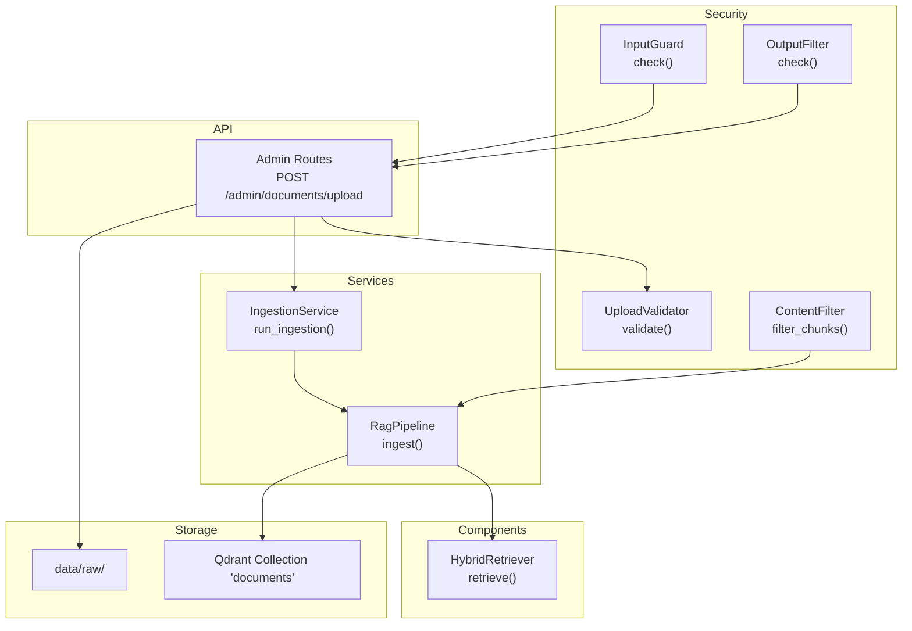
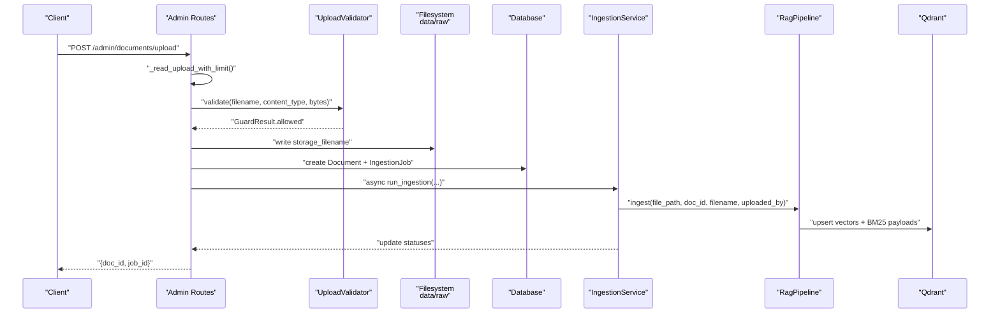
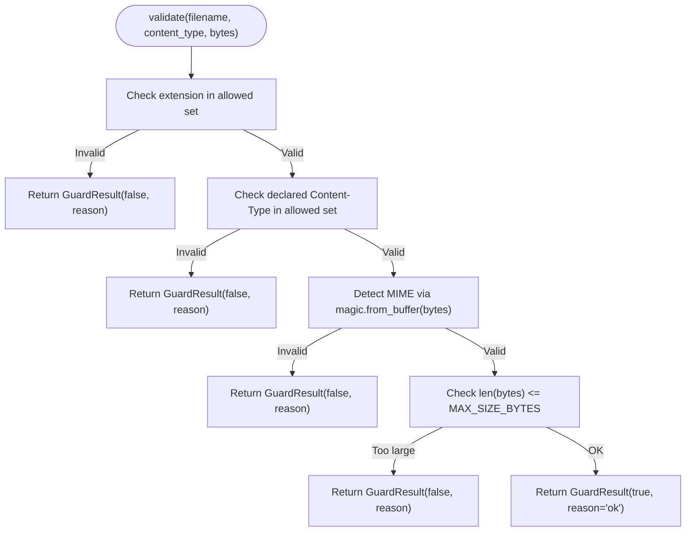
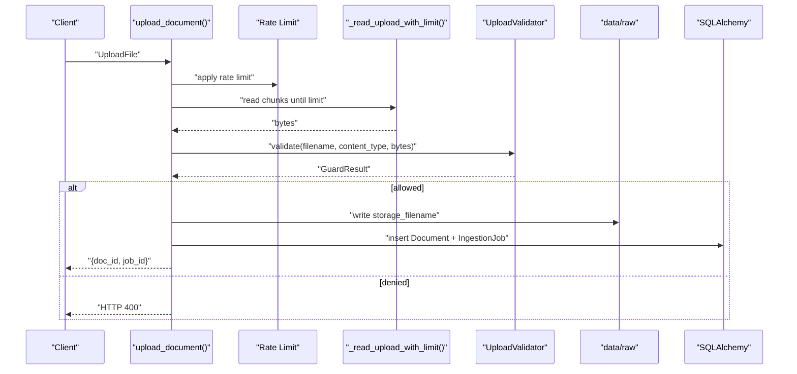
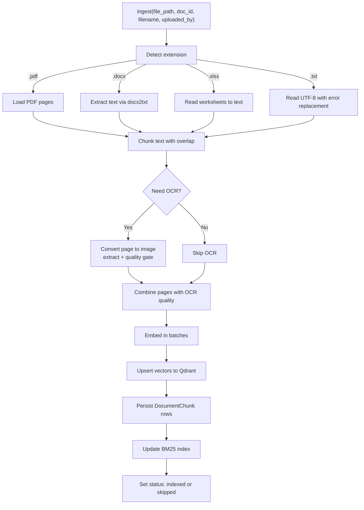
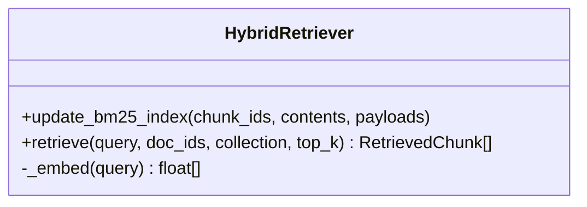
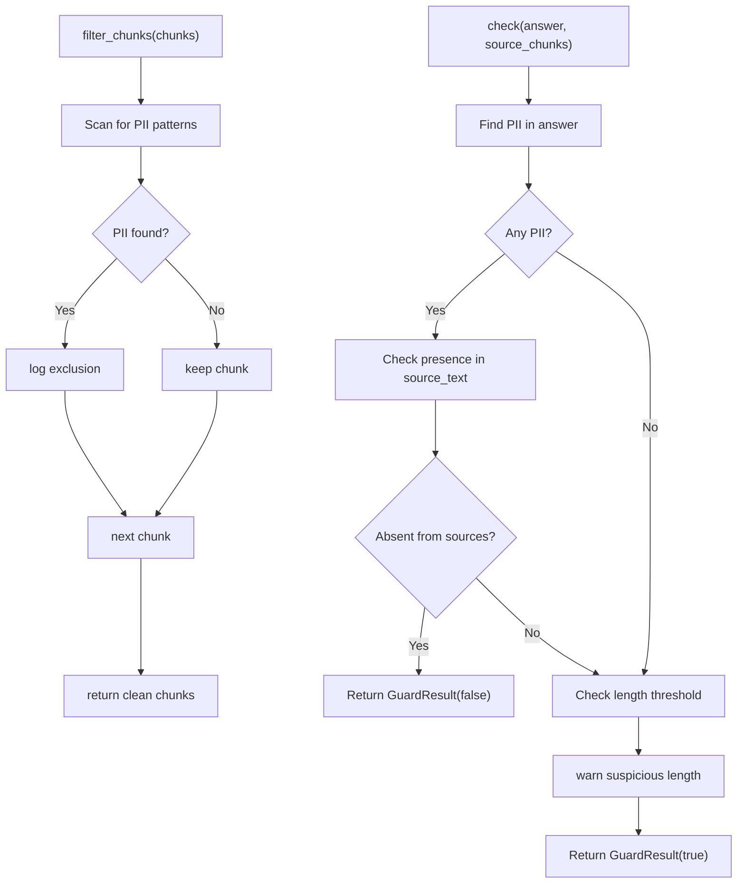
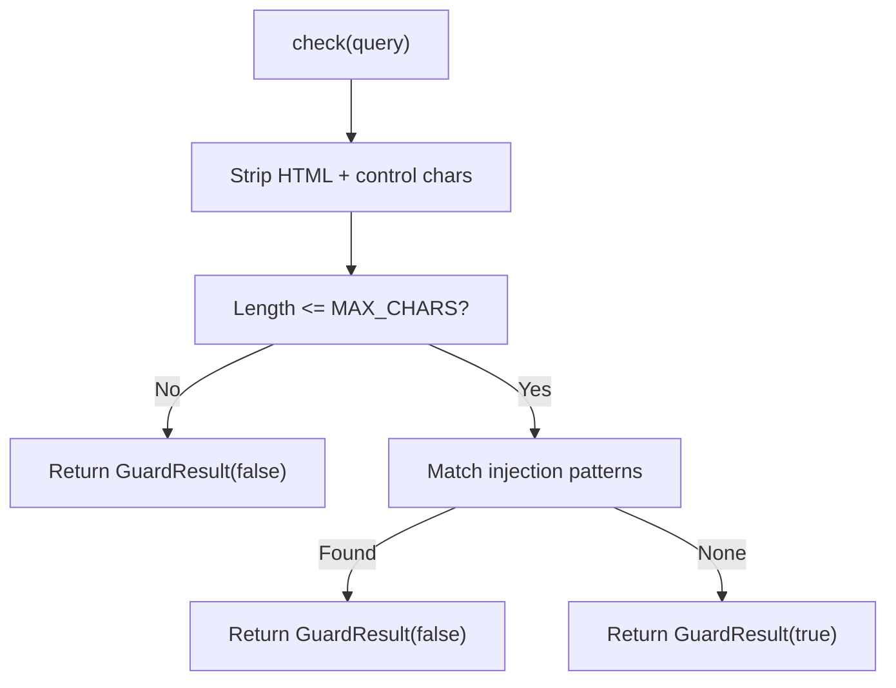
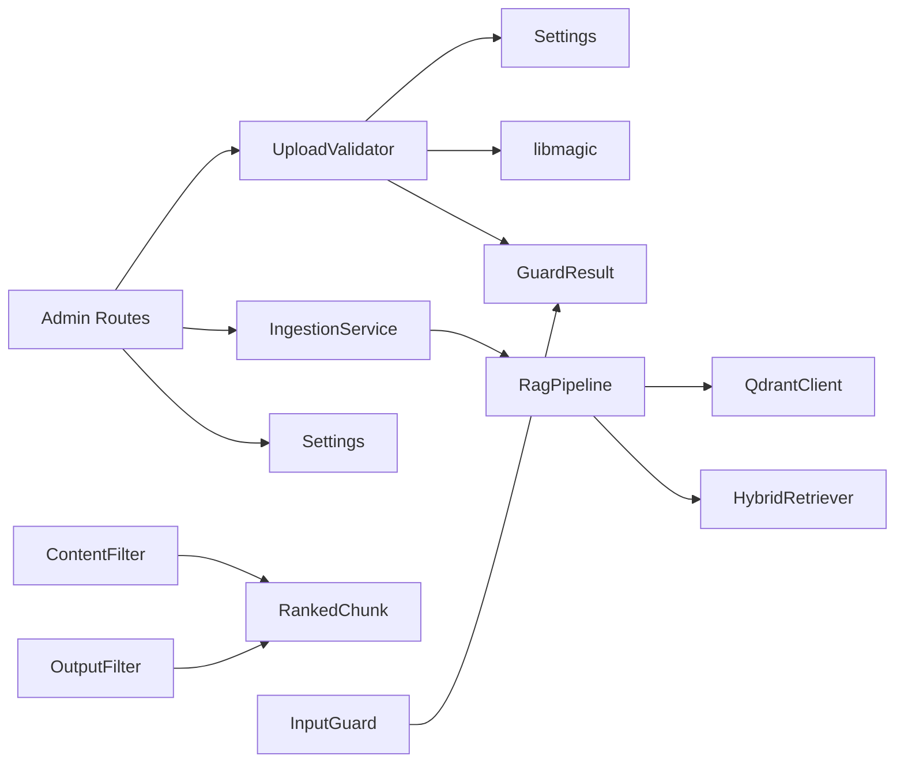
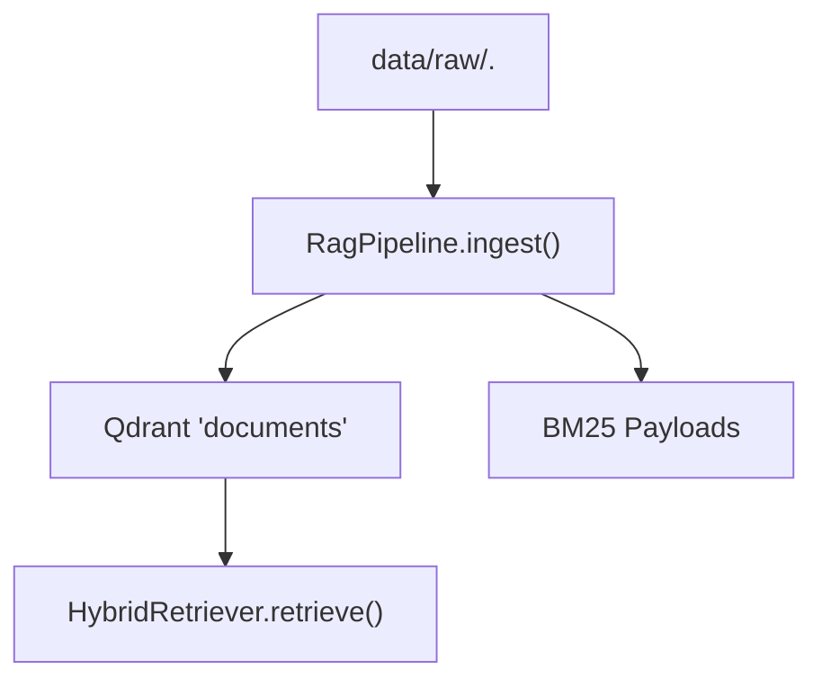

# File Upload Security and Validation

<cite>
**Referenced Files in This Document**
- [upload_validator.py](file://safe4ai-pilot/app/security/upload_validator.py)
- [input_guard.py](file://safe4ai-pilot/app/security/input_guard.py)
- [content_filter.py](file://safe4ai-pilot/app/security/content_filter.py)
- [output_filter.py](file://safe4ai-pilot/app/security/output_filter.py)
- [admin_routes.py](file://safe4ai-pilot/app/api/admin_routes.py)
- [ingestion_service.py](file://safe4ai-pilot/app/services/ingestion_service.py)
- [rag_pipeline.py](file://safe4ai-pilot/app/services/rag_pipeline.py)
- [hybrid_retriever.py](file://safe4ai-pilot/app/components/hybrid_retriever.py)
- [models.py](file://safe4ai-pilot/app/models.py)
- [config.py](file://safe4ai-pilot/app/config.py)
- [test_security_guards.py](file://safe4ai-pilot/tests/test_security_guards.py)
</cite>

## Table of Contents
1. [Introduction](#introduction)
2. [Project Structure](#project-structure)
3. [Core Components](#core-components)
4. [Architecture Overview](#architecture-overview)
5. [Detailed Component Analysis](#detailed-component-analysis)
6. [Dependency Analysis](#dependency-analysis)
7. [Performance Considerations](#performance-considerations)
8. [Troubleshooting Guide](#troubleshooting-guide)
9. [Conclusion](#conclusion)
10. [Appendices](#appendices)

## Introduction
This document explains the file upload security and validation system designed to protect the platform from malicious file uploads and ensure document integrity. It covers the upload validator’s enforcement of file type, MIME type, magic bytes, and size limits; the integration with antivirus scanning and content sanitization; and the end-to-end ingestion pipeline that connects validated uploads to OCR, chunking, embedding, and vector storage. Guidance is included for configuring upload policies, implementing custom validation rules, handling upload failures, and optimizing performance and storage.

## Project Structure
The upload security system spans several modules:
- Security validators: upload validation, input sanitization, content filtering, and output filtering
- API routes: upload endpoint with streaming read and size enforcement
- Services: background ingestion orchestration and RAG pipeline
- Components: hybrid retriever integrating dense vectors and BM25
- Models and configuration: shared data models and system settings

**Diagram sources**
- [admin_routes.py:66-119](file://safe4ai-pilot/app/api/admin_routes.py#L66-L119)
- [upload_validator.py:24-73](file://safe4ai-pilot/app/security/upload_validator.py#L24-L73)
- [ingestion_service.py:21-88](file://safe4ai-pilot/app/services/ingestion_service.py#L21-L88)
- [rag_pipeline.py:62-150](file://safe4ai-pilot/app/services/rag_pipeline.py#L62-L150)
- [hybrid_retriever.py:57-145](file://safe4ai-pilot/app/components/hybrid_retriever.py#L57-L145)

**Section sources**
- [admin_routes.py:66-119](file://safe4ai-pilot/app/api/admin_routes.py#L66-L119)
- [upload_validator.py:24-73](file://safe4ai-pilot/app/security/upload_validator.py#L24-L73)
- [ingestion_service.py:21-88](file://safe4ai-pilot/app/services/ingestion_service.py#L21-L88)
- [rag_pipeline.py:62-150](file://safe4ai-pilot/app/services/rag_pipeline.py#L62-L150)
- [hybrid_retriever.py:57-145](file://safe4ai-pilot/app/components/hybrid_retriever.py#L57-L145)

## Core Components
- UploadValidator: Enforces allowed extensions, declared Content-Type, detected MIME type via magic bytes, and maximum file size derived from settings.
- Admin Routes: Validates uploads, persists raw files, records metadata, and queues background ingestion.
- IngestionService: Manages ingestion lifecycle, updates statuses, and coordinates the RAG pipeline.
- RagPipeline: Loads supported formats, performs OCR when needed, chunks text, embeds, upserts vectors, and updates BM25.
- HybridRetriever: Integrates Qdrant dense vectors and BM25 sparse retrieval with Reciprocal Rank Fusion.
- ContentFilter and OutputFilter: Detect and remove PII-containing chunks and prevent hallucinated PII in generated answers.
- InputGuard: Sanitizes and validates user queries prior to LLM interaction.

**Section sources**
- [upload_validator.py:13-21](file://safe4ai-pilot/app/security/upload_validator.py#L13-L21)
- [admin_routes.py:66-119](file://safe4ai-pilot/app/api/admin_routes.py#L66-L119)
- [ingestion_service.py:21-88](file://safe4ai-pilot/app/services/ingestion_service.py#L21-L88)
- [rag_pipeline.py:62-150](file://safe4ai-pilot/app/services/rag_pipeline.py#L62-L150)
- [hybrid_retriever.py:57-145](file://safe4ai-pilot/app/components/hybrid_retriever.py#L57-L145)
- [content_filter.py:25-64](file://safe4ai-pilot/app/security/content_filter.py#L25-L64)
- [output_filter.py:31-61](file://safe4ai-pilot/app/security/output_filter.py#L31-L61)
- [input_guard.py:24-49](file://safe4ai-pilot/app/security/input_guard.py#L24-L49)

## Architecture Overview
The upload security architecture enforces validation at ingress, persists safe filenames, and triggers asynchronous ingestion. The ingestion pipeline extracts text from PDFs, DOCX, XLSX, and TXT, applies OCR when necessary, chunks content, embeds vectors, and stores both vectors and BM25 payloads. Retrieval combines dense and sparse signals, and output filters guard against PII leakage.

**Diagram sources**
- [admin_routes.py:66-119](file://safe4ai-pilot/app/api/admin_routes.py#L66-L119)
- [upload_validator.py:24-73](file://safe4ai-pilot/app/security/upload_validator.py#L24-L73)
- [ingestion_service.py:21-88](file://safe4ai-pilot/app/services/ingestion_service.py#L21-L88)
- [rag_pipeline.py:62-150](file://safe4ai-pilot/app/services/rag_pipeline.py#L62-L150)

## Detailed Component Analysis

### UploadValidator
- Supported file formats: PDF, DOCX, XLSX, TXT.
- Allowed MIME types: application/pdf, application/vnd.openxmlformats-officedocument.wordprocessingml.document, application/vnd.openxmlformats-officedocument.spreadsheetml.sheet, text/plain.
- Validation steps:
  1) Extension check against allowed set
  2) Declared Content-Type check against allowed set
  3) Magic-byte detection via libmagic and MIME type verification
  4) Size check against settings-derived maximum
- Safe filename generation: UUID4 to avoid relying on client-provided names.

**Diagram sources**
- [upload_validator.py:24-73](file://safe4ai-pilot/app/security/upload_validator.py#L24-L73)

**Section sources**
- [upload_validator.py:13-21](file://safe4ai-pilot/app/security/upload_validator.py#L13-L21)
- [upload_validator.py:24-73](file://safe4ai-pilot/app/security/upload_validator.py#L24-L73)
- [config.py:20](file://safe4ai-pilot/app/config.py#L20)
- [test_security_guards.py:216-294](file://safe4ai-pilot/tests/test_security_guards.py#L216-L294)

### Admin Routes Upload Endpoint
- Streams upload with chunked reads and enforces a hard cap based on settings.
- Applies UploadValidator before persisting the file under a safe storage filename.
- Records document metadata and creates an ingestion job.
- Queues background ingestion asynchronously.

**Diagram sources**
- [admin_routes.py:66-119](file://safe4ai-pilot/app/api/admin_routes.py#L66-L119)
- [admin_routes.py:265-277](file://safe4ai-pilot/app/api/admin_routes.py#L265-L277)
- [upload_validator.py:24-73](file://safe4ai-pilot/app/security/upload_validator.py#L24-L73)

**Section sources**
- [admin_routes.py:66-119](file://safe4ai-pilot/app/api/admin_routes.py#L66-L119)
- [admin_routes.py:265-277](file://safe4ai-pilot/app/api/admin_routes.py#L265-L277)

### IngestionService and RagPipeline
- IngestionService transitions job/document states and invokes the RAG pipeline.
- RagPipeline:
  - Loads PDFs via a PDF parser, DOCX via a text extractor, XLSX via spreadsheet parsing, and TXT via direct read.
  - Applies OCR for low-content PDF pages using a vision model and quality assessment.
  - Chunks text with overlap, embeds in batches, upserts vectors to Qdrant, and updates BM25 payloads.
  - Marks document status as indexed or skipped based on OCR confidence thresholds.

**Diagram sources**
- [ingestion_service.py:21-88](file://safe4ai-pilot/app/services/ingestion_service.py#L21-L88)
- [rag_pipeline.py:62-150](file://safe4ai-pilot/app/services/rag_pipeline.py#L62-L150)

**Section sources**
- [ingestion_service.py:21-88](file://safe4ai-pilot/app/services/ingestion_service.py#L21-L88)
- [rag_pipeline.py:62-150](file://safe4ai-pilot/app/services/rag_pipeline.py#L62-L150)

### HybridRetriever
- Embeds queries and retrieves top-k points from Qdrant.
- Maintains a local BM25 index built from chunk IDs and payloads.
- Combines dense and sparse rankings via Reciprocal Rank Fusion.

**Diagram sources**
- [hybrid_retriever.py:14-145](file://safe4ai-pilot/app/components/hybrid_retriever.py#L14-L145)

**Section sources**
- [hybrid_retriever.py:14-145](file://safe4ai-pilot/app/components/hybrid_retriever.py#L14-L145)

### ContentFilter and OutputFilter
- ContentFilter removes chunks containing PII patterns and optionally blocks configured terms.
- OutputFilter checks generated answers for hallucinated PII not present in source chunks and logs warnings for unusually long outputs.

**Diagram sources**
- [content_filter.py:25-64](file://safe4ai-pilot/app/security/content_filter.py#L25-L64)
- [output_filter.py:31-61](file://safe4ai-pilot/app/security/output_filter.py#L31-L61)

**Section sources**
- [content_filter.py:25-64](file://safe4ai-pilot/app/security/content_filter.py#L25-L64)
- [output_filter.py:31-61](file://safe4ai-pilot/app/security/output_filter.py#L31-L61)

### InputGuard
- Strips HTML tags and non-printable characters, enforces a maximum length, and detects prompt-injection patterns.

**Diagram sources**
- [input_guard.py:24-49](file://safe4ai-pilot/app/security/input_guard.py#L24-L49)

**Section sources**
- [input_guard.py:24-49](file://safe4ai-pilot/app/security/input_guard.py#L24-L49)

## Dependency Analysis
- UploadValidator depends on:
  - Settings for max upload size
  - libmagic for MIME detection
  - GuardResult model for outcomes
- Admin Routes depend on:
  - UploadValidator
  - Settings for size limits
  - IngestionService for background processing
- IngestionService depends on:
  - RagPipeline
  - Database models for persistence
- RagPipeline depends on:
  - External libraries for PDF parsing, DOCX/XLSX processing, OCR, and embeddings
  - Qdrant client for vector storage
  - HybridRetriever for BM25 updates
- ContentFilter and OutputFilter depend on:
  - RankedChunk model
  - Logging for warnings

**Diagram sources**
- [upload_validator.py:10-11](file://safe4ai-pilot/app/security/upload_validator.py#L10-L11)
- [admin_routes.py:22-39](file://safe4ai-pilot/app/api/admin_routes.py#L22-L39)
- [ingestion_service.py:10-13](file://safe4ai-pilot/app/services/ingestion_service.py#L10-L13)
- [rag_pipeline.py:16-23](file://safe4ai-pilot/app/services/rag_pipeline.py#L16-L23)
- [hybrid_retriever.py:7-11](file://safe4ai-pilot/app/components/hybrid_retriever.py#L7-L11)
- [content_filter.py:9](file://safe4ai-pilot/app/security/content_filter.py#L9)
- [output_filter.py:9](file://safe4ai-pilot/app/security/output_filter.py#L9)
- [input_guard.py:7](file://safe4ai-pilot/app/security/input_guard.py#L7)

**Section sources**
- [upload_validator.py:10-11](file://safe4ai-pilot/app/security/upload_validator.py#L10-L11)
- [admin_routes.py:22-39](file://safe4ai-pilot/app/api/admin_routes.py#L22-L39)
- [ingestion_service.py:10-13](file://safe4ai-pilot/app/services/ingestion_service.py#L10-L13)
- [rag_pipeline.py:16-23](file://safe4ai-pilot/app/services/rag_pipeline.py#L16-L23)
- [hybrid_retriever.py:7-11](file://safe4ai-pilot/app/components/hybrid_retriever.py#L7-L11)
- [content_filter.py:9](file://safe4ai-pilot/app/security/content_filter.py#L9)
- [output_filter.py:9](file://safe4ai-pilot/app/security/output_filter.py#L9)
- [input_guard.py:7](file://safe4ai-pilot/app/security/input_guard.py#L7)

## Performance Considerations
- Streaming upload reads: The upload route reads in fixed-size chunks and enforces a strict byte limit to prevent memory exhaustion.
- Asynchronous ingestion: Background tasks decouple upload completion from heavy processing.
- Batch embeddings: RagPipeline embeds in batches to reduce network overhead.
- OCR gating: OCR is only invoked when text density is low, minimizing compute costs.
- Vector upsert batching: Upserts are performed in bulk to Qdrant to reduce latency.
- Rate limiting: The upload endpoint is rate-limited to mitigate abuse.

Recommendations:
- Tune chunk sizes and overlaps to balance recall and storage.
- Monitor OCR confidence thresholds to adjust when documents are scanned vs. native.
- Scale Qdrant and embedding resources according to ingestion volume.
- Consider compression or deduplication strategies for repeated documents.

**Section sources**
- [admin_routes.py:265-277](file://safe4ai-pilot/app/api/admin_routes.py#L265-L277)
- [ingestion_service.py:21-88](file://safe4ai-pilot/app/services/ingestion_service.py#L21-L88)
- [rag_pipeline.py:187-201](file://safe4ai-pilot/app/services/rag_pipeline.py#L187-L201)
- [rag_pipeline.py:265-295](file://safe4ai-pilot/app/services/rag_pipeline.py#L265-L295)

## Troubleshooting Guide
Common failure modes and resolutions:
- Validation failures:
  - Wrong extension or declared Content-Type: Ensure clients send correct file extensions and Content-Type headers.
  - Magic-byte mismatch: Verify the actual file format; attackers may spoof headers.
  - Oversized file: Increase settings.max_upload_size_mb if appropriate, or compress files.
- Upload failures:
  - 413 Payload Too Large: The streaming reader enforces the size limit; reduce file size or increase the setting.
  - 400 Bad Request: Validation returned false; inspect reason for cause.
- Ingestion failures:
  - Exceptions during embedding or vector upsert lead to job failure; check logs and retry.
  - Stuck jobs are auto-recovered after a threshold; monitor and investigate root causes.
- PII exposure:
  - ContentFilter excludes PII-containing chunks; verify patterns and adjust as needed.
  - OutputFilter blocks hallucinated PII; ensure source documents contain expected data.

Operational tips:
- Use the document status endpoint to poll ingestion progress.
- Re-index documents if raw files are intact but indexing failed.
- Export audit logs for compliance and monitoring.

**Section sources**
- [admin_routes.py:265-277](file://safe4ai-pilot/app/api/admin_routes.py#L265-L277)
- [admin_routes.py:156-180](file://safe4ai-pilot/app/api/admin_routes.py#L156-L180)
- [ingestion_service.py:90-113](file://safe4ai-pilot/app/services/ingestion_service.py#L90-L113)
- [content_filter.py:25-64](file://safe4ai-pilot/app/security/content_filter.py#L25-L64)
- [output_filter.py:31-61](file://safe4ai-pilot/app/security/output_filter.py#L31-L61)

## Conclusion
The upload security system provides layered protection: strict validation at ingress, safe filename handling, and robust ingestion to vector storage. Together with content and output filters, it mitigates risks from malicious uploads and hallucinations. The design emphasizes asynchronous processing, batched operations, and clear failure handling to maintain reliability and performance.

## Appendices

### Supported File Formats and MIME Types
- PDF (.pdf): application/pdf
- DOCX (.docx): application/vnd.openxmlformats-officedocument.wordprocessingml.document
- XLSX (.xlsx): application/vnd.openxmlformats-officedocument.spreadsheetml.sheet
- TXT (.txt): text/plain

These are enforced by UploadValidator and used by the ingestion pipeline to select loaders.

**Section sources**
- [upload_validator.py:13-19](file://safe4ai-pilot/app/security/upload_validator.py#L13-L19)
- [rag_pipeline.py:69-83](file://safe4ai-pilot/app/services/rag_pipeline.py#L69-L83)

### Configuration Options
Key settings affecting upload security and ingestion:
- max_upload_size_mb: Controls both streaming read cap and validator size check.
- qdrant_url, ollama_url, embedding_model, ollama_model: Integration endpoints for vector storage and embeddings.
- audit_log_retention_days, cache_retention_days: Operational retention settings.

**Section sources**
- [config.py:20](file://safe4ai-pilot/app/config.py#L20)
- [config.py:8-20](file://safe4ai-pilot/app/config.py#L8-L20)
- [ingestion_service.py:46-61](file://safe4ai-pilot/app/services/ingestion_service.py#L46-L61)
- [rag_pipeline.py:39-53](file://safe4ai-pilot/app/services/rag_pipeline.py#L39-L53)

### Custom Validation Rules
To add new allowed formats or stricter checks:
- Extend allowed sets in UploadValidator and align ingestion pipeline loaders.
- Add new injection patterns or length thresholds in InputGuard.
- Introduce additional PII patterns or blocked terms in ContentFilter and OutputFilter.
- Update unit tests to cover new scenarios.

**Section sources**
- [upload_validator.py:13-19](file://safe4ai-pilot/app/security/upload_validator.py#L13-L19)
- [input_guard.py:9-19](file://safe4ai-pilot/app/security/input_guard.py#L9-L19)
- [content_filter.py:13-18](file://safe4ai-pilot/app/security/content_filter.py#L13-L18)
- [output_filter.py:13-18](file://safe4ai-pilot/app/security/output_filter.py#L13-L18)
- [test_security_guards.py:216-305](file://safe4ai-pilot/tests/test_security_guards.py#L216-L305)

### Antivirus and Content Sanitization
- Antivirus integration: Not implemented in the current codebase. To integrate, add a pre-ingestion scan step that calls an external AV service and blocks flagged files before proceeding to extraction and embedding.
- Content sanitization: InputGuard strips HTML and controls length; ContentFilter removes PII; OutputFilter prevents hallucinated PII.

**Section sources**
- [input_guard.py:24-49](file://safe4ai-pilot/app/security/input_guard.py#L24-L49)
- [content_filter.py:25-64](file://safe4ai-pilot/app/security/content_filter.py#L25-L64)
- [output_filter.py:31-61](file://safe4ai-pilot/app/security/output_filter.py#L31-L61)

### Storage and Vectorization Pipeline
- Raw storage: Files are written under data/raw with UUID-based filenames.
- Vector storage: Qdrant collection “documents” holds embeddings and payloads.
- Retrieval: HybridRetriever combines dense and sparse signals.

**Diagram sources**
- [admin_routes.py:88-90](file://safe4ai-pilot/app/api/admin_routes.py#L88-L90)
- [rag_pipeline.py:109-149](file://safe4ai-pilot/app/services/rag_pipeline.py#L109-L149)
- [hybrid_retriever.py:57-145](file://safe4ai-pilot/app/components/hybrid_retriever.py#L57-L145)