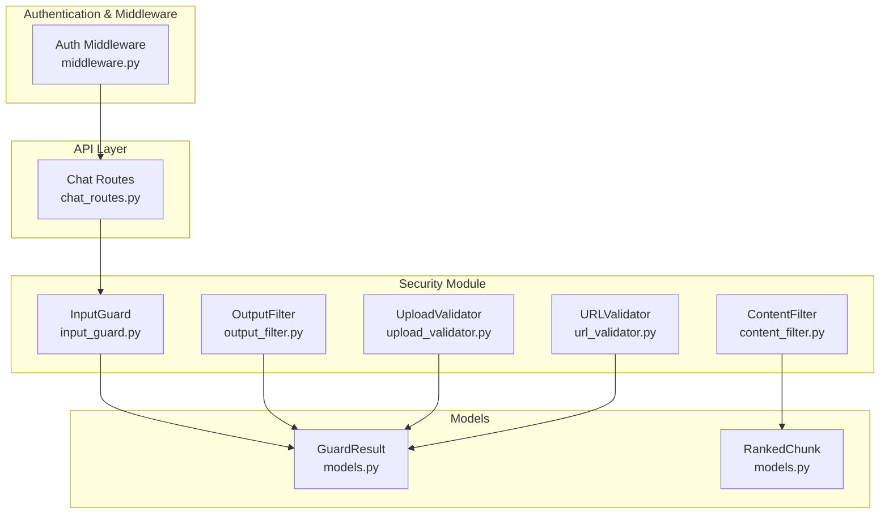
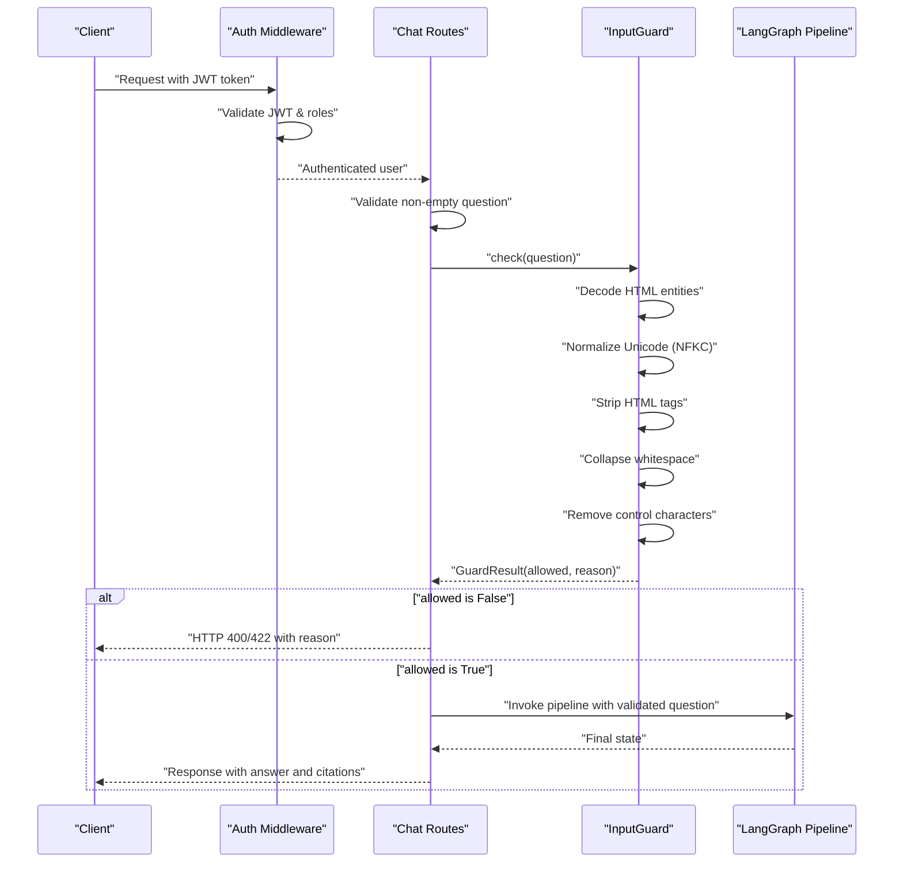
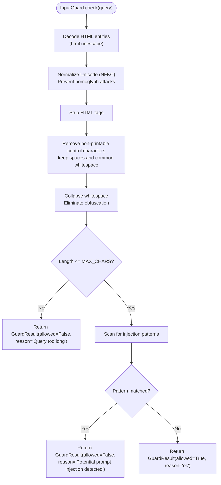
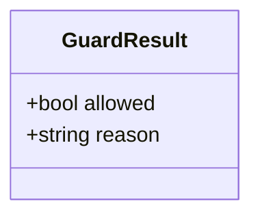
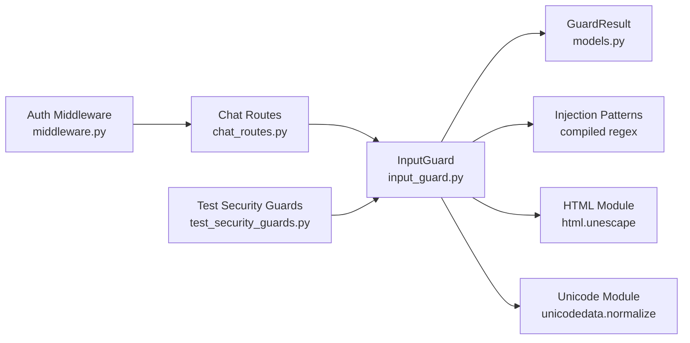

# Input Validation and Sanitization

<cite>
**Referenced Files in This Document**
- [input_guard.py](file://safe4ai-pilot/app/security/input_guard.py)
- [models.py](file://safe4ai-pilot/app/models.py)
- [test_security_guards.py](file://safe4ai-pilot/tests/test_security_guards.py)
- [config.py](file://safe4ai-pilot/app/config.py)
- [chat_routes.py](file://safe4ai-pilot/app/api/chat_routes.py)
- [content_filter.py](file://safe4ai-pilot/app/security/content_filter.py)
- [output_filter.py](file://safe4ai-pilot/app/security/output_filter.py)
- [upload_validator.py](file://safe4ai-pilot/app/security/upload_validator.py)
- [url_validator.py](file://safe4ai-pilot/app/security/url_validator.py)
- [middleware.py](file://safe4ai-pilot/app/auth/middleware.py)
</cite>

## Update Summary
**Changes Made**
- Enhanced InputGuard class with Unicode normalization using NFKC form to prevent homoglyph attacks
- Added HTML entity decoding to neutralize encoding bypass attempts
- Enhanced whitespace collapsing to eliminate obfuscation techniques
- Strengthened CSRF protection integration through authentication middleware
- Added new security middleware components for comprehensive protection
- Updated security guards documentation to reflect enhanced protection mechanisms

## Table of Contents
1. [Introduction](#introduction)
2. [Project Structure](#project-structure)
3. [Core Components](#core-components)
4. [Architecture Overview](#architecture-overview)
5. [Detailed Component Analysis](#detailed-component-analysis)
6. [Dependency Analysis](#dependency-analysis)
7. [Performance Considerations](#performance-considerations)
8. [Troubleshooting Guide](#troubleshooting-guide)
9. [Conclusion](#conclusion)

## Introduction
This document explains the input validation and sanitization system designed to protect the AI system from malicious inputs and prompt injection attacks. The system has been enhanced with improved sanitization capabilities, strengthened CSRF protection integration, and new security middleware components. It focuses on the InputGuard class, which sanitizes user queries through a comprehensive preprocessing pipeline that includes Unicode normalization, HTML entity decoding, and advanced whitespace handling. The system prevents homoglyph attacks, neutralizes encoding bypass attempts, and eliminates obfuscation techniques while enforcing character limits and detecting known prompt injection patterns.

## Project Structure
The security-related components are organized under the application's security module. The InputGuard resides in the security package alongside other filters and validators. The authentication middleware provides CSRF protection and JWT-based access control. Tests validate the behavior of the guard and related components.

**Diagram sources**
- [input_guard.py:1-48](file://safe4ai-pilot/app/security/input_guard.py#L1-L48)
- [content_filter.py:1-63](file://safe4ai-pilot/app/security/content_filter.py#L1-L63)
- [output_filter.py:1-60](file://safe4ai-pilot/app/security/output_filter.py#L1-L60)
- [upload_validator.py:1-73](file://safe4ai-pilot/app/security/upload_validator.py#L1-L73)
- [url_validator.py:1-56](file://safe4ai-pilot/app/security/url_validator.py#L1-L56)
- [middleware.py:1-109](file://safe4ai-pilot/app/auth/middleware.py#L1-L109)
- [models.py:38-41](file://safe4ai-pilot/app/models.py#L38-L41)
- [chat_routes.py:109-142](file://safe4ai-pilot/app/api/chat_routes.py#L109-L142)

**Section sources**
- [input_guard.py:1-48](file://safe4ai-pilot/app/security/input_guard.py#L1-L48)
- [models.py:38-41](file://safe4ai-pilot/app/models.py#L38-L41)
- [chat_routes.py:109-142](file://safe4ai-pilot/app/api/chat_routes.py#L109-L142)

## Core Components
- **InputGuard**: Validates and sanitizes user queries through a comprehensive preprocessing pipeline. The pipeline includes HTML entity decoding, Unicode normalization (NFKC), HTML tag stripping, control character removal, and whitespace collapsing to prevent homoglyph attacks and obfuscation techniques.
- **GuardResult**: A Pydantic model representing the outcome of a security check with allowed and reason fields.
- **Security patterns**: Regex-based patterns detect instruction override attempts and special token sequences.
- **Character limits and printable validation**: Enforced via a maximum character threshold and printable character filtering.
- **Error handling**: Validation failures return a GuardResult with allowed set to false and a descriptive reason; no raw exceptions are exposed to callers.
- **Enhanced CSRF Protection**: Authentication middleware provides JWT-based access control with role-based access control and token validation.
- **Security Middleware**: Comprehensive middleware stack for request validation, rate limiting, and access control.

**Section sources**
- [input_guard.py:26-48](file://safe4ai-pilot/app/security/input_guard.py#L26-L48)
- [models.py:38-41](file://safe4ai-pilot/app/models.py#L38-L41)
- [test_security_guards.py:32-83](file://safe4ai-pilot/tests/test_security_guards.py#L32-L83)
- [middleware.py:51-95](file://safe4ai-pilot/app/auth/middleware.py#L51-L95)

## Architecture Overview
The input validation pipeline integrates with the chat API and performs comprehensive sanitization before invoking the AI pipeline. The enhanced pipeline now includes Unicode normalization and HTML entity decoding as the first steps to prevent sophisticated attacks. The authentication middleware provides CSRF protection and JWT-based access control.

**Diagram sources**
- [chat_routes.py:109-142](file://safe4ai-pilot/app/api/chat_routes.py#L109-L142)
- [input_guard.py:29-47](file://safe4ai-pilot/app/security/input_guard.py#L29-L47)
- [middleware.py:51-95](file://safe4ai-pilot/app/auth/middleware.py#L51-L95)

## Detailed Component Analysis

### InputGuard
The InputGuard class implements a comprehensive sanitization pipeline with six primary steps:

**Enhanced** Improved with Unicode normalization, HTML entity decoding, and advanced whitespace handling to prevent sophisticated attacks.

1. **HTML Entity Decoding**: Converts HTML entities (e.g., `&amp;`, `&#x20;`) to their actual characters before processing.
2. **Unicode Normalization (NFKC)**: Applies Unicode Normalization Form KC to prevent homoglyph attacks by converting equivalent characters to a canonical form.
3. **HTML Tag Stripping**: Removes angle-bracketed markup using regex patterns.
4. **Control Character Removal**: Keeps printable characters plus common whitespace characters.
5. **Whitespace Collapsing**: Eliminates obfuscation by converting multiple spaces to single spaces.
6. **Length validation**: Rejects queries exceeding the maximum allowed characters.
7. **Injection pattern detection**: Scans for known prompt injection patterns using compiled regex.

Key behaviors:
- **HTML entity decoding** neutralizes encoding bypass attempts before any other processing.
- **Unicode normalization** prevents homoglyph attacks by standardizing equivalent characters.
- **Advanced whitespace handling** eliminates obfuscation techniques using multiple space characters.
- **Enhanced injection detection** uses a list of compiled patterns, including instruction overrides and special tokens.

**Diagram sources**
- [input_guard.py:29-47](file://safe4ai-pilot/app/security/input_guard.py#L29-L47)

Practical examples:
- Normal query allowed: See [test_input_guard_allows_normal_query:32-38](file://safe4ai-pilot/tests/test_security_guards.py#L32-L38).
- Too-long query blocked: See [test_input_guard_blocks_too_long:41-48](file://safe4ai-pilot/tests/test_security_guards.py#L41-L48).
- Injection patterns blocked: See [test_input_guard_blocks_injection_ignore_previous:51-57](file://safe4ai-pilot/tests/test_security_guards.py#L51-L57), [test_input_guard_blocks_injection_you_are_now:60-66](file://safe4ai-pilot/tests/test_security_guards.py#L60-L66), [test_input_guard_blocks_injection_act_as:68-73](file://safe4ai-pilot/tests/test_security_guards.py#L68-L73).
- HTML stripped: See [test_input_guard_strips_html:76-82](file://safe4ai-pilot/tests/test_security_guards.py#L76-L82).

Configuration and customization:
- Maximum characters: Defined as a class constant and enforced in the check method. To change the limit, modify the constant and ensure downstream components align.
- Injection patterns: Patterns are compiled once and reused. Extend the list to add new detection rules.
- Preprocessing pipeline: The sanitization order is critical - HTML entities must be decoded before Unicode normalization, which must precede HTML tag stripping.

Validation failure handling:
- On length violation: GuardResult indicates the query is too long.
- On injection detection: GuardResult indicates potential prompt injection.
- On success: GuardResult indicates the query is allowed.

**Section sources**
- [input_guard.py:26-48](file://safe4ai-pilot/app/security/input_guard.py#L26-L48)
- [test_security_guards.py:32-83](file://safe4ai-pilot/tests/test_security_guards.py#L32-L83)

### GuardResult Model
GuardResult encapsulates the outcome of a security check:
- allowed: Boolean indicating whether the input is permitted.
- reason: Human-readable explanation for the decision.

Usage:
- InputGuard returns GuardResult after validation.
- Other security components (OutputFilter, UploadValidator) also return GuardResult for consistent error handling.

**Diagram sources**
- [models.py:38-41](file://safe4ai-pilot/app/models.py#L38-L41)

**Section sources**
- [models.py:38-41](file://safe4ai-pilot/app/models.py#L38-L41)

### Enhanced Authentication and CSRF Protection
The authentication middleware provides comprehensive CSRF protection and JWT-based access control:

**Enhanced** Strengthened CSRF protection integration with JWT validation and role-based access control.

- **JWT Token Validation**: Validates signed JWT tokens with expiration checking and role verification.
- **CSRF Protection**: Extracts tokens from cookies and validates them against database-stored token validity timestamps.
- **Role-Based Access Control**: Enforces role-based permissions with normalized role comparisons.
- **Password Hashing**: Secure bcrypt-based password hashing and verification.
- **Rate Limiting Integration**: Works with rate limiting middleware for comprehensive protection.

Key features:
- **Token Expiry Management**: Validates JWT expiration and compares with user token_valid_after timestamps.
- **Role Synchronization**: Ensures JWT roles match database-stored user roles.
- **Revocation Support**: Detects and rejects revoked tokens based on token issuance time.
- **Comprehensive Error Handling**: Provides appropriate HTTP exceptions for authentication failures.

**Section sources**
- [middleware.py:51-95](file://safe4ai-pilot/app/auth/middleware.py#L51-L95)
- [middleware.py:98-109](file://safe4ai-pilot/app/auth/middleware.py#L98-L109)

### Comprehensive Sanitization Pipeline
The sanitization pipeline now includes three critical security enhancements:

#### Unicode Normalization (NFKC)
- Prevents homoglyph attacks by converting visually similar characters to their canonical forms
- Handles combining characters and compatibility decompositions
- Ensures consistent character representation across different input encodings

#### HTML Entity Decoding
- Neutralizes encoding bypass attempts using `html.unescape()`
- Converts HTML entities to their actual character representations
- Prevents attackers from hiding malicious content in encoded form

#### Advanced Whitespace Handling
- Eliminates obfuscation techniques using multiple space characters
- Converts irregular whitespace sequences to single spaces
- Maintains readability while preventing encoding-based evasion

**Section sources**
- [input_guard.py:30-36](file://safe4ai-pilot/app/security/input_guard.py#L30-L36)

### Regex-Based Security Patterns
The InputGuard defines a set of compiled regex patterns to detect prompt injection attempts:
- Instruction override attempts: ignore previous instructions variants, act as variations, system prompt mentions, and similar directives.
- Special tokens: sequences matching a special token pattern.

These patterns are compiled once and reused for performance.

**Section sources**
- [input_guard.py:11-21](file://safe4ai-pilot/app/security/input_guard.py#L11-L21)

### Character Limit Enforcement and Printable Character Validation
- Maximum length: Enforced by comparing the sanitized query length to a fixed threshold.
- Printable validation: Non-printable control characters are removed while preserving whitespace characters commonly used in text.

**Section sources**
- [input_guard.py:27](file://safe4ai-pilot/app/security/input_guard.py#L27)
- [input_guard.py:35-36](file://safe4ai-pilot/app/security/input_guard.py#L35-L36)

### Extending Security Patterns and Additional Rules
To extend the system:
- Add new regex patterns to the injection patterns list for detection.
- Introduce additional sanitization steps (e.g., Unicode normalization, additional character whitelisting) before length and pattern checks.
- Centralize configuration of thresholds and patterns for easier maintenance.

Note: The current implementation compiles patterns once at module load time. When extending, ensure patterns remain compiled and reused efficiently.

**Section sources**
- [input_guard.py:11-21](file://safe4ai-pilot/app/security/input_guard.py#L11-L21)

## Dependency Analysis
The InputGuard depends on:
- Compiled regex patterns for injection detection.
- The GuardResult model for returning decisions.
- Configuration constants for maximum character limits.
- **Enhanced** New dependencies for Unicode normalization and HTML entity decoding.

Integration points:
- Chat routes validate the question before invoking the pipeline.
- Authentication middleware provides CSRF protection and JWT validation.
- Tests validate behavior across normal, too-long, and injection scenarios.

**Diagram sources**
- [input_guard.py:26-48](file://safe4ai-pilot/app/security/input_guard.py#L26-L48)
- [models.py:38-41](file://safe4ai-pilot/app/models.py#L38-L41)
- [chat_routes.py:109-142](file://safe4ai-pilot/app/api/chat_routes.py#L109-L142)
- [test_security_guards.py:32-83](file://safe4ai-pilot/tests/test_security_guards.py#L32-L83)
- [middleware.py:51-95](file://safe4ai-pilot/app/auth/middleware.py#L51-L95)

**Section sources**
- [input_guard.py:26-48](file://safe4ai-pilot/app/security/input_guard.py#L26-L48)
- [chat_routes.py:109-142](file://safe4ai-pilot/app/api/chat_routes.py#L109-L142)
- [test_security_guards.py:32-83](file://safe4ai-pilot/tests/test_security_guards.py#L32-L83)

## Performance Considerations
- Regex compilation: Patterns are compiled once and reused, minimizing overhead.
- **Enhanced** Multi-step preprocessing: HTML entity decoding, Unicode normalization, and whitespace handling add computational overhead but provide essential security benefits.
- Single-pass sanitization: The enhanced pipeline processes input in a single pass through multiple stages for efficiency.
- Early exit: Validation stops at the first failure (length or injection), avoiding unnecessary work.
- Threshold tuning: Adjust the maximum character limit to balance safety and usability.
- **Enhanced** Authentication overhead: JWT validation adds minimal overhead but provides crucial security benefits.
- **Enhanced** Rate limiting integration: Works seamlessly with authentication middleware for comprehensive protection.

## Troubleshooting Guide
Common issues and resolutions:
- Queries rejected as too long: Verify the maximum character limit and consider increasing it if legitimate inputs exceed the threshold.
- False positives for injection detection: Review the regex patterns and refine them to reduce over-blocking while maintaining protection.
- HTML not being stripped: Confirm that the input contains standard HTML tags and that the sanitization step runs before length checks.
- **Enhanced** Unicode normalization issues: Ensure input contains valid Unicode sequences that can be properly normalized.
- **Enhanced** HTML entity decoding problems: Verify that HTML entities are properly formatted and not malformed.
- **Enhanced** Whitespace handling concerns: Check that legitimate multiple spaces are preserved while obfuscated spaces are collapsed.
- **Enhanced** Authentication failures: Verify JWT tokens are properly formatted, not expired, and match user role requirements.
- **Enhanced** CSRF protection issues: Ensure cookies contain valid access tokens and are properly transmitted with requests.
- Consistent error reporting: Ensure clients handle GuardResult.reason for actionable feedback.

Relevant tests:
- Normal query allowed: [test_input_guard_allows_normal_query:32-38](file://safe4ai-pilot/tests/test_security_guards.py#L32-L38)
- Too-long query blocked: [test_input_guard_blocks_too_long:41-48](file://safe4ai-pilot/tests/test_security_guards.py#L41-L48)
- Injection patterns blocked: [test_input_guard_blocks_injection_ignore_previous:51-57](file://safe4ai-pilot/tests/test_security_guards.py#L51-L57), [test_input_guard_blocks_injection_you_are_now:60-66](file://safe4ai-pilot/tests/test_security_guards.py#L60-L66), [test_input_guard_blocks_injection_act_as:68-73](file://safe4ai-pilot/tests/test_security_guards.py#L68-L73)
- HTML stripped: [test_input_guard_strips_html:76-82](file://safe4ai-pilot/tests/test_security_guards.py#L76-L82)

**Section sources**
- [test_security_guards.py:32-83](file://safe4ai-pilot/tests/test_security_guards.py#L32-L83)

## Conclusion
The InputGuard provides a comprehensive, efficient mechanism to sanitize and validate user inputs prior to LLM processing. The enhanced sanitization pipeline now includes Unicode normalization using NFKC form to prevent homoglyph attacks, HTML entity decoding to neutralize encoding bypass attempts, and comprehensive whitespace collapsing to eliminate obfuscation techniques. The system has been strengthened with CSRF protection integration through authentication middleware, providing JWT-based access control with role validation and token revocation support. By combining these advanced preprocessing steps with HTML tag stripping, printable character filtering, length enforcement, and regex-based injection detection, the system provides robust protection against sophisticated prompt injection attacks. The GuardResult model ensures consistent, exception-free error reporting. With clear extension points for patterns and thresholds, the system can evolve to address emerging threats while maintaining predictable performance and usability.