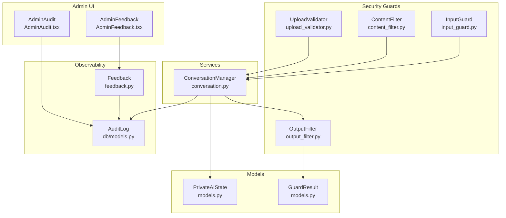
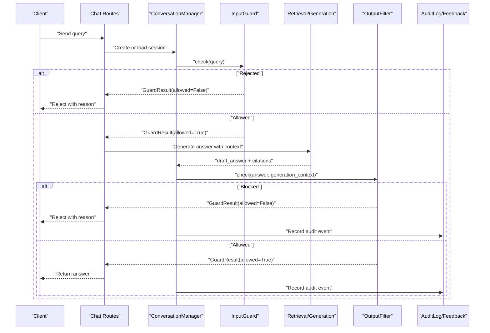
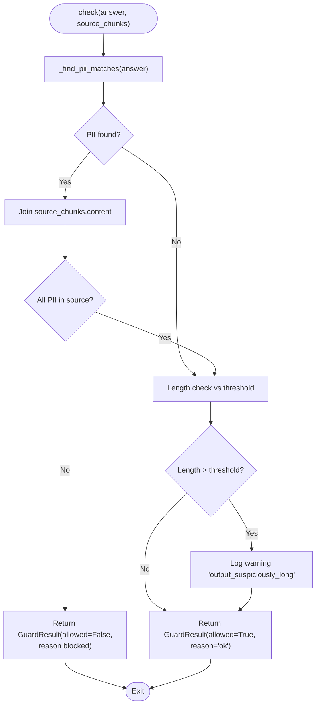
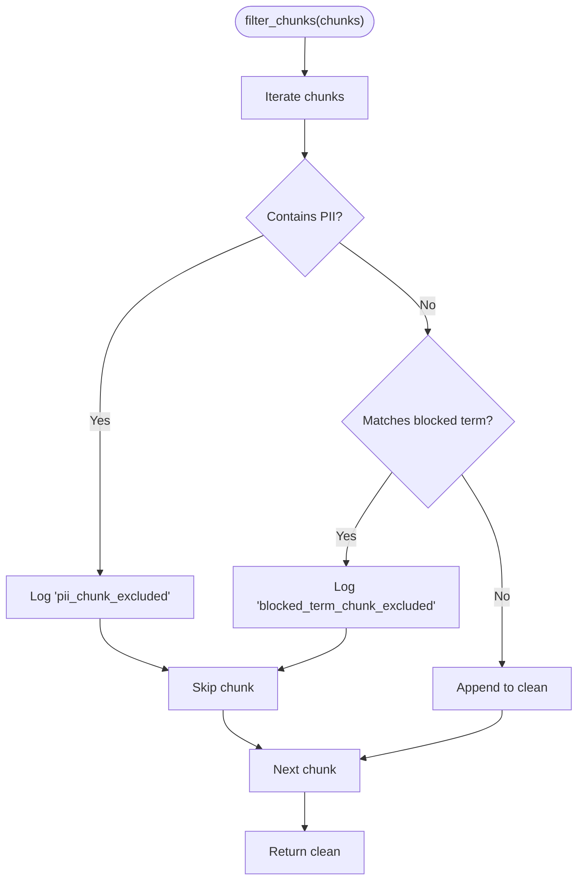
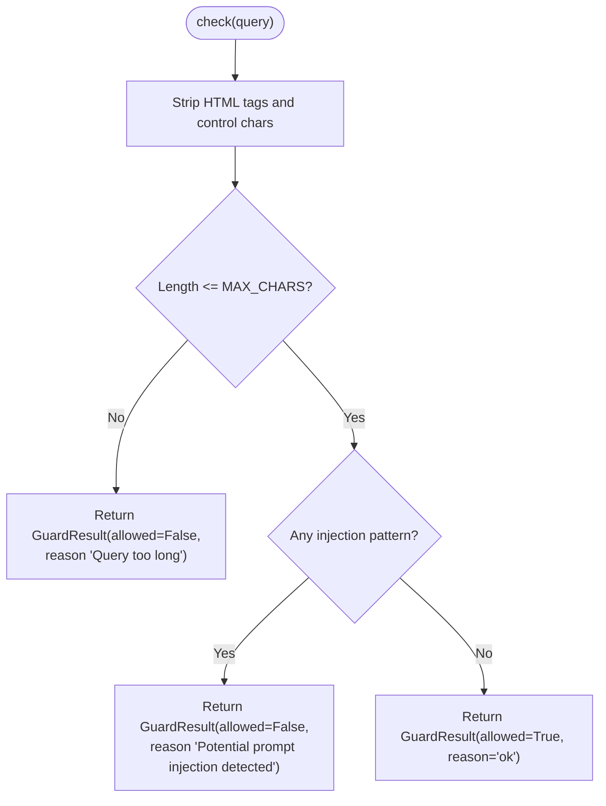
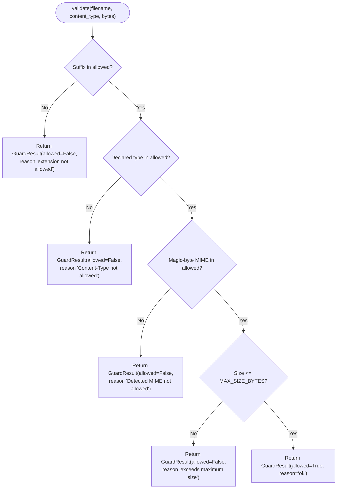
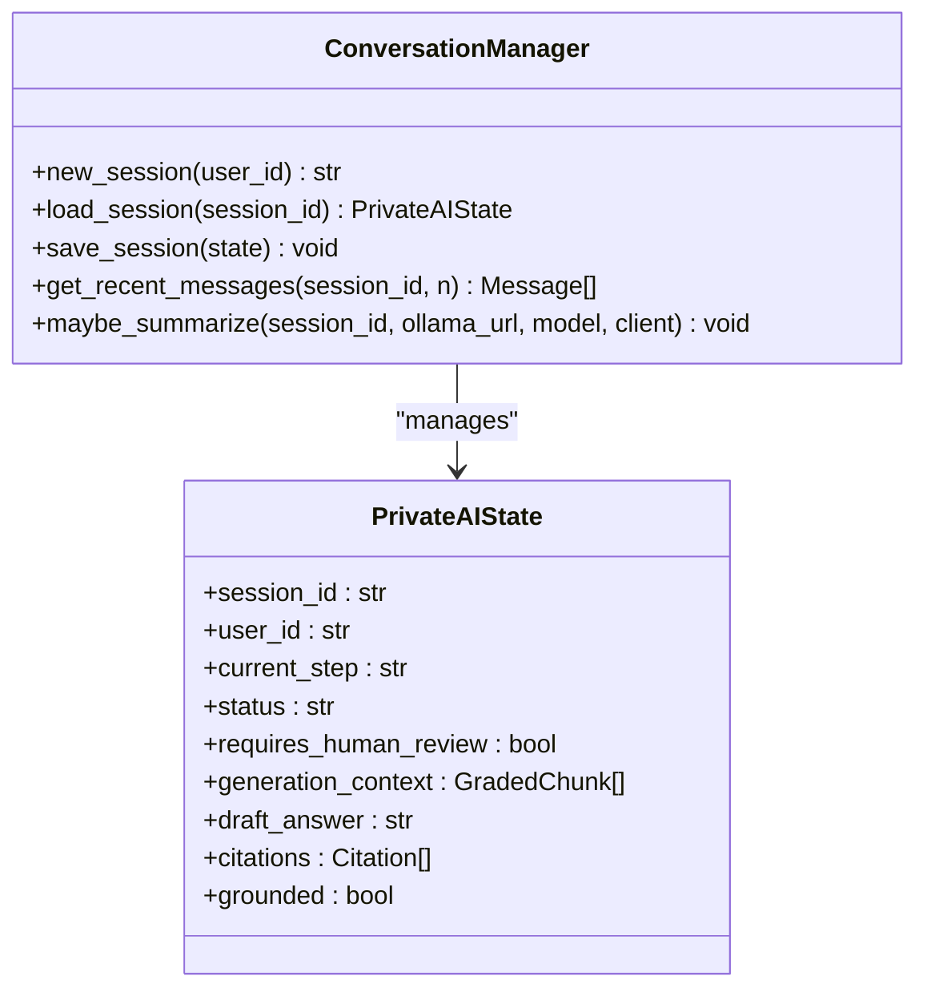
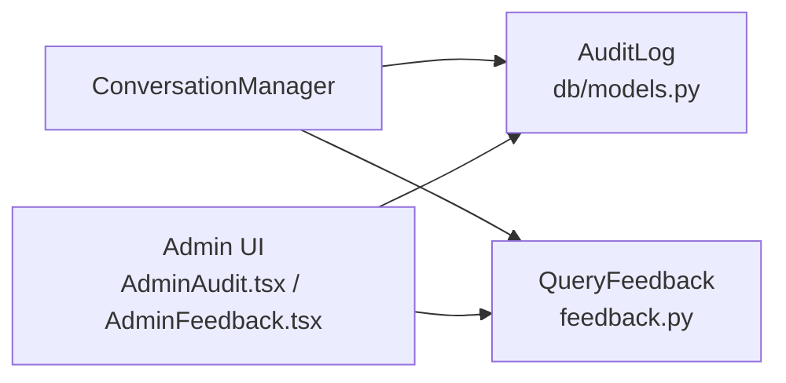
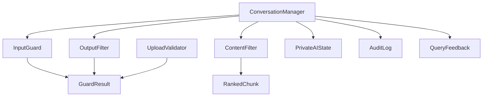

# Output Validation and Quality Assurance

<cite>
**Referenced Files in This Document**
- [output_filter.py](file://safe4ai-pilot/app/security/output_filter.py)
- [content_filter.py](file://safe4ai-pilot/app/security/content_filter.py)
- [input_guard.py](file://safe4ai-pilot/app/security/input_guard.py)
- [upload_validator.py](file://safe4ai-pilot/app/security/upload_validator.py)
- [models.py](file://safe4ai-pilot/app/models.py)
- [config.py](file://safe4ai-pilot/app/config.py)
- [conversation.py](file://safe4ai-pilot/app/services/conversation.py)
- [models.py (database)](file://safe4ai-pilot/app/db/models.py)
- [chat_routes.py](file://safe4ai-pilot/app/api/chat_routes.py)
- [admin_routes.py](file://safe4ai-pilot/app/api/admin_routes.py)
- [feedback.py](file://safe4ai-pilot/observability/feedback.py)
- [audit.py](file://safe4ai-pilot/app/audit/audit.py)
- [AdminAudit.tsx](file://safe4ai-pilot/frontend/src/components/admin/ActivityEvent.tsx)
- [AdminFeedback.tsx](file://safe4ai-pilot/frontend/src/components/admin/FeedbackListItem.tsx)
</cite>

## Table of Contents
1. [Introduction](#introduction)
2. [Project Structure](#project-structure)
3. [Core Components](#core-components)
4. [Architecture Overview](#architecture-overview)
5. [Detailed Component Analysis](#detailed-component-analysis)
6. [Dependency Analysis](#dependency-analysis)
7. [Performance Considerations](#performance-considerations)
8. [Troubleshooting Guide](#troubleshooting-guide)
9. [Conclusion](#conclusion)
10. [Appendices](#appendices)

## Introduction
This document describes the output validation and quality assurance system designed to ensure AI-generated responses meet safety and quality standards. It explains the output filter implementation, including response sanitization, PII detection, length heuristics, and integration with internal quality metrics and administrative review. It also covers configuration of output policies, custom validation rules, handling quality failures, and the relationship with user feedback and compliance reporting.

## Project Structure
The validation system spans backend security guards, service orchestration, database models, and frontend admin components:
- Security guards: input sanitization, content filtering, output filtering, and upload validation
- Orchestration: conversation state and pipeline steps including output filtering and quality gate
- Observability: feedback and audit logs supporting quality assurance and compliance
- Admin UI: activity and feedback dashboards for oversight

**Diagram sources**
- [input_guard.py:24-49](file://safe4ai-pilot/app/security/input_guard.py#L24-L49)
- [content_filter.py:25-64](file://safe4ai-pilot/app/security/content_filter.py#L25-L64)
- [output_filter.py:31-61](file://safe4ai-pilot/app/security/output_filter.py#L31-L61)
- [upload_validator.py:24-73](file://safe4ai-pilot/app/security/upload_validator.py#L24-L73)
- [conversation.py:26-117](file://safe4ai-pilot/app/services/conversation.py#L26-L117)
- [models.py:38-95](file://safe4ai-pilot/app/models.py#L38-L95)
- [feedback.py](file://safe4ai-pilot/observability/feedback.py)
- [models.py (database):118-182](file://safe4ai-pilot/app/db/models.py#L118-L182)
- [AdminAudit.tsx](file://safe4ai-pilot/frontend/src/components/admin/ActivityEvent.tsx)
- [AdminFeedback.tsx](file://safe4ai-pilot/frontend/src/components/admin/FeedbackListItem.tsx)

**Section sources**
- [input_guard.py:1-49](file://safe4ai-pilot/app/security/input_guard.py#L1-L49)
- [content_filter.py:1-64](file://safe4ai-pilot/app/security/content_filter.py#L1-L64)
- [output_filter.py:1-61](file://safe4ai-pilot/app/security/output_filter.py#L1-L61)
- [upload_validator.py:1-73](file://safe4ai-pilot/app/security/upload_validator.py#L1-L73)
- [conversation.py:1-117](file://safe4ai-pilot/app/services/conversation.py#L1-L117)
- [models.py:1-95](file://safe4ai-pilot/app/models.py#L1-L95)
- [models.py (database):1-182](file://safe4ai-pilot/app/db/models.py#L1-L182)

## Core Components
- InputGuard: sanitizes and validates user queries, rejecting potentially malicious inputs and enforcing length limits
- ContentFilter: removes document chunks containing PII or matching blocked terms prior to retrieval
- OutputFilter: checks generated answers for hallucinated PII and suspicious length; blocks or warns accordingly
- UploadValidator: enforces allowed extensions, declared and detected MIME types, and file size limits
- ConversationManager: orchestrates session state, controls pipeline steps, and applies safety measures during conversation lifecycle
- GuardResult: unified result type for all guards indicating allowed/denied decisions and reasons
- PrivateAIState: pipeline state including steps, retrieval context, generation context, and flags for human review

Key validation rules and behaviors:
- OutputFilter blocks answers containing PII not present in the source chunks and logs warnings for excessively long answers
- ContentFilter excludes chunks with PII or blocked terms and logs exclusions
- InputGuard strips HTML/control characters, enforces length, and detects prompt injection patterns
- UploadValidator ensures file integrity and safety via extension, declared MIME, magic-byte detection, and size checks

**Section sources**
- [input_guard.py:24-49](file://safe4ai-pilot/app/security/input_guard.py#L24-L49)
- [content_filter.py:25-64](file://safe4ai-pilot/app/security/content_filter.py#L25-L64)
- [output_filter.py:31-61](file://safe4ai-pilot/app/security/output_filter.py#L31-L61)
- [upload_validator.py:24-73](file://safe4ai-pilot/app/security/upload_validator.py#L24-L73)
- [models.py:38-95](file://safe4ai-pilot/app/models.py#L38-L95)

## Architecture Overview
The system integrates input, content, and output guards with the conversation pipeline and observability layers. The pipeline advances through stages including intake, rewrite, retrieve, grade, decompose, generate, output_filter, quality_gate, respond, fallback, and human review.

**Diagram sources**
- [chat_routes.py](file://safe4ai-pilot/app/api/chat_routes.py)
- [conversation.py:26-117](file://safe4ai-pilot/app/services/conversation.py#L26-L117)
- [input_guard.py:24-49](file://safe4ai-pilot/app/security/input_guard.py#L24-L49)
- [output_filter.py:31-61](file://safe4ai-pilot/app/security/output_filter.py#L31-L61)
- [models.py (database):118-182](file://safe4ai-pilot/app/db/models.py#L118-L182)

## Detailed Component Analysis

### Output Filter Implementation
The OutputFilter performs two primary checks:
- PII hallucination detection: Compares PII found in the answer against the combined source content and blocks if any PII appears without evidence in sources
- Length heuristic: Logs a warning for answers exceeding a configurable threshold without blocking

**Diagram sources**
- [output_filter.py:23-61](file://safe4ai-pilot/app/security/output_filter.py#L23-L61)

**Section sources**
- [output_filter.py:13-18](file://safe4ai-pilot/app/security/output_filter.py#L13-L18)
- [output_filter.py:20](file://safe4ai-pilot/app/security/output_filter.py#L20)
- [output_filter.py:23-28](file://safe4ai-pilot/app/security/output_filter.py#L23-L28)
- [output_filter.py:31-61](file://safe4ai-pilot/app/security/output_filter.py#L31-L61)

### Content Filter for Retrieval Safety
The ContentFilter removes chunks containing PII or matching blocked terms, logging each exclusion. It exposes helpers to detect PII and filter by blocked terms.

**Diagram sources**
- [content_filter.py:25-64](file://safe4ai-pilot/app/security/content_filter.py#L25-L64)

**Section sources**
- [content_filter.py:13-18](file://safe4ai-pilot/app/security/content_filter.py#L13-L18)
- [content_filter.py:25-64](file://safe4ai-pilot/app/security/content_filter.py#L25-L64)

### Input Guard for Query Safety
The InputGuard sanitizes queries by stripping HTML tags and non-printable characters, enforcing a maximum length, and detecting prompt injection patterns.

**Diagram sources**
- [input_guard.py:24-49](file://safe4ai-pilot/app/security/input_guard.py#L24-L49)

**Section sources**
- [input_guard.py:9-19](file://safe4ai-pilot/app/security/input_guard.py#L9-L19)
- [input_guard.py:24-49](file://safe4ai-pilot/app/security/input_guard.py#L24-L49)

### Upload Validator for Document Safety
The UploadValidator enforces allowed extensions, declared and detected MIME types, and file size limits, generating a safe storage filename.

**Diagram sources**
- [upload_validator.py:24-73](file://safe4ai-pilot/app/security/upload_validator.py#L24-L73)

**Section sources**
- [upload_validator.py:13-21](file://safe4ai-pilot/app/security/upload_validator.py#L13-L21)
- [upload_validator.py:24-73](file://safe4ai-pilot/app/security/upload_validator.py#L24-L73)

### Conversation Pipeline and Quality Gate
The ConversationManager coordinates the conversation lifecycle and pipeline steps. The PrivateAIState tracks the current step, retrieval context, generation context, and flags for human review. The pipeline includes an explicit output_filter step and a quality_gate step, followed by respond or fallback.

**Diagram sources**
- [conversation.py:26-117](file://safe4ai-pilot/app/services/conversation.py#L26-L117)
- [models.py:49-95](file://safe4ai-pilot/app/models.py#L49-L95)

**Section sources**
- [conversation.py:26-117](file://safe4ai-pilot/app/services/conversation.py#L26-L117)
- [models.py:49-95](file://safe4ai-pilot/app/models.py#L49-L95)

### Quality Metrics, Feedback, and Compliance
Quality metrics and compliance are supported by:
- AuditLog entries capturing actions, queries, responses, latency, and model usage
- QueryFeedback records for user ratings and comments
- Admin dashboards for activity and feedback monitoring

**Diagram sources**
- [models.py (database):118-156](file://safe4ai-pilot/app/db/models.py#L118-L156)
- [feedback.py](file://safe4ai-pilot/observability/feedback.py)
- [AdminAudit.tsx](file://safe4ai-pilot/frontend/src/components/admin/ActivityEvent.tsx)
- [AdminFeedback.tsx](file://safe4ai-pilot/frontend/src/components/admin/FeedbackListItem.tsx)

**Section sources**
- [models.py (database):118-156](file://safe4ai-pilot/app/db/models.py#L118-L156)
- [feedback.py](file://safe4ai-pilot/observability/feedback.py)

## Dependency Analysis
The validation system exhibits clear separation of concerns:
- Guards depend only on models and logging
- ConversationManager depends on models, prompts, and external services for summarization
- Database models define audit and feedback schemas
- Frontend admin components consume audit and feedback data

**Diagram sources**
- [input_guard.py:24-49](file://safe4ai-pilot/app/security/input_guard.py#L24-L49)
- [content_filter.py:25-64](file://safe4ai-pilot/app/security/content_filter.py#L25-L64)
- [output_filter.py:31-61](file://safe4ai-pilot/app/security/output_filter.py#L31-L61)
- [upload_validator.py:24-73](file://safe4ai-pilot/app/security/upload_validator.py#L24-L73)
- [conversation.py:26-117](file://safe4ai-pilot/app/services/conversation.py#L26-L117)
- [models.py:38-95](file://safe4ai-pilot/app/models.py#L38-L95)
- [models.py (database):118-182](file://safe4ai-pilot/app/db/models.py#L118-L182)

**Section sources**
- [models.py:38-95](file://safe4ai-pilot/app/models.py#L38-L95)
- [models.py (database):118-182](file://safe4ai-pilot/app/db/models.py#L118-L182)

## Performance Considerations
- OutputFilter efficiency: The PII detection scans the answer once and builds the combined source text once; consider caching repeated source texts if the same chunks are reused frequently
- ContentFilter filtering: Filtering chunks early reduces downstream computation; ensure chunk lists are reasonably sized
- InputGuard sanitization: Regex-based cleaning is linear in input size; keep patterns minimal and reuse compiled regex objects
- UploadValidator: Magic-byte detection adds overhead; batch validations when possible and avoid redundant checks
- ConversationManager summarization: Summarization is asynchronous and optional; tune thresholds and model parameters to balance accuracy and latency

[No sources needed since this section provides general guidance]

## Troubleshooting Guide
Common issues and resolutions:
- Output blocked due to hallucinated PII: Verify that source chunks include the relevant context; adjust retrieval or reranking to improve grounding
- Excessive warnings for long answers: Tune the length threshold or investigate generation settings that cause verbose outputs
- ContentFilter excluding too many chunks: Review blocked terms and PII patterns; ensure they align with organizational policy
- InputGuard rejecting legitimate queries: Adjust injection patterns or length limits; validate with representative datasets
- UploadValidator rejections: Confirm file extensions, declared types, and sizes; verify magic-byte detection support

Operational checks:
- AuditLog retention and indexing support compliance reporting
- QueryFeedback enables trend analysis and user sentiment monitoring
- Admin dashboards provide visibility into activity and feedback

**Section sources**
- [output_filter.py:31-61](file://safe4ai-pilot/app/security/output_filter.py#L31-L61)
- [content_filter.py:25-64](file://safe4ai-pilot/app/security/content_filter.py#L25-L64)
- [input_guard.py:24-49](file://safe4ai-pilot/app/security/input_guard.py#L24-L49)
- [upload_validator.py:24-73](file://safe4ai-pilot/app/security/upload_validator.py#L24-L73)
- [models.py (database):118-156](file://safe4ai-pilot/app/db/models.py#L118-L156)

## Conclusion
The output validation and quality assurance system combines input sanitization, content filtering, and output filtering to ensure AI responses are safe and grounded. The system’s modular design, clear guard results, and integration with observability and admin tools enable robust quality control, compliance reporting, and continuous improvement through user feedback.

[No sources needed since this section summarizes without analyzing specific files]

## Appendices

### Configuration and Policy Examples
- Configure upload size limits via settings and ensure validators reflect the configured maximum
- Define blocked terms for ContentFilter to align with organizational restrictions
- Adjust output length threshold to balance safety and helpfulness
- Set up audit retention and feedback collection for compliance and quality insights

**Section sources**
- [config.py:20](file://safe4ai-pilot/app/config.py#L20)
- [content_filter.py:26-27](file://safe4ai-pilot/app/security/content_filter.py#L26-L27)
- [output_filter.py:20](file://safe4ai-pilot/app/security/output_filter.py#L20)
- [models.py (database):118-156](file://safe4ai-pilot/app/db/models.py#L118-L156)

### Implementing Custom Validation Rules
- Extend ContentFilter with additional blocked-term or PII pattern logic
- Add new guard classes similar to InputGuard or OutputFilter with GuardResult semantics
- Integrate custom guards into the conversation pipeline by adding new steps and updating state transitions

**Section sources**
- [content_filter.py:25-64](file://safe4ai-pilot/app/security/content_filter.py#L25-L64)
- [input_guard.py:24-49](file://safe4ai-pilot/app/security/input_guard.py#L24-L49)
- [output_filter.py:31-61](file://safe4ai-pilot/app/security/output_filter.py#L31-L61)
- [models.py:49-95](file://safe4ai-pilot/app/models.py#L49-L95)

### Handling Quality Assurance Failures
- Route low-confidence or flagged outputs to a human review queue
- Record audit events and feedback for each failure to inform future tuning
- Monitor admin dashboards for recurring failure patterns and adjust policies accordingly

**Section sources**
- [models.py:86-87](file://safe4ai-pilot/app/models.py#L86-L87)
- [models.py (database):169-182](file://safe4ai-pilot/app/db/models.py#L169-L182)
- [feedback.py](file://safe4ai-pilot/observability/feedback.py)
- [AdminAudit.tsx](file://safe4ai-pilot/frontend/src/components/admin/ActivityEvent.tsx)
- [AdminFeedback.tsx](file://safe4ai-pilot/frontend/src/components/admin/FeedbackListItem.tsx)