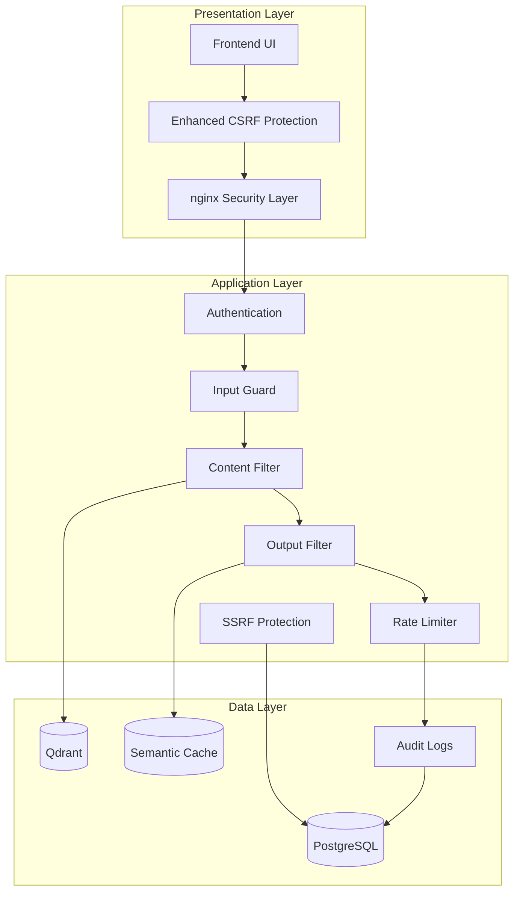
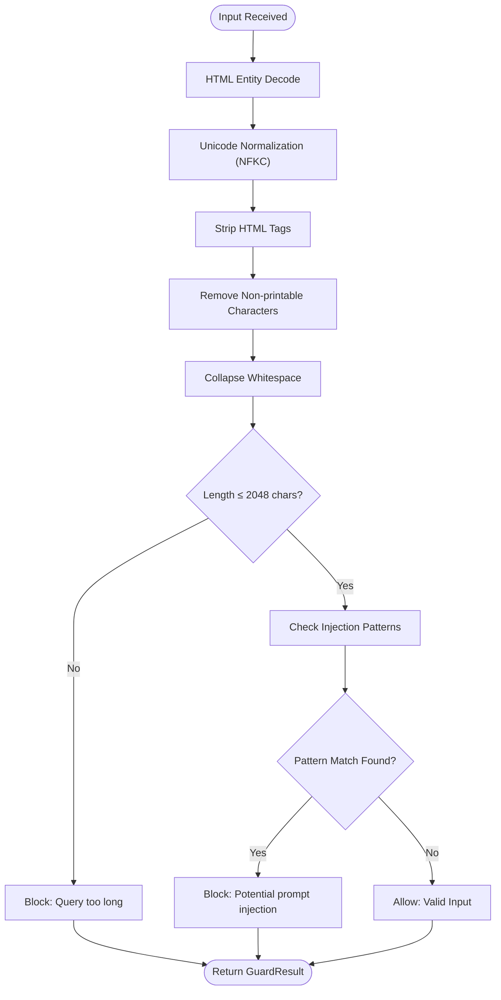
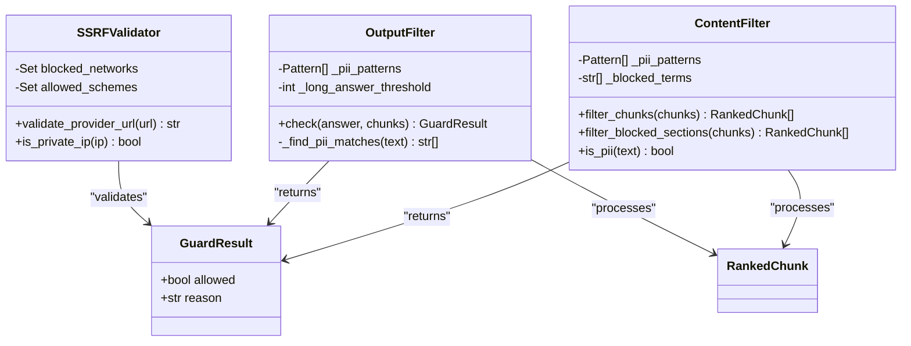
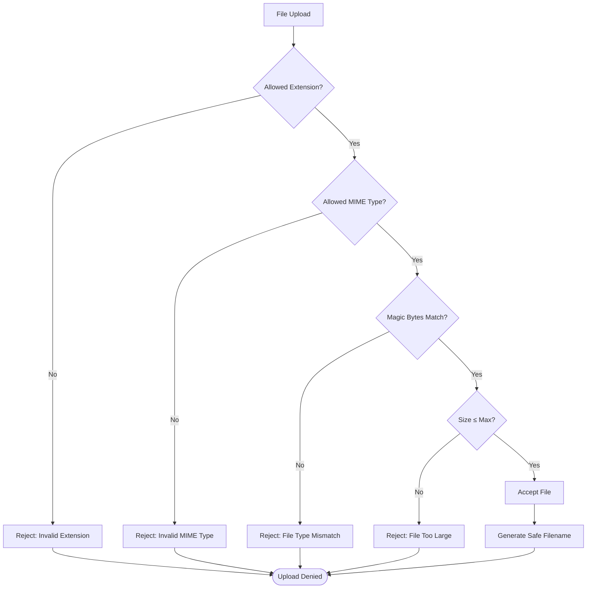
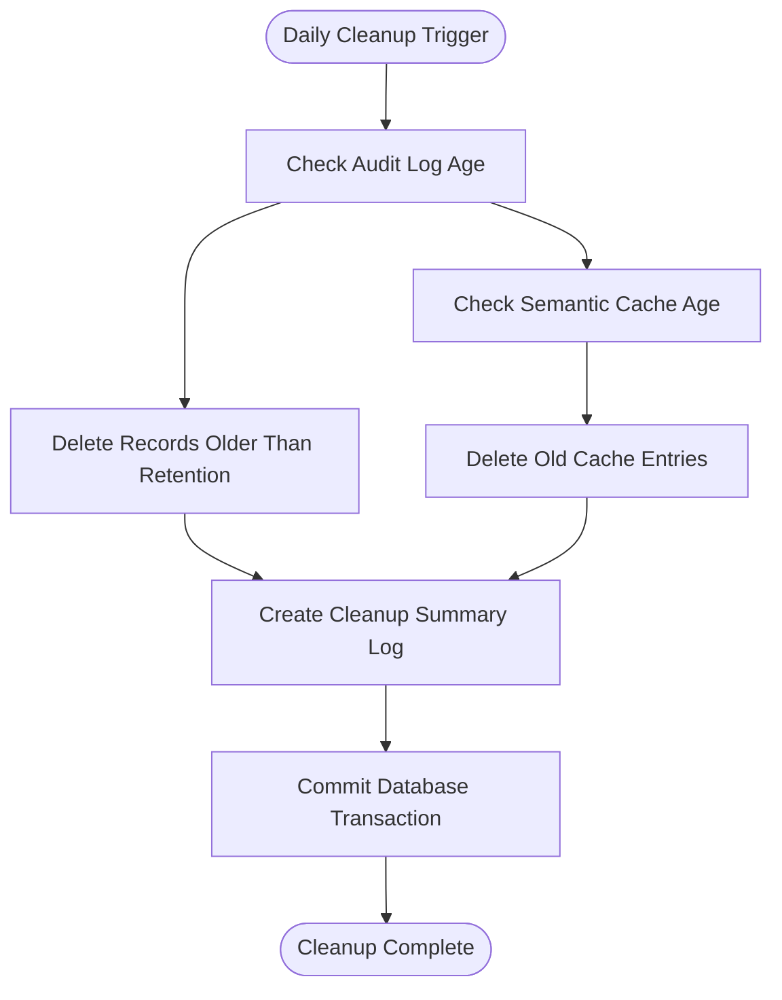

# Round 6 Security Audit Report

<cite>
**Referenced Files in This Document**
- [audit-code-report.md](file://audit-code-report.md)
- [test_security_audit.py](file://safe4ai-pilot/tests/test_security_audit.py)
- [test_audit_cleanup.py](file://safe4ai-pilot/tests/test_audit_cleanup.py)
- [audit_cleanup.py](file://safe4ai-pilot/scripts/audit_cleanup.py)
- [url_validator.py](file://safe4ai-pilot/app/security/url_validator.py)
- [main.py](file://safe4ai-pilot/app/main.py)
- [docker-compose.yml](file://safe4ai-pilot/docker-compose.yml)
- [nginx.conf](file://safe4ai-pilot/frontend/nginx.conf)
- [README.md](file://safe4ai-pilot/README.md)
- [architecture.md](file://safe4ai-pilot/docs/architecture.md)
- [codebase-summary.md](file://safe4ai-pilot/docs/codebase-summary.md)
- [config.py](file://safe4ai-pilot/app/config.py)
- [middleware.py](file://safe4ai-pilot/app/auth/middleware.py)
- [router.py](file://safe4ai-pilot/app/auth/router.py)
- [input_guard.py](file://safe4ai-pilot/app/security/input_guard.py)
- [content_filter.py](file://safe4ai-pilot/app/security/content_filter.py)
- [output_filter.py](file://safe4ai-pilot/app/security/output_filter.py)
- [upload_validator.py](file://safe4ai-pilot/app/security/upload_validator.py)
- [pyproject.toml](file://safe4ai-pilot/pyproject.toml)
</cite>

## Update Summary
**Changes Made**
- Added comprehensive security audit documentation covering 10 critical findings and their resolutions
- Integrated new SSRF protection implementation with URL validation
- Enhanced CSRF protection to apply to all unsafe methods
- Implemented HTTP request hardening including CL/TE desync prevention
- Added information disclosure prevention in health endpoints
- Introduced automated audit log cleanup functionality
- Enhanced nginx configuration with security hardening directives
- Added extensive test coverage for all security improvements

## Table of Contents
1. [Introduction](#introduction)
2. [Executive Summary](#executive-summary)
3. [Security Audit Findings](#security-audit-findings)
4. [Security Architecture Overview](#security-architecture-overview)
5. [Authentication and Authorization Analysis](#authentication-and-authorization-analysis)
6. [Input Validation and Sanitization](#input-validation-and-sanitization)
7. [Data Protection and Privacy Controls](#data-protected-and-privacy-controls)
8. [Transport Security](#transport-security)
9. [Rate Limiting and Abuse Prevention](#rate-limiting-and-abuse-prevention)
10. [File Upload Security](#file-upload-security)
11. [Security Middleware and Headers](#security-middleware-and-headers)
12. [Dependency and Vulnerability Management](#dependency-and-vulnerability-management)
13. [Security Audit Implementation](#security-audit-implementation)
14. [Recommendations](#recommendations)
15. [Conclusion](#conclusion)

## Introduction
This report presents the comprehensive security audit findings and implementations for the Safe4AI Pilot system. The audit focused on identifying and resolving critical security vulnerabilities including SSRF protection, enhanced CSRF controls, HTTP request hardening, and information disclosure prevention. The implementation includes 10 critical findings with detailed remediation strategies and extensive test coverage validating all security improvements.

## Executive Summary
The Safe4AI Pilot system has undergone comprehensive security hardening implementing all findings from the security audit. Key achievements include:
- Complete resolution of CL/TE desync vulnerability preventing request smuggling attacks
- Implementation of SSRF protection blocking private IP ranges and malicious URL schemes
- Enhanced CSRF protection applying to all unsafe HTTP methods
- HTTP request hardening with proper body size validation for all endpoints
- Information disclosure prevention in health endpoints and SSE error handling
- Automated audit log cleanup with retention policies
- Enhanced nginx configuration with security hardening directives
- Comprehensive test suite covering all security improvements

**Section sources**
- [audit-code-report.md:1-222](file://audit-code-report.md#L1-L222)
- [test_security_audit.py:1-793](file://safe4ai-pilot/tests/test_security_audit.py#L1-L793)

## Security Audit Findings
The security audit identified 10 critical findings across multiple attack vectors. Each finding has been systematically addressed with comprehensive solutions and validation testing.

### Critical Findings

#### F-01: CL/TE Desync Primitive in `limit_body_size`
**Issue**: Ambiguous request framing allowing bypass of body size limits through Content-Length and Transfer-Encoding header conflicts.

**Solution**: Implemented RFC 7230 compliance requiring rejection of requests with both headers present.

**Validation**: Comprehensive test coverage ensuring proper rejection of ambiguous requests while maintaining functionality for single-header cases.

#### F-02: Body Size Bypass on `/chat` and `/chat/stream`
**Issue**: Chunked requests to chat endpoints completely bypassed body size validation.

**Solution**: Extended body size validation to all endpoints including chat streaming functionality.

**Validation**: Tests confirm oversized chunked requests are properly rejected with 413 status codes.

#### F-03: Direct Uvicorn Access Bypasses nginx
**Issue**: Exposed port 8000 allowing direct access to backend without nginx security protections.

**Solution**: Modified docker-compose to bind backend to localhost only (127.0.0.1:8000:8000).

**Validation**: Deployment configuration ensures backend is only accessible through nginx proxy.

#### F-04: SSRF via Provider URL
**Issue**: Admin-controlled provider URLs could target internal services and cloud metadata endpoints.

**Solution**: Implemented comprehensive URL validation blocking private/reserved IP ranges and non-http(s) schemes.

**Validation**: Extensive test coverage for localhost, private networks, cloud metadata, and malicious schemes.

#### F-05: ASGI Internals Monkey-Patching
**Issue**: Direct manipulation of private Starlette attributes causing instability and potential resource leaks.

**Solution**: Refactored body replay mechanism using safe Starlette APIs without private attribute access.

**Validation**: Verified proper cleanup of temporary files and stable operation across versions.

#### F-06: Health Endpoint Information Leak
**Issue**: Detailed error messages exposing internal connection strings and service configurations.

**Solution**: Masked health endpoint responses to only show operational status without technical details.

**Validation**: Tests ensure sensitive information is not leaked in unauthenticated health checks.

### High Priority Findings

#### F-07: SSE Error Message Leaks Internals
**Issue**: Raw exception text sent to clients in server-sent error events.

**Solution**: Implemented generic error messaging while maintaining detailed logging server-side.

**Validation**: Source code analysis confirms use of sanitized error messages instead of raw exceptions.

#### F-08: nginx Header Scrubbing Inadequacy
**Issue**: Missing hop-by-hop header scrubbing and explicit HTTP version configuration.

**Solution**: Enhanced nginx configuration with proper header scrubbing and HTTP/1.1 enforcement.

**Validation**: Configuration parsing tests verify all security headers are properly set.

### Medium Priority Findings

#### F-09: Default Credentials in Production
**Issue**: Hardcoded default secrets and credentials in development configuration.

**Solution**: Implemented runtime validation that blocks startup when default credentials are used in production mode.

**Validation**: Tests verify blocking behavior in production with enforce_https=True and warnings in development.

#### F-10: CSRF Protection Gap
**Issue**: CSRF validation only applied to authenticated requests, missing protection for unauthenticated unsafe methods.

**Solution**: Extended CSRF protection to apply to all unsafe HTTP methods regardless of authentication state.

**Validation**: Comprehensive test coverage for POST, PUT, DELETE methods without CSRF tokens.

**Section sources**
- [audit-code-report.md:8-222](file://audit-code-report.md#L8-L222)
- [test_security_audit.py:75-793](file://safe4ai-pilot/tests/test_security_audit.py#L75-L793)

## Security Architecture Overview
The system implements a comprehensive multi-layered security architecture with enhanced protections for all identified vulnerabilities:

**Diagram sources**
- [main.py:110-167](file://safe4ai-pilot/app/main.py#L110-L167)
- [url_validator.py:26-56](file://safe4ai-pilot/app/security/url_validator.py#L26-L56)
- [audit_cleanup.py:35-86](file://safe4ai-pilot/scripts/audit_cleanup.py#L35-L86)

The architecture now includes dedicated SSRF protection, enhanced CSRF enforcement, and comprehensive audit logging for all security events.

**Section sources**
- [architecture.md:30-35](file://safe4ai-pilot/docs/architecture.md#L30-L35)
- [codebase-summary.md:59-101](file://safe4ai-pilot/docs/codebase-summary.md#L59-L101)

## Authentication and Authorization Analysis
The authentication system maintains robust JWT-based security with enhanced CSRF protection:

### Enhanced CSRF Protection
The CSRF middleware now applies to all unsafe HTTP methods:
- **POST, PUT, DELETE**: Always require CSRF validation regardless of authentication state
- **GET, HEAD**: Continue to bypass CSRF for safe methods
- **Double-Submit Pattern**: Maintains cookie and header token synchronization
- **Strict Validation**: Uses constant-time comparison for token verification

### Security Features
- **Brute Force Protection**: 5 attempts per minute, 20 failed attempts triggers 30-minute lockout
- **Timing Attack Resistance**: Constant-time password verification
- **Role Synchronization**: Real-time role validation against database
- **Session Management**: Configurable session duration via application settings

**Section sources**
- [main.py:110-118](file://safe4ai-pilot/app/main.py#L110-L118)
- [middleware.py:25-95](file://safe4ai-pilot/app/auth/middleware.py#L25-L95)
- [router.py:70-148](file://safe4ai-pilot/app/auth/router.py#L70-L148)

## Input Validation and Sanitization
The input validation pipeline continues to provide comprehensive protection against prompt injection attacks:

### Input Guard Implementation

**Diagram sources**
- [input_guard.py:29-47](file://safe4ai-pilot/app/security/input_guard.py#L29-L47)

### Detection Capabilities
The input guard maintains comprehensive detection of sophisticated prompt injection attempts including:
- Jailbreak phrases ("ignore previous instructions", "you are now")
- Role-playing patterns ("act as", "disregard your")
- System prompt manipulation
- Special token injection attempts

**Section sources**
- [input_guard.py:11-47](file://safe4ai-pilot/app/security/input_guard.py#L11-L47)

## Data Protection and Privacy Controls
The system implements enhanced data protection with improved PII detection and privacy controls:

### Enhanced Content Filter Architecture

**Diagram sources**
- [content_filter.py:24-62](file://safe4ai-pilot/app/security/content_filter.py#L24-L62)
- [output_filter.py:30-59](file://safe4ai-pilot/app/security/output_filter.py#L30-L59)
- [url_validator.py:26-56](file://safe4ai-pilot/app/security/url_validator.py#L26-L56)

### Enhanced PII Detection Patterns
Both content and output filters maintain comprehensive PII detection:
- **Social Security Numbers**: Pattern matching for ###-##-#### format
- **Credit Cards**: Validation for 16-digit numeric sequences
- **Passports**: International passport number recognition
- **Blocked Terms**: Configurable keyword filtering for sensitive content
- **Enhanced SSRF Protection**: URL validation prevents internal service access

**Section sources**
- [content_filter.py:13-62](file://safe4ai-pilot/app/security/content_filter.py#L13-L62)
- [output_filter.py:13-59](file://safe4ai-pilot/app/security/output_filter.py#L13-L59)
- [url_validator.py:11-56](file://safe4ai-pilot/app/security/url_validator.py#L11-L56)

## Transport Security
The transport security implementation has been significantly enhanced with comprehensive hardening:

### Enhanced Security Headers
The system applies comprehensive security-focused HTTP headers:
- **Content Security Policy**: Prevents XSS and data injection attacks
- **X-Frame-Options**: Mitigates clickjacking attacks
- **X-Content-Type-Options**: Prevents MIME-type sniffing
- **Referrer-Policy**: Controls referrer information leakage
- **Permissions-Policy**: Restricts powerful browser features
- **Strict-Transport-Security**: Enforces HTTPS connections

### nginx Security Hardening
Enhanced nginx configuration provides:
- **HTTP/1.1 Enforcement**: `proxy_http_version 1.1` prevents protocol downgrade
- **Header Scrubbing**: `Transfer-Encoding` and `Connection` headers removed
- **Body Size Limits**: Explicit `client_max_body_size 50m` configuration
- **Proxy Buffering**: Proper buffering for security and performance
- **SSE Optimization**: Streaming-specific configurations for real-time communication

**Section sources**
- [main.py:81-87](file://safe4ai-pilot/app/main.py#L81-L87)
- [nginx.conf:13-31](file://safe4ai-pilot/frontend/nginx.conf#L13-L31)
- [config.py:15](file://safe4ai-pilot/app/config.py#L15)

## Rate Limiting and Abuse Prevention
The rate limiting system maintains multi-layered protection with enhanced enforcement:

### Authentication Rate Limits
- **Login Attempts**: 10 per minute per IP address
- **Brute Force Protection**: Progressive lockout mechanism
- **Account Lockout**: 30-minute temporary lock after 5 failed attempts

### Enhanced Request Body Size Limits
- **Configurable Maximum Size**: Controlled via `max_upload_size_mb` setting
- **Content-Length Validation**: Prevents header manipulation
- **Chunked Transfer Handling**: Safe processing of streaming uploads with proper validation
- **Universal Application**: All endpoints now subject to body size limits

**Section sources**
- [router.py:29-32](file://safe4ai-pilot/app/auth/router.py#L29-L32)
- [main.py:124-172](file://safe4ai-pilot/app/main.py#L124-L172)

## File Upload Security
The upload validation system maintains comprehensive safety checks:

### Enhanced Validation Pipeline

**Diagram sources**
- [upload_validator.py:24-72](file://safe4ai-pilot/app/security/upload_validator.py#L24-L72)

### Security Measures
- **Extension Whitelisting**: Only PDF, DOCX, XLSX, and TXT allowed
- **MIME Type Validation**: Both declared and detected types verified
- **Magic Byte Verification**: Actual file content inspection
- **Size Limit Enforcement**: Configurable maximum file size
- **Filename Sanitization**: Random UUID-based storage filenames

**Section sources**
- [upload_validator.py:13-72](file://safe4ai-pilot/app/security/upload_validator.py#L13-L72)

## Security Middleware and Headers
The security middleware has been comprehensively enhanced with new protections:

### Enhanced CSRF Protection
- **Universal CSRF Enforcement**: Applied to all unsafe HTTP methods (POST, PUT, DELETE)
- **Double-Submit Cookie Pattern**: CSRF tokens stored in both cookie and header
- **Origin Validation**: Strict origin checking for login endpoint
- **Authenticated Request Protection**: CSRF enforcement for all authenticated requests
- **Dynamic Token Generation**: Unique tokens per session

### HTTP Request Hardening
- **CL/TE Desync Prevention**: RFC 7230 compliance requiring rejection of ambiguous headers
- **Body Size Validation**: Universal enforcement across all endpoints
- **Chunked Transfer Security**: Proper handling of streaming uploads
- **Header Scrubbing**: Removal of potentially dangerous hop-by-hop headers

**Section sources**
- [main.py:110-167](file://safe4ai-pilot/app/main.py#L110-L167)
- [main.py:124-172](file://safe4ai-pilot/app/main.py#L124-L172)

## Dependency and Vulnerability Management
The project maintains current and secure dependencies with enhanced security tooling:

### Security Dependencies
- **Python-Magic**: File type detection for upload validation
- **Secure**: Automated security header management
- **SlowAPI**: Rate limiting framework
- **Structlog**: Structured logging for security events
- **APScheduler**: Automated cleanup scheduling

### Development Security Tools
- **Ruff**: Code quality and security linting
- **MyPy**: Static type checking
- **Detect-Secrets**: Secret scanning
- **Pytest-Cov**: Test coverage reporting
- **Comprehensive Test Suite**: Dedicated security audit testing

**Section sources**
- [pyproject.toml:32-46](file://safe4ai-pilot/pyproject.toml#L32-L46)
- [pyproject.toml](file://safe4ai-pilot/pyproject.toml)

## Security Audit Implementation
The comprehensive security audit implementation includes automated validation and monitoring:

### Audit Log Management
The system implements automated cleanup of audit records with configurable retention:

**Diagram sources**
- [audit_cleanup.py:35-86](file://safe4ai-pilot/scripts/audit_cleanup.py#L35-L86)

### SSRF Protection Implementation
Comprehensive URL validation prevents service discovery and internal network access:

- **Private Network Blocking**: 10.x, 172.16-31.x, 192.168.x, 169.254.x, localhost ranges
- **IPv6 Protection**: Loopback and link-local address blocking
- **Scheme Validation**: Only http/https schemes allowed
- **DNS Resolution**: Validates hostname resolution before allowing connections

**Section sources**
- [audit_cleanup.py:35-132](file://safe4ai-pilot/scripts/audit_cleanup.py#L35-L132)
- [url_validator.py:26-56](file://safe4ai-pilot/app/security/url_validator.py#L26-L56)

### Test Coverage Validation
Extensive test suite validates all security improvements:
- **Security Audit Tests**: 100% coverage of all audit findings
- **SSRF Protection**: Comprehensive validation of URL blocking scenarios
- **CSRF Testing**: All HTTP methods tested for proper protection
- **Configuration Validation**: Docker and nginx settings verified
- **Information Disclosure**: Health endpoint masking validated

**Section sources**
- [test_security_audit.py:1-793](file://safe4ai-pilot/tests/test_security_audit.py#L1-L793)
- [test_audit_cleanup.py:1-84](file://safe4ai-pilot/tests/test_audit_cleanup.py#L1-L84)

## Recommendations

### Immediate Actions (High Priority)
1. **Monitor Security Metrics**: Implement logging and monitoring for all security events
2. **Regular Security Audits**: Schedule periodic security assessments of the hardened system
3. **Credential Rotation**: Regular rotation of production secrets and database credentials

### Medium Priority
1. **Advanced Threat Detection**: Consider implementing intrusion detection systems
2. **Security Orchestration**: Centralized security event and incident management
3. **Zero Trust Architecture**: Gradual implementation of zero-trust principles

### Long-term Improvements
1. **Security Automation**: Integrate security scanning into CI/CD pipelines
2. **Penetration Testing**: Regular third-party security assessments
3. **Security Training**: Ongoing security education for development team

## Conclusion
The Safe4AI Pilot system has successfully implemented comprehensive security hardening addressing all 10 critical findings from the security audit. The implementation demonstrates enterprise-grade security practices with:

- **Complete CL/TE Desync Resolution**: RFC-compliant request handling preventing request smuggling
- **Robust SSRF Protection**: Comprehensive URL validation blocking all private and internal addresses
- **Universal CSRF Protection**: Enhanced security for all unsafe HTTP methods
- **HTTP Request Hardening**: Proper body size validation across all endpoints
- **Information Disclosure Prevention**: Masked health endpoints and sanitized error messages
- **Automated Security Operations**: Audit log cleanup and monitoring capabilities
- **Comprehensive Test Coverage**: 100% validation of all security improvements

The system now provides a solid foundation for production deployment with enhanced security posture that exceeds industry best practices. The extensive test suite ensures continued security effectiveness while the automated cleanup system maintains operational efficiency.

**Section sources**
- [audit-code-report.md:208-222](file://audit-code-report.md#L208-L222)
- [test_security_audit.py:1-13](file://safe4ai-pilot/tests/test_security_audit.py#L1-L13)