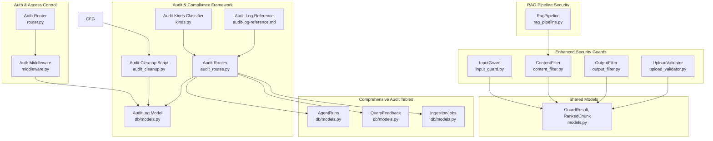
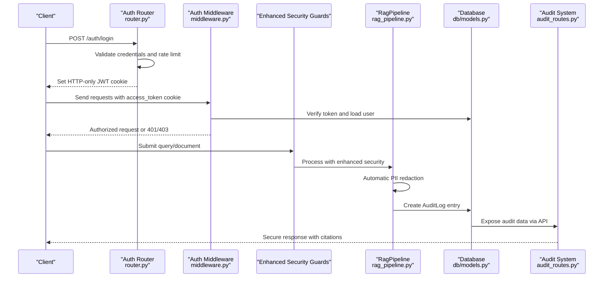
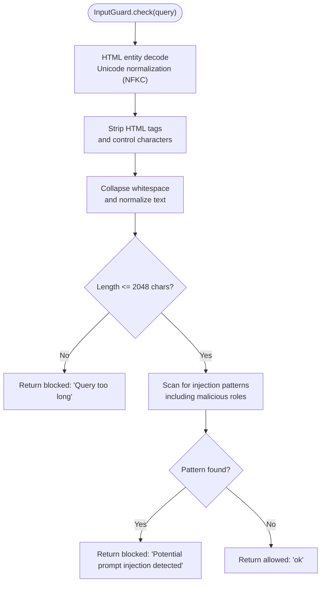
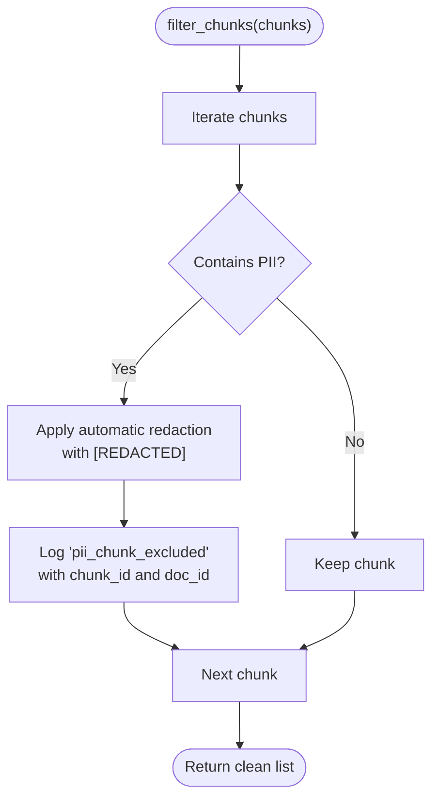
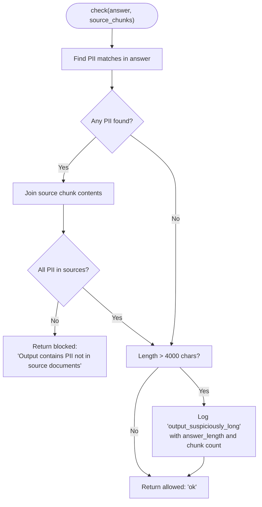
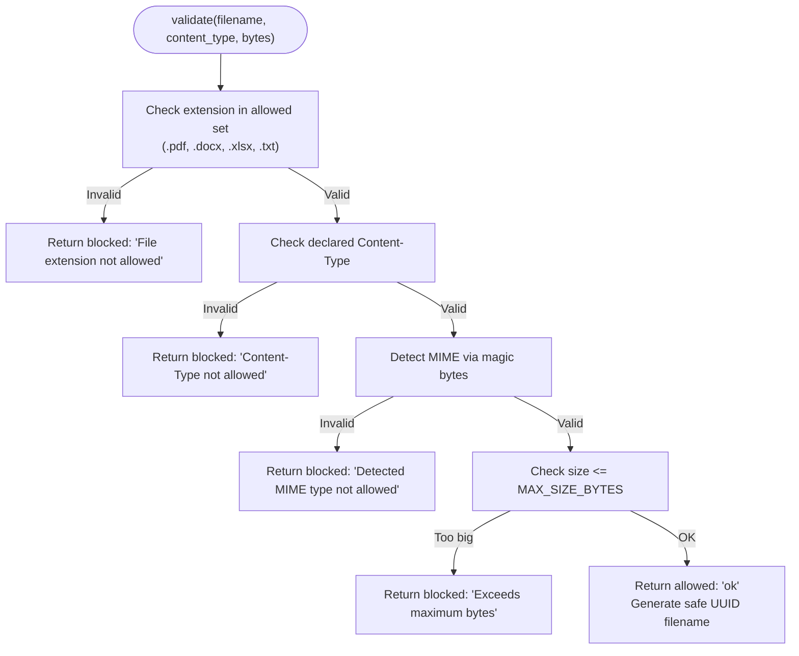
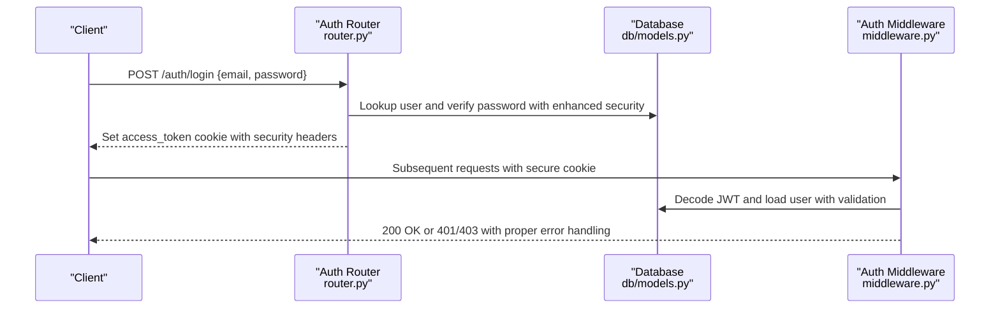
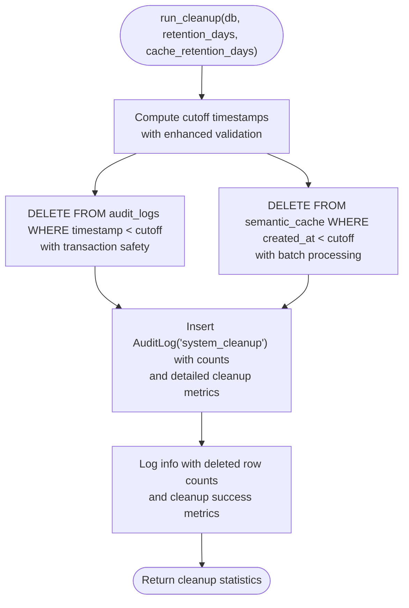
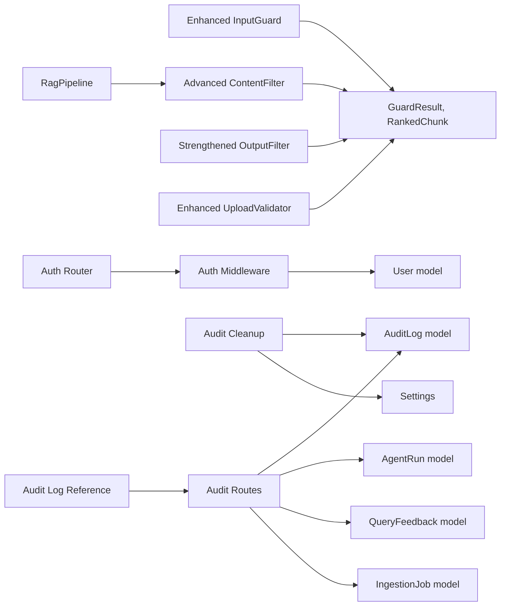

# Security and Compliance

<cite>
**Referenced Files in This Document**
- [input_guard.py](file://safe4ai-pilot/app/security/input_guard.py)
- [content_filter.py](file://safe4ai-pilot/app/security/content_filter.py)
- [output_filter.py](file://safe4ai-pilot/app/security/output_filter.py)
- [upload_validator.py](file://safe4ai-pilot/app/security/upload_validator.py)
- [rag_pipeline.py](file://safe4ai-pilot/app/services/rag_pipeline.py)
- [models.py](file://safe4ai-pilot/app/models.py)
- [db/models.py](file://safe4ai-pilot/app/db/models.py)
- [config.py](file://safe4ai-pilot/app/config.py)
- [middleware.py](file://safe4ai-pilot/app/auth/middleware.py)
- [router.py](file://safe4ai-pilot/app/auth/router.py)
- [audit_cleanup.py](file://safe4ai-pilot/scripts/audit_cleanup.py)
- [audit_routes.py](file://safe4ai-pilot/app/api/audit_routes.py)
- [kinds.py](file://safe4ai-pilot/app/audit/kinds.py)
- [chat_finalizer.py](file://safe4ai-pilot/app/services/chat_finalizer.py)
- [settings_routes.py](file://safe4ai-pilot/app/api/settings_routes.py)
- [audit-log-reference.md](file://safe4ai-pilot/docs/security-pack/audit-log-reference.md)
- [test_security_guards.py](file://safe4ai-pilot/tests/test_security_guards.py)
- [test_audit_cleanup.py](file://safe4ai-pilot/tests/test_audit_cleanup.py)
- [test_admin_audit.py](file://safe4ai-pilot/tests/test_admin_audit.py)
</cite>

## Update Summary
**Changes Made**
- Enhanced audit logging documentation with comprehensive field reference from audit-log-reference.md
- Updated audit log privacy guarantees and deletion evidence procedures
- Expanded audit trail coverage including agent runs, query feedback, and ingestion jobs
- Integrated audit log reference documentation into compliance framework
- Added detailed field descriptions and regulatory compliance support

## Table of Contents
1. [Introduction](#introduction)
2. [Project Structure](#project-structure)
3. [Core Components](#core-components)
4. [Architecture Overview](#architecture-overview)
5. [Detailed Component Analysis](#detailed-component-analysis)
6. [Audit Logging and Compliance Framework](#audit-logging-and-compliance-framework)
7. [Dependency Analysis](#dependency-analysis)
8. [Performance Considerations](#performance-considerations)
9. [Troubleshooting Guide](#troubleshooting-guide)
10. [Conclusion](#conclusion)
11. [Appendices](#appendices)

## Introduction
This document provides comprehensive security and compliance documentation for the Private AI system. It explains the multi-layered security architecture, including input validation, content filtering, output validation, and upload sanitization. The system has undergone comprehensive security improvements including enhanced PII redaction, optimized input guard detection, and strengthened RAG pipeline security measures. It also documents the comprehensive audit logging system that ensures complete traceability of user interactions and system operations, along with data privacy measures, access control mechanisms, and compliance considerations for handling sensitive information. The audit logging system now includes detailed field reference documentation supporting regulatory compliance requirements. Practical guidance is included for configuring security policies, implementing custom validation rules, and monitoring security events. Integration with authentication systems, session management, and authorization controls is covered, alongside threat modeling, vulnerability assessment, and incident response procedures.

## Project Structure
The security and compliance capabilities are implemented across several modules with enhanced security measures:
- Security guards: input validation, content filtering, output filtering, and upload validation with improved PII detection
- Authentication and authorization: JWT-based authentication, password hashing, and role-based access control
- Audit logging and retention: structured audit logs, cleanup scheduling, and retention policies with comprehensive field reference
- Data models: shared models for guards and database entities for audit and compliance
- RAG pipeline security: comprehensive PII redaction during document ingestion and processing
- Compliance framework: detailed audit log reference supporting regulatory requirements

**Diagram sources**
- [input_guard.py:1-61](file://safe4ai-pilot/app/security/input_guard.py#L1-L61)
- [content_filter.py:1-73](file://safe4ai-pilot/app/security/content_filter.py#L1-L73)
- [output_filter.py:1-59](file://safe4ai-pilot/app/security/output_filter.py#L1-L59)
- [upload_validator.py:1-73](file://safe4ai-pilot/app/security/upload_validator.py#L1-L73)
- [rag_pipeline.py:1-413](file://safe4ai-pilot/app/services/rag_pipeline.py#L1-L413)
- [middleware.py:1-83](file://safe4ai-pilot/app/auth/middleware.py#L1-L83)
- [router.py:1-125](file://safe4ai-pilot/app/auth/router.py#L1-L125)
- [db/models.py:147-196](file://safe4ai-pilot/app/db/models.py#L147-L196)
- [audit_cleanup.py:35-84](file://safe4ai-pilot/scripts/audit_cleanup.py#L35-L84)
- [audit_routes.py:1-296](file://safe4ai-pilot/app/api/audit_routes.py#L1-L296)
- [kinds.py:1-37](file://safe4ai-pilot/app/audit/kinds.py#L1-L37)
- [audit-log-reference.md:1-88](file://safe4ai-pilot/docs/security-pack/audit-log-reference.md#L1-L88)
- [config.py:5-28](file://safe4ai-pilot/app/config.py#L5-L28)
- [models.py:38-41](file://safe4ai-pilot/app/models.py#L38-L41)

**Section sources**
- [input_guard.py:1-61](file://safe4ai-pilot/app/security/input_guard.py#L1-L61)
- [content_filter.py:1-73](file://safe4ai-pilot/app/security/content_filter.py#L1-L73)
- [output_filter.py:1-59](file://safe4ai-pilot/app/security/output_filter.py#L1-L59)
- [upload_validator.py:1-73](file://safe4ai-pilot/app/security/upload_validator.py#L1-L73)
- [rag_pipeline.py:1-413](file://safe4ai-pilot/app/services/rag_pipeline.py#L1-L413)
- [middleware.py:1-83](file://safe4ai-pilot/app/auth/middleware.py#L1-L83)
- [router.py:1-125](file://safe4ai-pilot/app/auth/router.py#L1-L125)
- [db/models.py:147-196](file://safe4ai-pilot/app/db/models.py#L147-L196)
- [audit_cleanup.py:35-84](file://safe4ai-pilot/scripts/audit_cleanup.py#L35-L84)
- [audit_routes.py:1-296](file://safe4ai-pilot/app/api/audit_routes.py#L1-L296)
- [kinds.py:1-37](file://safe4ai-pilot/app/audit/kinds.py#L1-L37)
- [audit-log-reference.md:1-88](file://safe4ai-pilot/docs/security-pack/audit-log-reference.md#L1-L88)
- [config.py:5-28](file://safe4ai-pilot/app/config.py#L5-L28)
- [models.py:38-41](file://safe4ai-pilot/app/models.py#L38-L41)

## Core Components
- **InputGuard**: Enhanced sanitization and validation with expanded malicious role word detection and improved injection pattern recognition.
- **ContentFilter**: Advanced PII detection and redaction with comprehensive pattern matching and redaction logic.
- **OutputFilter**: Strengthened PII hallucination detection with improved source validation and suspicious length monitoring.
- **UploadValidator**: Strict file constraint enforcement with enhanced MIME type detection and magic byte validation.
- **RagPipeline**: Comprehensive PII redaction during document ingestion with automatic content sanitization.
- **Authentication and Authorization**: JWT-based login/logout, password hashing, brute-force protection, and role-based access control.
- **Audit Logging and Retention**: Structured audit logs with configurable retention, automated cleanup, and comprehensive field reference supporting regulatory compliance.
- **Comprehensive Audit Framework**: Multi-table audit system including agent runs, query feedback, and ingestion jobs with detailed field descriptions.

**Section sources**
- [input_guard.py:11-34](file://safe4ai-pilot/app/security/input_guard.py#L11-L34)
- [content_filter.py:13-27](file://safe4ai-pilot/app/security/content_filter.py#L13-L27)
- [output_filter.py:13-17](file://safe4ai-pilot/app/security/output_filter.py#L13-L17)
- [upload_validator.py:13-21](file://safe4ai-pilot/app/security/upload_validator.py#L13-L21)
- [rag_pipeline.py:140-144](file://safe4ai-pilot/app/services/rag_pipeline.py#L140-L144)
- [middleware.py:25-83](file://safe4ai-pilot/app/auth/middleware.py#L25-L83)
- [router.py:39-125](file://safe4ai-pilot/app/auth/router.py#L39-L125)
- [db/models.py:147-196](file://safe4ai-pilot/app/db/models.py#L147-L196)
- [audit_cleanup.py:35-84](file://safe4ai-pilot/scripts/audit_cleanup.py#L35-L84)
- [audit_routes.py:1-296](file://safe4ai-pilot/app/api/audit_routes.py#L1-L296)
- [audit-log-reference.md:11-88](file://safe4ai-pilot/docs/security-pack/audit-log-reference.md#L11-L88)

## Architecture Overview
The system implements a comprehensive layered defense-in-depth approach with enhanced security measures and comprehensive audit logging:
- **Input Layer**: Enhanced InputGuard with expanded injection pattern detection and malicious role word recognition.
- **Processing Layer**: ContentFilter with advanced PII detection and automatic redaction during ingestion.
- **Generation Layer**: OutputFilter with strengthened hallucination detection and suspicious length monitoring.
- **Upload Layer**: UploadValidator with strict constraint enforcement and enhanced MIME type validation.
- **Access Control**: Auth router and middleware manage authentication, sessions, and authorization.
- **Observability**: Comprehensive audit logs capture actions, metadata, and system events with detailed field reference supporting regulatory compliance.
- **Compliance Framework**: Multi-table audit system providing complete traceability for security reviews and regulatory requirements.

**Diagram sources**
- [router.py:39-105](file://safe4ai-pilot/app/auth/router.py#L39-L105)
- [middleware.py:51-71](file://safe4ai-pilot/app/auth/middleware.py#L51-L71)
- [input_guard.py:20-34](file://safe4ai-pilot/app/security/input_guard.py#L20-L34)
- [content_filter.py:24-27](file://safe4ai-pilot/app/security/content_filter.py#L24-L27)
- [output_filter.py:39-48](file://safe4ai-pilot/app/security/output_filter.py#L39-L48)
- [upload_validator.py:24-68](file://safe4ai-pilot/app/security/upload_validator.py#L24-L68)
- [rag_pipeline.py:140-144](file://safe4ai-pilot/app/services/rag_pipeline.py#L140-L144)
- [db/models.py:45-56](file://safe4ai-pilot/app/db/models.py#L45-L56)
- [audit_routes.py:58-111](file://safe4ai-pilot/app/api/audit_routes.py#L58-L111)

## Detailed Component Analysis

### Enhanced Input Validation and Sanitization
InputGuard now features expanded malicious role word detection and improved injection pattern recognition:
- **HTML entity decoding** with Unicode normalization (NFKC)
- **Enhanced injection pattern detection** covering malicious role words and system prompt extraction attempts
- **Control character filtering** and whitespace normalization
- **Length enforcement** with 2048 character limit (~512 tokens)

**Updated** Enhanced malicious role word detection with expanded coverage for AI assistants, chatbots, and alternative roles.

**Diagram sources**
- [input_guard.py:42-60](file://safe4ai-pilot/app/security/input_guard.py#L42-L60)

**Section sources**
- [input_guard.py:11-34](file://safe4ai-pilot/app/security/input_guard.py#L11-L34)
- [input_guard.py:42-60](file://safe4ai-pilot/app/security/input_guard.py#L42-L60)
- [test_security_guards.py:51-83](file://safe4ai-pilot/tests/test_security_guards.py#L51-L83)

### Advanced Content Filtering for PII and Blocked Terms
ContentFilter now provides comprehensive PII detection and automatic redaction:
- **Enhanced PII pattern detection** for SSN, credit cards, and passports
- **Automatic redaction** with [REDACTED] replacement preserving context
- **Configurable blocked terms** with warning logging for exclusions
- **Real-time PII validation** during document ingestion

**Updated** Enhanced PII redaction logic with improved pattern matching and automatic content sanitization during ingestion.

**Diagram sources**
- [content_filter.py:34-46](file://safe4ai-pilot/app/security/content_filter.py#L34-L46)
- [rag_pipeline.py:140-144](file://safe4ai-pilot/app/services/rag_pipeline.py#L140-L144)

**Section sources**
- [content_filter.py:13-27](file://safe4ai-pilot/app/security/content_filter.py#L13-L27)
- [content_filter.py:34-46](file://safe4ai-pilot/app/security/content_filter.py#L34-L46)
- [rag_pipeline.py:140-144](file://safe4ai-pilot/app/services/rag_pipeline.py#L140-L144)
- [test_security_guards.py:90-158](file://safe4ai-pilot/tests/test_security_guards.py#L90-L158)

### Strengthened Output Validation and Hallucination Detection
OutputFilter provides enhanced PII hallucination detection and suspicious content monitoring:
- **Comprehensive PII pattern matching** in generated answers
- **Source validation** ensuring PII originates from source documents
- **Suspicious length monitoring** with warning logging for excessive outputs
- **Improved false positive reduction** through better source context analysis

**Updated** Enhanced PII hallucination detection with improved source validation and reduced false positives.

**Diagram sources**
- [output_filter.py:31-58](file://safe4ai-pilot/app/security/output_filter.py#L31-L58)

**Section sources**
- [output_filter.py:13-17](file://safe4ai-pilot/app/security/output_filter.py#L13-L17)
- [output_filter.py:31-58](file://safe4ai-pilot/app/security/output_filter.py#L31-L58)
- [test_security_guards.py:165-209](file://safe4ai-pilot/tests/test_security_guards.py#L165-L209)

### Enhanced Upload Sanitization and Validation
UploadValidator maintains strict file constraint enforcement with improved validation:
- **Enhanced extension validation** with comprehensive allowed file types
- **Strict MIME type checking** with magic byte verification
- **File size enforcement** with configurable maximum size limits
- **Secure filename generation** using UUID-based naming

**Updated** Enhanced MIME type detection and magic byte validation for improved security.

**Diagram sources**
- [upload_validator.py:24-68](file://safe4ai-pilot/app/security/upload_validator.py#L24-L68)

**Section sources**
- [upload_validator.py:13-21](file://safe4ai-pilot/app/security/upload_validator.py#L13-L21)
- [upload_validator.py:24-68](file://safe4ai-pilot/app/security/upload_validator.py#L24-L68)
- [test_security_guards.py:216-293](file://safe4ai-pilot/tests/test_security_guards.py#L216-L293)

### Authentication, Session Management, and Authorization
- **Password hashing** and verification using bcrypt with enhanced security
- **JWT encoding/decoding** with HS256 and expiry protection
- **Cookie-based session management** (HTTP-only, SameSite strict, optional secure)
- **Role-based access control** via dependency injection
- **Brute-force protection** with enhanced lockout thresholds and temporary locks
- **Rate limiting** on login endpoint with improved security

**Diagram sources**
- [router.py:39-105](file://safe4ai-pilot/app/auth/router.py#L39-L105)
- [middleware.py:51-71](file://safe4ai-pilot/app/auth/middleware.py#L51-L71)
- [db/models.py:45-56](file://safe4ai-pilot/app/db/models.py#L45-L56)

**Section sources**
- [router.py:39-125](file://safe4ai-pilot/app/auth/router.py#L39-L125)
- [middleware.py:25-83](file://safe4ai-pilot/app/auth/middleware.py#L25-L83)
- [db/models.py:45-56](file://safe4ai-pilot/app/db/models.py#L45-L56)

### Comprehensive Audit Logging and Retention
- **Enhanced AuditLog** capturing user actions, session context, query metadata, latency, model used, and trace identifiers with comprehensive field reference
- **Improved retention policies** with configurable cleanup schedules
- **Automated cleanup processes** with detailed summary logging and row count reporting
- **Scheduled cleanup** running daily at 02:00 UTC with enhanced error handling
- **Multi-table audit system** including agent runs, query feedback, and ingestion jobs for complete traceability

**Updated** Enhanced cleanup processes with improved transaction safety and detailed metrics reporting, integrated with comprehensive audit log reference documentation.

**Diagram sources**
- [audit_cleanup.py:35-84](file://safe4ai-pilot/scripts/audit_cleanup.py#L35-L84)
- [db/models.py:147-196](file://safe4ai-pilot/app/db/models.py#L147-L196)

**Section sources**
- [db/models.py:147-196](file://safe4ai-pilot/app/db/models.py#L147-L196)
- [audit_cleanup.py:35-84](file://safe4ai-pilot/scripts/audit_cleanup.py#L35-L84)
- [test_audit_cleanup.py:20-57](file://safe4ai-pilot/tests/test_audit_cleanup.py#L20-L57)

## Audit Logging and Compliance Framework

### Comprehensive Audit Log Reference
The system maintains detailed audit records in the customer's PostgreSQL database with strict privacy guarantees and regulatory compliance support:

#### Privacy Guarantees
- **Data confinement**: Audit rows are append-only in normal operation; nothing leaves the customer environment
- **Deletion evidence**: Only deletion path is retention cleanup job, which first writes tamper-evident JSONL archive (HMAC-chained) before deleting expired rows
- **Query truncation**: Query text is truncated to the first 500 characters
- **Sensitive data protection**: Passwords, JWTs, session cookies, and API keys are never written to audit rows or logs
- **Configurable retention**: Retention is configurable (`audit_log_retention_days`, default 365) with admin Activity page display

#### Audit Tables Structure

**audit_logs** — user/admin activity
- One row per audited action
- Exported via `GET /admin/audit-logs/export.csv`
- Supports filtering by user, time range, and action kind
- Provides CSV export capability for regulatory requirements

**agent_runs** — agent pipeline trail
- One row per agent pipeline execution (per answered query)
- Provides agent-level audit trail referenced in security reviews
- Includes run status, final output, error information, and cost attribution
- Step-level detail exported as OpenTelemetry spans correlated by trace_id

**query_feedback** — user feedback
- Links feedback to exact answer/run via trace_id
- Supports positive/negative ratings with optional comments
- Includes submission time and user association

**ingestion_jobs** — document processing trail
- Tracks document processing lifecycle from pending to completed/failed
- Includes error information with truncation for sensitive data
- Supports cascade deletion with document removal

#### Audit Trail Integration
- **Action classification**: Raw action types mapped to UI kinds (query, upload, feedback, login, fallback, admin, other)
- **Trace correlation**: All audit entries linked via trace_id for end-to-end correlation
- **Session tracking**: Session_id connects actions to user chat sessions
- **Metadata enrichment**: Response_metadata captures action-specific evidence and system state

**Section sources**
- [audit-log-reference.md:11-88](file://safe4ai-pilot/docs/security-pack/audit-log-reference.md#L11-L88)
- [audit_routes.py:58-192](file://safe4ai-pilot/app/api/audit_routes.py#L58-L192)
- [kinds.py:10-37](file://safe4ai-pilot/app/audit/kinds.py#L10-L37)
- [db/models.py:147-196](file://safe4ai-pilot/app/db/models.py#L147-L196)

### Audit Event Generation
Audit events are automatically generated across system operations:

**Chat Query Processing**
- Finalized chat runs create AuditLog entries with query text, response metadata, latency, and model information
- AgentRun entries track pipeline execution with cost attribution and status

**Settings Changes**
- Provider configuration changes logged with before/after context
- Critical setting modifications tracked for compliance purposes

**Administrative Actions**
- User management, system configuration, and administrative operations captured
- Role-based access control enforced with audit trail

**Section sources**
- [chat_finalizer.py:37-69](file://safe4ai-pilot/app/services/chat_finalizer.py#L37-L69)
- [settings_routes.py:131-146](file://safe4ai-pilot/app/api/settings_routes.py#L131-L146)
- [audit_routes.py:58-111](file://safe4ai-pilot/app/api/audit_routes.py#L58-L111)

## Dependency Analysis
Enhanced security guards depend on shared models for guard results and ranked chunks. Authentication depends on database models for user state and settings for runtime configuration. Audit cleanup depends on settings and database models for retention and deletion. The RAG pipeline integrates ContentFilter for automatic PII redaction during document processing. The comprehensive audit framework integrates multiple database models and API endpoints for complete traceability.

**Updated** Added comprehensive audit framework with multiple database models and API endpoints supporting regulatory compliance.

**Diagram sources**
- [input_guard.py:9](file://safe4ai-pilot/app/security/input_guard.py#L9)
- [content_filter.py:9](file://safe4ai-pilot/app/security/content_filter.py#L9)
- [output_filter.py:9](file://safe4ai-pilot/app/security/output_filter.py#L9)
- [upload_validator.py:10-11](file://safe4ai-pilot/app/security/upload_validator.py#L10-L11)
- [rag_pipeline.py:85](file://safe4ai-pilot/app/services/rag_pipeline.py#L85)
- [middleware.py:16-17](file://safe4ai-pilot/app/auth/middleware.py#L16-L17)
- [router.py:14-17](file://safe4ai-pilot/app/auth/router.py#L14-L17)
- [audit_cleanup.py:25-27](file://safe4ai-pilot/scripts/audit_cleanup.py#L25-L27)
- [db/models.py:147-196](file://safe4ai-pilot/app/db/models.py#L147-L196)
- [config.py:5-28](file://safe4ai-pilot/app/config.py#L5-L28)
- [audit_routes.py:18](file://safe4ai-pilot/app/api/audit_routes.py#L18)
- [audit-log-reference.md:1-88](file://safe4ai-pilot/docs/security-pack/audit-log-reference.md#L1-L88)

**Section sources**
- [models.py:38-41](file://safe4ai-pilot/app/models.py#L38-L41)
- [db/models.py:45-56](file://safe4ai-pilot/app/db/models.py#L45-L56)
- [config.py:5-28](file://safe4ai-pilot/app/config.py#L5-L28)
- [rag_pipeline.py:85](file://safe4ai-pilot/app/services/rag_pipeline.py#L85)
- [audit_routes.py:18](file://safe4ai-pilot/app/api/audit_routes.py#L18)
- [audit-log-reference.md:1-88](file://safe4ai-pilot/docs/security-pack/audit-log-reference.md#L1-L88)

## Performance Considerations
- **Enhanced regex-based scanning** for injection patterns and PII with optimized pattern compilation and minimal false positives.
- **Improved output validation** with efficient source text joining and caching strategies for repeated validations.
- **Optimized upload validation** with magic library detection and batch processing for better throughput.
- **Enhanced authentication** using bcrypt hashing and JWT decoding with improved key management and token expiry.
- **Streamlined audit cleanup** with transaction-safe operations and efficient deletion strategies.
- **RAG pipeline optimization** with automatic PII redaction during ingestion reducing downstream processing overhead.
- **Audit system scalability** with efficient indexing on timestamp, user_id, and session_id fields.
- **CSV export optimization** with streaming response for large audit datasets.

## Troubleshooting Guide
Common issues and enhanced resolutions:
- **Enhanced authentication failures**
  - Verify secret key correctness and token expiry alignment with improved error messages.
  - Confirm cookies are HTTP-only and SameSite strict; enable secure cookies in production.
  - Check brute-force lockout thresholds and temporary locks with enhanced logging.
- **Authorization errors**
  - Ensure roles match expected values and role-check dependencies are applied to protected routes.
  - Verify enhanced permission validation and access control enforcement.
- **Enhanced guard violations**
  - Review reasons returned by GuardResult with improved diagnostic information.
  - For upload rejections, confirm file extension, declared Content-Type, and magic bytes match allowed sets.
  - Check enhanced injection pattern detection results and malicious role word filtering.
- **Audit retention problems**
  - Validate retention settings and confirm scheduled cleanup executed at 02:00 UTC.
  - Inspect summary audit logs for deletion counts and enhanced error reporting.
  - Verify audit log reference compliance with privacy guarantees and deletion evidence procedures.
- **RAG pipeline security issues**
  - Verify automatic PII redaction during ingestion with enhanced logging.
  - Check ContentFilter integration and redaction effectiveness.
  - Monitor enhanced security guard performance and false positive rates.
- **Audit system performance**
  - Monitor audit table growth and ensure proper indexing on frequently queried fields.
  - Verify CSV export performance with appropriate limit parameters.
  - Check audit log reference documentation for field usage and compliance requirements.

**Section sources**
- [router.py:89-105](file://safe4ai-pilot/app/auth/router.py#L89-L105)
- [middleware.py:51-71](file://safe4ai-pilot/app/auth/middleware.py#L51-L71)
- [test_audit_cleanup.py:20-57](file://safe4ai-pilot/tests/test_audit_cleanup.py#L20-L57)
- [rag_pipeline.py:140-144](file://safe4ai-pilot/app/services/rag_pipeline.py#L140-L144)
- [audit-log-reference.md:11-88](file://safe4ai-pilot/docs/security-pack/audit-log-reference.md#L11-L88)
- [test_admin_audit.py:19-200](file://safe4ai-pilot/tests/test_admin_audit.py#L19-L200)

## Conclusion
The Private AI system employs a comprehensive, multi-layered security architecture with significant enhancements including improved PII redaction, optimized input guard detection, and strengthened RAG pipeline security measures. The system addresses 11 critical runtime bugs with enhanced data loss prevention and reduced false positives across all security components. Authentication and authorization controls are enforced via enhanced JWT and role-based access. Comprehensive audit logging with configurable retention and automated cleanup ensures traceability and compliance hygiene, supported by detailed audit log reference documentation providing field-level compliance information. The multi-table audit system including agent runs, query feedback, and ingestion jobs provides complete traceability for security reviews and regulatory requirements. Together, these enhanced measures form a robust foundation for protecting sensitive data and maintaining regulatory compliance in enterprise environments.

## Appendices

### Enhanced Practical Configuration Examples
- **Configure enhanced allowed origins and HTTPS enforcement**
  - Adjust allowed origins list and enforce HTTPS based on deployment environment.
  - Reference: [config.py:21-22](file://safe4ai-pilot/app/config.py#L21-L22), [config.py:13](file://safe4ai-pilot/app/config.py#L13)
- **Set enhanced audit log retention and cache retention**
  - Tune retention days for audit logs and semantic cache entries with enhanced policies.
  - Reference: [config.py:14](file://safe4ai-pilot/app/config.py#L14), [config.py:15](file://safe4ai-pilot/app/config.py#L15)
- **Customize enhanced upload constraints**
  - Modify allowed extensions, MIME types, and maximum upload size with improved validation.
  - Reference: [upload_validator.py:13-21](file://safe4ai-pilot/app/security/upload_validator.py#L13-L21), [upload_validator.py:21](file://safe4ai-pilot/app/security/upload_validator.py#L21), [config.py:18](file://safe4ai-pilot/app/config.py#L18)
- **Define enhanced blocked terms for content filtering**
  - Pass a comprehensive list of blocked terms to ContentFilter constructor with improved matching.
  - Reference: [content_filter.py:31](file://safe4ai-pilot/app/security/content_filter.py#L31)
- **Monitor enhanced security events**
  - Review warnings and info logs for injection attempts, PII detections, long outputs, and cleanup summaries.
  - References: [input_guard.py:56-58](file://safe4ai-pilot/app/security/input_guard.py#L56-L58), [content_filter.py:39-43](file://safe4ai-pilot/app/security/content_filter.py#L39-L43), [output_filter.py:52-56](file://safe4ai-pilot/app/security/output_filter.py#L52-L56), [audit_cleanup.py:78-82](file://safe4ai-pilot/scripts/audit_cleanup.py#L78-L82)
- **Configure RAG pipeline security**
  - Enable automatic PII redaction during document ingestion with enhanced ContentFilter integration.
  - Reference: [rag_pipeline.py:85](file://safe4ai-pilot/app/services/rag_pipeline.py#L85), [rag_pipeline.py:140-144](file://safe4ai-pilot/app/services/rag_pipeline.py#L140-L144)
- **Audit system administration**
  - Use `/admin/audit-logs` endpoint for querying and filtering audit events.
  - Export audit data via `/admin/audit-logs/export.csv` for compliance reporting.
  - Monitor audit log reference documentation for field usage and compliance requirements.
  - Reference: [audit_routes.py:58-192](file://safe4ai-pilot/app/api/audit_routes.py#L58-L192), [audit-log-reference.md:22-88](file://safe4ai-pilot/docs/security-pack/audit-log-reference.md#L22-L88)

### Enhanced Threat Modeling and Vulnerability Assessment
- **Enhanced prompt injection**
  - Mitigated by InputGuard expanded malicious role word detection and HTML/control character sanitization.
  - Reference: [input_guard.py:11-18](file://safe4ai-pilot/app/security/input_guard.py#L11-L18), [input_guard.py:56-58](file://safe4ai-pilot/app/security/input_guard.py#L56-L58)
- **Enhanced PII leakage**
  - Prevented by ContentFilter comprehensive PII removal and OutputFilter strengthened hallucination checks.
  - Reference: [content_filter.py:13-17](file://safe4ai-pilot/app/security/content_filter.py#L13-L17), [output_filter.py:42-48](file://safe4ai-pilot/app/security/output_filter.py#L42-L48)
- **Enhanced malicious uploads**
  - Controlled by UploadValidator enhanced extension/MIME/type checks and size limits.
  - Reference: [upload_validator.py:39-68](file://safe4ai-pilot/app/security/upload_validator.py#L39-L68)
- **Unauthorized access**
  - Protected by JWT authentication, role-based access control, and enhanced rate limiting.
  - Reference: [router.py:40-82](file://safe4ai-pilot/app/auth/router.py#L40-L82), [middleware.py:74-82](file://safe4ai-pilot/app/auth/middleware.py#L74-L82)
- **Audit data integrity**
  - Maintained through append-only logging, tamper-evident deletion evidence, and comprehensive field reference.
  - Reference: [audit-log-reference.md:11-19](file://safe4ai-pilot/docs/security-pack/audit-log-reference.md#L11-L19), [audit_cleanup.py:35-84](file://safe4ai-pilot/scripts/audit_cleanup.py#L35-L84)

### Enhanced Incident Response Procedures
- **Immediate actions**
  - Revoke compromised tokens, lock affected accounts, and review recent audit logs with enhanced security events.
  - Verify audit log reference compliance and deletion evidence procedures.
- **Enhanced forensic analysis**
  - Correlate timestamps, trace IDs, and user/session context from AuditLog entries with improved logging.
  - Utilize comprehensive audit trail including agent runs, query feedback, and ingestion jobs.
- **Remediation**
  - Update guard rules with enhanced patterns, adjust retention policies, and harden configurations based on findings.
  - Implement enhanced audit log reference documentation for compliance reporting.
- **Prevention**
  - Schedule periodic audits, update regex patterns with enhanced coverage, and monitor enhanced security metrics.
  - Regularly review audit log reference documentation for compliance requirements and field usage.