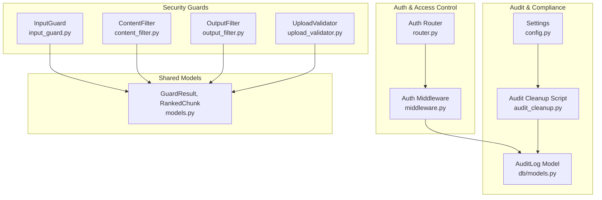
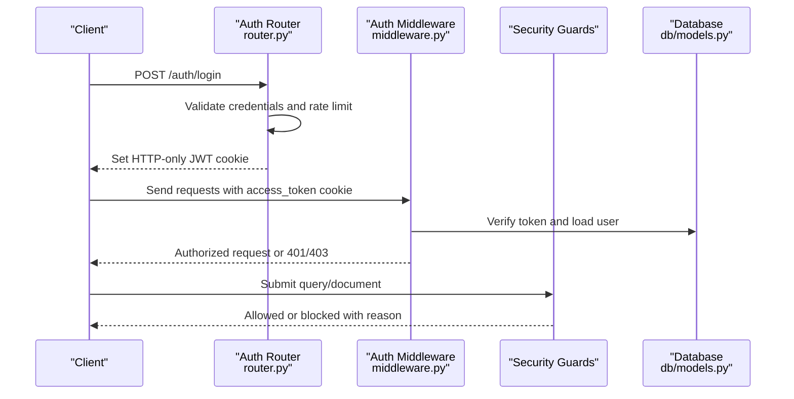
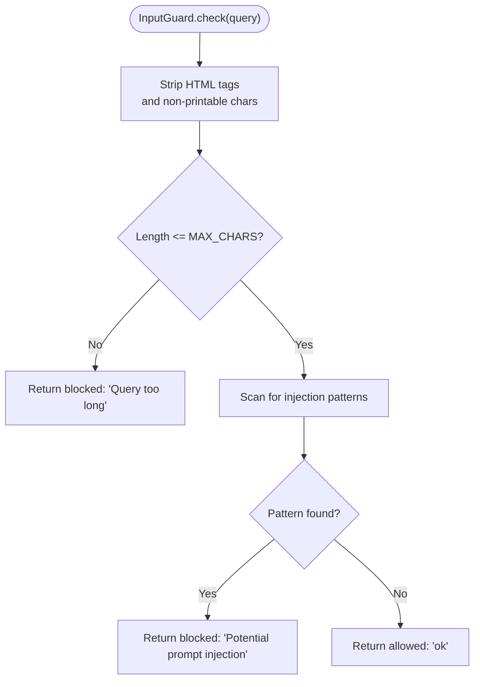
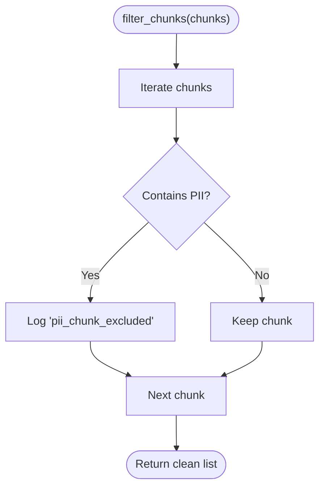
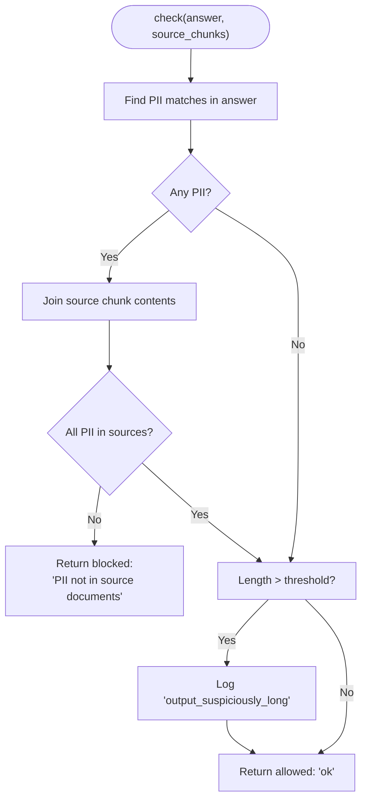
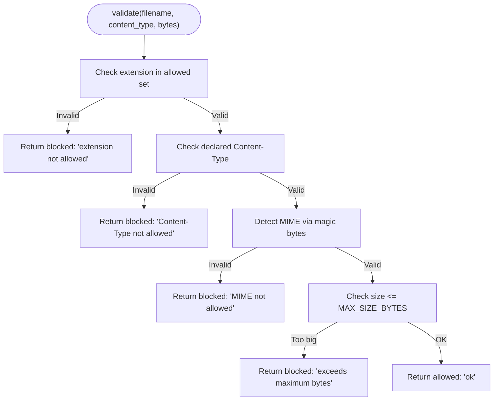
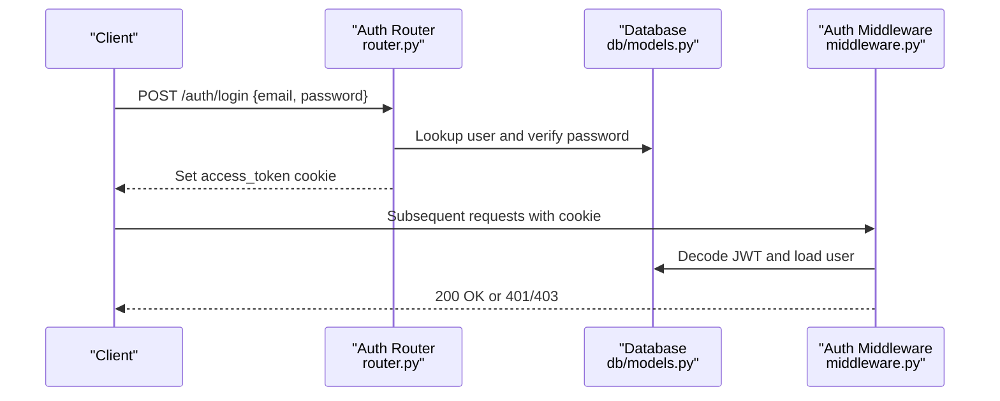
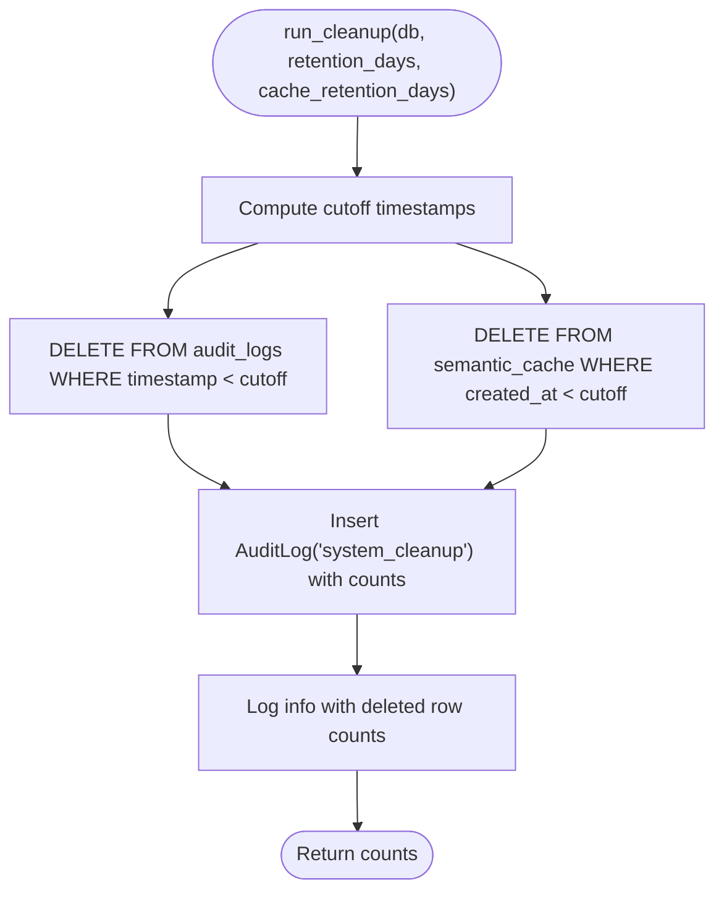
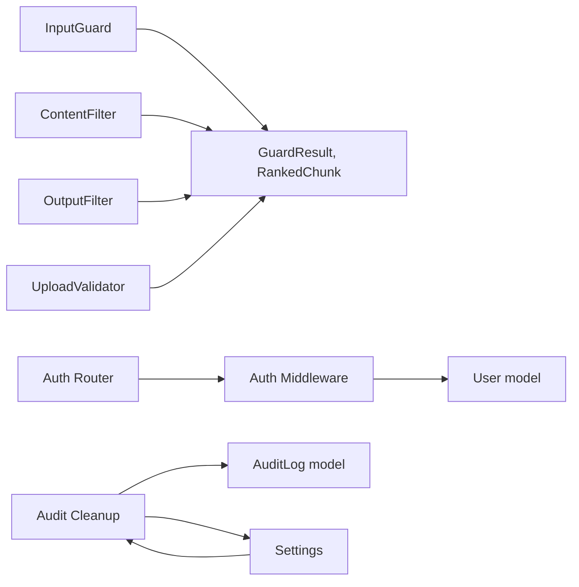

# Security and Compliance

<cite>
**Referenced Files in This Document**
- [input_guard.py](file://safe4ai-pilot/app/security/input_guard.py)
- [content_filter.py](file://safe4ai-pilot/app/security/content_filter.py)
- [output_filter.py](file://safe4ai-pilot/app/security/output_filter.py)
- [upload_validator.py](file://safe4ai-pilot/app/security/upload_validator.py)
- [models.py](file://safe4ai-pilot/app/models.py)
- [db/models.py](file://safe4ai-pilot/app/db/models.py)
- [config.py](file://safe4ai-pilot/app/config.py)
- [middleware.py](file://safe4ai-pilot/app/auth/middleware.py)
- [router.py](file://safe4ai-pilot/app/auth/router.py)
- [audit_cleanup.py](file://safe4ai-pilot/scripts/audit_cleanup.py)
- [test_security_guards.py](file://safe4ai-pilot/tests/test_security_guards.py)
- [test_audit_cleanup.py](file://safe4ai-pilot/tests/test_audit_cleanup.py)
</cite>

## Table of Contents
1. [Introduction](#introduction)
2. [Project Structure](#project-structure)
3. [Core Components](#core-components)
4. [Architecture Overview](#architecture-overview)
5. [Detailed Component Analysis](#detailed-component-analysis)
6. [Dependency Analysis](#dependency-analysis)
7. [Performance Considerations](#performance-considerations)
8. [Troubleshooting Guide](#troubleshooting-guide)
9. [Conclusion](#conclusion)
10. [Appendices](#appendices)

## Introduction
This document provides comprehensive security and compliance documentation for the Private AI system. It explains the multi-layered security architecture, including input validation, content filtering, output validation, and upload sanitization. It also documents the audit logging system that ensures complete traceability of user interactions and system operations, along with data privacy measures, access control mechanisms, and compliance considerations for handling sensitive information. Practical guidance is included for configuring security policies, implementing custom validation rules, and monitoring security events. Integration with authentication systems, session management, and authorization controls is covered, alongside threat modeling, vulnerability assessment, and incident response procedures.

## Project Structure
The security and compliance capabilities are implemented across several modules:
- Security guards: input validation, content filtering, output filtering, and upload validation
- Authentication and authorization: JWT-based authentication, password hashing, and role-based access control
- Audit logging and retention: structured audit logs, cleanup scheduling, and retention policies
- Data models: shared models for guards and database entities for audit and compliance

**Diagram sources**
- [input_guard.py:1-49](file://safe4ai-pilot/app/security/input_guard.py#L1-L49)
- [content_filter.py:1-63](file://safe4ai-pilot/app/security/content_filter.py#L1-L63)
- [output_filter.py:1-60](file://safe4ai-pilot/app/security/output_filter.py#L1-L60)
- [upload_validator.py:1-73](file://safe4ai-pilot/app/security/upload_validator.py#L1-L73)
- [middleware.py:1-83](file://safe4ai-pilot/app/auth/middleware.py#L1-L83)
- [router.py:1-125](file://safe4ai-pilot/app/auth/router.py#L1-L125)
- [db/models.py:111-124](file://safe4ai-pilot/app/db/models.py#L111-L124)
- [audit_cleanup.py:35-84](file://safe4ai-pilot/scripts/audit_cleanup.py#L35-L84)
- [config.py:5-28](file://safe4ai-pilot/app/config.py#L5-L28)
- [models.py:38-41](file://safe4ai-pilot/app/models.py#L38-L41)

**Section sources**
- [input_guard.py:1-49](file://safe4ai-pilot/app/security/input_guard.py#L1-L49)
- [content_filter.py:1-63](file://safe4ai-pilot/app/security/content_filter.py#L1-L63)
- [output_filter.py:1-60](file://safe4ai-pilot/app/security/output_filter.py#L1-L60)
- [upload_validator.py:1-73](file://safe4ai-pilot/app/security/upload_validator.py#L1-L73)
- [middleware.py:1-83](file://safe4ai-pilot/app/auth/middleware.py#L1-L83)
- [router.py:1-125](file://safe4ai-pilot/app/auth/router.py#L1-L125)
- [db/models.py:111-124](file://safe4ai-pilot/app/db/models.py#L111-L124)
- [audit_cleanup.py:35-84](file://safe4ai-pilot/scripts/audit_cleanup.py#L35-L84)
- [config.py:5-28](file://safe4ai-pilot/app/config.py#L5-L28)
- [models.py:38-41](file://safe4ai-pilot/app/models.py#L38-L41)

## Core Components
- InputGuard: Sanitizes and validates user queries to prevent prompt injection and enforce length limits.
- ContentFilter: Detects and removes PII-containing document chunks and blocks sections matching configured terms.
- OutputFilter: Validates LLM answers for PII hallucinations and suspicious length, ensuring outputs align with source documents.
- UploadValidator: Enforces allowed extensions, declared and detected MIME types, magic bytes, and file size limits.
- Authentication and Authorization: JWT-based login/logout, password hashing, brute-force protection, and role-based access control.
- Audit Logging and Retention: Structured audit logs with configurable retention, automated cleanup, and summary logging.

**Section sources**
- [input_guard.py:24-49](file://safe4ai-pilot/app/security/input_guard.py#L24-L49)
- [content_filter.py:24-63](file://safe4ai-pilot/app/security/content_filter.py#L24-L63)
- [output_filter.py:30-60](file://safe4ai-pilot/app/security/output_filter.py#L30-L60)
- [upload_validator.py:24-73](file://safe4ai-pilot/app/security/upload_validator.py#L24-L73)
- [middleware.py:25-83](file://safe4ai-pilot/app/auth/middleware.py#L25-L83)
- [router.py:39-125](file://safe4ai-pilot/app/auth/router.py#L39-L125)
- [db/models.py:111-124](file://safe4ai-pilot/app/db/models.py#L111-L124)
- [audit_cleanup.py:35-84](file://safe4ai-pilot/scripts/audit_cleanup.py#L35-L84)

## Architecture Overview
The system implements a layered defense-in-depth approach:
- Input Layer: InputGuard sanitizes queries and rejects injection attempts.
- Retrieval Layer: ContentFilter removes PII-containing chunks and blocks configured terms.
- Generation Layer: OutputFilter checks for hallucinated PII and suspicious lengths.
- Upload Layer: UploadValidator enforces strict file constraints.
- Access Control: Auth router and middleware manage authentication, sessions, and authorization.
- Observability: Audit logs capture actions, metadata, and system events; cleanup scripts maintain retention.

**Diagram sources**
- [router.py:39-105](file://safe4ai-pilot/app/auth/router.py#L39-L105)
- [middleware.py:51-71](file://safe4ai-pilot/app/auth/middleware.py#L51-L71)
- [input_guard.py:27-48](file://safe4ai-pilot/app/security/input_guard.py#L27-L48)
- [content_filter.py:28-58](file://safe4ai-pilot/app/security/content_filter.py#L28-L58)
- [output_filter.py:31-59](file://safe4ai-pilot/app/security/output_filter.py#L31-L59)
- [upload_validator.py:25-68](file://safe4ai-pilot/app/security/upload_validator.py#L25-L68)
- [db/models.py:45-56](file://safe4ai-pilot/app/db/models.py#L45-L56)

## Detailed Component Analysis

### Input Validation and Sanitization
InputGuard performs:
- HTML tag stripping and control character filtering
- Length enforcement
- Injection pattern detection (e.g., instructions to override behavior, special tokens)

**Diagram sources**
- [input_guard.py:27-48](file://safe4ai-pilot/app/security/input_guard.py#L27-L48)

**Section sources**
- [input_guard.py:24-49](file://safe4ai-pilot/app/security/input_guard.py#L24-L49)
- [test_security_guards.py:32-83](file://safe4ai-pilot/tests/test_security_guards.py#L32-L83)

### Content Filtering for PII and Blocked Terms
ContentFilter:
- Removes chunks containing PII patterns (SSN, credit cards, passport numbers)
- Blocks sections matching configured blocked terms
- Logs exclusions for auditability

**Diagram sources**
- [content_filter.py:28-40](file://safe4ai-pilot/app/security/content_filter.py#L28-L40)

**Section sources**
- [content_filter.py:24-63](file://safe4ai-pilot/app/security/content_filter.py#L24-L63)
- [test_security_guards.py:90-158](file://safe4ai-pilot/tests/test_security_guards.py#L90-L158)

### Output Validation and Hallucination Detection
OutputFilter:
- Detects PII in generated answers
- Blocks answers containing PII not present in source chunks
- Warns on suspiciously long outputs

**Diagram sources**
- [output_filter.py:31-59](file://safe4ai-pilot/app/security/output_filter.py#L31-L59)

**Section sources**
- [output_filter.py:30-60](file://safe4ai-pilot/app/security/output_filter.py#L30-L60)
- [test_security_guards.py:165-209](file://safe4ai-pilot/tests/test_security_guards.py#L165-L209)

### Upload Sanitization and Validation
UploadValidator:
- Validates file extension, declared Content-Type, detected MIME via magic bytes, and file size
- Generates safe filenames to avoid client-provided risks

**Diagram sources**
- [upload_validator.py:25-68](file://safe4ai-pilot/app/security/upload_validator.py#L25-L68)

**Section sources**
- [upload_validator.py:24-73](file://safe4ai-pilot/app/security/upload_validator.py#L24-L73)
- [test_security_guards.py:216-293](file://safe4ai-pilot/tests/test_security_guards.py#L216-L293)

### Authentication, Session Management, and Authorization
- Password hashing and verification using bcrypt
- JWT encoding/decoding with HS256 and expiry
- Cookie-based session management (HTTP-only, SameSite strict, optional secure)
- Role-based access control via dependency
- Brute-force protection with lockout thresholds and temporary locks
- Rate limiting on login endpoint

**Diagram sources**
- [router.py:39-105](file://safe4ai-pilot/app/auth/router.py#L39-L105)
- [middleware.py:51-71](file://safe4ai-pilot/app/auth/middleware.py#L51-L71)
- [db/models.py:45-56](file://safe4ai-pilot/app/db/models.py#L45-L56)

**Section sources**
- [router.py:39-125](file://safe4ai-pilot/app/auth/router.py#L39-L125)
- [middleware.py:25-83](file://safe4ai-pilot/app/auth/middleware.py#L25-L83)
- [db/models.py:45-56](file://safe4ai-pilot/app/db/models.py#L45-L56)

### Audit Logging and Retention
- AuditLog captures user actions, session context, query metadata, latency, model used, and trace identifiers
- Retention controlled by settings; cleanup script deletes old records and writes a summary audit event
- Scheduled cleanup runs daily at 02:00 UTC

**Diagram sources**
- [audit_cleanup.py:35-84](file://safe4ai-pilot/scripts/audit_cleanup.py#L35-L84)
- [db/models.py:111-124](file://safe4ai-pilot/app/db/models.py#L111-L124)

**Section sources**
- [db/models.py:111-124](file://safe4ai-pilot/app/db/models.py#L111-L124)
- [audit_cleanup.py:35-84](file://safe4ai-pilot/scripts/audit_cleanup.py#L35-L84)
- [test_audit_cleanup.py:20-57](file://safe4ai-pilot/tests/test_audit_cleanup.py#L20-L57)

## Dependency Analysis
Security guards depend on shared models for guard results and ranked chunks. Authentication depends on database models for user state and settings for runtime configuration. Audit cleanup depends on settings and database models for retention and deletion.

**Diagram sources**
- [input_guard.py:7](file://safe4ai-pilot/app/security/input_guard.py#L7)
- [content_filter.py:9](file://safe4ai-pilot/app/security/content_filter.py#L9)
- [output_filter.py:9](file://safe4ai-pilot/app/security/output_filter.py#L9)
- [upload_validator.py:10-11](file://safe4ai-pilot/app/security/upload_validator.py#L10-L11)
- [middleware.py:16-17](file://safe4ai-pilot/app/auth/middleware.py#L16-L17)
- [router.py:14-17](file://safe4ai-pilot/app/auth/router.py#L14-L17)
- [audit_cleanup.py:25-27](file://safe4ai-pilot/scripts/audit_cleanup.py#L25-L27)
- [db/models.py:111-124](file://safe4ai-pilot/app/db/models.py#L111-L124)
- [config.py:5-28](file://safe4ai-pilot/app/config.py#L5-L28)

**Section sources**
- [models.py:38-41](file://safe4ai-pilot/app/models.py#L38-L41)
- [db/models.py:45-56](file://safe4ai-pilot/app/db/models.py#L45-L56)
- [config.py:5-28](file://safe4ai-pilot/app/config.py#L5-L28)

## Performance Considerations
- Regex-based scanning for injection patterns and PII is linear in input size; keep patterns minimal and specific.
- OutputFilter joins source texts once per check; consider caching small source sets if repeated validations occur frequently.
- UploadValidator relies on magic library detection; ensure it is installed and tuned for production environments.
- Authentication uses bcrypt hashing and JWT decoding; tune secret key strength and token expiry for workload needs.
- Audit cleanup runs as a scheduled job; ensure database maintenance and indexing support efficient deletions and summaries.

[No sources needed since this section provides general guidance]

## Troubleshooting Guide
Common issues and resolutions:
- Authentication failures
  - Verify secret key correctness and token expiry alignment.
  - Confirm cookies are HTTP-only and SameSite strict; enable secure cookies in production.
  - Check brute-force lockout thresholds and temporary locks.
- Authorization errors
  - Ensure roles match expected values and role-check dependencies are applied to protected routes.
- Guard violations
  - Review reasons returned by GuardResult to adjust policies or user prompts.
  - For upload rejections, confirm file extension, declared Content-Type, and magic bytes match allowed sets.
- Audit retention problems
  - Validate retention settings and confirm scheduled cleanup executed at 02:00 UTC.
  - Inspect summary audit logs for deletion counts and errors.

**Section sources**
- [router.py:89-105](file://safe4ai-pilot/app/auth/router.py#L89-L105)
- [middleware.py:51-71](file://safe4ai-pilot/app/auth/middleware.py#L51-L71)
- [test_audit_cleanup.py:20-57](file://safe4ai-pilot/tests/test_audit_cleanup.py#L20-L57)

## Conclusion
The Private AI system employs a robust, multi-layered security architecture combining input sanitization, content filtering, output validation, and upload sanitization. Authentication and authorization controls are enforced via JWT and role-based access. Comprehensive audit logging with configurable retention and automated cleanup ensures traceability and compliance hygiene. Together, these measures form a strong foundation for protecting sensitive data and maintaining regulatory compliance.

[No sources needed since this section summarizes without analyzing specific files]

## Appendices

### Practical Configuration Examples
- Configure allowed origins and HTTPS enforcement
  - Adjust allowed origins list and enforce HTTPS based on deployment environment.
  - Reference: [config.py:21-22](file://safe4ai-pilot/app/config.py#L21-L22), [config.py:13](file://safe4ai-pilot/app/config.py#L13)
- Set audit log retention and cache retention
  - Tune retention days for audit logs and semantic cache entries.
  - Reference: [config.py:14](file://safe4ai-pilot/app/config.py#L14), [config.py:15](file://safe4ai-pilot/app/config.py#L15)
- Customize upload constraints
  - Modify allowed extensions, MIME types, and maximum upload size.
  - Reference: [upload_validator.py:13-21](file://safe4ai-pilot/app/security/upload_validator.py#L13-L21), [upload_validator.py:21](file://safe4ai-pilot/app/security/upload_validator.py#L21), [config.py:18](file://safe4ai-pilot/app/config.py#L18)
- Define blocked terms for content filtering
  - Pass a list of blocked terms to ContentFilter constructor.
  - Reference: [content_filter.py:25](file://safe4ai-pilot/app/security/content_filter.py#L25)
- Monitor security events
  - Review warnings and info logs for injection attempts, PII detections, long outputs, and cleanup summaries.
  - References: [input_guard.py:45-46](file://safe4ai-pilot/app/security/input_guard.py#L45-L46), [content_filter.py:33-37](file://safe4ai-pilot/app/security/content_filter.py#L33-L37), [output_filter.py:52-57](file://safe4ai-pilot/app/security/output_filter.py#L52-L57), [audit_cleanup.py:78-82](file://safe4ai-pilot/scripts/audit_cleanup.py#L78-L82)

### Threat Modeling and Vulnerability Assessment
- Prompt injection
  - Mitigated by InputGuard injection pattern detection and HTML/control character sanitization.
  - Reference: [input_guard.py:9-19](file://safe4ai-pilot/app/security/input_guard.py#L9-L19), [input_guard.py:35-37](file://safe4ai-pilot/app/security/input_guard.py#L35-L37)
- PII leakage
  - Prevented by ContentFilter PII removal and OutputFilter hallucination checks.
  - Reference: [content_filter.py:13-17](file://safe4ai-pilot/app/security/content_filter.py#L13-L17), [output_filter.py:42-49](file://safe4ai-pilot/app/security/output_filter.py#L42-L49)
- Malicious uploads
  - Controlled by UploadValidator extension/MIME/type checks and size limits.
  - Reference: [upload_validator.py:39-68](file://safe4ai-pilot/app/security/upload_validator.py#L39-L68)
- Unauthorized access
  - Protected by JWT authentication, role-based access control, and rate limiting.
  - Reference: [router.py:40-82](file://safe4ai-pilot/app/auth/router.py#L40-L82), [middleware.py:74-82](file://safe4ai-pilot/app/auth/middleware.py#L74-L82)

### Incident Response Procedures
- Immediate actions
  - Revoke compromised tokens, lock affected accounts, and review recent audit logs.
- Forensic analysis
  - Correlate timestamps, trace IDs, and user/session context from AuditLog entries.
- Remediation
  - Update guard rules, adjust retention, and harden configurations based on findings.
- Prevention
  - Schedule periodic audits, update regex patterns, and monitor security metrics.

[No sources needed since this section provides general guidance]