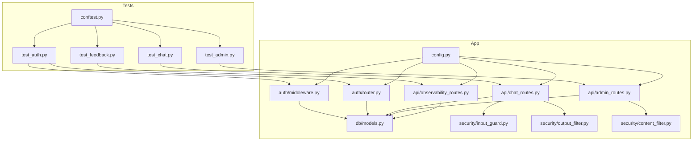
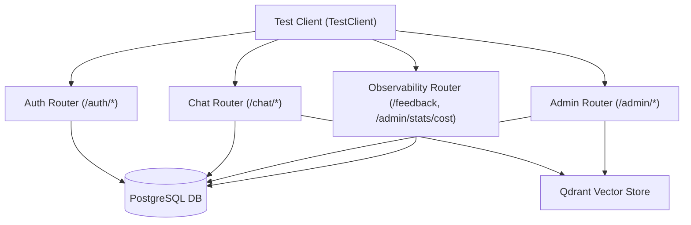
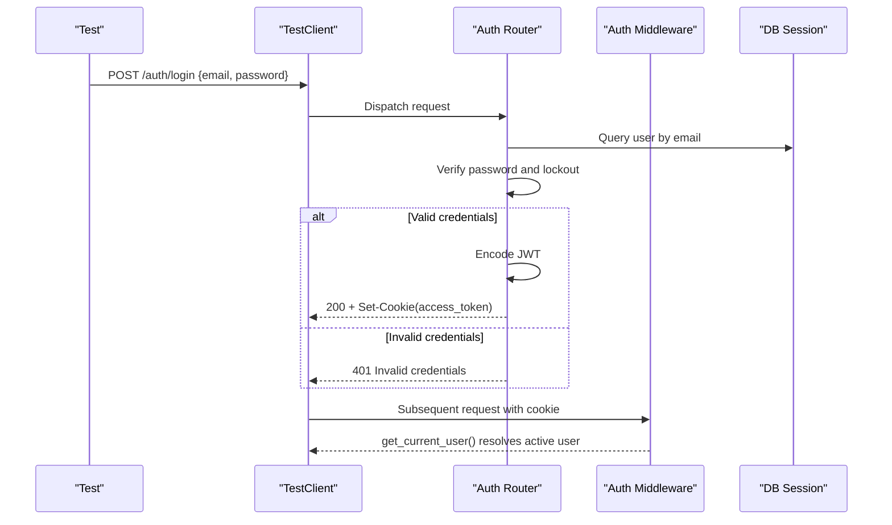
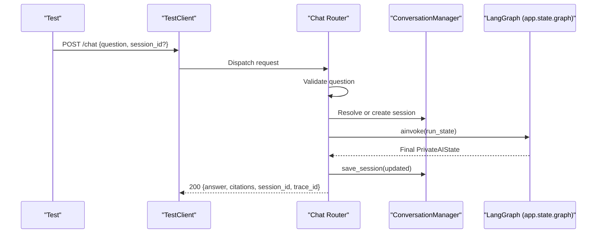
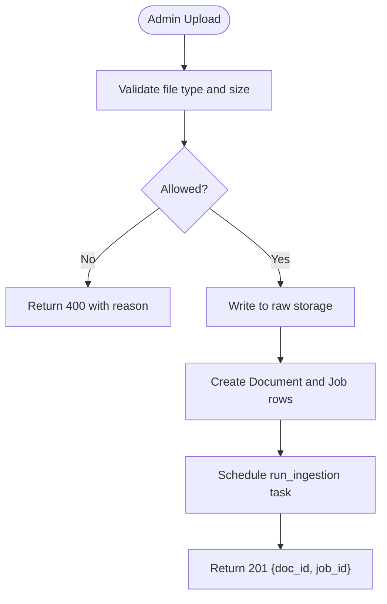
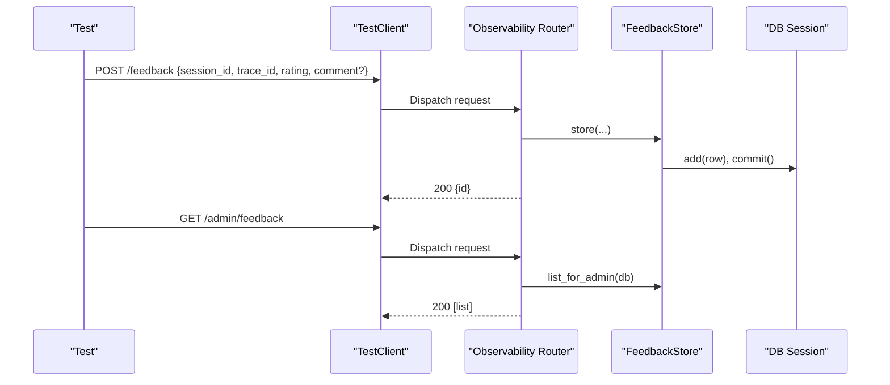
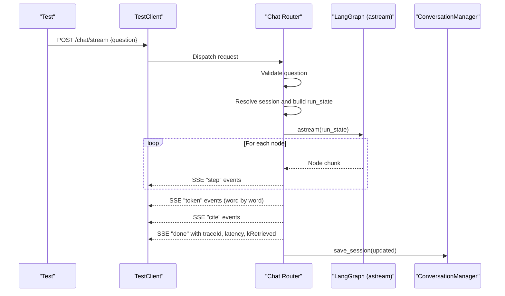
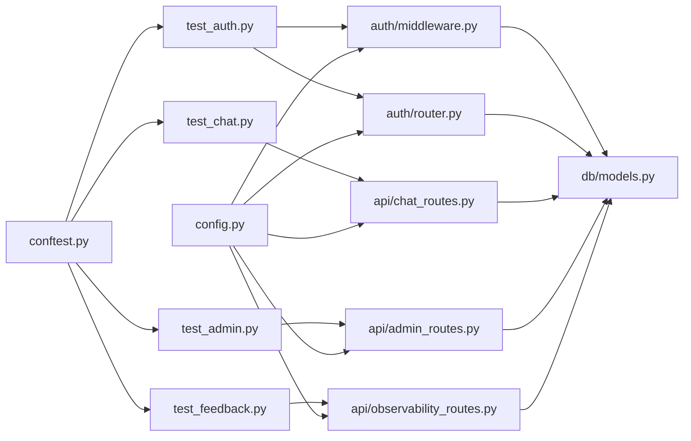

# API and End-to-End Testing

<cite>
**Referenced Files in This Document**
- [conftest.py](file://safe4ai-pilot/tests/conftest.py)
- [test_auth.py](file://safe4ai-pilot/tests/test_auth.py)
- [test_chat.py](file://safe4ai-pilot/tests/test_chat.py)
- [test_admin.py](file://safe4ai-pilot/tests/test_admin.py)
- [test_feedback.py](file://safe4ai-pilot/tests/test_feedback.py)
- [middleware.py](file://safe4ai-pilot/app/auth/middleware.py)
- [router.py](file://safe4ai-pilot/app/auth/router.py)
- [chat_routes.py](file://safe4ai-pilot/app/api/chat_routes.py)
- [admin_routes.py](file://safe4ai-pilot/app/api/admin_routes.py)
- [observability_routes.py](file://safe4ai-pilot/app/api/observability_routes.py)
- [models.py](file://safe4ai-pilot/app/db/models.py)
- [config.py](file://safe4ai-pilot/app/config.py)
- [input_guard.py](file://safe4ai-pilot/app/security/input_guard.py)
- [output_filter.py](file://safe4ai-pilot/app/security/output_filter.py)
- [content_filter.py](file://safe4ai-pilot/app/security/content_filter.py)
</cite>

## Table of Contents
1. [Introduction](#introduction)
2. [Project Structure](#project-structure)
3. [Core Components](#core-components)
4. [Architecture Overview](#architecture-overview)
5. [Detailed Component Analysis](#detailed-component-analysis)
6. [Dependency Analysis](#dependency-analysis)
7. [Performance Considerations](#performance-considerations)
8. [Troubleshooting Guide](#troubleshooting-guide)
9. [Conclusion](#conclusion)
10. [Appendices](#appendices)

## Introduction
This document provides comprehensive API and end-to-end testing guidance for the Private AI system. It covers authentication flows, chat interactions, administrative operations, and feedback mechanisms. It explains REST API testing approaches using pytest-httpx and FastAPI TestClient, details JWT token validation and session management, and outlines testing strategies for chat message processing, streaming responses, citations, and conversation persistence. Administrative testing includes user management, document oversight, and system monitoring. Feedback collection testing, audit trail validation, and real-time communication testing are also documented with practical examples and integration patterns.

## Project Structure
The testing suite resides under the safe4ai-pilot/tests directory and leverages FastAPI’s TestClient for unit-style tests against the live application routing. Authentication, chat, admin, and observability endpoints are implemented in separate routers and services. Security guards and filters protect inputs and outputs. Configuration and database models define environment settings and data schemas.

**Diagram sources**
- [conftest.py:1-88](file://safe4ai-pilot/tests/conftest.py#L1-L88)
- [test_auth.py:1-224](file://safe4ai-pilot/tests/test_auth.py#L1-L224)
- [test_chat.py:1-123](file://safe4ai-pilot/tests/test_chat.py#L1-L123)
- [test_admin.py:1-784](file://safe4ai-pilot/tests/test_admin.py#L1-L784)
- [test_feedback.py:1-122](file://safe4ai-pilot/tests/test_feedback.py#L1-L122)
- [middleware.py:1-83](file://safe4ai-pilot/app/auth/middleware.py#L1-L83)
- [router.py:1-125](file://safe4ai-pilot/app/auth/router.py#L1-L125)
- [chat_routes.py:1-251](file://safe4ai-pilot/app/api/chat_routes.py#L1-L251)
- [admin_routes.py:1-555](file://safe4ai-pilot/app/api/admin_routes.py#L1-L555)
- [observability_routes.py:1-57](file://safe4ai-pilot/app/api/observability_routes.py#L1-L57)
- [config.py:1-48](file://safe4ai-pilot/app/config.py#L1-L48)
- [models.py:1-182](file://safe4ai-pilot/app/db/models.py#L1-L182)
- [input_guard.py:1-49](file://safe4ai-pilot/app/security/input_guard.py#L1-L49)
- [output_filter.py:1-61](file://safe4ai-pilot/app/security/output_filter.py#L1-L61)
- [content_filter.py:1-64](file://safe4ai-pilot/app/security/content_filter.py#L1-L64)

**Section sources**
- [conftest.py:1-88](file://safe4ai-pilot/tests/conftest.py#L1-L88)
- [test_auth.py:1-224](file://safe4ai-pilot/tests/test_auth.py#L1-L224)
- [test_chat.py:1-123](file://safe4ai-pilot/tests/test_chat.py#L1-L123)
- [test_admin.py:1-784](file://safe4ai-pilot/tests/test_admin.py#L1-L784)
- [test_feedback.py:1-122](file://safe4ai-pilot/tests/test_feedback.py#L1-L122)

## Core Components
- Authentication and Authorization:
  - JWT encoding/decoding and role-based access control (RBAC) via middleware.
  - Login/logout endpoints with brute-force protection and cookie management.
- Chat:
  - Blocking POST /chat and streaming POST /chat/stream with SSE.
  - Conversation persistence and session resolution.
- Administration:
  - Document lifecycle (upload, list, status, delete, reindex).
  - User management (list, create, deactivate).
  - Audit logs and CSV export.
  - Human review queue (list, approve, reject).
  - Statistics aggregation and runtime hardening (trace_id generation, session size limits).
- Observability and Feedback:
  - Feedback submission and admin listing.
  - Cost statistics.

**Section sources**
- [middleware.py:1-83](file://safe4ai-pilot/app/auth/middleware.py#L1-L83)
- [router.py:1-125](file://safe4ai-pilot/app/auth/router.py#L1-L125)
- [chat_routes.py:1-251](file://safe4ai-pilot/app/api/chat_routes.py#L1-L251)
- [admin_routes.py:1-555](file://safe4ai-pilot/app/api/admin_routes.py#L1-L555)
- [observability_routes.py:1-57](file://safe4ai-pilot/app/api/observability_routes.py#L1-L57)

## Architecture Overview
The system exposes REST endpoints grouped by domain. Tests use FastAPI TestClient to send requests and assert responses. Authentication is cookie-based JWT. Chat endpoints integrate with a LangGraph pipeline and persist conversations. Admin endpoints enforce RBAC and coordinate ingestion jobs and vector deletions. Observability endpoints record feedback and compute costs.

**Diagram sources**
- [router.py:1-125](file://safe4ai-pilot/app/auth/router.py#L1-L125)
- [chat_routes.py:1-251](file://safe4ai-pilot/app/api/chat_routes.py#L1-L251)
- [admin_routes.py:1-555](file://safe4ai-pilot/app/api/admin_routes.py#L1-L555)
- [observability_routes.py:1-57](file://safe4ai-pilot/app/api/observability_routes.py#L1-L57)
- [models.py:1-182](file://safe4ai-pilot/app/db/models.py#L1-L182)

## Detailed Component Analysis

### Authentication and Authorization Testing
Key testing aspects:
- JWT encode/decode correctness and tampering detection.
- Login success with valid credentials and cookie presence.
- Login failure with wrong password and lockout behavior.
- Logout clears the access_token cookie.
- Role-based access control blocks unauthorized routes.
- Password policy enforcement at login and admin user creation.

Recommended test scenarios:
- Encode/decode roundtrip and PyJWT error on tamper.
- Successful login sets httponly cookie with correct attributes.
- Wrong password increments counters and returns 401.
- Locked account returns 429 during lock window.
- Admin-only route rejects non-admin tokens.
- Short passwords rejected at login and admin user creation.

**Diagram sources**
- [router.py:1-125](file://safe4ai-pilot/app/auth/router.py#L1-L125)
- [middleware.py:1-83](file://safe4ai-pilot/app/auth/middleware.py#L1-L83)
- [test_auth.py:1-224](file://safe4ai-pilot/tests/test_auth.py#L1-L224)

**Section sources**
- [test_auth.py:67-156](file://safe4ai-pilot/tests/test_auth.py#L67-L156)
- [test_auth.py:163-192](file://safe4ai-pilot/tests/test_auth.py#L163-L192)
- [test_auth.py:199-224](file://safe4ai-pilot/tests/test_auth.py#L199-L224)
- [router.py:39-125](file://safe4ai-pilot/app/auth/router.py#L39-L125)
- [middleware.py:51-83](file://safe4ai-pilot/app/auth/middleware.py#L51-L83)

### Chat Functionality Testing
Key testing aspects:
- POST /chat returns answer, session_id, citations, and trace_id.
- Empty or whitespace-only questions rejected with 422.
- Unauthenticated requests return 401.
- Graph readiness check returns 503 when pipeline is not initialized.
- Streaming endpoint emits step events, tokens, citations, and done with metadata.
- Conversation persistence after successful runs.

Recommended test scenarios:
- Authenticated request with valid question returns structured answer and citations.
- Empty question returns 422.
- No cookie returns 401.
- Missing graph returns 503.
- Stream endpoint emits step transitions and final token stream.
- Save assistant reply persists updated messages.

**Diagram sources**
- [chat_routes.py:115-149](file://safe4ai-pilot/app/api/chat_routes.py#L115-L149)
- [test_chat.py:75-98](file://safe4ai-pilot/tests/test_chat.py#L75-L98)

**Section sources**
- [test_chat.py:75-123](file://safe4ai-pilot/tests/test_chat.py#L75-L123)
- [chat_routes.py:115-251](file://safe4ai-pilot/app/api/chat_routes.py#L115-L251)

### Administrative Operations Testing
Key testing aspects:
- Document upload validates file type and size, writes to disk, creates DB records, and schedules ingestion.
- Document list and status endpoints return aggregated data.
- Delete removes filesystem, vector points, and DB rows; prevents deletion during ingestion.
- Reindex checks raw file existence and reschedules ingestion.
- User management enforces uniqueness, role, and password policies; disallows self-deactivation.
- Audit logs list and CSV export; stats aggregation.
- Review queue supports listing, approval, rejection, and idempotent operations.
- Runtime hardening: trace_id generation per invocation and session size limits.

Recommended test scenarios:
- Upload valid PDF returns 201 with doc_id and job_id.
- Upload invalid file returns 400 with reason.
- Non-admin upload returns 403.
- List documents returns paginated list with chunk counts.
- Get status returns ingestion state and latest job.
- Delete returns 204 and removes Qdrant points.
- Reindex returns 202 with job_id; missing raw returns 409.
- Create user returns 201; short password returns 422; duplicate email returns 409.
- Deactivate user returns 204; own account returns 400; unknown user returns 404.
- Export CSV returns 200 with CSV content-type.
- Approve/reject review items updates status and reviewer metadata.
- Stats endpoint returns aggregated metrics; non-admin returns 403.
- Trace_id generated before graph invocation; oversized session raises error.

**Diagram sources**
- [admin_routes.py:66-119](file://safe4ai-pilot/app/api/admin_routes.py#L66-L119)
- [test_admin.py:100-124](file://safe4ai-pilot/tests/test_admin.py#L100-L124)

**Section sources**
- [test_admin.py:100-158](file://safe4ai-pilot/tests/test_admin.py#L100-L158)
- [test_admin.py:165-215](file://safe4ai-pilot/tests/test_admin.py#L165-L215)
- [test_admin.py:222-322](file://safe4ai-pilot/tests/test_admin.py#L222-L322)
- [test_admin.py:329-431](file://safe4ai-pilot/tests/test_admin.py#L329-L431)
- [test_admin.py:438-467](file://safe4ai-pilot/tests/test_admin.py#L438-L467)
- [test_admin.py:474-548](file://safe4ai-pilot/tests/test_admin.py#L474-L548)
- [test_admin.py:646-726](file://safe4ai-pilot/tests/test_admin.py#L646-L726)
- [admin_routes.py:66-278](file://safe4ai-pilot/app/api/admin_routes.py#L66-L278)

### Feedback Collection and Audit Trail Testing
Key testing aspects:
- FeedbackStore stores ratings and optional comments, returns UUID.
- Admin listing returns ordered results with timestamps.
- Observability routes expose feedback submission and admin listing.
- Audit logs capture query actions with latency and trace_id.

Recommended test scenarios:
- Store positive feedback with comment; verify persisted fields and commit.
- Negative feedback without comment persists correctly.
- Unique IDs generated for multiple submissions.
- Admin listing returns expected shape and ordering.
- Export CSV endpoint returns CSV content-type and downloadable filename.

**Diagram sources**
- [observability_routes.py:26-46](file://safe4ai-pilot/app/api/observability_routes.py#L26-L46)
- [test_feedback.py:19-122](file://safe4ai-pilot/tests/test_feedback.py#L19-L122)

**Section sources**
- [test_feedback.py:19-122](file://safe4ai-pilot/tests/test_feedback.py#L19-L122)
- [observability_routes.py:26-57](file://safe4ai-pilot/app/api/observability_routes.py#L26-L57)

### Real-Time Communication Testing
Key testing aspects:
- Streaming endpoint emits step events, tokens, citations, and done with metadata.
- Frontmatter headers disable buffering for SSE.
- Errors propagate with traceId and early termination.

Recommended test scenarios:
- Stream endpoint emits step transitions and final token stream.
- Stream handles errors gracefully and emits done with error and traceId.
- After stream completes, assistant reply is saved.

**Diagram sources**
- [chat_routes.py:156-251](file://safe4ai-pilot/app/api/chat_routes.py#L156-L251)

**Section sources**
- [chat_routes.py:156-251](file://safe4ai-pilot/app/api/chat_routes.py#L156-L251)

## Dependency Analysis
- Test fixtures:
  - TestClient fixture initializes app and provides cookie-based auth for tests.
  - Mock Ollama transport simulates local LLM responses without external service calls.
  - Container fixtures for PostgreSQL and Qdrant enable integration tests requiring external systems.
- Application dependencies:
  - Auth middleware depends on settings.secret_key and DB session.
  - Chat routes depend on ConversationManager and LangGraph pipeline.
  - Admin routes depend on UploadValidator, QdrantClient, and ingestion service.
  - Observability routes depend on FeedbackStore and CostTracker.

**Diagram sources**
- [conftest.py:1-88](file://safe4ai-pilot/tests/conftest.py#L1-L88)
- [test_auth.py:1-224](file://safe4ai-pilot/tests/test_auth.py#L1-L224)
- [test_chat.py:1-123](file://safe4ai-pilot/tests/test_chat.py#L1-L123)
- [test_admin.py:1-784](file://safe4ai-pilot/tests/test_admin.py#L1-L784)
- [test_feedback.py:1-122](file://safe4ai-pilot/tests/test_feedback.py#L1-L122)
- [middleware.py:1-83](file://safe4ai-pilot/app/auth/middleware.py#L1-L83)
- [router.py:1-125](file://safe4ai-pilot/app/auth/router.py#L1-L125)
- [chat_routes.py:1-251](file://safe4ai-pilot/app/api/chat_routes.py#L1-L251)
- [admin_routes.py:1-555](file://safe4ai-pilot/app/api/admin_routes.py#L1-L555)
- [observability_routes.py:1-57](file://safe4ai-pilot/app/api/observability_routes.py#L1-L57)
- [config.py:1-48](file://safe4ai-pilot/app/config.py#L1-L48)
- [models.py:1-182](file://safe4ai-pilot/app/db/models.py#L1-L182)

**Section sources**
- [conftest.py:47-88](file://safe4ai-pilot/tests/conftest.py#L47-L88)
- [config.py:7-48](file://safe4ai-pilot/app/config.py#L7-L48)

## Performance Considerations
- Rate limiting:
  - Login and admin endpoints use SlowAPI limiter keyed by remote address.
  - Chat endpoints apply per-minute limits to prevent abuse.
- Upload size limits:
  - Admin upload enforces max upload size from settings.
- Streaming overhead:
  - SSE token emission introduces small delays; ensure client-side buffering is disabled.
- Session size limits:
  - Oversized session state raises an error to protect memory and persistence.

[No sources needed since this section provides general guidance]

## Troubleshooting Guide
Common issues and resolutions:
- Authentication failures:
  - Ensure access_token cookie is present and not expired.
  - Verify secret_key strength and HTTPS enforcement setting.
- Chat errors:
  - Empty questions return 422; confirm payload validation.
  - Missing graph returns 503; initialize app.state.graph before tests.
- Admin operations:
  - Deletion during ingestion returns 409; wait for job completion.
  - Reindex returns 409 when raw file missing; upload again.
  - Self-deactivation returns 400; avoid deactivating current user.
- Feedback and audit:
  - Export CSV returns 200 with CSV content-type; verify headers.
  - Admin-only endpoints return 403 for non-admin users.

**Section sources**
- [router.py:39-125](file://safe4ai-pilot/app/auth/router.py#L39-L125)
- [chat_routes.py:115-149](file://safe4ai-pilot/app/api/chat_routes.py#L115-L149)
- [admin_routes.py:183-228](file://safe4ai-pilot/app/api/admin_routes.py#L183-L228)
- [admin_routes.py:230-262](file://safe4ai-pilot/app/api/admin_routes.py#L230-L262)
- [observability_routes.py:26-57](file://safe4ai-pilot/app/api/observability_routes.py#L26-L57)

## Conclusion
The Private AI system provides robust REST APIs for authentication, chat, administration, and observability. The test suite demonstrates effective use of FastAPI TestClient and pytest-httpx for unit and integration testing. Authentication relies on signed JWT cookies with RBAC, chat endpoints support both blocking and streaming responses, admin operations enforce strict permissions and safeguards, and feedback and audit trails are fully testable. The included fixtures and patterns enable scalable and maintainable API testing across the system.

[No sources needed since this section summarizes without analyzing specific files]

## Appendices

### Practical Testing Patterns
- Using TestClient:
  - Override dependencies (DB, graph) with mocks to isolate units.
  - Set cookies for authenticated requests.
  - Assert status codes, headers, and JSON payloads.
- Using pytest-httpx:
  - Replace external HTTP calls (e.g., Ollama) with a mock transport to avoid flakiness.
  - Validate request bodies and response shapes without network overhead.
- Integration testing:
  - Provision containers for PostgreSQL and Qdrant using testcontainers.
  - Run end-to-end flows that exercise ingestion, retrieval, and chat pipelines.

**Section sources**
- [conftest.py:47-88](file://safe4ai-pilot/tests/conftest.py#L47-L88)
- [test_chat.py:61-73](file://safe4ai-pilot/tests/test_chat.py#L61-L73)
- [test_admin.py:100-124](file://safe4ai-pilot/tests/test_admin.py#L100-L124)