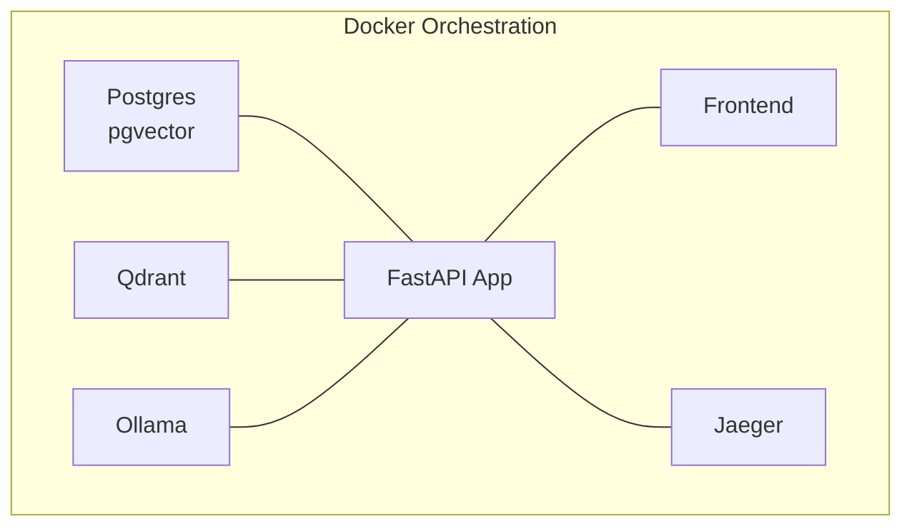
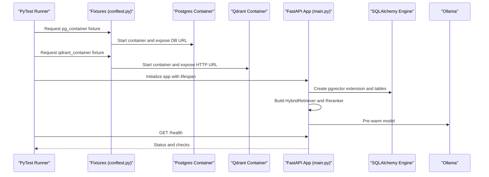
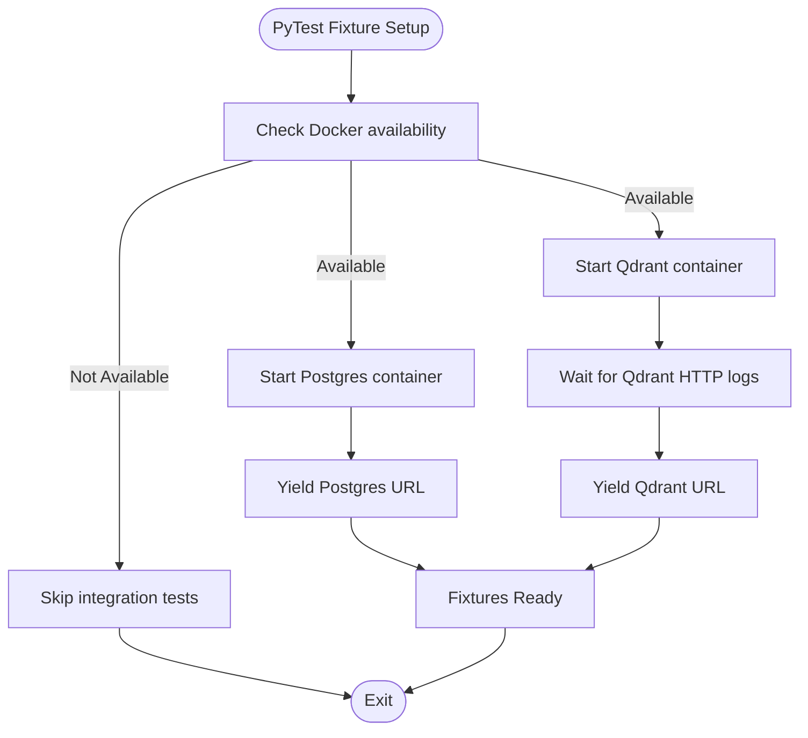
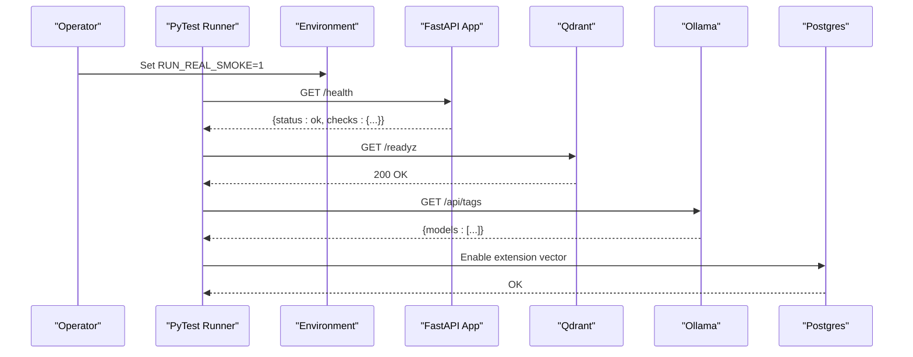
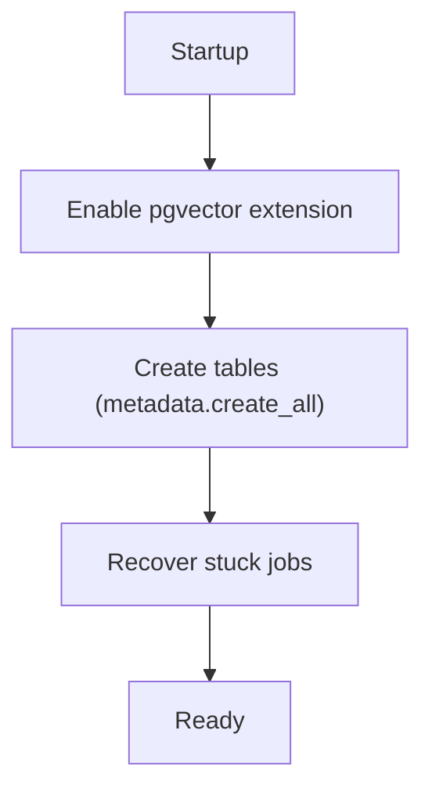
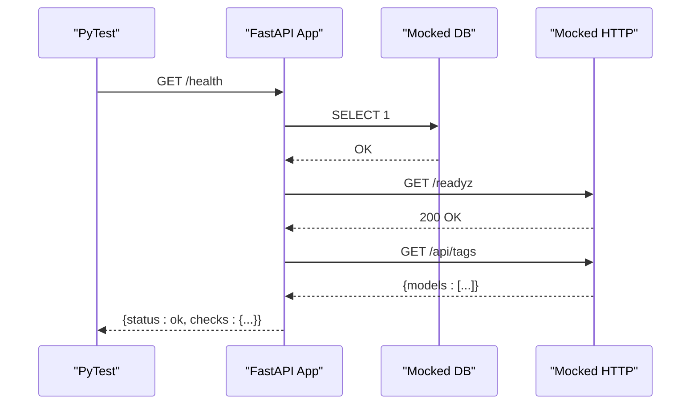
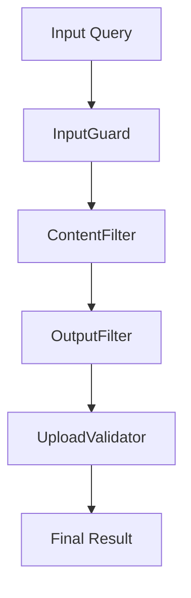
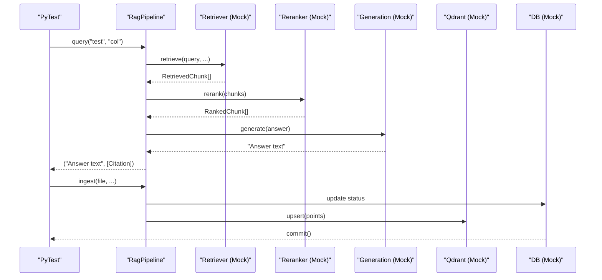
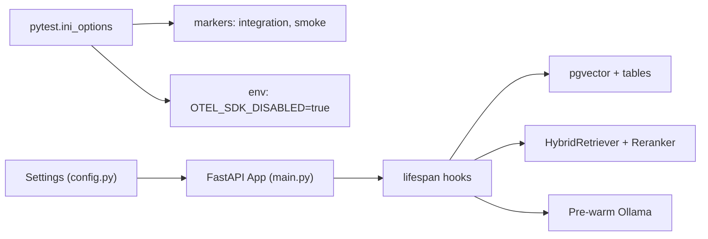

# Integration Testing

<cite>
**Referenced Files in This Document**
- [conftest.py](file://safe4ai-pilot/tests/conftest.py)
- [docker-compose.yml](file://safe4ai-pilot/docker-compose.yml)
- [docker-compose.override.yml](file://safe4ai-pilot/docker-compose.override.yml)
- [pyproject.toml](file://safe4ai-pilot/pyproject.toml)
- [test_integration_containers.py](file://safe4ai-pilot/tests/test_integration_containers.py)
- [test_real_services_smoke.py](file://safe4ai-pilot/tests/test_real_services_smoke.py)
- [test_health.py](file://safe4ai-pilot/tests/test_health.py)
- [test_startup_schema.py](file://safe4ai-pilot/tests/test_startup_schema.py)
- [test_security_guards.py](file://safe4ai-pilot/tests/test_security_guards.py)
- [test_rag_pipeline.py](file://safe4ai-pilot/tests/test_rag_pipeline.py)
- [main.py](file://safe4ai-pilot/app/main.py)
- [config.py](file://safe4ai-pilot/app/config.py)
</cite>

## Table of Contents
1. [Introduction](#introduction)
2. [Project Structure](#project-structure)
3. [Core Components](#core-components)
4. [Architecture Overview](#architecture-overview)
5. [Detailed Component Analysis](#detailed-component-analysis)
6. [Dependency Analysis](#dependency-analysis)
7. [Performance Considerations](#performance-considerations)
8. [Troubleshooting Guide](#troubleshooting-guide)
9. [Conclusion](#conclusion)
10. [Appendices](#appendices)

## Introduction
This document provides comprehensive integration testing guidance for the Private AI system. It focuses on container orchestration, service startup validation, and end-to-end component testing. The system uses Docker Compose to provision dependent services (PostgreSQL with pgvector, Qdrant, Ollama, Jaeger), and FastAPI for the application server. Integration tests leverage PyTest fixtures to manage Docker-based databases and vector stores, and also support smoke tests against real running services.

## Project Structure
The integration testing setup centers around:
- Docker Compose services for Postgres (pgvector), Qdrant, Ollama, Jaeger, the FastAPI app, and the frontend.
- PyTest fixtures that spin up real Postgres and Qdrant containers for integration tests.
- Smoke tests that validate real services when orchestrated via Docker Compose.
- Application lifecycle hooks that initialize the database schema and pre-warm external services.

**Diagram sources**
- [docker-compose.yml:1-119](file://safe4ai-pilot/docker-compose.yml#L1-L119)

**Section sources**
- [docker-compose.yml:1-119](file://safe4ai-pilot/docker-compose.yml#L1-L119)
- [docker-compose.override.yml:1-11](file://safe4ai-pilot/docker-compose.override.yml#L1-L11)

## Core Components
- Test fixtures for Postgres and Qdrant containers using Testcontainers.
- Mock transport for Ollama to avoid real model pulls during unit-style tests.
- PyTest markers for integration and smoke tests.
- Health endpoint and startup schema validations.
- Security guard and RAG pipeline tests that exercise multi-service coordination.

Key integration test files and their roles:
- [conftest.py](file://safe4ai-pilot/tests/conftest.py): Defines Docker-based fixtures and a mock Ollama transport.
- [test_integration_containers.py](file://safe4ai-pilot/tests/test_integration_containers.py): Validates Postgres pgvector extension and Qdrant readiness.
- [test_real_services_smoke.py](file://safe4ai-pilot/tests/test_real_services_smoke.py): Smoke tests against real running services after Docker Compose.
- [test_health.py](file://safe4ai-pilot/tests/test_health.py): Unit-style health checks with mocks for DB, Qdrant, and Ollama.
- [test_startup_schema.py](file://safe4ai-pilot/tests/test_startup_schema.py): Startup order assertions for schema creation and job recovery.
- [test_security_guards.py](file://safe4ai-pilot/tests/test_security_guards.py): Security guard tests exercising input, content, output, and upload validators.
- [test_rag_pipeline.py](file://safe4ai-pilot/tests/test_rag_pipeline.py): RAG pipeline tests with mocked retriever/reranker and Ollama/Qdrant interactions.

**Section sources**
- [conftest.py:1-88](file://safe4ai-pilot/tests/conftest.py#L1-L88)
- [test_integration_containers.py:1-28](file://safe4ai-pilot/tests/test_integration_containers.py#L1-L28)
- [test_real_services_smoke.py:1-62](file://safe4ai-pilot/tests/test_real_services_smoke.py#L1-L62)
- [test_health.py:1-85](file://safe4ai-pilot/tests/test_health.py#L1-L85)
- [test_startup_schema.py:1-23](file://safe4ai-pilot/tests/test_startup_schema.py#L1-L23)
- [test_security_guards.py:1-305](file://safe4ai-pilot/tests/test_security_guards.py#L1-L305)
- [test_rag_pipeline.py:1-264](file://safe4ai-pilot/tests/test_rag_pipeline.py#L1-L264)

## Architecture Overview
The integration test architecture ties together:
- PyTest fixtures that bring up Postgres and Qdrant containers.
- Application startup that initializes pgvector, creates tables, builds the LangGraph, and pre-warms Ollama.
- Health checks that probe Postgres, Qdrant, and Ollama.
- Smoke tests that validate the running stack after Docker Compose.

**Diagram sources**
- [conftest.py:64-88](file://safe4ai-pilot/tests/conftest.py#L64-L88)
- [main.py:28-61](file://safe4ai-pilot/app/main.py#L28-L61)
- [main.py:118-147](file://safe4ai-pilot/app/main.py#L118-L147)

## Detailed Component Analysis

### Test Fixtures and Environment Setup
- Docker availability check and container fixtures:
  - Postgres fixture yields a connection URL for SQLAlchemy.
  - Qdrant fixture waits for the HTTP service to be ready and yields a base URL.
- Mock Ollama transport:
  - Provides canned responses for generate, embeddings, and tags endpoints to avoid pulling models during tests.

**Diagram sources**
- [conftest.py:10-18](file://safe4ai-pilot/tests/conftest.py#L10-L18)
- [conftest.py:64-88](file://safe4ai-pilot/tests/conftest.py#L64-L88)

**Section sources**
- [conftest.py:10-18](file://safe4ai-pilot/tests/conftest.py#L10-L18)
- [conftest.py:64-88](file://safe4ai-pilot/tests/conftest.py#L64-L88)

### Smoke Testing Against Real Services
- Real-service smoke tests require setting an environment variable to confirm Docker Compose is running.
- Tests validate:
  - FastAPI health endpoint returns success.
  - Qdrant ready endpoint responds.
  - Ollama tags endpoint lists configured models.
  - Postgres has the pgvector extension enabled.

**Diagram sources**
- [test_real_services_smoke.py:12-62](file://safe4ai-pilot/tests/test_real_services_smoke.py#L12-L62)

**Section sources**
- [test_real_services_smoke.py:12-62](file://safe4ai-pilot/tests/test_real_services_smoke.py#L12-L62)

### Startup Schema Validation
- Ensures the application initializes the pgvector extension before creating tables.
- Confirms schema creation precedes recovery of stuck jobs.

**Diagram sources**
- [test_startup_schema.py:7-23](file://safe4ai-pilot/tests/test_startup_schema.py#L7-L23)
- [main.py:35-40](file://safe4ai-pilot/app/main.py#L35-L40)

**Section sources**
- [test_startup_schema.py:7-23](file://safe4ai-pilot/tests/test_startup_schema.py#L7-L23)
- [main.py:35-40](file://safe4ai-pilot/app/main.py#L35-L40)

### Health Endpoint and Mocked Dependencies
- Health endpoint probes Postgres, Qdrant, and Ollama.
- Tests mock external dependencies to validate the health route and prompt registry.

**Diagram sources**
- [main.py:118-147](file://safe4ai-pilot/app/main.py#L118-L147)
- [test_health.py:23-41](file://safe4ai-pilot/tests/test_health.py#L23-L41)

**Section sources**
- [main.py:118-147](file://safe4ai-pilot/app/main.py#L118-L147)
- [test_health.py:23-41](file://safe4ai-pilot/tests/test_health.py#L23-L41)

### Security Guards Integration
- Tests validate input guard behavior, content filter PII detection, output filter logic, and upload validator constraints.
- These tests exercise multi-service coordination by validating data flow through security layers.

**Diagram sources**
- [test_security_guards.py:32-305](file://safe4ai-pilot/tests/test_security_guards.py#L32-L305)

**Section sources**
- [test_security_guards.py:32-305](file://safe4ai-pilot/tests/test_security_guards.py#L32-L305)

### RAG Pipeline Integration
- Tests simulate retrieval, reranking, generation, ingestion, and OCR flows.
- Uses mocks for Qdrant, Ollama, and database operations while asserting expected interactions and outcomes.

**Diagram sources**
- [test_rag_pipeline.py:48-156](file://safe4ai-pilot/tests/test_rag_pipeline.py#L48-L156)
- [test_rag_pipeline.py:158-264](file://safe4ai-pilot/tests/test_rag_pipeline.py#L158-L264)

**Section sources**
- [test_rag_pipeline.py:48-156](file://safe4ai-pilot/tests/test_rag_pipeline.py#L48-L156)
- [test_rag_pipeline.py:158-264](file://safe4ai-pilot/tests/test_rag_pipeline.py#L158-L264)

## Dependency Analysis
- PyTest configuration defines markers for integration and smoke tests and sets environment defaults.
- Application configuration loads environment variables for service URLs and validates critical settings.
- Application lifespan manages database initialization, graph building, and pre-warming of Ollama.

**Diagram sources**
- [pyproject.toml:84-97](file://safe4ai-pilot/pyproject.toml#L84-L97)
- [config.py:7-48](file://safe4ai-pilot/app/config.py#L7-L48)
- [main.py:28-61](file://safe4ai-pilot/app/main.py#L28-L61)

**Section sources**
- [pyproject.toml:84-97](file://safe4ai-pilot/pyproject.toml#L84-L97)
- [config.py:7-48](file://safe4ai-pilot/app/config.py#L7-L48)
- [main.py:28-61](file://safe4ai-pilot/app/main.py#L28-L61)

## Performance Considerations
- Prefer mocking external services (Qdrant, Ollama) in unit-style tests to reduce flakiness and speed up runs.
- Use Docker-based fixtures only for integration tests that require real containers.
- Keep smoke tests minimal and targeted to prevent long-running suites.
- Ensure pre-warming of Ollama avoids cold-start latency during initial queries.

## Troubleshooting Guide
Common issues and resolutions:
- Docker not available:
  - Symptom: Integration tests skip with a Docker availability message.
  - Resolution: Install and start Docker; ensure the current user can access the daemon.
- Postgres container fails health check:
  - Symptom: Tests fail to connect or enable pgvector.
  - Resolution: Verify Postgres credentials and port mapping; confirm pgvector image compatibility.
- Qdrant container not reachable:
  - Symptom: Socket connection fails in integration tests.
  - Resolution: Confirm exposed ports and network settings; ensure logs indicate HTTP service is listening.
- Real smoke tests failing:
  - Symptom: Health checks or model tags endpoints fail.
  - Resolution: Set the smoke flag environment variable and ensure Docker Compose is running; verify service dependencies are healthy.
- Application startup errors:
  - Symptom: Schema creation or job recovery failures.
  - Resolution: Check database connectivity and pgvector extension presence; review application logs for exceptions.

**Section sources**
- [conftest.py:10-18](file://safe4ai-pilot/tests/conftest.py#L10-L18)
- [test_integration_containers.py:21-28](file://safe4ai-pilot/tests/test_integration_containers.py#L21-L28)
- [test_real_services_smoke.py:12-17](file://safe4ai-pilot/tests/test_real_services_smoke.py#L12-L17)
- [main.py:35-40](file://safe4ai-pilot/app/main.py#L35-L40)

## Conclusion
The Private AI system’s integration testing framework combines Docker-based fixtures, real-service smoke tests, and focused unit-style tests to validate container orchestration, service startup, and end-to-end workflows. By leveraging PyTest markers, environment configuration, and application lifecycle hooks, teams can reliably test multi-service coordination across the database, vector store, and external LLM services.

## Appendices

### Practical Examples and Best Practices
- Writing integration tests with Docker fixtures:
  - Use the Postgres and Qdrant fixtures to validate schema creation and service readiness.
  - Example reference: [test_integration_containers.py:9-18](file://safe4ai-pilot/tests/test_integration_containers.py#L9-L18), [test_integration_containers.py:21-28](file://safe4ai-pilot/tests/test_integration_containers.py#L21-L28)
- Managing test environments:
  - Configure environment variables for service URLs and feature flags.
  - Example reference: [config.py:7-21](file://safe4ai-pilot/app/config.py#L7-L21)
- Handling service dependencies:
  - Use Docker Compose to orchestrate dependent services and health checks.
  - Example reference: [docker-compose.yml:12-16](file://safe4ai-pilot/docker-compose.yml#L12-L16), [docker-compose.yml:25-29](file://safe4ai-pilot/docker-compose.yml#L25-L29), [docker-compose.yml:39-44](file://safe4ai-pilot/docker-compose.yml#L39-L44), [docker-compose.yml:98-103](file://safe4ai-pilot/docker-compose.yml#L98-L103)
- Agent pipeline and retrieval coordination:
  - Mock external services and assert interactions in the RAG pipeline.
  - Example reference: [test_rag_pipeline.py:48-77](file://safe4ai-pilot/tests/test_rag_pipeline.py#L48-L77), [test_rag_pipeline.py:158-233](file://safe4ai-pilot/tests/test_rag_pipeline.py#L158-L233)
- Security guard integration:
  - Validate input, content, output, and upload guards in isolation and together.
  - Example reference: [test_security_guards.py:32-83](file://safe4ai-pilot/tests/test_security_guards.py#L32-L83), [test_security_guards.py:90-158](file://safe4ai-pilot/tests/test_security_guards.py#L90-L158), [test_security_guards.py:165-210](file://safe4ai-pilot/tests/test_security_guards.py#L165-L210), [test_security_guards.py:216-293](file://safe4ai-pilot/tests/test_security_guards.py#L216-L293)