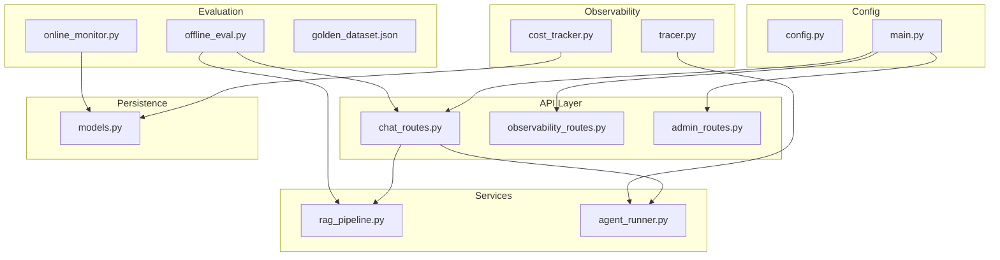
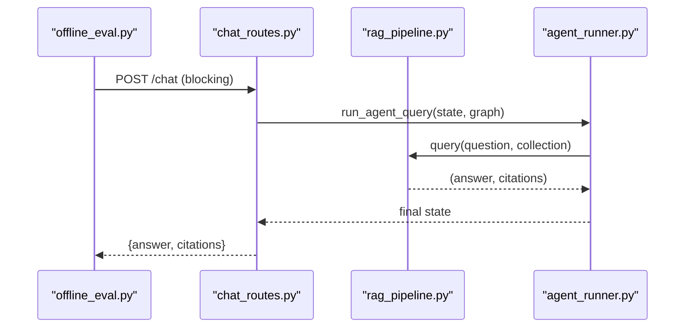
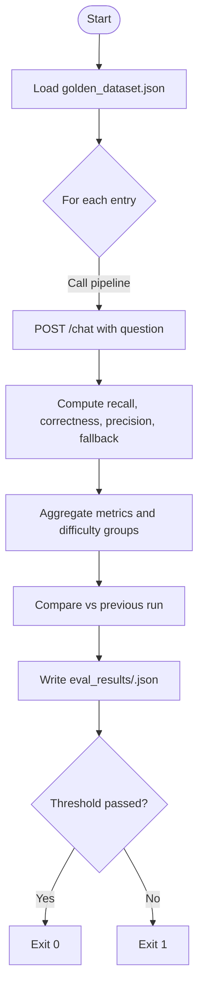
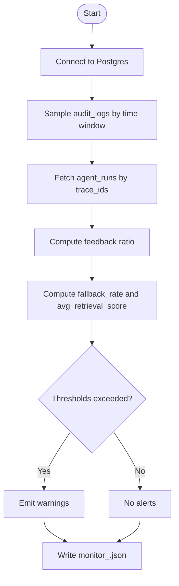
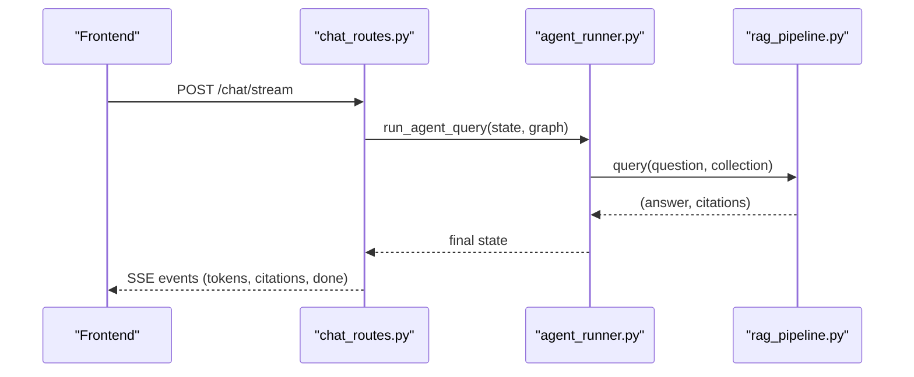
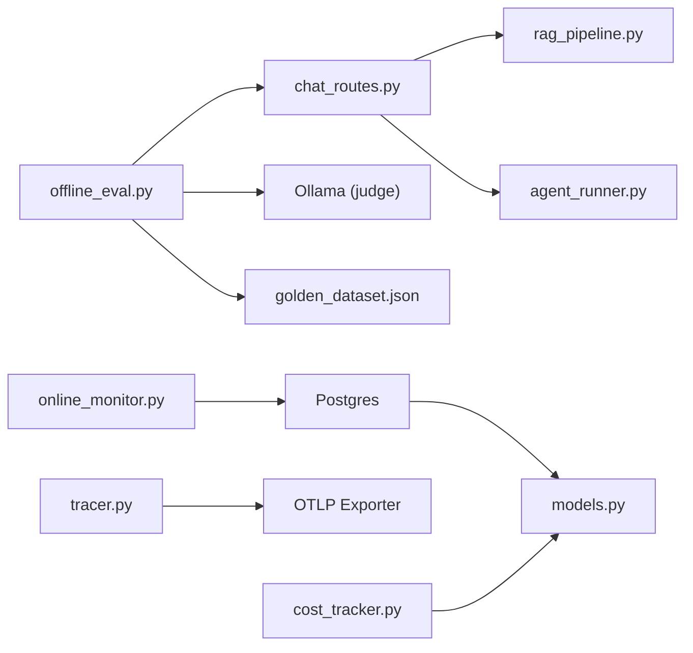

# Performance Evaluation

<cite>
**Referenced Files in This Document**
- [offline_eval.py](file://safe4ai-pilot/evaluation/offline_eval.py)
- [online_monitor.py](file://safe4ai-pilot/evaluation/online_monitor.py)
- [golden_dataset.json](file://safe4ai-pilot/evaluation/golden_dataset.json)
- [tracer.py](file://safe4ai-pilot/observability/tracer.py)
- [cost_tracker.py](file://safe4ai-pilot/observability/cost_tracker.py)
- [admin_routes.py](file://safe4ai-pilot/app/api/admin_routes.py)
- [observability_routes.py](file://safe4ai-pilot/app/api/observability_routes.py)
- [rag_pipeline.py](file://safe4ai-pilot/app/services/rag_pipeline.py)
- [agent_runner.py](file://safe4ai-pilot/app/services/agent_runner.py)
- [chat_routes.py](file://safe4ai-pilot/app/api/chat_routes.py)
- [models.py](file://safe4ai-pilot/app/db/models.py)
- [config.py](file://safe4ai-pilot/app/config.py)
- [main.py](file://safe4ai-pilot/app/main.py)
</cite>

## Table of Contents
1. [Introduction](#introduction)
2. [Project Structure](#project-structure)
3. [Core Components](#core-components)
4. [Architecture Overview](#architecture-overview)
5. [Detailed Component Analysis](#detailed-component-analysis)
6. [Dependency Analysis](#dependency-analysis)
7. [Performance Considerations](#performance-considerations)
8. [Troubleshooting Guide](#troubleshooting-guide)
9. [Conclusion](#conclusion)
10. [Appendices](#appendices)

## Introduction
This document provides a comprehensive performance evaluation guide for the Private AI system. It covers:
- Offline evaluation using a golden dataset to compute retrieval accuracy, answer correctness, citation precision, and fallback behavior.
- Online monitoring of production performance using sampled audit logs, agent runs, and user feedback.
- Observability primitives for latency, cost tracking, and tracing across pipeline stages.
- Practical guidance for running evaluation scripts, interpreting results, and setting up monitoring dashboards.
- Strategies for performance optimization, bottleneck identification, and capacity planning.

## Project Structure
The performance evaluation and monitoring capabilities are implemented across evaluation scripts, observability modules, API routes, and service layers. The following diagram shows the high-level layout of relevant components.



**Diagram sources**
- [offline_eval.py](file://safe4ai-pilot/evaluation/offline_eval.py)
- [online_monitor.py](file://safe4ai-pilot/evaluation/online_monitor.py)
- [golden_dataset.json](file://safe4ai-pilot/evaluation/golden_dataset.json)
- [tracer.py](file://safe4ai-pilot/observability/tracer.py)
- [cost_tracker.py](file://safe4ai-pilot/observability/cost_tracker.py)
- [chat_routes.py](file://safe4ai-pilot/app/api/chat_routes.py)
- [observability_routes.py](file://safe4ai-pilot/app/api/observability_routes.py)
- [admin_routes.py](file://safe4ai-pilot/app/api/admin_routes.py)
- [rag_pipeline.py](file://safe4ai-pilot/app/services/rag_pipeline.py)
- [agent_runner.py](file://safe4ai-pilot/app/services/agent_runner.py)
- [models.py](file://safe4ai-pilot/app/db/models.py)
- [config.py](file://safe4ai-pilot/app/config.py)
- [main.py](file://safe4ai-pilot/app/main.py)

**Section sources**
- [offline_eval.py](file://safe4ai-pilot/evaluation/offline_eval.py)
- [online_monitor.py](file://safe4ai-pilot/evaluation/online_monitor.py)
- [chat_routes.py](file://safe4ai-pilot/app/api/chat_routes.py)
- [main.py](file://safe4ai-pilot/app/main.py)

## Core Components
- Offline evaluation framework:
  - Loads a golden dataset and executes the live RAG pipeline for each question.
  - Computes retrieval recall, answer correctness (LLM-as-judge), citation precision, and fallback accuracy.
  - Aggregates scores by difficulty and overall, writes results to disk, and exits non-zero if the overall score falls below a threshold.
- Online monitoring:
  - Samples recent audit logs and correlates with agent runs to compute fallback rate, average retrieval score, and user feedback ratio.
  - Emits warnings when thresholds are exceeded and writes daily summaries to disk.
- Observability:
  - Tracing spans across pipeline stages for latency breakdowns.
  - Cost tracking aggregates token usage and compute costs.
  - Feedback store persists user ratings for sentiment analysis.

**Section sources**
- [offline_eval.py](file://safe4ai-pilot/evaluation/offline_eval.py)
- [online_monitor.py](file://safe4ai-pilot/evaluation/online_monitor.py)
- [tracer.py](file://safe4ai-pilot/observability/tracer.py)
- [cost_tracker.py](file://safe4ai-pilot/observability/cost_tracker.py)

## Architecture Overview
The offline evaluation and online monitoring integrate with the production API and services to measure and track performance.



**Diagram sources**
- [offline_eval.py](file://safe4ai-pilot/evaluation/offline_eval.py)
- [chat_routes.py](file://safe4ai-pilot/app/api/chat_routes.py)
- [rag_pipeline.py](file://safe4ai-pilot/app/services/rag_pipeline.py)
- [agent_runner.py](file://safe4ai-pilot/app/services/agent_runner.py)

## Detailed Component Analysis

### Offline Evaluation Framework
- Dataset loading and scoring:
  - Loads the golden dataset and iterates each entry.
  - Invokes the live pipeline via the blocking chat endpoint.
  - Computes:
    - Retrieval recall: whether any expected source appears in citations.
    - Answer correctness: LLM-as-judge score normalized to 0–1.
    - Citation precision: fraction of citations matching expected sources.
    - Fallback accuracy: for out-of-scope questions, whether the fallback marker was returned.
  - Weighted overall score and difficulty-based averages.
  - Writes a timestamped summary JSON and compares against the previous run to detect regressions.
- Command-line interface:
  - Threshold, collection, Ollama URL, and model can be configured via CLI or environment variables.



**Diagram sources**
- [offline_eval.py](file://safe4ai-pilot/evaluation/offline_eval.py)
- [golden_dataset.json](file://safe4ai-pilot/evaluation/golden_dataset.json)
- [chat_routes.py](file://safe4ai-pilot/app/api/chat_routes.py)

**Section sources**
- [offline_eval.py](file://safe4ai-pilot/evaluation/offline_eval.py)
- [golden_dataset.json](file://safe4ai-pilot/evaluation/golden_dataset.json)
- [chat_routes.py](file://safe4ai-pilot/app/api/chat_routes.py)

### Online Monitoring System
- Data sources:
  - Audit logs: sampled recent entries with trace identifiers.
  - Agent runs: retrieval score maxima and final answers.
  - Query feedback: positive/negative ratios over a configurable window.
- Metrics computed:
  - Fallback rate: fraction of sampled queries returning the fallback marker.
  - Average retrieval score: mean of max retrieval scores across agent runs.
  - User feedback ratio: positive/(positive+negative) from query feedback.
- Alerts:
  - Warns when fallback rate exceeds a threshold or average retrieval score drops below a threshold.
- Outputs:
  - Writes a daily summary JSON with metrics and alerts.



**Diagram sources**
- [online_monitor.py](file://safe4ai-pilot/evaluation/online_monitor.py)
- [models.py](file://safe4ai-pilot/app/db/models.py)

**Section sources**
- [online_monitor.py](file://safe4ai-pilot/evaluation/online_monitor.py)
- [models.py](file://safe4ai-pilot/app/db/models.py)

### Observability and Tracing
- Tracing:
  - PipelineSpan wraps each stage with attributes for trace_id and stage.
  - Valid stages include pipeline, input_guard, query_rewrite, retrieval, rerank, document_grade, generate, output_filter.
  - Spans are exported via OTLP exporter to an OpenTelemetry collector.
- Cost tracking:
  - Tracks token usage and computes USD cost per run.
  - Provides aggregate stats grouped by day and optional filtering by user.
- Feedback:
  - Stores user feedback with rating and optional comments for downstream analysis.

```mermaid
classDiagram
class PipelineSpan {
+__enter__()
+__exit__(exc_type, exc_val, exc_tb)
+set_attribute(key, value)
}
class CostTracker {
+calculate(prompt_tokens, completion_tokens) float
+record_run(db, session_id, prompt_tokens, completion_tokens, model, status) str
+get_stats(db, user_id, days) dict
}
class FeedbackStore {
+store(session_id, user_id, trace_id, rating, comment) str
+list_for_admin(db, limit) list
}
PipelineSpan --> "exports spans" OTLP["OTLPSpanExporter"]
CostTracker --> "reads/writes" AgentRun["AgentRun (models.py)"]
FeedbackStore --> "reads/writes" QueryFeedback["QueryFeedback (models.py)"]
```

**Diagram sources**
- [tracer.py](file://safe4ai-pilot/observability/tracer.py)
- [cost_tracker.py](file://safe4ai-pilot/observability/cost_tracker.py)
- [models.py](file://safe4ai-pilot/app/db/models.py)

**Section sources**
- [tracer.py](file://safe4ai-pilot/observability/tracer.py)
- [cost_tracker.py](file://safe4ai-pilot/observability/cost_tracker.py)
- [models.py](file://safe4ai-pilot/app/db/models.py)

### Production Pipeline Integration
- Chat endpoints:
  - Blocking POST /chat used by offline evaluation scripts.
  - Streaming POST /chat/stream used by the frontend; emits latencyMs and other metadata.
- Agent runner:
  - Wraps graph execution in a tracing span and persists session state and human review queue items when needed.
- RAG pipeline:
  - Handles ingestion, retrieval, reranking, generation, and fallback behavior.
  - Uses external services for embeddings and generation.



**Diagram sources**
- [chat_routes.py](file://safe4ai-pilot/app/api/chat_routes.py)
- [agent_runner.py](file://safe4ai-pilot/app/services/agent_runner.py)
- [rag_pipeline.py](file://safe4ai-pilot/app/services/rag_pipeline.py)

**Section sources**
- [chat_routes.py](file://safe4ai-pilot/app/api/chat_routes.py)
- [agent_runner.py](file://safe4ai-pilot/app/services/agent_runner.py)
- [rag_pipeline.py](file://safe4ai-pilot/app/services/rag_pipeline.py)

## Dependency Analysis
- Offline evaluation depends on:
  - Live API for pipeline execution.
  - Judge model via Ollama for answer correctness.
  - Golden dataset for ground truth.
- Online monitoring depends on:
  - Postgres for audit logs, agent runs, and feedback.
  - Sampling and correlation by trace_id.
- Observability integrates with:
  - OpenTelemetry exporter for tracing.
  - Database models for cost and feedback persistence.



**Diagram sources**
- [offline_eval.py](file://safe4ai-pilot/evaluation/offline_eval.py)
- [online_monitor.py](file://safe4ai-pilot/evaluation/online_monitor.py)
- [chat_routes.py](file://safe4ai-pilot/app/api/chat_routes.py)
- [rag_pipeline.py](file://safe4ai-pilot/app/services/rag_pipeline.py)
- [agent_runner.py](file://safe4ai-pilot/app/services/agent_runner.py)
- [tracer.py](file://safe4ai-pilot/observability/tracer.py)
- [cost_tracker.py](file://safe4ai-pilot/observability/cost_tracker.py)
- [models.py](file://safe4ai-pilot/app/db/models.py)

**Section sources**
- [offline_eval.py](file://safe4ai-pilot/evaluation/offline_eval.py)
- [online_monitor.py](file://safe4ai-pilot/evaluation/online_monitor.py)
- [chat_routes.py](file://safe4ai-pilot/app/api/chat_routes.py)
- [rag_pipeline.py](file://safe4ai-pilot/app/services/rag_pipeline.py)
- [agent_runner.py](file://safe4ai-pilot/app/services/agent_runner.py)
- [tracer.py](file://safe4ai-pilot/observability/tracer.py)
- [cost_tracker.py](file://safe4ai-pilot/observability/cost_tracker.py)
- [models.py](file://safe4ai-pilot/app/db/models.py)

## Performance Considerations
- Offline evaluation:
  - Use a representative subset of the golden dataset to reduce runtime.
  - Tune judge model and prompt for consistency.
  - Monitor overall score trends to detect regressions early.
- Online monitoring:
  - Adjust sampling rate and look-back window to balance accuracy and overhead.
  - Set appropriate thresholds for fallback rate and retrieval score based on historical baselines.
- Observability:
  - Enable tracing for all pipeline stages to identify slow steps.
  - Track cost per run and aggregate daily spend to manage compute budgets.
- Production pipeline:
  - Pre-warm local models to reduce cold-start latency.
  - Monitor health endpoints for database, vector store, and model server readiness.
  - Use streaming responses for interactive UX and capture latencyMs for SLA tracking.

[No sources needed since this section provides general guidance]

## Troubleshooting Guide
- Offline evaluation failures:
  - Verify the live API is reachable and the chat endpoint responds to blocking requests.
  - Confirm Ollama judge model is available and reachable.
  - Check that the threshold is set appropriately; the script exits non-zero if the overall score is below the threshold.
- Online monitoring warnings:
  - Ensure POSTGRES_URL is configured; missing connection disables database metrics.
  - Investigate high fallback rates by reviewing agent runs and audit logs for repeated out-of-scope queries.
  - Monitor retrieval score thresholds to identify degradation in retrieval quality.
- Observability issues:
  - Confirm OTLP endpoint and exporter settings for tracing.
  - Validate cost tracking configuration and database connectivity for cost stats.
- Health checks:
  - Use the health endpoint to verify database, vector store, and model server availability.

**Section sources**
- [offline_eval.py](file://safe4ai-pilot/evaluation/offline_eval.py)
- [online_monitor.py](file://safe4ai-pilot/evaluation/online_monitor.py)
- [tracer.py](file://safe4ai-pilot/observability/tracer.py)
- [cost_tracker.py](file://safe4ai-pilot/observability/cost_tracker.py)
- [main.py](file://safe4ai-pilot/app/main.py)

## Conclusion
The Private AI system provides robust offline and online performance evaluation capabilities. Offline evaluation ensures correctness and reliability against a curated golden dataset, while online monitoring continuously tracks production health using sampled audit logs and feedback. Combined with observability primitives for latency and cost, teams can identify bottlenecks, optimize performance, and plan capacity effectively.

[No sources needed since this section summarizes without analyzing specific files]

## Appendices

### Practical Examples and Interpretation
- Running offline evaluation:
  - Execute the evaluation script with desired threshold and collection; results are written to the evaluation results directory with timestamps.
  - Interpret results by reviewing overall score, difficulty breakdowns, and regression compared to previous runs.
- Interpreting online monitoring:
  - Review daily summaries for fallback rate, average retrieval score, and feedback ratio.
  - Use alerts to trigger investigations when thresholds are exceeded.
- Setting up monitoring dashboards:
  - Visualize metrics from the evaluation results and online monitoring outputs.
  - Correlate tracing spans with latencyMs from streaming responses to identify slow stages.

[No sources needed since this section provides general guidance]