# Test Automation and Quality Assurance

<cite>
**Referenced Files in This Document**
- [.github/workflows/ci.yml](file://.github/workflows/ci.yml)
- [safe4ai-pilot/.github/workflows/ci.yml](file://safe4ai-pilot/.github/workflows/ci.yml)
- [safe4ai-pilot/pyproject.toml](file://safe4ai-pilot/pyproject.toml)
- [safe4ai-pilot/tests/conftest.py](file://safe4ai-pilot/tests/conftest.py)
- [safe4ai-pilot/tests/test_health.py](file://safe4ai-pilot/tests/test_health.py)
- [safe4ai-pilot/tests/test_security_headers.py](file://safe4ai-pilot/tests/test_security_headers.py)
- [safe4ai-pilot/tests/test_seed.py](file://safe4ai-pilot/tests/test_seed.py)
- [safe4ai-pilot/tests/test_integration_containers.py](file://safe4ai-pilot/tests/test_integration_containers.py)
- [safe4ai-pilot/tests/test_real_services_smoke.py](file://safe4ai-pilot/tests/test_real_services_smoke.py)
- [safe4ai-pilot/tests/test_agents.py](file://safe4ai-pilot/tests/test_agents.py)
- [safe4ai-pilot/tests/test_security_guards.py](file://safe4ai-pilot/tests/test_security_guards.py)
- [safe4ai-pilot/tests/test_rag_pipeline.py](file://safe4ai-pilot/tests/test_rag_pipeline.py)
- [safe4ai-pilot/app/prompts/templates.py](file://safe4ai-pilot/app/prompts/templates.py)
- [safe4ai-pilot/app/security/output_filter.py](file://safe4ai-pilot/app/security/output_filter.py)
- [safe4ai-pilot/scripts/healthcheck.py](file://safe4ai-pilot/scripts/healthcheck.py)
- [safe4ai-pilot/scripts/seed.py](file://safe4ai-pilot/scripts/seed.py)
- [safe4ai-pilot/README.md](file://safe4ai-pilot/README.md)
- [safe4ai-pilot/docs/deployment.md](file://safe4ai-pilot/docs/deployment.md)
- [safe4ai-pilot/docs/superpowers/specs/2026-06-03-rag-grounded-inference-design.md](file://safe4ai-pilot/docs/superpowers/specs/2026-06-03-rag-grounded-inference-design.md)
- [safe4ai-pilot/docker-compose.yml](file://safe4ai-pilot/docker-compose.yml)
- [safe4ai-pilot/.pre-commit-config.yaml](file://safe4ai-pilot/.pre-commit-config.yaml)
</cite>

## Update Summary
**Changes Made**
- Added comprehensive testing infrastructure for new RAG answer contract v2
- Integrated inference labeling guards testing with output filter validation
- Enhanced context numbering system testing for stable source labels
- Expanded test coverage for partial evidence labeled inference answers
- Improved user question handling validation in RAG pipeline tests

## Table of Contents
1. [Introduction](#introduction)
2. [Project Structure](#project-structure)
3. [Core Components](#core-components)
4. [Architecture Overview](#architecture-overview)
5. [Detailed Component Analysis](#detailed-component-analysis)
6. [Dependency Analysis](#dependency-analysis)
7. [Performance Considerations](#performance-considerations)
8. [Troubleshooting Guide](#troubleshooting-guide)
9. [Conclusion](#conclusion)
10. [Appendices](#appendices)

## Introduction
This document describes the test automation and quality assurance framework for the Private AI system, focusing on continuous integration workflows, automated testing pipelines, and quality gates. It explains the GitHub Actions CI configuration, automated test execution, and deployment validation processes. It also documents health check testing, security header validation, and data seeding verification. Quality assurance processes covered include code coverage requirements, static analysis integration, and automated security scanning. Practical examples show how to configure CI/CD pipelines, implement quality gates, and handle test failures. Debugging techniques for automated test failures, log analysis, and test environment troubleshooting are included, along with best practices for maintaining test reliability and preventing flakiness.

**Updated** Added comprehensive testing infrastructure for new RAG answer contract v2, inference labeling guards, and context numbering system. Enhanced test coverage for partial evidence labeled inference answers and proper user question handling.

## Project Structure
The repository includes two primary CI configurations and a comprehensive test suite:
- Root CI workflow for the monorepo-level pipeline
- Application-specific CI workflow for the Safe4AI pilot
- A pytest-based test suite with fixtures, unit, integration, and smoke tests
- Scripts for health checks and data seeding
- Docker Compose orchestration for local and CI environments

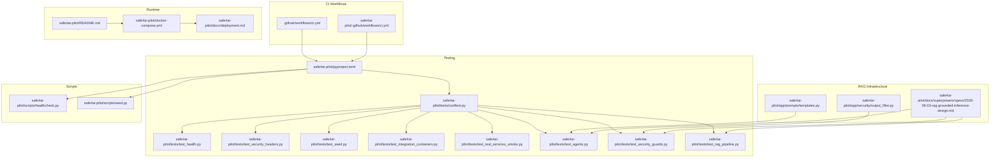

**Diagram sources**
- [.github/workflows/ci.yml:1-40](file://.github/workflows/ci.yml#L1-L40)
- [safe4ai-pilot/.github/workflows/ci.yml:1-51](file://safe4ai-pilot/.github/workflows/ci.yml#L1-L51)
- [safe4ai-pilot/pyproject.toml:84-98](file://safe4ai-pilot/pyproject.toml#L84-L98)
- [safe4ai-pilot/tests/conftest.py:1-88](file://safe4ai-pilot/tests/conftest.py#L1-L88)
- [safe4ai-pilot/tests/test_health.py:1-85](file://safe4ai-pilot/tests/test_health.py#L1-L85)
- [safe4ai-pilot/tests/test_security_headers.py:1-105](file://safe4ai-pilot/tests/test_security_headers.py#L1-L105)
- [safe4ai-pilot/tests/test_seed.py:1-14](file://safe4ai-pilot/tests/test_seed.py#L1-L14)
- [safe4ai-pilot/tests/test_integration_containers.py:1-28](file://safe4ai-pilot/tests/test_integration_containers.py#L1-L28)
- [safe4ai-pilot/tests/test_real_services_smoke.py:1-62](file://safe4ai-pilot/tests/test_real_services_smoke.py#L1-L62)
- [safe4ai-pilot/tests/test_agents.py:489-501](file://safe4ai-pilot/tests/test_agents.py#L489-L501)
- [safe4ai-pilot/tests/test_security_guards.py:286](file://safe4ai-pilot/tests/test_security_guards.py#L286)
- [safe4ai-pilot/tests/test_rag_pipeline.py:1-200](file://safe4ai-pilot/tests/test_rag_pipeline.py#L1-L200)
- [safe4ai-pilot/app/prompts/templates.py:60-79](file://safe4ai-pilot/app/prompts/templates.py#L60-L79)
- [safe4ai-pilot/app/security/output_filter.py:16](file://safe4ai-pilot/app/security/output_filter.py#L16)
- [safe4ai-pilot/docs/superpowers/specs/2026-06-03-rag-grounded-inference-design.md:38-180](file://safe4ai-pilot/docs/superpowers/specs/2026-06-03-rag-grounded-inference-design.md#L38-L180)
- [safe4ai-pilot/scripts/healthcheck.py:1-58](file://safe4ai-pilot/scripts/healthcheck.py#L1-L58)
- [safe4ai-pilot/scripts/seed.py:1-47](file://safe4ai-pilot/scripts/seed.py#L1-L47)
- [safe4ai-pilot/docker-compose.yml:1-119](file://safe4ai-pilot/docker-compose.yml#L1-L119)
- [safe4ai-pilot/docs/deployment.md:1-122](file://safe4ai-pilot/docs/deployment.md#L1-L122)
- [safe4ai-pilot/README.md:1-133](file://safe4ai-pilot/README.md#L1-L133)

**Section sources**
- [.github/workflows/ci.yml:1-40](file://.github/workflows/ci.yml#L1-L40)
- [safe4ai-pilot/.github/workflows/ci.yml:1-51](file://safe4ai-pilot/.github/workflows/ci.yml#L1-L51)
- [safe4ai-pilot/pyproject.toml:84-98](file://safe4ai-pilot/pyproject.toml#L84-L98)
- [safe4ai-pilot/README.md:1-133](file://safe4ai-pilot/README.md#L1-L133)
- [safe4ai-pilot/docs/deployment.md:1-122](file://safe4ai-pilot/docs/deployment.md#L1-L122)
- [safe4ai-pilot/docker-compose.yml:1-119](file://safe4ai-pilot/docker-compose.yml#L1-L119)

## Core Components
- CI pipelines:
  - Root CI validates linting, formatting, type checking, tests with coverage, dependency CVE scan, and secret scanning.
  - Application CI mirrors the above plus system dependency installation and extended pip-audit options.
- Testing framework:
  - Pytest configuration defines markers for integration and smoke tests, coverage exclusions, and environment overrides.
  - Fixtures provide mock transports and containerized services for deterministic tests.
- Health checks and seeding:
  - Healthcheck script verifies PostgreSQL, Qdrant, and Ollama reachability.
  - Seed script creates an admin user and test documents for functional validation.
- Orchestration:
  - Docker Compose manages service health checks and runtime dependencies.

**Section sources**
- [.github/workflows/ci.yml:1-40](file://.github/workflows/ci.yml#L1-L40)
- [safe4ai-pilot/.github/workflows/ci.yml:1-51](file://safe4ai-pilot/.github/workflows/ci.yml#L1-L51)
- [safe4ai-pilot/pyproject.toml:84-98](file://safe4ai-pilot/pyproject.toml#L84-L98)
- [safe4ai-pilot/tests/conftest.py:1-88](file://safe4ai-pilot/tests/conftest.py#L1-L88)
- [safe4ai-pilot/scripts/healthcheck.py:1-58](file://safe4ai-pilot/scripts/healthcheck.py#L1-L58)
- [safe4ai-pilot/scripts/seed.py:1-47](file://safe4ai-pilot/scripts/seed.py#L1-L47)
- [safe4ai-pilot/docker-compose.yml:1-119](file://safe4ai-pilot/docker-compose.yml#L1-L119)

## Architecture Overview
The CI/CD and QA architecture integrates GitHub Actions with local development and containerized environments. Static analysis and security scans run alongside unit and integration tests. Smoke tests validate real services when orchestrated by Docker Compose.

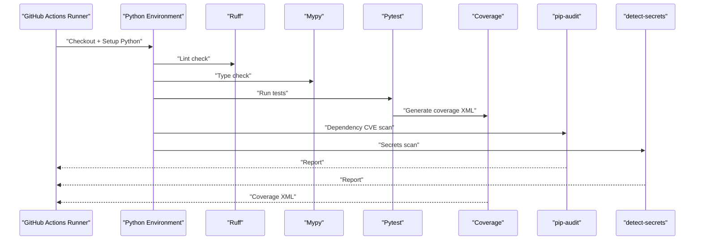

**Diagram sources**
- [.github/workflows/ci.yml:15-39](file://.github/workflows/ci.yml#L15-L39)
- [safe4ai-pilot/.github/workflows/ci.yml:18-50](file://safe4ai-pilot/.github/workflows/ci.yml#L18-L50)
- [safe4ai-pilot/pyproject.toml:84-98](file://safe4ai-pilot/pyproject.toml#L84-L98)

## Detailed Component Analysis

### CI Pipelines and Quality Gates
- Root CI:
  - Triggers on pushes and pull requests to main.
  - Steps include checkout, Python setup, dependency installation, lint/format/type checks, tests with coverage threshold, dependency CVE scan, and secrets scan.
  - Coverage failure threshold is enforced via a dedicated flag.
- Application CI:
  - Adds system dependencies for file processing and PDF utilities.
  - Uses extended pip-audit options and a baseline for secrets detection.
- Quality gates:
  - Coverage threshold gate ensures maintainable test coverage.
  - Security gates enforce dependency audits and secret scanning.

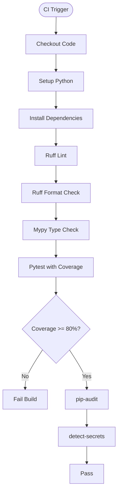

**Diagram sources**
- [.github/workflows/ci.yml:3-39](file://.github/workflows/ci.yml#L3-L39)
- [safe4ai-pilot/.github/workflows/ci.yml:3-50](file://safe4ai-pilot/.github/workflows/ci.yml#L3-L50)
- [safe4ai-pilot/pyproject.toml:84-98](file://safe4ai-pilot/pyproject.toml#L84-L98)

**Section sources**
- [.github/workflows/ci.yml:1-40](file://.github/workflows/ci.yml#L1-L40)
- [safe4ai-pilot/.github/workflows/ci.yml:1-51](file://safe4ai-pilot/.github/workflows/ci.yml#L1-L51)
- [safe4ai-pilot/pyproject.toml:84-98](file://safe4ai-pilot/pyproject.toml#L84-L98)

### Health Check Testing
Health check tests validate the application's readiness and prompt registry behavior under mocked dependencies. They ensure the health endpoint returns expected keys and that prompt retrieval works as expected.

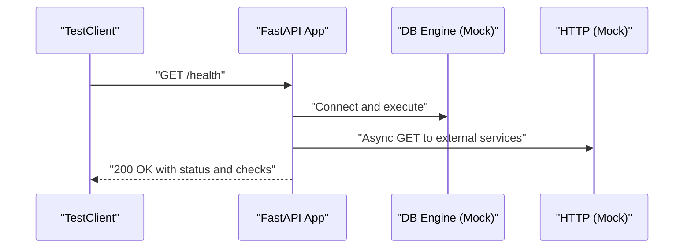

**Diagram sources**
- [safe4ai-pilot/tests/test_health.py:23-41](file://safe4ai-pilot/tests/test_health.py#L23-L41)
- [safe4ai-pilot/tests/test_health.py:43-49](file://safe4ai-pilot/tests/test_health.py#L43-L49)

**Section sources**
- [safe4ai-pilot/tests/test_health.py:1-85](file://safe4ai-pilot/tests/test_health.py#L1-L85)

### Security Header Validation
Security header tests verify that the application enforces standard security headers on endpoints, including error responses. They also validate request body limits enforced by middleware.

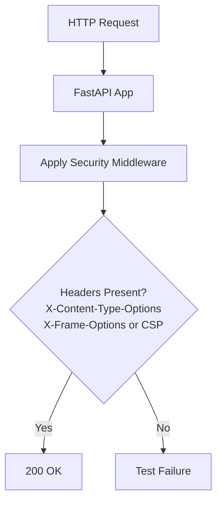

**Diagram sources**
- [safe4ai-pilot/tests/test_security_headers.py:51-64](file://safe4ai-pilot/tests/test_security_headers.py#L51-L64)
- [safe4ai-pilot/tests/test_security_headers.py:67-87](file://safe4ai-pilot/tests/test_security_headers.py#L67-L87)

**Section sources**
- [safe4ai-pilot/tests/test_security_headers.py:1-105](file://safe4ai-pilot/tests/test_security_headers.py#L1-L105)

### Data Seeding Verification
Seeding verification ensures that the seed script flushes the database before creating documents, preserving deterministic order for tests and demos.

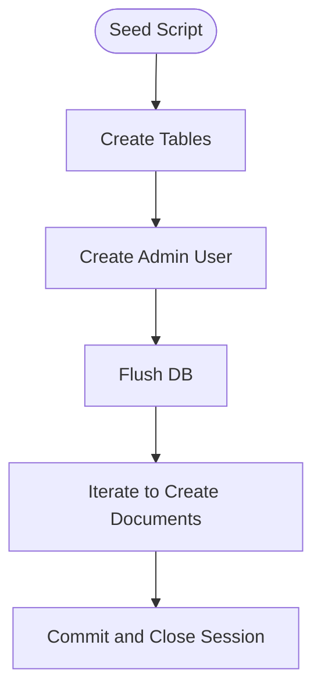

**Diagram sources**
- [safe4ai-pilot/scripts/seed.py:13-42](file://safe4ai-pilot/scripts/seed.py#L13-L42)
- [safe4ai-pilot/tests/test_seed.py:7-13](file://safe4ai-pilot/tests/test_seed.py#L7-L13)

**Section sources**
- [safe4ai-pilot/scripts/seed.py:1-47](file://safe4ai-pilot/scripts/seed.py#L1-L47)
- [safe4ai-pilot/tests/test_seed.py:1-14](file://safe4ai-pilot/tests/test_seed.py#L1-L14)

### Integration and Smoke Testing
Integration tests rely on Docker containers for PostgreSQL and Qdrant, skipping when Docker is unavailable. Smoke tests validate real services when orchestrated by Docker Compose.

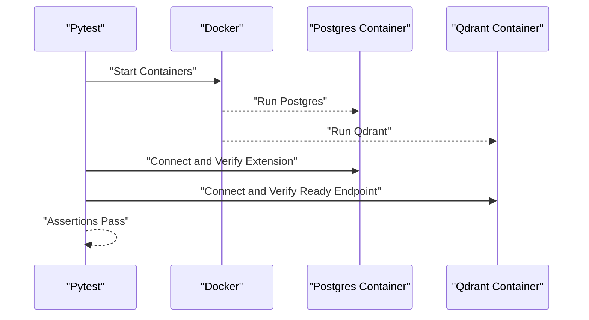

**Diagram sources**
- [safe4ai-pilot/tests/conftest.py:64-87](file://safe4ai-pilot/tests/conftest.py#L64-L87)
- [safe4ai-pilot/tests/test_integration_containers.py:9-18](file://safe4ai-pilot/tests/test_integration_containers.py#L9-L18)
- [safe4ai-pilot/tests/test_integration_containers.py:21-27](file://safe4ai-pilot/tests/test_integration_containers.py#L21-L27)

**Section sources**
- [safe4ai-pilot/tests/conftest.py:1-88](file://safe4ai-pilot/tests/conftest.py#L1-L88)
- [safe4ai-pilot/tests/test_integration_containers.py:1-28](file://safe4ai-pilot/tests/test_integration_containers.py#L1-L28)
- [safe4ai-pilot/tests/test_real_services_smoke.py:1-62](file://safe4ai-pilot/tests/test_real_services_smoke.py#L1-L62)

### RAG Answer Contract v2 Testing Infrastructure
**Updated** Added comprehensive testing infrastructure for the new RAG answer contract v2, which introduces strict answer contracts, inference labeling guards, and enhanced context numbering systems.

The RAG answer contract v2 testing validates that the prompt template contains critical labeling instructions and forbidden entity-specific categories. The testing infrastructure ensures that:
- Direct document answers remain grounded and cited
- Partial-evidence answers include document facts plus labeled general inference
- Entity-specific questions are not filled from model knowledge
- Output guards reject inference answers lacking required disclaimers
- Simple ordinary questions complete without extra LLM router calls

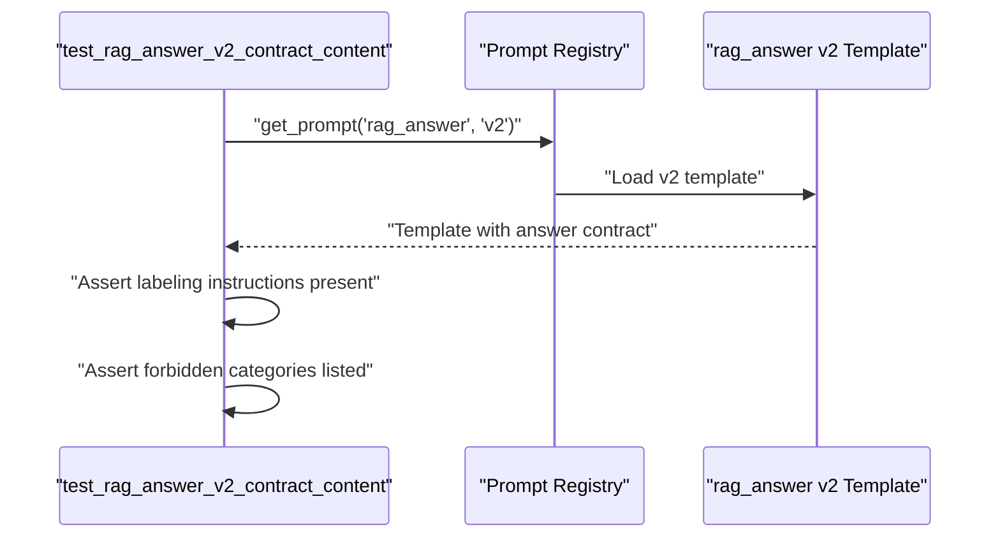

**Diagram sources**
- [safe4ai-pilot/tests/test_agents.py:489-501](file://safe4ai-pilot/tests/test_agents.py#L489-L501)
- [safe4ai-pilot/app/prompts/templates.py:60-79](file://safe4ai-pilot/app/prompts/templates.py#L60-L79)

**Section sources**
- [safe4ai-pilot/tests/test_agents.py:489-501](file://safe4ai-pilot/tests/test_agents.py#L489-L501)
- [safe4ai-pilot/app/prompts/templates.py:60-79](file://safe4ai-pilot/app/prompts/templates.py#L60-L79)
- [safe4ai-pilot/docs/superpowers/specs/2026-06-03-rag-grounded-inference-design.md:146-162](file://safe4ai-pilot/docs/superpowers/specs/2026-06-03-rag-grounded-inference-design.md#L146-L162)

### Inference Labeling Guards Testing
**Updated** Enhanced testing infrastructure for inference labeling guards, particularly Rule 3 which enforces inference labeling requirements in output filtering.

The inference labeling guard testing validates that:
- Answers using general inference/model knowledge language include clear disclaimers
- Output guards only enforce labeling when inference is present
- Forbidden entity-specific categories trigger guard enforcement
- Simple questions bypass unnecessary inference labeling requirements

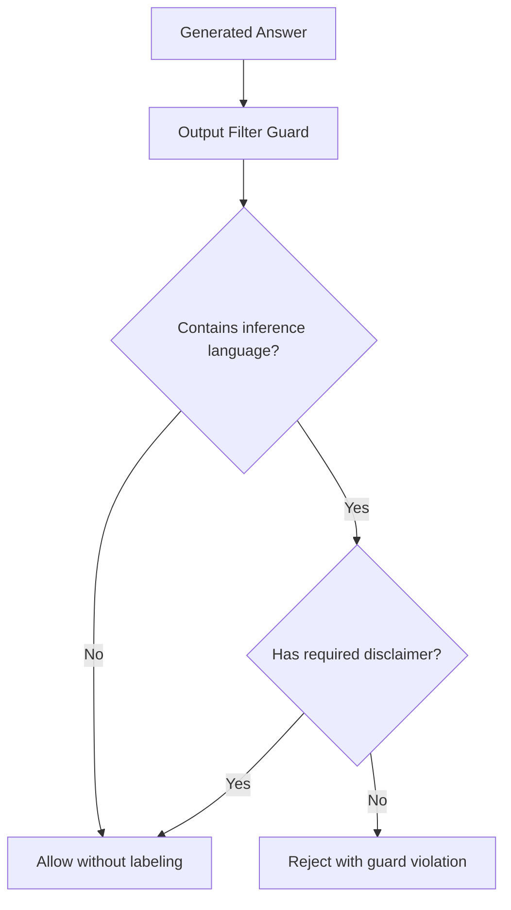

**Diagram sources**
- [safe4ai-pilot/tests/test_security_guards.py:286](file://safe4ai-pilot/tests/test_security_guards.py#L286)
- [safe4ai-pilot/app/security/output_filter.py:16](file://safe4ai-pilot/app/security/output_filter.py#L16)

**Section sources**
- [safe4ai-pilot/tests/test_security_guards.py:286](file://safe4ai-pilot/tests/test_security_guards.py#L286)
- [safe4ai-pilot/app/security/output_filter.py:16](file://safe4ai-pilot/app/security/output_filter.py#L16)
- [safe4ai-pilot/docs/superpowers/specs/2026-06-03-rag-grounded-inference-design.md:112-120](file://safe4ai-pilot/docs/superpowers/specs/2026-06-03-rag-grounded-inference-design.md#L112-L120)

### Context Numbering System Testing
**Updated** Enhanced test coverage for the context numbering system that provides stable source labels for better citation anchoring.

The context numbering system testing ensures:
- Stable source labels in format [S1], [S2], etc.
- Proper citation anchoring for evidence tracking
- Compatibility with existing UI citation list formatting
- Clean anchors for model citation capabilities

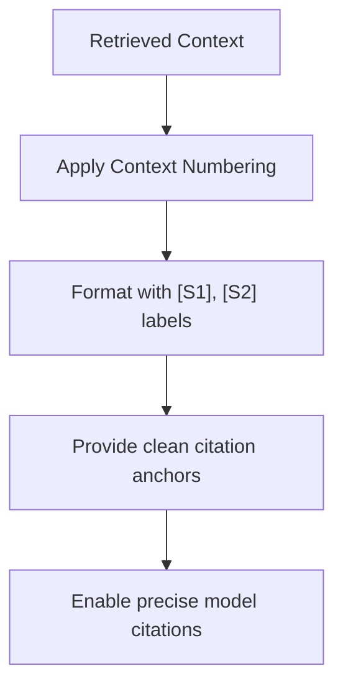

**Diagram sources**
- [safe4ai-pilot/docs/superpowers/specs/2026-06-03-rag-grounded-inference-design.md:103-111](file://safe4ai-pilot/docs/superpowers/specs/2026-06-03-rag-grounded-inference-design.md#L103-L111)

**Section sources**
- [safe4ai-pilot/docs/superpowers/specs/2026-06-03-rag-grounded-inference-design.md:103-111](file://safe4ai-pilot/docs/superpowers/specs/2026-06-03-rag-grounded-inference-design.md#L103-L111)

### Deployment Validation and Orchestration
Deployment documentation outlines required smoke checks and local verification steps. Docker Compose defines health checks for all services, ensuring reliable CI and local development.

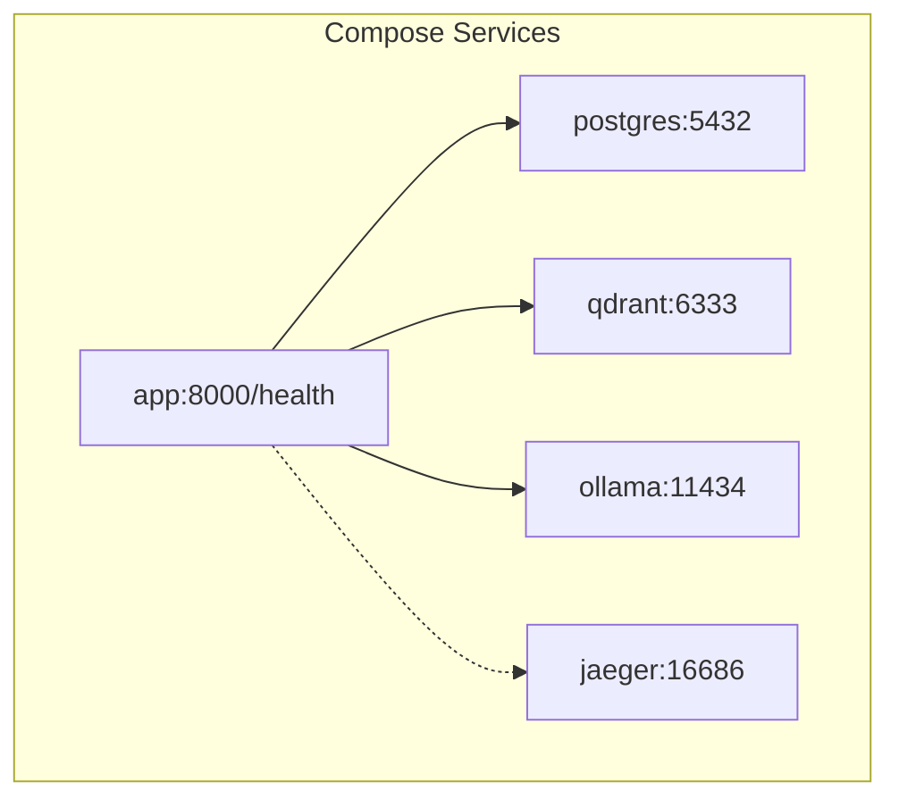

**Diagram sources**
- [safe4ai-pilot/docker-compose.yml:12-16](file://safe4ai-pilot/docker-compose.yml#L12-L16)
- [safe4ai-pilot/docker-compose.yml:25-29](file://safe4ai-pilot/docker-compose.yml#L25-L29)
- [safe4ai-pilot/docker-compose.yml:39-44](file://safe4ai-pilot/docker-compose.yml#L39-L44)
- [safe4ai-pilot/docker-compose.yml:69-73](file://safe4ai-pilot/docker-compose.yml#L69-L73)
- [safe4ai-pilot/docker-compose.yml:98-103](file://safe4ai-pilot/docker-compose.yml#L98-L103)

**Section sources**
- [safe4ai-pilot/docs/deployment.md:55-94](file://safe4ai-pilot/docs/deployment.md#L55-L94)
- [safe4ai-pilot/README.md:104-128](file://safe4ai-pilot/README.md#L104-L128)
- [safe4ai-pilot/docker-compose.yml:1-119](file://safe4ai-pilot/docker-compose.yml#L1-L119)

## Dependency Analysis
The testing and QA stack relies on:
- Pytest for test execution and fixtures
- Ruff for linting and formatting
- Mypy for type checking
- Coverage reporting and thresholds
- pip-audit for dependency vulnerability scanning
- detect-secrets for secret scanning
- Testcontainers for integration tests
- Docker Compose for service orchestration

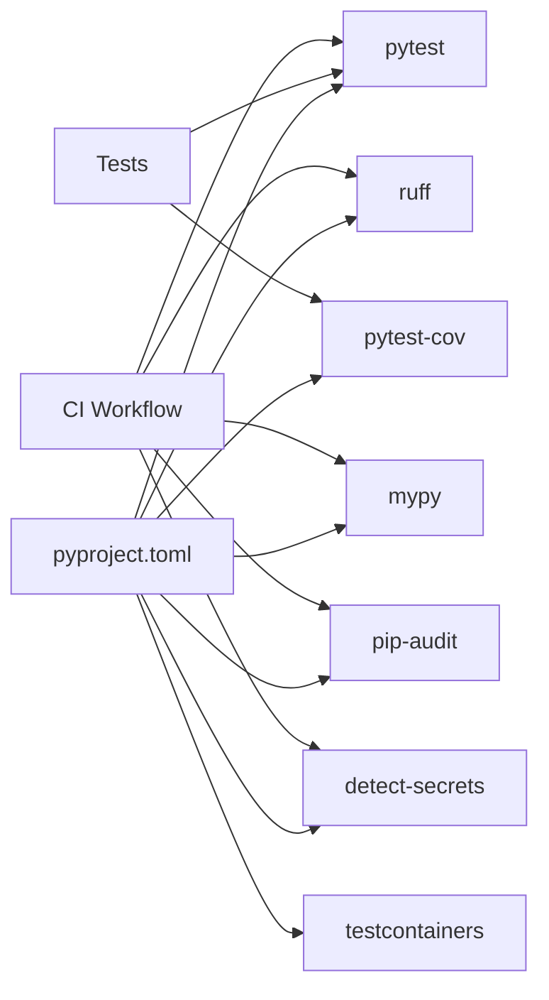

**Diagram sources**
- [safe4ai-pilot/pyproject.toml:48-60](file://safe4ai-pilot/pyproject.toml#L48-L60)
- [safe4ai-pilot/pyproject.toml:66-82](file://safe4ai-pilot/pyproject.toml#L66-L82)
- [safe4ai-pilot/pyproject.toml:84-98](file://safe4ai-pilot/pyproject.toml#L84-L98)
- [.github/workflows/ci.yml:23-39](file://.github/workflows/ci.yml#L23-L39)
- [safe4ai-pilot/.github/workflows/ci.yml:34-50](file://safe4ai-pilot/.github/workflows/ci.yml#L34-L50)

**Section sources**
- [safe4ai-pilot/pyproject.toml:48-60](file://safe4ai-pilot/pyproject.toml#L48-L60)
- [safe4ai-pilot/pyproject.toml:66-82](file://safe4ai-pilot/pyproject.toml#L66-L82)
- [safe4ai-pilot/pyproject.toml:84-98](file://safe4ai-pilot/pyproject.toml#L84-L98)
- [.github/workflows/ci.yml:23-39](file://.github/workflows/ci.yml#L23-L39)
- [safe4ai-pilot/.github/workflows/ci.yml:34-50](file://safe4ai-pilot/.github/workflows/ci.yml#L34-L50)

## Performance Considerations
- Keep CI runtime efficient by running linting, type checking, and tests in parallel steps where appropriate.
- Use Docker Compose health checks to reduce flakiness in service readiness.
- Prefer mocking for network-dependent tests to avoid external latency and variability.
- Limit integration tests to essential scenarios and skip them when Docker is unavailable to prevent CI timeouts.
- **Updated** Optimize RAG pipeline tests to minimize unnecessary LLM calls while maintaining comprehensive coverage of answer contract behaviors.

## Troubleshooting Guide
Common issues and resolutions:
- Coverage below threshold:
  - Ensure tests exercise sufficient code paths and that coverage exclusions remain minimal.
  - Review coverage configuration and adjust thresholds as needed.
- Secret or dependency scan failures:
  - Update dependencies to address vulnerabilities or record exceptions per policy.
  - Regenerate secrets baselines after controlled updates.
- Docker-related test failures:
  - Confirm Docker availability and permissions in CI runners.
  - Use explicit waits and retry logic for container startup.
- Real-service smoke test failures:
  - Verify Docker Compose stack is fully healthy before running smoke tests.
  - Check environment variables and service URLs.
- Healthcheck failures:
  - Inspect service logs and network connectivity.
  - Validate database credentials and Qdrant/Ollama endpoints.
- **Updated** RAG answer contract v2 test failures:
  - Verify prompt template contains required labeling instructions and forbidden categories.
  - Check that inference guard properly enforces labeling requirements.
  - Ensure context numbering system generates stable source labels.

**Section sources**
- [safe4ai-pilot/docs/deployment.md:55-94](file://safe4ai-pilot/docs/deployment.md#L55-L94)
- [safe4ai-pilot/scripts/healthcheck.py:12-53](file://safe4ai-pilot/scripts/healthcheck.py#L12-L53)
- [safe4ai-pilot/tests/test_real_services_smoke.py:12-17](file://safe4ai-pilot/tests/test_real_services_smoke.py#L12-L17)
- [safe4ai-pilot/tests/test_agents.py:489-501](file://safe4ai-pilot/tests/test_agents.py#L489-L501)
- [safe4ai-pilot/tests/test_security_guards.py:286](file://safe4ai-pilot/tests/test_security_guards.py#L286)

## Conclusion
The Private AI system employs robust CI/CD and QA practices that combine static analysis, security scanning, comprehensive testing, and deployment validation. Quality gates ensure code quality and security standards, while health checks and smoke tests validate runtime readiness. Integration and smoke tests provide confidence in real-world deployments orchestrated by Docker Compose. **Updated** The recent enhancements to RAG answer contract v2 testing infrastructure, inference labeling guards, and context numbering system significantly improve the system's ability to maintain grounded, properly labeled inference answers while preserving performance and user experience.

## Appendices
- Pre-commit configuration integrates linting, formatting, and secret scanning into local workflows to catch issues early.

**Section sources**
- [safe4ai-pilot/.pre-commit-config.yaml:1-20](file://safe4ai-pilot/.pre-commit-config.yaml#L1-L20)