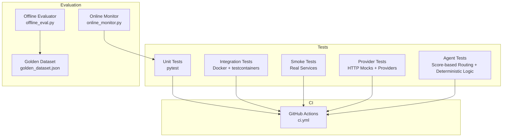
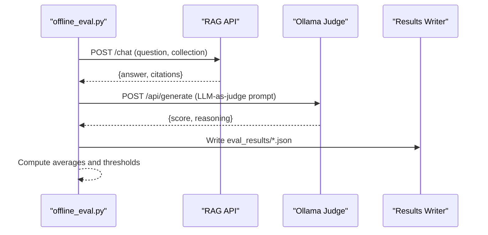
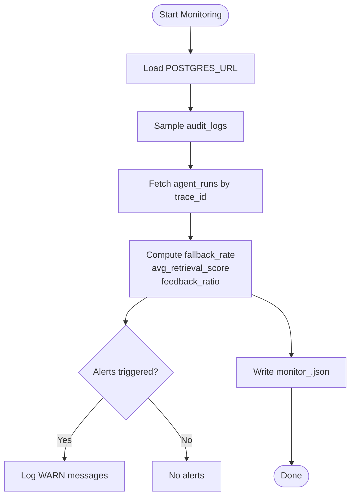
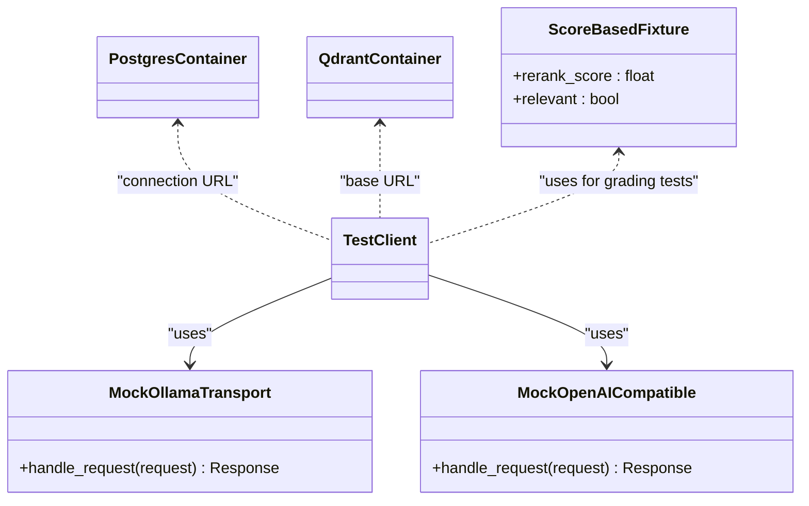
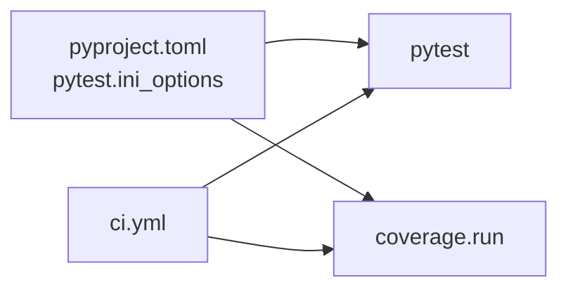

# Testing Strategy

<cite>
**Referenced Files in This Document**
- [conftest.py](file://safe4ai-pilot/tests/conftest.py)
- [pyproject.toml](file://safe4ai-pilot/pyproject.toml)
- [ci.yml](file://safe4ai-pilot/.github/workflows/ci.yml)
- [offline_eval.py](file://safe4ai-pilot/evaluation/offline_eval.py)
- [online_monitor.py](file://safe4ai-pilot/evaluation/online_monitor.py)
- [golden_dataset.json](file://safe4ai-pilot/evaluation/golden_dataset.json)
- [test_admin.py](file://safe4ai-pilot/tests/test_admin.py)
- [test_agents.py](file://safe4ai-pilot/tests/test_agents.py)
- [test_chat.py](file://safe4ai-pilot/tests/test_chat.py)
- [test_auth.py](file://safe4ai-pilot/tests/test_auth.py)
- [test_models.py](file://safe4ai-pilot/tests/test_models.py)
- [test_hybrid_retriever.py](file://safe4ai-pilot/tests/test_hybrid_retriever.py)
- [test_security_guards.py](file://safe4ai-pilot/tests/test_security_guards.py)
- [test_startup_schema.py](file://safe4ai-pilot/tests/test_startup_schema.py)
- [test_health.py](file://safe4ai-pilot/tests/test_health.py)
- [test_real_services_smoke.py](file://safe4ai-pilot/tests/test_real_services_smoke.py)
- [test_integration_containers.py](file://safe4ai-pilot/tests/test_integration_containers.py)
- [test_conversation.py](file://safe4ai-pilot/tests/test_conversation.py)
- [test_rag_pipeline.py](file://safe4ai-pilot/tests/test_rag_pipeline.py)
- [test_reranker.py](file://safe4ai-pilot/tests/test_reranker.py)
- [test_cost_tracker.py](file://safe4ai-pilot/tests/test_cost_tracker.py)
- [test_provider_clients.py](file://safe4ai-pilot/tests/test_provider_clients.py)
- [test_runtime_config.py](file://safe4ai-pilot/tests/test_runtime_config.py)
- [provider_clients.py](file://safe4ai-pilot/app/services/provider_clients.py)
- [runtime_config.py](file://safe4ai-pilot/app/services/runtime_config.py)
- [router.py](file://safe4ai-pilot/app/auth/router.py)
- [chat_routes.py](file://safe4ai-pilot/app/api/chat_routes.py)
- [cost_tracker.py](file://safe4ai-pilot/observability/cost_tracker.py)
- [admin_routes.py](file://safe4ai-pilot/app/api/admin_routes.py)
- [useDocuments.ts](file://safe4ai-pilot/frontend/src/hooks/useDocuments.ts)
- [client.ts](file://safe4ai-pilot/frontend/src/api/client.ts)
- [ErrorBoundary.tsx](file://safe4ai-pilot/frontend/src/components/ErrorBoundary.tsx)
- [StreamingPipeline.tsx](file://safe4ai-pilot/frontend/src/components/chat/StreamingPipeline.tsx)
- [seed.py](file://safe4ai-pilot/scripts/seed.py)
- [2026-05-14-r4-9-r4-10-hardening.md](file://safe4ai-pilot/docs/superpowers/plans/2026-05-14-r4-9-r4-10-hardening.md)
- [2026-05-15-provider-runtime-hardening.md](file://safe4ai-pilot/docs/superpowers/plans/2026-05-15-provider-runtime-hardening.md)
- [README.md](file://safe4ai-pilot/README.md)
- [adaptive_router.py](file://safe4ai-pilot/app/agents/adaptive_router.py)
- [document_grader.py](file://safe4ai-pilot/app/agents/document_grader.py)
- [graph.py](file://safe4ai-pilot/app/agents/graph.py)
- [models.py](file://safe4ai-pilot/app/models.py)
</cite>

## Update Summary
**Changes Made**
- Added comprehensive test coverage for new score-based grading system using rerank scores instead of LLM-based decisions
- Implemented synchronous routing functions with deterministic behavior for routing decisions
- Added tests for OllamaProvider null message handling fix with response fallback
- Updated agent workflow tests to validate deterministic behavior instead of LLM-based routing
- Enhanced testing strategy to cover score-based chunk grading and threshold-based routing

## Table of Contents
1. [Introduction](#introduction)
2. [Project Structure](#project-structure)
3. [Core Components](#core-components)
4. [Architecture Overview](#architecture-overview)
5. [Detailed Component Analysis](#detailed-component-analysis)
6. [Dependency Analysis](#dependency-analysis)
7. [Performance Considerations](#performance-considerations)
8. [Troubleshooting Guide](#troubleshooting-guide)
9. [Conclusion](#conclusion)
10. [Appendices](#appendices)

## Introduction
This document defines a comprehensive testing strategy for the Private AI system. It covers unit testing, integration testing, end-to-end testing, and performance evaluation. It explains the pytest framework setup, test organization, and mocking strategies for external dependencies. It documents the evaluation framework using a golden dataset and online monitoring for production performance. It also provides practical guidance for testing AI components, database operations, API endpoints, and frontend interactions, along with automation, coverage requirements, debugging techniques, best practices for AI systems, data privacy, regression testing, and continuous integration.

**Updated** Enhanced with comprehensive testing infrastructure for the new score-based grading system, synchronous routing functions, and improved provider client testing including null message handling.

## Project Structure
The testing system is organized under the tests directory and evaluation directory, with pytest configuration in pyproject.toml and CI in .github/workflows. Key areas:
- Unit tests: isolated logic, mocks for external services, FastAPI TestClient
- Integration tests: Docker containers for Postgres/pgvector and Qdrant
- Real-service smoke tests: optional verification against live services
- Evaluation: offline scoring against a golden dataset and online monitoring of production signals
- Provider system tests: specialized testing for multi-provider architecture and runtime configuration
- **New**: Agent workflow tests: deterministic routing based on score thresholds instead of LLM decisions



**Diagram sources**
- [pyproject.toml:84-97](file://safe4ai-pilot/pyproject.toml#L84-L97)
- [ci.yml:9-44](file://safe4ai-pilot/.github/workflows/ci.yml#L9-L44)
- [offline_eval.py:149-240](file://safe4ai-pilot/evaluation/offline_eval.py#L149-L240)
- [online_monitor.py:112-176](file://safe4ai-pilot/evaluation/online_monitor.py#L112-L176)

**Section sources**
- [pyproject.toml:84-97](file://safe4ai-pilot/pyproject.toml#L84-L97)
- [ci.yml:9-44](file://safe4ai-pilot/.github/workflows/ci.yml#L9-L44)
- [README.md:121-126](file://safe4ai-pilot/README.md#L121-L126)

## Core Components
- pytest configuration and markers for integration and smoke tests
- Test fixtures for FastAPI TestClient, containerized services, and Ollama mocking
- Evaluation scripts for offline scoring and online monitoring
- Golden dataset for offline evaluation
- Security guards and model tests validating safety and schema correctness
- Cost tracking and token estimation testing
- Frontend component testing with proper cleanup and timeout handling
- **New**: Provider client testing with HTTP mocking for external APIs
- **New**: Runtime configuration testing with provider type validation and fallback mechanisms
- **New**: Score-based grading system testing with threshold validation
- **New**: Synchronous routing function testing with deterministic behavior validation

**Updated** Enhanced with comprehensive provider system testing, score-based grading system testing, and synchronous routing function testing.

Key capabilities:
- Isolated unit tests with dependency overrides and mocks
- Containerized integration tests for Postgres and Qdrant
- Optional smoke tests against live services
- Automated evaluation and monitoring pipelines
- Security-focused testing for password validation and brute-force protection
- Cost management testing for token estimation and spending controls
- **New**: Multi-provider architecture testing with OpenAI-compatible and Ollama providers
- **New**: Runtime configuration validation with provider type coercion and fallback handling
- **New**: Score-based chunk grading with threshold validation and deterministic routing
- **New**: Synchronous routing functions with explicit threshold-based decision making

**Section sources**
- [conftest.py:47-88](file://safe4ai-pilot/tests/conftest.py#L47-L88)
- [pyproject.toml:84-97](file://safe4ai-pilot/pyproject.toml#L84-L97)
- [offline_eval.py:149-240](file://safe4ai-pilot/evaluation/offline_eval.py#L149-L240)
- [online_monitor.py:112-176](file://safe4ai-pilot/evaluation/online_monitor.py#L112-L176)

## Architecture Overview
The testing architecture separates concerns across layers:
- Unit layer: FastAPI TestClient with dependency overrides and HTTP mocks
- Integration layer: Docker containers for Postgres/Qdrant; optional real-service smoke checks
- Evaluation layer: Offline evaluator and online monitor consuming production data
- **New**: Provider layer: HTTP mocks for external AI providers with usage tracking and token estimation
- **New**: Agent layer: Score-based chunk grading with threshold validation and synchronous routing

```mermaid
graph TB
TC["TestClient<br/>FastAPI"] --> APP["App routes<br/>/auth, /chat, /health"]
APP --> DB["SQLAlchemy Engine"]
APP --> QD["QdrantClient"]
APP --> OL["Ollama HTTP"]
APP --> OC["OpenAI-Compatible HTTP"]
subgraph "Mocks"
MOCKOL["MockOllamaTransport"]
MOCKOC["MockOpenAICompatible"]
END
subgraph "Containers"
PG["Postgres + pgvector"]
QD2["Qdrant"]
END
APP -.optional.-> PG
APP -.optional.-> QD2
APP -.real services.-> APPRS["Real Services Smoke"]
subgraph "Agent Layer"
SCORE["Score-based Grading<br/>rerank_score >= threshold"]
SYNC["Synchronous Routing<br/>≥ 2 relevant chunks → generate"]
END
```

**Diagram sources**
- [conftest.py:35-49](file://safe4ai-pilot/tests/conftest.py#L35-L49)
- [conftest.py:65-87](file://safe4ai-pilot/tests/conftest.py#L65-L87)
- [test_real_services_smoke.py:19-61](file://safe4ai-pilot/tests/test_real_services_smoke.py#L19-L61)
- [test_provider_clients.py:12-44](file://safe4ai-pilot/tests/test_provider_clients.py#L12-L44)
- [test_runtime_config.py:8-18](file://safe4ai-pilot/tests/test_runtime_config.py#L8-18)
- [adaptive_router.py:12-23](file://safe4ai-pilot/app/agents/adaptive_router.py#L12-L23)
- [document_grader.py:15-24](file://safe4ai-pilot/app/agents/document_grader.py#L15-L24)

## Detailed Component Analysis

### Unit Testing Strategy
- Use FastAPI TestClient to exercise endpoints without hitting real databases or external services.
- Override dependencies (e.g., database sessions) with mocks to isolate logic.
- Mock external HTTP services (e.g., Ollama, OpenAI-compatible) to avoid flakiness and speed up tests.
- Validate request validation, error responses, and response shapes.

**Updated** Enhanced with comprehensive provider system testing, score-based grading system testing, and synchronous routing function testing.

Representative examples:
- Authentication and authorization tests validate login, logout, role-based access, token encoding/decoding, and password strength validation.
- Chat endpoint tests validate happy-path responses, empty-input rejection, unauthorized access, cost tracking scenarios, and spending ceiling enforcement.
- Health endpoint tests validate service readiness and prompt registry access with mocks.
- Admin functionality tests validate document upload, deletion, reindexing, user management, audit logging, and system settings.
- Agent workflow tests validate LangGraph components, routing decisions, and error handling with deterministic score-based logic.
- Security guards tests validate input/output filtering, PII detection, and content safety.
- Cost tracker tests validate token calculation, cost projection, and spending limit enforcement.
- Frontend component tests validate proper cleanup, timeout cancellation, and error boundary handling.
- **New**: Provider client tests validate OpenAI-compatible chat usage extraction, embedding vector processing, and batch document embedding.
- **New**: Runtime configuration tests validate provider type coercion, fallback mechanisms, and runtime component building.
- **New**: Score-based grading tests validate threshold-based chunk relevance determination without LLM calls.
- **New**: Synchronous routing tests validate deterministic routing decisions based on relevant chunk counts.

Best practices:
- Keep tests deterministic; rely on fixtures and patches.
- Assert on status codes and JSON payloads.
- Prefer small, focused assertions per test.
- Test both success and failure paths for security features.
- **New**: Use HTTPX MockTransport for external API testing without network dependencies.
- **New**: Validate score-based grading with explicit threshold comparisons.
- **New**: Test synchronous routing functions with predefined decision criteria.

**Section sources**
- [test_auth.py:67-290](file://safe4ai-pilot/tests/test_auth.py#L67-L290)
- [test_chat.py:75-123](file://safe4ai-pilot/tests/test_chat.py#L75-L123)
- [test_health.py:43-85](file://safe4ai-pilot/tests/test_health.py#L43-L85)
- [test_admin.py:111-905](file://safe4ai-pilot/tests/test_admin.py#L111-L905)
- [test_agents.py:118-595](file://safe4ai-pilot/tests/test_agents.py#L118-L595)
- [test_cost_tracker.py:1-169](file://safe4ai-pilot/tests/test_cost_tracker.py#L1-169)
- [test_provider_clients.py:12-80](file://safe4ai-pilot/tests/test_provider_clients.py#L12-L80)
- [test_runtime_config.py:8-84](file://safe4ai-pilot/tests/test_runtime_config.py#L8-84)

### Integration Testing Strategy
- Use Docker containers for Postgres (with pgvector extension) and Qdrant via testcontainers.
- Provide fixtures that yield connection URLs or base URLs to real services.
- Skip integration tests when Docker is unavailable; mark them distinctly to enable selective runs.

Representative examples:
- Verify pgvector extension installation and Qdrant readiness.
- Integration fixtures for Postgres and Qdrant are used by other tests requiring real backends.

**Section sources**
- [test_integration_containers.py:9-28](file://safe4ai-pilot/tests/test_integration_containers.py#L9-L28)
- [conftest.py:65-87](file://safe4ai-pilot/tests/conftest.py#L65-L87)

### End-to-End Testing Strategy
- Optional smoke tests that hit real services after bringing them up with Docker Compose.
- These tests validate readiness endpoints and basic connectivity.

Representative examples:
- Health endpoint, Qdrant readyz, Ollama tags, and Postgres pgvector extension verification.

**Section sources**
- [test_real_services_smoke.py:19-61](file://safe4ai-pilot/tests/test_real_services_smoke.py#L19-L61)

### AI Component Testing Strategy
- Mock AI inference endpoints to avoid variability and latency.
- For retrieval components, mock Qdrant and embedding calls; simulate BM25 indexing and fusion logic.
- Validate that filters, collections, and payload handling behave as expected.

**Updated** Enhanced with comprehensive provider system testing, score-based grading system testing, and synchronous routing function testing.

Representative examples:
- Hybrid retriever tests validate fused retrieval, doc-id filtering, BM25 updates, and collection routing.
- Agent workflow tests validate single-turn Q&A, out-of-scope queries, decomposition scenarios, and fallback mechanisms.
- RAG pipeline tests validate query processing, citation generation, and document ingestion workflows.
- **New**: Provider client tests validate OpenAI-compatible usage extraction from API responses and embedding vector processing.
- **New**: Runtime configuration tests validate provider type coercion and fallback to Ollama when invalid provider types are specified.
- **New**: Score-based grading tests validate threshold-based chunk relevance determination using rerank scores.
- **New**: Synchronous routing tests validate deterministic routing decisions based on relevant chunk counts and grounded state.

**Section sources**
- [test_hybrid_retriever.py:57-169](file://safe4ai-pilot/tests/test_hybrid_retriever.py#L57-L169)
- [test_agents.py:118-595](file://safe4ai-pilot/tests/test_agents.py#L118-L595)
- [test_rag_pipeline.py:48-200](file://safe4ai-pilot/tests/test_rag_pipeline.py#L48-L200)
- [test_provider_clients.py:12-80](file://safe4ai-pilot/tests/test_provider_clients.py#L12-L80)
- [test_runtime_config.py:8-84](file://safe4ai-pilot/tests/test_runtime_config.py#L8-84)
- [conftest.py:25-49](file://safe4ai-pilot/tests/conftest.py#L25-L49)

### Database Operations Testing Strategy
- Validate SQLAlchemy metadata and table presence.
- Validate column sets and enums align with design.
- Ensure startup order initializes extensions before table creation.

**Updated** Enhanced with comprehensive model validation and schema testing.

Representative examples:
- Model and schema tests validate tables, columns, and settings parsing.
- Startup schema tests enforce initialization order.
- Conversation management tests validate session persistence and state handling.

**Section sources**
- [test_models.py:19-58](file://safe4ai-pilot/tests/test_models.py#L19-L58)
- [test_startup_schema.py:7-23](file://safe4ai-pilot/tests/test_startup_schema.py#L7-L23)
- [test_conversation.py:19-132](file://safe4ai-pilot/tests/test_conversation.py#L19-L132)

### API Endpoint Testing Strategy
- Use TestClient to send requests and assert responses.
- Apply dependency overrides to bypass DB/auth for pure endpoint tests.
- Mock external services to keep tests stable.

**Updated** Enhanced with comprehensive chat endpoint testing including cost tracking, session management, and error scenarios.

Representative examples:
- Chat endpoint tests validate answer delivery, citations, error handling, cost ceiling enforcement, and token estimation.
- Auth endpoint tests validate login, logout, role gating, password strength validation, and CSRF protection.
- Admin endpoints tests validate document management, user administration, system configuration, and reindex safety mechanisms.

**Section sources**
- [test_chat.py:75-123](file://safe4ai-pilot/tests/test_chat.py#L75-L123)
- [test_auth.py:67-290](file://safe4ai-pilot/tests/test_auth.py#L67-L290)
- [test_admin.py:111-905](file://safe4ai-pilot/tests/test_admin.py#L111-L905)

### Security Guards and Data Privacy Testing Strategy
- Validate input guards, content filters, output filters, and upload validators.
- Ensure PII detection, blocked terms, and safe filenames are enforced.
- Confirm that outputs are allowed when PII originates from sources.

**Updated** Enhanced with comprehensive security validation including PII detection, content filtering, output safety, and password strength validation.

Representative examples:
- Comprehensive checks for allowed and blocked inputs, PII detection, and upload validation.
- Content filter tests validate PII removal, blocked term filtering, and safe chunk processing.
- Output filter tests validate PII prevention and source-based allowance.
- Password strength validation tests ensure minimum 12-character passwords with required complexity.
- CSRF protection tests validate cross-origin request security and token validation.

**Section sources**
- [test_security_guards.py:32-305](file://safe4ai-pilot/tests/test_security_guards.py#L32-L305)
- [router.py:29-35](file://safe4ai-pilot/app/auth/router.py#L29-L35)

### Cost Management System Testing Strategy
- Validate token estimation algorithms and cost projection calculations.
- Test spending ceiling enforcement for daily and monthly limits.
- Ensure proper cost tracking integration with agent runs and billing cycles.

**Updated** New section documenting comprehensive cost management testing.

Representative examples:
- Token estimation tests validate prompt and completion token counting accuracy.
- Cost projection tests ensure accurate cost calculation before request execution.
- Spending ceiling tests validate daily and monthly limit enforcement with proper HTTP exceptions.
- Cost tracking tests validate database integration and statistics aggregation.

**Section sources**
- [test_cost_tracker.py:1-169](file://safe4ai-pilot/tests/test_cost_tracker.py#L1-169)
- [chat_routes.py:95-139](file://safe4ai-pilot/app/api/chat_routes.py#L95-L139)
- [cost_tracker.py:16-25](file://safe4ai-pilot/observability/cost_tracker.py#L16-L25)

### Frontend Component Testing Strategy
- Validate proper cleanup and timeout cancellation in React hooks.
- Test error boundary handling and user experience during failures.
- Ensure streaming pipeline components handle step states correctly.

**Updated** New section documenting enhanced frontend component testing.

Representative examples:
- Document management hook tests validate cleanup, timeout cancellation, and proper component lifecycle.
- Error boundary tests ensure graceful degradation and user-friendly error messaging.
- Streaming pipeline tests validate step state visualization and progress indication.
- API client tests validate CSRF token handling and authentication flow.

**Section sources**
- [useDocuments.ts:1-93](file://safe4ai-pilot/frontend/src/hooks/useDocuments.ts#L1-93)
- [ErrorBoundary.tsx:1-42](file://safe4ai-pilot/frontend/src/components/ErrorBoundary.tsx#L1-42)
- [StreamingPipeline.tsx:1-30](file://safe4ai-pilot/frontend/src/components/chat/StreamingPipeline.tsx#L1-30)
- [client.ts:1-59](file://safe4ai-pilot/frontend/src/api/client.ts#L1-59)

### Provider System Testing Strategy
**New** Comprehensive testing strategy for the multi-provider architecture that enables switching between Ollama and OpenAI-compatible providers.

The provider system consists of:
- **OpenAICompatibleProvider**: HTTP client for OpenAI-compatible APIs with usage tracking
- **OllamaProvider**: HTTP client for local Ollama instances with fallback mechanisms
- **RuntimeConfig**: Central configuration manager for provider selection and settings
- **ProviderUsage**: Data structure for tracking token usage from provider responses

Representative examples:
- **Provider Client Testing**: Validates OpenAI-compatible chat usage extraction, embedding vector processing, and batch document embedding with HTTP mocking.
- **Runtime Configuration Testing**: Validates provider type coercion, fallback mechanisms, and runtime component building with proper error handling.
- **Usage Tracking Testing**: Ensures accurate token counting from provider responses and proper usage source selection.
- **Null Message Handling Testing**: Validates OllamaProvider fallback behavior when API returns null message with valid response.

Best practices:
- Use HTTPX MockTransport for external API testing without network dependencies.
- Validate both actual usage extraction and estimated usage fallback scenarios.
- Test provider type validation and graceful fallback to Ollama when invalid provider types are specified.
- Ensure proper error handling for missing API keys and invalid provider configurations.
- **New**: Test null message handling scenarios with proper fallback behavior validation.

**Section sources**
- [test_provider_clients.py:12-80](file://safe4ai-pilot/tests/test_provider_clients.py#L12-L80)
- [test_runtime_config.py:8-84](file://safe4ai-pilot/tests/test_runtime_config.py#L8-L84)
- [provider_clients.py:52-106](file://safe4ai-pilot/app/services/provider_clients.py#L52-L106)
- [runtime_config.py:89-129](file://safe4ai-pilot/app/services/runtime_config.py#L89-L129)

### Score-Based Grading System Testing Strategy
**New** Comprehensive testing strategy for the score-based grading system that replaces LLM-based chunk relevance determination with threshold-based scoring.

The score-based grading system consists of:
- **grade_chunks_by_score**: Threshold-based chunk relevance determination using rerank scores
- **RankedChunk**: Enhanced chunk model with rerank_score field
- **GradedChunk**: Extended chunk model with relevance and reason fields
- **rerank_threshold**: Configuration parameter for score-based grading

Representative examples:
- **Threshold Validation Testing**: Validates that rerank_score >= threshold determines relevance
- **Score-Based Chunk Grading Testing**: Tests threshold-based grading without external LLM calls
- **Deterministic Behavior Testing**: Ensures consistent routing decisions based on score thresholds
- **Fallback Mechanism Testing**: Validates LLM-based grading when threshold is not specified

Best practices:
- Use explicit threshold comparisons in tests for deterministic behavior
- Validate score-based grading with various threshold values
- Test edge cases around threshold boundaries (exactly equal to threshold)
- Ensure backward compatibility with LLM-based grading when threshold is None

**Section sources**
- [document_grader.py:15-24](file://safe4ai-pilot/app/agents/document_grader.py#L15-L24)
- [models.py:26-33](file://safe4ai-pilot/app/models.py#L26-L33)
- [test_agents.py:512-559](file://safe4ai-pilot/tests/test_agents.py#L512-L559)

### Synchronous Routing Functions Testing Strategy
**New** Comprehensive testing strategy for synchronous routing functions that provide deterministic behavior instead of LLM-based routing decisions.

The synchronous routing system consists of:
- **route_after_grade**: Synchronous fallback rule based on relevant chunk count
- **route_quality_gate**: Synchronous quality gate based on grounded state
- **Deterministic Decision Making**: Explicit threshold-based routing logic

Representative examples:
- **Relevant Chunk Count Testing**: Validates ≥ 2 relevant chunks → generate, else → decompose
- **Quality Gate Testing**: Validates grounded state → respond, else → fallback
- **Deterministic Behavior Testing**: Ensures consistent routing decisions regardless of external factors
- **Safety Mechanism Testing**: Validates that ungrounded states never reach respond

Best practices:
- Test all routing decision branches with explicit state conditions
- Validate safety mechanisms that prevent invalid routing combinations
- Ensure deterministic behavior in all test scenarios
- Test edge cases around routing thresholds (exactly 2 relevant chunks)

**Section sources**
- [adaptive_router.py:12-23](file://safe4ai-pilot/app/agents/adaptive_router.py#L12-L23)
- [test_agents.py:396-417](file://safe4ai-pilot/tests/test_agents.py#L396-L417)
- [test_agents.py:420-456](file://safe4ai-pilot/tests/test_agents.py#L420-L456)

### Evaluation Framework: Offline and Online
- Offline evaluation: Score answers against a golden dataset using a judge model; compute retrieval recall, answer correctness, citation precision, and fallback accuracy; aggregate scores and compare to thresholds; write results and detect regressions.
- Online monitoring: Sample recent audit logs, join agent runs, compute fallback rate, average retrieval score, and user feedback ratio; alert on thresholds; write daily summaries.



**Diagram sources**
- [offline_eval.py:121-134](file://safe4ai-pilot/evaluation/offline_eval.py#L121-L134)
- [offline_eval.py:43-64](file://safe4ai-pilot/evaluation/offline_eval.py#L43-L64)
- [offline_eval.py:149-240](file://safe4ai-pilot/evaluation/offline_eval.py#L149-L240)



**Diagram sources**
- [online_monitor.py:112-176](file://safe4ai-pilot/evaluation/online_monitor.py#L112-L176)

**Section sources**
- [offline_eval.py:149-240](file://safe4ai-pilot/evaluation/offline_eval.py#L149-L240)
- [online_monitor.py:112-176](file://safe4ai-pilot/evaluation/online_monitor.py#L112-L176)
- [golden_dataset.json:1-145](file://safe4ai-pilot/evaluation/golden_dataset.json#L1-L145)

### Test Fixtures and Mocking Strategies
- MockOllamaTransport: Provides canned responses for generate, embeddings, and tags endpoints to avoid hitting real Ollama instances.
- TestClient fixture: Returns a FastAPI TestClient configured with the app.
- Container fixtures: Provide Postgres and Qdrant connection details; skip when Docker is unavailable.
- Dependency overrides: Replace database/session dependencies with mocks in tests that need isolation.
- **New**: HTTPX MockTransport: Provides canned responses for OpenAI-compatible API endpoints to avoid hitting real external services.
- **New**: Score-based grading fixtures: Provide test data with explicit rerank scores for threshold validation.



**Diagram sources**
- [conftest.py:35-49](file://safe4ai-pilot/tests/conftest.py#L35-L49)
- [conftest.py:57-87](file://safe4ai-pilot/tests/conftest.py#L57-L87)
- [test_provider_clients.py:12-44](file://safe4ai-pilot/tests/test_provider_clients.py#L12-L44)

**Section sources**
- [conftest.py:25-49](file://safe4ai-pilot/tests/conftest.py#L25-L49)
- [conftest.py:57-87](file://safe4ai-pilot/tests/conftest.py#L57-L87)

### Practical Examples and Automation
- Running tests locally and in CI:
  - Install dev dependencies and run pytest with coverage.
  - CI job lints, formats, type-checks, audits dependencies, scans for secrets, and enforces coverage thresholds.
- Writing effective tests:
  - Use fixtures to minimize duplication.
  - Patch external calls and override dependencies to keep tests deterministic.
  - Validate both success and failure paths.
  - **New**: Use HTTPX MockTransport for external API testing to avoid network dependencies.
  - **New**: Test score-based grading with explicit threshold comparisons for deterministic behavior.
  - **New**: Validate synchronous routing functions with predefined decision criteria.
- Continuous integration:
  - GitHub Actions orchestrates linting, type checking, security scanning, tests, and coverage reporting.

**Updated** Enhanced with comprehensive test organization and execution strategies for the expanded test suite including provider system testing, score-based grading testing, and synchronous routing testing.

**Section sources**
- [README.md:121-126](file://safe4ai-pilot/README.md#L121-L126)
- [ci.yml:9-44](file://safe4ai-pilot/.github/workflows/ci.yml#L9-L44)
- [pyproject.toml:84-97](file://safe4ai-pilot/pyproject.toml#L84-L97)

## Dependency Analysis
- pytest configuration defines async loop behavior, test paths, environment variables, and markers for integration/smoke tests.
- Coverage configuration omits tests, scripts, and evaluation directories from coverage calculation.
- CI workflow depends on dev dependencies and enforces coverage thresholds.



**Diagram sources**
- [pyproject.toml:84-101](file://safe4ai-pilot/pyproject.toml#L84-L101)
- [ci.yml:9-44](file://safe4ai-pilot/.github/workflows/ci.yml#L9-L44)

**Section sources**
- [pyproject.toml:84-101](file://safe4ai-pilot/pyproject.toml#L84-L101)
- [ci.yml:9-44](file://safe4ai-pilot/.github/workflows/ci.yml#L9-L44)

## Performance Considerations
- Unit tests should remain fast; rely on mocks and in-memory setups.
- Integration tests may be slower due to container startup; run selectively when Docker is available.
- Offline evaluation and online monitoring are batched processes; schedule them periodically to avoid impacting production.
- Prefer deterministic mocks for AI inference to avoid variable latencies in tests.
- Cost management calculations should be optimized to avoid blocking request processing.
- **New**: Provider system tests should use HTTP mocking to avoid external API latency and ensure consistent test performance.
- **New**: Runtime configuration tests should validate provider type coercion and fallback mechanisms without network dependencies.
- **New**: Score-based grading tests should avoid external API calls and use in-memory threshold comparisons.
- **New**: Synchronous routing tests should validate deterministic behavior without LLM inference overhead.

**Updated** Enhanced with performance considerations for the expanded test suite including provider system testing, score-based grading testing, and synchronous routing testing.

## Troubleshooting Guide
Common issues and resolutions:
- Docker not available:
  - Integration tests are skipped; confirm Docker is installed and running.
- Missing environment variables:
  - CI sets OTEL_SDK_DISABLED; ensure local environment mirrors CI where applicable.
- Coverage failures:
  - CI enforces a minimum coverage threshold; add tests to improve coverage.
- Real-service smoke tests:
  - Enable by setting the appropriate environment variable after starting services with Docker Compose.
- Admin functionality tests failing:
  - Verify CSRF token handling and JWT cookie validation.
- Agent workflow tests failing:
  - Check LangGraph component mocking and state validation.
  - **New**: Verify score-based grading threshold logic and synchronous routing decisions.
- Chat endpoint tests failing:
  - Validate cost tracking integration and session management.
- Authentication tests failing:
  - Verify password strength validation and CSRF protection.
- Cost management tests failing:
  - Check token estimation accuracy and spending limit enforcement.
- Frontend component tests failing:
  - Validate cleanup, timeout cancellation, and error boundary handling.
- **New**: Provider client tests failing:
  - Verify HTTP mocking setup and external API response format validation.
- **New**: Runtime configuration tests failing:
  - Check provider type coercion and fallback mechanism validation.
- **New**: Usage tracking tests failing:
  - Validate token extraction from provider responses and usage source selection.
- **New**: Score-based grading tests failing:
  - Verify threshold comparison logic and rerank score handling.
- **New**: Synchronous routing tests failing:
  - Check relevant chunk count calculations and grounded state validation.

**Updated** Enhanced troubleshooting guidance for the expanded test suite including provider system testing, score-based grading testing, and synchronous routing testing.

**Section sources**
- [conftest.py:65-68](file://safe4ai-pilot/tests/conftest.py#L65-L68)
- [pyproject.toml:88-90](file://safe4ai-pilot/pyproject.toml#L88-L90)
- [ci.yml:43-44](file://safe4ai-pilot/.github/workflows/ci.yml#L43-L44)
- [test_real_services_smoke.py:12-17](file://safe4ai-pilot/tests/test_real_services_smoke.py#L12-L17)

## Conclusion
The Private AI system employs a layered testing strategy: unit tests for isolated logic with robust mocking, integration tests for database and vector stores using containers, optional smoke tests for real services, and dedicated evaluation pipelines for offline scoring and online monitoring. The pytest configuration and CI pipeline automate quality gates, ensuring reliability and performance across the system. The expanded test suite now provides comprehensive coverage for security features, cost management system, reindex safety mechanisms, frontend component improvements, provider system architecture, score-based grading system, and synchronous routing functions.

**Updated** Enhanced conclusion reflecting the comprehensive testing infrastructure additions including security features, cost management, reindex safety, frontend improvements, provider system testing, score-based grading system testing, and synchronous routing function testing.

## Appendices

### A. Test Organization and Categories
- Unit tests: focused on business logic, models, and API endpoints with mocks
- Integration tests: Postgres/Qdrant via containers
- Smoke tests: real-service readiness checks
- Evaluation: offline and online quality assessment
- **New**: Provider tests: HTTP mocking for external AI providers with usage tracking
- **New**: Agent tests: score-based chunk grading and synchronous routing validation

**Updated** Enhanced test organization categories to reflect the expanded test suite including provider system testing, score-based grading testing, and synchronous routing testing.

**Section sources**
- [pyproject.toml:94-97](file://safe4ai-pilot/pyproject.toml#L94-L97)
- [test_integration_containers.py:6](file://safe4ai-pilot/tests/test_integration_containers.py#L6)
- [test_real_services_smoke.py:9](file://safe4ai-pilot/tests/test_real_services_smoke.py#L9)

### B. Golden Dataset Usage
- The offline evaluator reads the golden dataset and computes multiple metrics; results are persisted and compared to thresholds and previous runs.

**Section sources**
- [offline_eval.py:149-240](file://safe4ai-pilot/evaluation/offline_eval.py#L149-L240)
- [golden_dataset.json:1-145](file://safe4ai-pilot/evaluation/golden_dataset.json#L1-L145)

### C. Continuous Integration and Coverage
- CI runs linting, formatting, type checking, dependency audit, secrets scanning, and tests with coverage enforcement.

**Section sources**
- [ci.yml:9-44](file://safe4ai-pilot/.github/workflows/ci.yml#L9-L44)
- [pyproject.toml:99-101](file://safe4ai-pilot/pyproject.toml#L99-L101)

### D. Comprehensive Test Suite Coverage
**Updated** New appendix documenting the expanded test suite coverage including provider system testing, score-based grading system testing, and synchronous routing function testing.

The Private AI system now includes comprehensive test coverage across multiple functional areas:

- **Security Features Testing**: Complete coverage of password strength validation (minimum 12 characters with required complexity), brute-force protection with account lockout mechanisms, CSRF protection validation, and cross-origin request security.

- **Cost Management System Testing**: Comprehensive testing of token estimation algorithms, cost projection calculations, spending ceiling enforcement (daily and monthly limits), and cost tracking integration with database operations.

- **Reindex Safety Mechanisms Testing**: Enhanced testing for document reindexing with proper rollback handling, error propagation, and state consistency validation when external services fail.

- **Frontend Component Testing**: Comprehensive testing of React hooks with proper cleanup and timeout cancellation, error boundary handling for graceful degradation, streaming pipeline visualization, and API client authentication flow.

- **Admin Functionality Testing**: Complete coverage of document management (upload, delete, reindex), user management (create, deactivate, role validation), audit logging, review queue management, and system settings configuration.

- **Agent Workflow Testing**: Integration testing for LangGraph components including routing decisions, quality gates, decomposition scenarios, human review queue integration, and runtime safety mechanisms. **New**: Comprehensive testing of score-based chunk grading with threshold validation and synchronous routing functions with deterministic behavior.

- **Enhanced Chat Endpoint Testing**: Comprehensive testing of chat functionality including cost tracking enforcement, session management, error recovery, and authentication requirements.

- **Strengthened Authentication Testing**: CSRF protection validation, role-based access control, token validation, account lockout mechanisms, and cross-origin request security.

- **Improved Database and Model Testing**: Enhanced schema validation, conversation state management, and model serialization/deserialization testing.

- **Expanded Security Testing**: Comprehensive PII detection, content filtering, output safety validation, and upload security testing.

- **RAG Pipeline Testing**: Document ingestion workflows, query processing, citation generation, and error handling scenarios.

- **Provider System Testing**: **New** Comprehensive testing of multi-provider architecture including OpenAI-compatible provider clients, Ollama provider support, runtime configuration management, usage tracking, and provider type validation.

- **Runtime Configuration Testing**: **New** Testing of provider type coercion, fallback mechanisms, runtime component building, and configuration validation without external dependencies.

- **Usage Tracking Testing**: **New** Testing of token extraction from provider responses, usage source selection (actual vs estimated), and provider-specific usage handling.

- **HTTP Mocking Testing**: **New** Comprehensive testing of external API mocking with HTTPX MockTransport for reliable, network-independent provider testing.

- **Score-Based Grading System Testing**: **New** Comprehensive testing of threshold-based chunk relevance determination using rerank scores, validation of deterministic behavior without LLM calls, and fallback mechanism testing.

- **Synchronous Routing Function Testing**: **New** Comprehensive testing of deterministic routing decisions based on relevant chunk counts, grounded state validation, and safety mechanisms preventing invalid routing combinations.

- **Null Message Handling Testing**: **New** Testing of OllamaProvider fallback behavior when API returns null message with valid response, ensuring robust error handling and graceful degradation.

**Section sources**
- [test_auth.py:67-290](file://safe4ai-pilot/tests/test_auth.py#L67-L290)
- [test_cost_tracker.py:1-169](file://safe4ai-pilot/tests/test_cost_tracker.py#L1-169)
- [test_admin.py:111-905](file://safe4ai-pilot/tests/test_admin.py#L111-L905)
- [test_agents.py:118-595](file://safe4ai-pilot/tests/test_agents.py#L118-L595)
- [test_chat.py:75-123](file://safe4ai-pilot/tests/test_chat.py#L75-L123)
- [test_models.py:19-58](file://safe4ai-pilot/tests/test_models.py#L19-L58)
- [test_conversation.py:19-132](file://safe4ai-pilot/tests/test_conversation.py#L19-L132)
- [test_rag_pipeline.py:48-200](file://safe4ai-pilot/tests/test_rag_pipeline.py#L48-L200)
- [test_security_guards.py:32-305](file://safe4ai-pilot/tests/test_security_guards.py#L32-L305)
- [test_provider_clients.py:12-80](file://safe4ai-pilot/tests/test_provider_clients.py#L12-L80)
- [test_runtime_config.py:8-84](file://safe4ai-pilot/tests/test_runtime_config.py#L8-L84)
- [useDocuments.ts:1-93](file://safe4ai-pilot/frontend/src/hooks/useDocuments.ts#L1-93)
- [ErrorBoundary.tsx:1-42](file://safe4ai-pilot/frontend/src/components/ErrorBoundary.tsx#L1-42)
- [StreamingPipeline.tsx:1-30](file://safe4ai-pilot/frontend/src/components/chat/StreamingPipeline.tsx#L1-30)
- [client.ts:1-59](file://safe4ai-pilot/frontend/src/api/client.ts#L1-59)
- [router.py:29-35](file://safe4ai-pilot/app/auth/router.py#L29-L35)
- [chat_routes.py:95-139](file://safe4ai-pilot/app/api/chat_routes.py#L95-L139)
- [cost_tracker.py:16-25](file://safe4ai-pilot/observability/cost_tracker.py#L16-L25)
- [admin_routes.py:492-523](file://safe4ai-pilot/app/api/admin_routes.py#L492-L523)
- [seed.py:96-136](file://safe4ai-pilot/scripts/seed.py#L96-L136)
- [2026-05-14-r4-9-r4-10-hardening.md:128-169](file://safe4ai-pilot/docs/superpowers/plans/2026-05-14-r4-9-r4-10-hardening.md#L128-L169)
- [2026-05-15-provider-runtime-hardening.md:48-103](file://safe4ai-pilot/docs/superpowers/plans/2026-05-15-provider-runtime-hardening.md#L48-L103)
- [provider_clients.py:52-200](file://safe4ai-pilot/app/services/provider_clients.py#L52-L200)
- [runtime_config.py:89-172](file://safe4ai-pilot/app/services/runtime_config.py#L89-L172)
- [adaptive_router.py:12-23](file://safe4ai-pilot/app/agents/adaptive_router.py#L12-L23)
- [document_grader.py:15-24](file://safe4ai-pilot/app/agents/document_grader.py#L15-L24)
- [models.py:26-33](file://safe4ai-pilot/app/models.py#L26-L33)
- [graph.py:140-189](file://safe4ai-pilot/app/agents/graph.py#L140-L189)
</appendices>