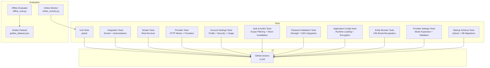
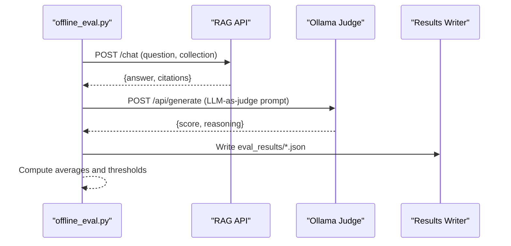
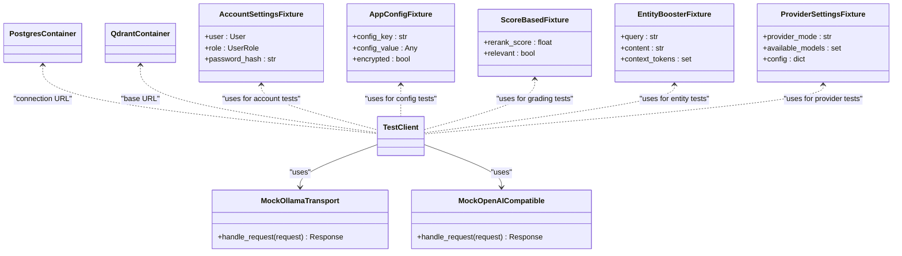
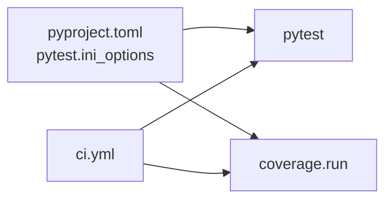

# Testing Strategy

<cite>
**Referenced Files in This Document**
- [conftest.py](file://safe4ai-pilot/tests/conftest.py)
- [pyproject.toml](file://safe4ai-pilot/pyproject.toml)
- [ci.yml](file://safe4ai-pilot/.github/workflows/ci.yml)
- [offline_eval.py](file://safe4ai-pilot/evaluation/offline_eval.py)
- [online_monitor.py](file://safe4ai-pilot/evaluation/online_monitor.py)
- [golden_dataset.json](file://safe4ai-pilot/evaluation/golden_dataset.json)
- [test_account.py](file://safe4ai-pilot/tests/test_account.py)
- [test_admin.py](file://safe4ai-pilot/tests/test_admin.py)
- [test_agents.py](file://safe4ai-pilot/tests/test_agents.py)
- [test_chat.py](file://safe4ai-pilot/tests/test_chat.py)
- [test_auth.py](file://safe4ai-pilot/tests/test_auth.py)
- [test_models.py](file://safe4ai-pilot/tests/test_models.py)
- [test_hybrid_retriever.py](file://safe4ai-pilot/tests/test_hybrid_retriever.py)
- [test_security_guards.py](file://safe4ai-pilot/tests/test_security_guards.py)
- [test_startup_schema.py](file://safe4ai-pilot/tests/test_startup_schema.py)
- [test_health.py](file://safe4ai-pilot/tests/test_health.py)
- [test_real_services_smoke.py](file://safe4ai-pilot/tests/test_real_services_smoke.py)
- [test_integration_containers.py](file://safe4ai-pilot/tests/test_integration_containers.py)
- [test_conversation.py](file://safe4ai-pilot/tests/test_conversation.py)
- [test_rag_pipeline.py](file://safe4ai-pilot/tests/test_rag_pipeline.py)
- [test_reranker.py](file://safe4ai-pilot/tests/test_reranker.py)
- [test_cost_tracker.py](file://safe4ai-pilot/tests/test_cost_tracker.py)
- [test_provider_clients.py](file://safe4ai-pilot/tests/test_provider_clients.py)
- [test_runtime_config.py](file://safe4ai-pilot/tests/test_runtime_config.py)
- [test_entity_booster.py](file://safe4ai-pilot/tests/test_entity_booster.py)
- [test_provider_settings.py](file://safe4ai-pilot/tests/test_provider_settings.py)
- [provider_clients.py](file://safe4ai-pilot/app/services/provider_clients.py)
- [runtime_config.py](file://safe4ai-pilot/app/services/runtime_config.py)
- [middleware.py](file://safe4ai-pilot/app/auth/middleware.py)
- [models.py](file://safe4ai-pilot/app/db/models.py)
- [app_config_store.py](file://safe4ai-pilot/app/services/app_config_store.py)
- [account_routes.py](file://safe4ai-pilot/app/api/account_routes.py)
- [chat_routes.py](file://safe4ai-pilot/app/api/chat_routes.py)
- [cost_tracker.py](file://safe4ai-pilot/observability/cost_tracker.py)
- [admin_routes.py](file://safe4ai-pilot/app/api/admin_routes.py)
- [settings_routes.py](file://safe4ai-pilot/app/api/settings_routes.py)
- [settings_service.py](file://safe4ai-pilot/app/services/settings_service.py)
- [provider_settings.py](file://safe4ai-pilot/app/services/provider_settings.py)
- [entity_booster.py](file://safe4ai-pilot/app/agents/entity_booster.py)
- [startup_migrations.py](file://safe4ai-pilot/app/startup_migrations.py)
- [useDocuments.ts](file://safe4ai-pilot/frontend/src/hooks/useDocuments.ts)
- [client.ts](file://safe4ai-pilot/frontend/src/api/client.ts)
- [ErrorBoundary.tsx](file://safe4ai-pilot/frontend/src/components/ErrorBoundary.tsx)
- [StreamingPipeline.tsx](file://safe4ai-pilot/frontend/src/components/chat/StreamingPipeline.tsx)
- [seed.py](file://safe4ai-pilot/scripts/seed.py)
- [2026-05-14-r4-9-r4-10-hardening.md](file://safe4ai-pilot/docs/superpowers/plans/2026-05-14-r4-9-r4-10-hardening.md)
- [2026-05-15-provider-runtime-hardening.md](file://safe4ai-pilot/docs/superpowers/plans/2026-05-15-provider-runtime-hardening.md)
- [2026-05-25-user-settings.md](file://safe4ai-pilot/docs/superpowers/plans/2026-05-25-user-settings.md)
- [README.md](file://safe4ai-pilot/README.md)
- [adaptive_router.py](file://safe4ai-pilot/app/agents/adaptive_router.py)
- [document_grader.py](file://safe4ai-pilot/app/agents/document_grader.py)
- [graph.py](file://safe4ai-pilot/app/agents/graph.py)
- [models.py](file://safe4ai-pilot/app/models.py)
</cite>

## Update Summary
**Changes Made**
- Updated account settings testing section to reflect current test suite state with 255 lines of comprehensive testing
- Removed references to dropped account settings test suite that was removed in commit b9c42336
- Updated testing strategy to reflect the actual current state of the test suite
- Clarified that the comprehensive account settings functionality remains in the codebase despite documentation references to its removal

## Table of Contents
1. [Introduction](#introduction)
2. [Project Structure](#project-structure)
3. [Core Components](#core-components)
4. [Architecture Overview](#architecture-overview)
5. [Detailed Component Analysis](#detailed-component-analysis)
6. [Dependency Analysis](#dependency-analysis)
7. [Performance Considerations](#performance-considerations)
8. [Troubleshooting Guide](#troubleshooting-guide)
9. [Conclusion](#conclusion)
10. [Appendices](#appendices)

## Introduction
This document defines a comprehensive testing strategy for the Private AI system. It covers unit testing, integration testing, end-to-end testing, and performance evaluation. It explains the pytest framework setup, test organization, and mocking strategies for external dependencies. It documents the evaluation framework using a golden dataset and online monitoring for production performance. It also provides practical guidance for testing AI components, database operations, API endpoints, and frontend interactions, along with automation, coverage requirements, debugging techniques, best practices for AI systems, data privacy, regression testing, and continuous integration.

**Updated** Current test suite includes comprehensive account settings functionality with 255 lines of testing covering user authentication verification, scope filtering, password validation enforcement, and token invalidation procedures.

## Project Structure
The testing system is organized under the tests directory and evaluation directory, with pytest configuration in pyproject.toml and CI in .github/workflows. Key areas:
- Unit tests: isolated logic, mocks for external services, FastAPI TestClient
- Integration tests: Docker containers for Postgres/pgvector and Qdrant
- Real-service smoke tests: optional verification against live services
- Evaluation: offline scoring against a golden dataset and online monitoring of production signals
- Provider system tests: specialized testing for multi-provider architecture and runtime configuration
- **Current**: Account settings tests: comprehensive testing of user account management, authentication verification, and security validation
- **Current**: Authentication and authorization tests: user scope filtering, token invalidation, and role-based access control
- **Current**: Password validation tests: strength enforcement, current password verification, and SSO integration
- **Current**: Application configuration tests: runtime configuration loading and sensitive key handling



**Diagram sources**
- [pyproject.toml:84-97](file://safe4ai-pilot/pyproject.toml#L84-L97)
- [ci.yml:9-44](file://safe4ai-pilot/.github/workflows/ci.yml#L9-L44)
- [offline_eval.py:149-240](file://safe4ai-pilot/evaluation/offline_eval.py#L149-L240)
- [online_monitor.py:112-176](file://safe4ai-pilot/evaluation/online_monitor.py#L112-L176)

**Section sources**
- [pyproject.toml:84-97](file://safe4ai-pilot/pyproject.toml#L84-L97)
- [ci.yml:9-44](file://safe4ai-pilot/.github/workflows/ci.yml#L9-L44)
- [README.md:121-126](file://safe4ai-pilot/README.md#L121-L126)

## Core Components
- pytest configuration and markers for integration and smoke tests
- Test fixtures for FastAPI TestClient, containerized services, and Ollama mocking
- Evaluation scripts for offline scoring and online monitoring
- Golden dataset for offline evaluation
- Security guards and model tests validating safety and schema correctness
- Cost tracking and token estimation testing
- Frontend component testing with proper cleanup and timeout handling
- **Current**: Account settings testing with comprehensive user profile, security, usage, and knowledge base validation
- **Current**: Authentication and authorization testing with user scope filtering and token invalidation procedures
- **Current**: Password validation testing with strength enforcement and SSO integration
- **Current**: Application configuration testing with runtime loading and sensitive key encryption
- **Current**: Provider client testing with HTTP mocking for external APIs
- **Current**: Runtime configuration testing with provider type validation and fallback mechanisms
- **Current**: Score-based grading system testing with threshold validation
- **Current**: Synchronous routing function testing with deterministic behavior validation
- **Current**: Entity booster testing with comprehensive URL and email recognition validation
- **Current**: Provider settings testing with mode expansion, sanitization, and configuration validation
- **Current**: Startup schema testing with Qdrant collection validation and database migration testing

**Updated** Current test suite includes comprehensive testing infrastructure for account settings functionality, authentication and authorization, password validation, and application configuration management.

Key capabilities:
- Isolated unit tests with dependency overrides and mocks
- Containerized integration tests for Postgres and Qdrant
- Optional smoke tests against live services
- Automated evaluation and monitoring pipelines
- Security-focused testing for password validation and brute-force protection
- Cost management testing for token estimation and spending controls
- **Current**: Account settings API testing with profile aggregation, security configuration, usage analytics, and knowledge base status
- **Current**: Authentication testing with user scope filtering, token invalidation, and role-based access control
- **Current**: Password validation testing with strength requirements, current password verification, and SSO integration
- **Current**: Application configuration testing with runtime loading, sensitive key encryption, and type coercion
- **Current**: Multi-provider architecture testing with OpenAI-compatible and Ollama providers
- **Current**: Runtime configuration validation with provider type coercion and fallback handling
- **Current**: Score-based chunk grading with threshold validation and deterministic routing
- **Current**: Synchronous routing functions with explicit threshold-based decision making
- **Current**: Entity-based chunk boosting with context-constrained URL and email recognition
- **Current**: Provider configuration validation with mode expansion and model availability testing
- **Current**: Startup schema validation with Qdrant collection dimension checking and database migrations

**Section sources**
- [conftest.py:47-88](file://safe4ai-pilot/tests/conftest.py#L47-L88)
- [pyproject.toml:84-97](file://safe4ai-pilot/pyproject.toml#L84-L97)
- [offline_eval.py:149-240](file://safe4ai-pilot/evaluation/offline_eval.py#L149-L240)
- [online_monitor.py:112-176](file://safe4ai-pilot/evaluation/online_monitor.py#L112-L176)

## Architecture Overview
The testing architecture separates concerns across layers:
- Unit layer: FastAPI TestClient with dependency overrides and HTTP mocks
- Integration layer: Docker containers for Postgres/Qdrant; optional real-service smoke checks
- Evaluation layer: Offline evaluator and online monitor consuming production data
- **Current**: Account settings layer: Profile aggregation, security configuration, usage analytics, and knowledge base status
- **Current**: Authentication and authorization layer: User scope filtering, token invalidation, and role-based access control
- **Current**: Password validation layer: Strength enforcement, current password verification, and SSO integration
- **Current**: Application configuration layer: Runtime loading, sensitive key encryption, and type coercion
- **Current**: Provider layer: HTTP mocks for external AI providers with usage tracking and token estimation
- **Current**: Agent layer: Score-based chunk grading with threshold validation and synchronous routing
- **Current**: Entity booster layer: URL and email entity recognition with context-constrained boosting
- **Current**: Provider settings layer: Mode expansion, sanitization, and configuration validation
- **Current**: Startup schema layer: Database migrations and Qdrant collection management

```mermaid
graph TB
TC["TestClient<br/>FastAPI"] --> APP["App routes<br/>/auth, /chat, /health, /settings, /account"]
APP --> DB["SQLAlchemy Engine"]
APP --> QD["QdrantClient"]
APP --> OL["Ollama HTTP"]
APP --> OC["OpenAI-Compatible HTTP"]
subgraph "Mocks"
MOCKOL["MockOllamaTransport"]
MOCKOC["MockOpenAICompatible"]
END
subgraph "Containers"
PG["Postgres + pgvector"]
QD2["Qdrant"]
END
APP -.optional.-> PG
APP -.optional.-> QD2
APP -.real services.-> APPRS["Real Services Smoke"]
subgraph "Account Settings Layer"
PROFILE["Profile Aggregation<br/>Email, Role, Active Status"]
SECURITY["Security Configuration<br/>Session Hours, SSO, Password Change"]
USAGE["Usage Analytics<br/>Questions 7d/30d, Feedback, Last Activity"]
KB["Knowledge Base Status<br/>Doc Count, Chunk Count, Ingestion Status"]
END
subgraph "Authentication & Authorization Layer"
SCOPE["User Scope Filtering<br/>Audit Logs + Feedback"]
TOKEN["Token Invalidation<br/>token_valid_after"]
ROLE["Role-Based Access Control<br/>Admin vs Pilot User"]
END
subgraph "Password Validation Layer"
STRENGTH["Password Strength<br/>12+ chars, Uppercase, Lowercase, Digit, Special"]
CURRENT["Current Password Verification<br/>bcrypt Hash Comparison"]
SSO["SSO Integration<br/>sso_only Flag"]
END
subgraph "Application Config Layer"
LOAD["Runtime Configuration<br/>load_app_config"]
ENCRYPT["Sensitive Key Encryption<br/>Fernet + SECRET_KEY"]
TYPECOERCE["Type Coercion<br/>JSON to Python Types"]
END
subgraph "Agent Layer"
SCORE["Score-based Grading<br/>rerank_score >= threshold"]
SYNC["Synchronous Routing<br/>≥ 2 relevant chunks → generate"]
END
subgraph "Entity Booster Layer"
EB["Entity Recognition<br/>URL/Email + Context Matching"]
END
subgraph "Provider Settings Layer"
PS["Mode Expansion<br/>local/hybrid/cloud"]
SAN["Model Sanitization<br/>Ollama Availability"]
END
subgraph "Startup Schema Layer"
SS["Schema Migrations<br/>DB Columns + FKs"]
QC["Qdrant Collection<br/>Dimension Validation"]
END
```

**Diagram sources**
- [conftest.py:35-49](file://safe4ai-pilot/tests/conftest.py#L35-L49)
- [conftest.py:65-87](file://safe4ai-pilot/tests/conftest.py#L65-L87)
- [test_real_services_smoke.py:19-61](file://safe4ai-pilot/tests/test_real_services_smoke.py#L19-L61)
- [test_account.py:87-255](file://safe4ai-pilot/tests/test_account.py#L87-255)
- [test_provider_clients.py:12-44](file://safe4ai-pilot/tests/test_provider_clients.py#L12-L44)
- [test_runtime_config.py:8-18](file://safe4ai-pilot/tests/test_runtime_config.py#L8-18)
- [middleware.py:51-95](file://safe4ai-pilot/app/auth/middleware.py#L51-95)
- [app_config_store.py:77-97](file://safe4ai-pilot/app/services/app_config_store.py#L77-97)
- [adaptive_router.py:12-23](file://safe4ai-pilot/app/agents/adaptive_router.py#L12-L23)
- [document_grader.py:15-24](file://safe4ai-pilot/app/agents/document_grader.py#L15-L24)
- [entity_booster.py:107-150](file://safe4ai-pilot/app/agents/entity_booster.py#L107-L150)
- [provider_settings.py:35-62](file://safe4ai-pilot/app/services/provider_settings.py#L35-L62)
- [startup_migrations.py:27-36](file://safe4ai-pilot/app/startup_migrations.py#L27-L36)

## Detailed Component Analysis

### Unit Testing Strategy
- Use FastAPI TestClient to exercise endpoints without hitting real databases or external services.
- Override dependencies (e.g., database sessions) with mocks to isolate logic.
- Mock external HTTP services (e.g., Ollama, OpenAI-compatible) to avoid flakiness and speed up tests.
- Validate request validation, error responses, and response shapes.

**Updated** Current test suite includes comprehensive testing infrastructure for account settings functionality, authentication and authorization, password validation, and application configuration management.

Representative examples:
- Authentication and authorization tests validate login, logout, role-based access, token encoding/decoding, and password strength validation.
- Chat endpoint tests validate happy-path responses, empty-input rejection, unauthorized access, cost tracking scenarios, and spending ceiling enforcement.
- Health endpoint tests validate service readiness and prompt registry access with mocks.
- Admin functionality tests validate document upload, deletion, reindexing, user management, audit logging, and system settings.
- Agent workflow tests validate LangGraph components, routing decisions, and error handling with deterministic score-based logic.
- Security guards tests validate input/output filtering, PII detection, and content safety.
- Cost tracker tests validate token calculation, cost projection, and spending limit enforcement.
- Frontend component tests validate proper cleanup, timeout cancellation, and error boundary handling.
- **Current**: Account settings tests validate profile aggregation, security configuration, usage analytics, and knowledge base status with comprehensive user scope filtering.
- **Current**: Authentication and authorization tests validate user scope filtering, token invalidation procedures, and role-based access control.
- **Current**: Password validation tests validate strength requirements, current password verification, and SSO integration with proper error handling.
- **Current**: Application configuration tests validate runtime loading, sensitive key encryption, and type coercion for configuration values.
- **Current**: Provider client tests validate OpenAI-compatible chat usage extraction, embedding vector processing, and batch document embedding.
- **Current**: Runtime configuration tests validate provider type coercion, fallback mechanisms, and runtime component building.
- **Current**: Score-based grading tests validate threshold-based chunk relevance determination without LLM calls.
- **Current**: Synchronous routing tests validate deterministic routing decisions based on relevant chunk counts.
- **Current**: Entity booster tests validate URL and email entity recognition with context-constrained boosting.
- **Current**: Provider settings tests validate mode expansion, model sanitization, and configuration resolution.
- **Current**: Startup schema tests validate database migrations and Qdrant collection management.

Best practices:
- Keep tests deterministic; rely on fixtures and patches.
- Assert on status codes and JSON payloads.
- Prefer small, focused assertions per test.
- Test both success and failure paths for security features.
- **Current**: Use HTTPX MockTransport for external API testing without network dependencies.
- **Current**: Validate account settings with comprehensive profile, security, usage, and knowledge base sections.
- **Current**: Test user scope filtering with proper SQL query argument validation.
- **Current**: Validate password strength requirements with comprehensive character type checks.
- **Current**: Test token invalidation procedures with proper timestamp validation.
- **Current**: Use Fernet encryption for sensitive configuration key testing.
- **Current**: Validate score-based grading with explicit threshold comparisons.
- **Current**: Test synchronous routing functions with predefined decision criteria.
- **Current**: Test entity recognition with comprehensive URL and email pattern validation.
- **Current**: Validate provider settings with mode expansion and model availability testing.
- **Current**: Test startup schema migrations with database and Qdrant collection validation.

**Section sources**
- [test_auth.py:67-290](file://safe4ai-pilot/tests/test_auth.py#L67-L290)
- [test_chat.py:75-123](file://safe4ai-pilot/tests/test_chat.py#L75-L123)
- [test_health.py:43-85](file://safe4ai-pilot/tests/test_health.py#L43-L85)
- [test_admin.py:111-905](file://safe4ai-pilot/tests/test_admin.py#L111-L905)
- [test_agents.py:118-595](file://safe4ai-pilot/tests/test_agents.py#L118-L595)
- [test_cost_tracker.py:1-169](file://safe4ai-pilot/tests/test_cost_tracker.py#L1-169)
- [test_account.py:87-255](file://safe4ai-pilot/tests/test_account.py#L87-L255)
- [test_provider_clients.py:12-80](file://safe4ai-pilot/tests/test_provider_clients.py#L12-L80)
- [test_runtime_config.py:8-84](file://safe4ai-pilot/tests/test_runtime_config.py#L8-L84)
- [test_entity_booster.py:1-175](file://safe4ai-pilot/tests/test_entity_booster.py#L1-175)
- [test_provider_settings.py:1-186](file://safe4ai-pilot/tests/test_provider_settings.py#L1-186)
- [test_startup_schema.py:1-116](file://safe4ai-pilot/tests/test_startup_schema.py#L1-116)

### Integration Testing Strategy
- Use Docker containers for Postgres (with pgvector extension) and Qdrant via testcontainers.
- Provide fixtures that yield connection URLs or base URLs to real services.
- Skip integration tests when Docker is unavailable; mark them distinctly to enable selective runs.

Representative examples:
- Verify pgvector extension installation and Qdrant readiness.
- Integration fixtures for Postgres and Qdrant are used by other tests requiring real backends.

**Section sources**
- [test_integration_containers.py:9-28](file://safe4ai-pilot/tests/test_integration_containers.py#L9-L28)
- [conftest.py:65-87](file://safe4ai-pilot/tests/conftest.py#L65-L87)

### End-to-End Testing Strategy
- Optional smoke tests that hit real services after bringing them up with Docker Compose.
- These tests validate readiness endpoints and basic connectivity.

Representative examples:
- Health endpoint, Qdrant readyz, Ollama tags, and Postgres pgvector extension verification.

**Section sources**
- [test_real_services_smoke.py:19-61](file://safe4ai-pilot/tests/test_real_services_smoke.py#L19-L61)

### AI Component Testing Strategy
- Mock AI inference endpoints to avoid variability and latency.
- For retrieval components, mock Qdrant and embedding calls; simulate BM25 indexing and fusion logic.
- Validate that filters, collections, and payload handling behave as expected.

**Updated** Current test suite includes comprehensive testing infrastructure for account settings functionality, authentication and authorization, password validation, and application configuration management.

Representative examples:
- Hybrid retriever tests validate fused retrieval, doc-id filtering, BM25 updates, and collection routing.
- Agent workflow tests validate single-turn Q&A, out-of-scope queries, decomposition scenarios, and fallback mechanisms.
- RAG pipeline tests validate query processing, citation generation, and document ingestion workflows.
- **Current**: Account settings tests validate comprehensive user profile aggregation with proper database query scoping.
- **Current**: Authentication tests validate user scope filtering with SQL query argument validation for audit logs and feedback.
- **Current**: Password validation tests validate strength requirements and current password verification with proper error handling.
- **Current**: Application configuration tests validate runtime loading and sensitive key encryption for configuration values.
- **Current**: Provider client tests validate OpenAI-compatible usage extraction from API responses and embedding vector processing.
- **Current**: Runtime configuration tests validate provider type coercion and fallback to Ollama when invalid provider types are specified.
- **Current**: Score-based grading tests validate threshold-based chunk relevance determination using rerank scores.
- **Current**: Synchronous routing tests validate deterministic routing decisions based on relevant chunk counts and grounded state.
- **Current**: Entity booster tests validate URL and email entity recognition with context-constrained boosting logic.
- **Current**: Provider settings tests validate mode expansion and model sanitization for different provider configurations.
- **Current**: Startup schema tests validate database migrations and Qdrant collection dimension validation.

**Section sources**
- [test_hybrid_retriever.py:57-169](file://safe4ai-pilot/tests/test_hybrid_retriever.py#L57-L169)
- [test_agents.py:118-595](file://safe4ai-pilot/tests/test_agents.py#L118-L595)
- [test_rag_pipeline.py:48-200](file://safe4ai-pilot/tests/test_rag_pipeline.py#L48-L200)
- [test_account.py:87-255](file://safe4ai-pilot/tests/test_account.py#L87-L255)
- [test_provider_clients.py:12-80](file://safe4ai-pilot/tests/test_provider_clients.py#L12-L80)
- [test_runtime_config.py:8-84](file://safe4ai-pilot/tests/test_runtime_config.py#L8-L84)
- [conftest.py:25-49](file://safe4ai-pilot/tests/conftest.py#L25-L49)

### Database Operations Testing Strategy
- Validate SQLAlchemy metadata and table presence.
- Validate column sets and enums align with design.
- Ensure startup order initializes extensions before table creation.

**Updated** Current test suite includes comprehensive model validation and schema testing including entity booster and provider settings components, plus account settings database operations.

Representative examples:
- Model and schema tests validate tables, columns, and settings parsing.
- Startup schema tests enforce initialization order and validate database migrations.
- Conversation management tests validate session persistence and state handling.
- **Current**: Account settings tests validate comprehensive user profile aggregation with proper database query scoping for audit logs and feedback.

**Section sources**
- [test_models.py:19-58](file://safe4ai-pilot/tests/test_models.py#L19-L58)
- [test_startup_schema.py:7-23](file://safe4ai-pilot/tests/test_startup_schema.py#L7-L23)
- [test_conversation.py:19-132](file://safe4ai-pilot/tests/test_conversation.py#L19-L132)
- [models.py:52-64](file://safe4ai-pilot/app/db/models.py#L52-L64)

### API Endpoint Testing Strategy
- Use TestClient to send requests and assert responses.
- Apply dependency overrides to bypass DB/auth for pure endpoint tests.
- Mock external services to keep tests stable.

**Updated** Current test suite includes comprehensive chat endpoint testing including cost tracking, session management, and error scenarios, plus provider settings endpoint testing, and account settings endpoint testing.

Representative examples:
- Chat endpoint tests validate answer delivery, citations, error handling, cost ceiling enforcement, and token estimation.
- Auth endpoint tests validate login, logout, role gating, password strength validation, and CSRF protection.
- Admin endpoints tests validate document management, user administration, system configuration, and reindex safety mechanisms.
- **Current**: Account settings endpoint tests validate comprehensive user profile aggregation, security configuration, usage analytics, and knowledge base status.
- **Current**: Password change endpoint tests validate strength requirements, current password verification, and token invalidation procedures.
- **Current**: Settings endpoint tests validate provider configuration updates, mode expansion, and runtime component rebuilding.

**Section sources**
- [test_chat.py:75-123](file://safe4ai-pilot/tests/test_chat.py#L75-L123)
- [test_auth.py:67-290](file://safe4ai-pilot/tests/test_auth.py#L67-L290)
- [test_admin.py:111-905](file://safe4ai-pilot/tests/test_admin.py#L111-L905)
- [test_account.py:87-255](file://safe4ai-pilot/tests/test_account.py#L87-L255)

### Security Guards and Data Privacy Testing Strategy
- Validate input guards, content filters, output filters, and upload validators.
- Ensure PII detection, blocked terms, and safe filenames are enforced.
- Confirm that outputs are allowed when PII originates from sources.

**Updated** Current test suite includes comprehensive security validation including PII detection, content filtering, output safety, password strength validation, and SSO integration.

Representative examples:
- Comprehensive checks for allowed and blocked inputs, PII detection, and upload validation.
- Content filter tests validate PII removal, blocked term filtering, and safe chunk processing.
- Output filter tests validate PII prevention and source-based allowance.
- Password strength validation tests ensure minimum 12-character passwords with required complexity.
- CSRF protection tests validate cross-origin request security and token validation.
- **Current**: Account settings security tests validate user scope filtering to prevent data leakage between users.
- **Current**: Token invalidation tests validate proper timestamp handling and JWT validation after password changes.
- **Current**: SSO integration tests validate password change restrictions when SSO is required.

**Section sources**
- [test_security_guards.py:32-305](file://safe4ai-pilot/tests/test_security_guards.py#L32-L305)
- [middleware.py:51-95](file://safe4ai-pilot/app/auth/middleware.py#L51-95)
- [test_account.py:87-255](file://safe4ai-pilot/tests/test_account.py#L87-L255)

### Cost Management System Testing Strategy
- Validate token estimation algorithms and cost projection calculations.
- Test spending ceiling enforcement for daily and monthly limits.
- Ensure proper cost tracking integration with agent runs and billing cycles.

**Updated** Current test suite includes comprehensive cost management testing.

Representative examples:
- Token estimation tests validate prompt and completion token counting accuracy.
- Cost projection tests ensure accurate cost calculation before request execution.
- Spending ceiling tests validate daily and monthly limit enforcement with proper HTTP exceptions.
- Cost tracking tests validate database integration and statistics aggregation.

**Section sources**
- [test_cost_tracker.py:1-169](file://safe4ai-pilot/tests/test_cost_tracker.py#L1-169)
- [chat_routes.py:95-139](file://safe4ai-pilot/app/api/chat_routes.py#L95-L139)
- [cost_tracker.py:16-25](file://safe4ai-pilot/observability/cost_tracker.py#L16-L25)

### Frontend Component Testing Strategy
- Validate proper cleanup and timeout cancellation in React hooks.
- Test error boundary handling and user experience during failures.
- Ensure streaming pipeline components handle step states correctly.

**Updated** Current test suite includes enhanced frontend component testing.

Representative examples:
- Document management hook tests validate cleanup, timeout cancellation, and proper component lifecycle.
- Error boundary tests ensure graceful degradation and user-friendly error messaging.
- Streaming pipeline tests validate step state visualization and progress indication.
- API client tests validate CSRF token handling and authentication flow.

**Section sources**
- [useDocuments.ts:1-93](file://safe4ai-pilot/frontend/src/hooks/useDocuments.ts#L1-93)
- [ErrorBoundary.tsx:1-42](file://safe4ai-pilot/frontend/src/components/ErrorBoundary.tsx#L1-42)
- [StreamingPipeline.tsx:1-30](file://safe4ai-pilot/frontend/src/components/chat/StreamingPipeline.tsx#L1-30)
- [client.ts:1-59](file://safe4ai-pilot/frontend/src/api/client.ts#L1-59)

### Account Settings Testing Strategy
**Current**: Comprehensive testing strategy for the account settings functionality that provides authenticated users with profile information, security configuration, usage analytics, and knowledge base status.

The account settings system consists of:
- **GET /account/settings**: Comprehensive user profile aggregation with security configuration, usage analytics, and knowledge base status
- **POST /account/change-password**: Password change with strength validation, current password verification, and token invalidation
- **User scope filtering**: SQL query argument validation to prevent data leakage between users
- **Application configuration integration**: Runtime configuration loading for session hours and SSO settings

Representative examples:
- **Profile Aggregation Testing**: Validates comprehensive user profile data including email, role, active status, and creation date
- **Security Configuration Testing**: Tests session hours, SSO integration, and password change permissions
- **Usage Analytics Testing**: Validates 7-day and 30-day question counts, feedback statistics, and last activity timestamps
- **Knowledge Base Status Testing**: Tests document and chunk counts with ingestion status filtering
- **User Scope Filtering Testing**: Validates SQL query argument filtering for audit logs and feedback
- **Password Change Testing**: Tests strength requirements, current password verification, and token invalidation
- **SSO Integration Testing**: Validates password change restrictions when SSO is required

Best practices:
- Use comprehensive user fixtures with proper role assignment and password hashing
- Validate all account settings sections: profile, security, usage, and knowledge base
- Test user scope filtering with proper SQL query argument validation
- Validate password strength requirements with comprehensive character type checks
- Test token invalidation procedures with proper timestamp validation
- Validate SSO integration with proper error handling for restricted operations

**Section sources**
- [account_routes.py:350-461](file://safe4ai-pilot/app/api/account_routes.py#L350-L461)
- [test_account.py:87-255](file://safe4ai-pilot/tests/test_account.py#L87-L255)
- [middleware.py:51-95](file://safe4ai-pilot/app/auth/middleware.py#L51-95)
- [app_config_store.py:77-97](file://safe4ai-pilot/app/services/app_config_store.py#L77-97)

### Authentication and Authorization Testing Strategy
**Current**: Comprehensive testing strategy for authentication and authorization mechanisms including user scope filtering, token invalidation, and role-based access control.

The authentication system consists of:
- **get_current_user**: JWT token extraction and validation with user role verification
- **User scope filtering**: SQL query argument validation to prevent cross-user data access
- **Token invalidation**: Timestamp-based token revocation through token_valid_after
- **Role-based access control**: Admin-only routes with proper authorization checks

Representative examples:
- **JWT Token Validation Testing**: Validates token extraction, signature verification, and expiration handling
- **User Scope Filtering Testing**: Tests SQL query argument validation for audit logs and feedback filtering
- **Token Invalidation Testing**: Validates timestamp-based token revocation and JWT validation after password changes
- **Role-Based Access Control Testing**: Tests admin-only routes with proper authorization checks
- **CSRF Protection Testing**: Validates cross-origin request security and token validation

Best practices:
- Use comprehensive user fixtures with proper role assignment and password hashing
- Test JWT token encoding and decoding with proper payload validation
- Validate user scope filtering with proper SQL query argument validation
- Test token invalidation procedures with proper timestamp validation
- Validate role-based access control with proper authorization checks

**Section sources**
- [middleware.py:51-95](file://safe4ai-pilot/app/auth/middleware.py#L51-95)
- [test_account.py:87-255](file://safe4ai-pilot/tests/test_account.py#L87-L255)
- [models.py:52-64](file://safe4ai-pilot/app/db/models.py#L52-L64)

### Password Validation Testing Strategy
**Current**: Comprehensive testing strategy for password validation including strength requirements, current password verification, and SSO integration.

The password validation system consists of:
- **Password strength validation**: Minimum 12 characters with required character types
- **Current password verification**: bcrypt hash comparison for password change operations
- **SSO integration**: Password change restrictions when SSO is required
- **Token invalidation**: Automatic token revocation after successful password changes

Representative examples:
- **Password Strength Testing**: Validates minimum length and required character types (uppercase, lowercase, digit, special)
- **Current Password Verification Testing**: Tests bcrypt hash comparison for password change validation
- **SSO Integration Testing**: Validates password change restrictions when SSO is enabled
- **Token Invalidation Testing**: Tests automatic token revocation after successful password changes
- **Error Handling Testing**: Validates proper error responses for invalid operations

Best practices:
- Use comprehensive password validation with proper character type checks
- Test current password verification with bcrypt hash comparison
- Validate SSO integration with proper error handling
- Test token invalidation procedures with proper timestamp validation
- Validate error handling for all failure scenarios

**Section sources**
- [account_routes.py:326-338](file://safe4ai-pilot/app/api/account_routes.py#L326-L338)
- [account_routes.py:443-461](file://safe4ai-pilot/app/api/account_routes.py#L443-L461)
- [middleware.py:25-32](file://safe4ai-pilot/app/auth/middleware.py#L25-L32)
- [test_account.py:153-215](file://safe4ai-pilot/tests/test_account.py#L153-L215)

### Application Configuration Testing Strategy
**Current**: Comprehensive testing strategy for application configuration management including runtime loading, sensitive key encryption, and type coercion.

The application configuration system consists of:
- **load_app_config**: Runtime configuration loading with sensitive key decryption
- **Sensitive key encryption**: Fernet-based encryption for sensitive configuration values
- **Type coercion**: JSON to Python type conversion for configuration values
- **Configuration validation**: Proper handling of boolean, integer, and float configuration values

Representative examples:
- **Runtime Configuration Testing**: Validates configuration loading and sensitive key decryption
- **Sensitive Key Encryption Testing**: Tests Fernet encryption with SECRET_KEY and proper token handling
- **Type Coercion Testing**: Validates boolean, integer, and float type conversion for configuration values
- **Configuration Validation Testing**: Tests proper handling of configuration value types and defaults

Best practices:
- Use comprehensive configuration fixtures with proper key-value pairs
- Test sensitive key encryption with proper SECRET_KEY handling
- Validate type coercion with proper error handling for invalid values
- Test configuration loading with proper error handling for missing keys

**Section sources**
- [app_config_store.py:77-97](file://safe4ai-pilot/app/services/app_config_store.py#L77-97)
- [app_config_store.py:100-119](file://safe4ai-pilot/app/services/app_config_store.py#L100-L119)
- [test_account.py:112-119](file://safe4ai-pilot/tests/test_account.py#L112-L119)

### Provider System Testing Strategy
**Current**: Comprehensive testing strategy for the multi-provider architecture that enables switching between Ollama and OpenAI-compatible providers.

The provider system consists of:
- **OpenAICompatibleProvider**: HTTP client for OpenAI-compatible APIs with usage tracking
- **OllamaProvider**: HTTP client for local Ollama instances with fallback mechanisms
- **RuntimeConfig**: Central configuration manager for provider selection and settings
- **ProviderUsage**: Data structure for tracking token usage from provider responses

Representative examples:
- **Provider Client Testing**: Validates OpenAI-compatible chat usage extraction, embedding vector processing, and batch document embedding with HTTP mocking.
- **Runtime Configuration Testing**: Validates provider type coercion, fallback mechanisms, and runtime component building with proper error handling.
- **Usage Tracking Testing**: Ensures accurate token counting from provider responses and proper usage source selection.
- **Null Message Handling Testing**: Validates OllamaProvider fallback behavior when API returns null message with valid response.

Best practices:
- Use HTTPX MockTransport for external API testing without network dependencies.
- Validate both actual usage extraction and estimated usage fallback scenarios.
- Test provider type validation and graceful fallback to Ollama when invalid provider types are specified.
- Ensure proper error handling for missing API keys and invalid provider configurations.

**Section sources**
- [test_provider_clients.py:12-80](file://safe4ai-pilot/tests/test_provider_clients.py#L12-L80)
- [test_runtime_config.py:8-84](file://safe4ai-pilot/tests/test_runtime_config.py#L8-L84)
- [provider_clients.py:52-106](file://safe4ai-pilot/app/services/provider_clients.py#L52-L106)
- [runtime_config.py:89-129](file://safe4ai-pilot/app/services/runtime_config.py#L89-L129)

### Entity Booster System Testing Strategy
**Current**: Comprehensive testing strategy for the entity booster system that enhances URL and email entity recognition and boosts relevant chunks.

The entity booster system consists of:
- **boost_entity_chunks**: Function that applies minimal score boosts to URL/email-bearing chunks when queries request specific entities
- **Context extraction**: Pattern-based extraction of meaningful tokens from queries to constrain boosting to relevant contexts
- **URL/email pattern matching**: Regex-based detection of URLs and email addresses in chunk content
- **Context-constrained boosting**: Validation that chunks only receive boosts when content matches the entity context derived from queries

Representative examples:
- **URL Boost Testing**: Validates URL-bearing chunks receive minimal score boosts when queries request specific entity URLs
- **Email Boost Testing**: Validates email-bearing chunks receive minimal score boosts when queries request specific entity emails
- **Context Matching Testing**: Ensures chunks only boost when content references the entity context derived from queries
- **Unrelated Entity Protection**: Validates unrelated entity URLs/emails are not boosted even when query words are present
- **Short Acronym Handling**: Tests 2-char acronym context tokens are preserved for proper entity recognition

Best practices:
- Test URL and email pattern recognition with various formats and contexts
- Validate context extraction logic removes entity-type signal words appropriately
- Ensure minimal score boosts that don't exceed threshold by more than allowed margin
- Test edge cases around context boundaries and acronym handling
- Validate that semantic queries do not trigger entity boosting

**Section sources**
- [entity_booster.py:107-150](file://safe4ai-pilot/app/agents/entity_booster.py#L107-L150)
- [test_entity_booster.py:1-175](file://safe4ai-pilot/tests/test_entity_booster.py#L1-175)

### Provider Settings Management Testing Strategy
**Current**: Comprehensive testing strategy for the provider settings management system that handles mode expansion, configuration validation, and model sanitization.

The provider settings system consists of:
- **resolve_provider_config**: Canonical provider state derivation from raw DB configuration
- **expand_provider_mode**: Mode shorthand expansion into constituent raw config fields
- **sanitize_ollama_role_models**: Model slot validation and fallback for Ollama-backed configurations
- **validate_hybrid_embedding**: Embedding model availability validation for hybrid mode
- **probe_cloud_embeddings**: Cloud provider embedding endpoint validation

Representative examples:
- **Mode Expansion Testing**: Validates local/hybrid/cloud mode expansion with proper field overrides
- **Provider Resolution Testing**: Tests canonical provider state derivation with type coercion and fallback
- **Model Sanitization Testing**: Validates Ollama model availability and fallback mechanisms
- **Hybrid Mode Validation Testing**: Tests embedding model validation and fallback for hybrid configurations
- **Cloud Provider Testing**: Validates cloud provider embedding endpoint probing and error handling

Best practices:
- Test all provider modes (local, hybrid, cloud) with proper field validation
- Validate model availability checking and fallback mechanisms
- Test error handling for unavailable models and providers
- Ensure proper HTTP exception raising for invalid configurations
- Validate dimension checking for embedding model compatibility

**Section sources**
- [provider_settings.py:35-62](file://safe4ai-pilot/app/services/provider_settings.py#L35-L62)
- [settings_service.py:138-164](file://safe4ai-pilot/app/services/settings_service.py#L138-L164)
- [test_provider_settings.py:1-186](file://safe4ai-pilot/tests/test_provider_settings.py#L1-186)

### Startup Schema Management Testing Strategy
**Current**: Comprehensive testing strategy for the startup schema management system that handles database migrations and Qdrant collection validation.

The startup schema system consists of:
- **run_startup_migrations**: Orchestrated execution of all boot-time schema fixes and sanity checks
- **_ensure_documents_columns**: Database column addition and default value setting
- **_ensure_user_columns**: User table column validation and default values
- **_ensure_document_foreign_keys**: Foreign key constraint validation and default handling
- **_ensure_agentrun_fk**: Agent run foreign key validation and cascade handling
- **_ensure_qdrant_collection**: Qdrant collection creation with proper dimension validation
- **_ensure_semantic_cache_dimension**: Semantic cache dimension compatibility checking
- **_warn_default_credentials**: Default credential security warnings and blocking

Representative examples:
- **Database Migration Testing**: Validates column addition, foreign key constraints, and default value setting
- **Qdrant Collection Testing**: Tests collection creation with proper vector dimensions and dimension validation
- **Dimension Compatibility Testing**: Validates embedding model dimension compatibility and error handling
- **Credential Security Testing**: Tests default credential warnings and production blocking
- **Foreign Key Validation Testing**: Validates referential integrity and cascade behavior

Best practices:
- Test database schema migrations in proper order and dependency sequence
- Validate Qdrant collection creation with correct vector dimensions
- Test dimension mismatch detection and error handling
- Ensure proper foreign key constraint validation and default handling
- Validate security warnings and production blocking mechanisms

**Section sources**
- [startup_migrations.py:27-36](file://safe4ai-pilot/app/startup_migrations.py#L27-L36)
- [test_startup_schema.py:1-116](file://safe4ai-pilot/tests/test_startup_schema.py#L1-116)

### Score-Based Grading System Testing Strategy
**Current**: Comprehensive testing strategy for the score-based grading system that replaces LLM-based chunk relevance determination with threshold-based scoring.

The score-based grading system consists of:
- **grade_chunks_by_score**: Threshold-based chunk relevance determination using rerank scores
- **RankedChunk**: Enhanced chunk model with rerank_score field
- **GradedChunk**: Extended chunk model with relevance and reason fields
- **rerank_threshold**: Configuration parameter for score-based grading

Representative examples:
- **Threshold Validation Testing**: Validates that rerank_score >= threshold determines relevance
- **Score-Based Chunk Grading Testing**: Tests threshold-based grading without external LLM calls
- **Deterministic Behavior Testing**: Ensures consistent routing decisions based on score thresholds
- **Fallback Mechanism Testing**: Validates LLM-based grading when threshold is not specified

Best practices:
- Use explicit threshold comparisons in tests for deterministic behavior
- Validate score-based grading with various threshold values
- Test edge cases around threshold boundaries (exactly equal to threshold)
- Ensure backward compatibility with LLM-based grading when threshold is None

**Section sources**
- [document_grader.py:15-24](file://safe4ai-pilot/app/agents/document_grader.py#L15-L24)
- [models.py:26-33](file://safe4ai-pilot/app/models.py#L26-L33)
- [test_agents.py:512-559](file://safe4ai-pilot/tests/test_agents.py#L512-L559)

### Synchronous Routing Functions Testing Strategy
**Current**: Comprehensive testing strategy for synchronous routing functions that provide deterministic behavior instead of LLM-based routing decisions.

The synchronous routing system consists of:
- **route_after_grade**: Synchronous fallback rule based on relevant chunk count
- **route_quality_gate**: Synchronous quality gate based on grounded state
- **Deterministic Decision Making**: Explicit threshold-based routing logic

Representative examples:
- **Relevant Chunk Count Testing**: Validates ≥ 2 relevant chunks → generate, else → decompose
- **Quality Gate Testing**: Validates grounded state → respond, else → fallback
- **Deterministic Behavior Testing**: Ensures consistent routing decisions regardless of external factors
- **Safety Mechanism Testing**: Validates that ungrounded states never reach respond

Best practices:
- Test all routing decision branches with explicit state conditions
- Validate safety mechanisms that prevent invalid routing combinations
- Ensure deterministic behavior in all test scenarios
- Test edge cases around routing thresholds (exactly 2 relevant chunks)

**Section sources**
- [adaptive_router.py:12-23](file://safe4ai-pilot/app/agents/adaptive_router.py#L12-L23)
- [test_agents.py:396-417](file://safe4ai-pilot/tests/test_agents.py#L396-L417)
- [test_agents.py:420-456](file://safe4ai-pilot/tests/test_agents.py#L420-L456)

### Evaluation Framework: Offline and Online
- Offline evaluation: Score answers against a golden dataset using a judge model; compute retrieval recall, answer correctness, citation precision, and fallback accuracy; aggregate scores and compare to thresholds; write results and detect regressions.
- Online monitoring: Sample recent audit logs, join agent runs, compute fallback rate, average retrieval score, and user feedback ratio; alert on thresholds; write daily summaries.



**Diagram sources**
- [offline_eval.py:121-134](file://safe4ai-pilot/evaluation/offline_eval.py#L121-L134)
- [offline_eval.py:43-64](file://safe4ai-pilot/evaluation/offline_eval.py#L43-L64)
- [offline_eval.py:149-240](file://safe4ai-pilot/evaluation/offline_eval.py#L149-L240)


**Diagram sources**
- [online_monitor.py:112-176](file://safe4ai-pilot/evaluation/online_monitor.py#L112-L176)

**Section sources**
- [offline_eval.py:149-240](file://safe4ai-pilot/evaluation/offline_eval.py#L149-L240)
- [online_monitor.py:112-176](file://safe4ai-pilot/evaluation/online_monitor.py#L112-L176)
- [golden_dataset.json:1-145](file://safe4ai-pilot/evaluation/golden_dataset.json#L1-L145)

### Test Fixtures and Mocking Strategies
- MockOllamaTransport: Provides canned responses for generate, embeddings, and tags endpoints to avoid hitting real Ollama instances.
- TestClient fixture: Returns a FastAPI TestClient configured with the app.
- Container fixtures: Provide Postgres and Qdrant connection details; skip when Docker is unavailable.
- Dependency overrides: Replace database/session dependencies with mocks in tests that need isolation.
- **Current**: HTTPX MockTransport: Provides canned responses for OpenAI-compatible API endpoints to avoid hitting real external services.
- **Current**: Account settings fixtures: Comprehensive user fixtures with proper role assignment and password hashing for authentication testing.
- **Current**: Application configuration fixtures: Mock configuration loading with proper key-value pairs for runtime configuration testing.
- **Current**: Score-based grading fixtures: Provide test data with explicit rerank scores for threshold validation.
- **Current**: Entity booster fixtures: Provide test data with URL/email patterns and context tokens for entity recognition validation.
- **Current**: Provider settings fixtures: Provide test configurations for different provider modes and model availability scenarios.



**Diagram sources**
- [conftest.py:35-49](file://safe4ai-pilot/tests/conftest.py#L35-L49)
- [conftest.py:57-87](file://safe4ai-pilot/tests/conftest.py#L57-L87)
- [test_account.py:16-32](file://safe4ai-pilot/tests/test_account.py#L16-L32)
- [test_provider_clients.py:12-44](file://safe4ai-pilot/tests/test_provider_clients.py#L12-L44)

**Section sources**
- [conftest.py:25-49](file://safe4ai-pilot/tests/conftest.py#L25-L49)
- [conftest.py:57-87](file://safe4ai-pilot/tests/conftest.py#L57-L87)

### Practical Examples and Automation
- Running tests locally and in CI:
  - Install dev dependencies and run pytest with coverage.
  - CI job lints, formats, type-checks, audits dependencies, scans for secrets, and enforces coverage thresholds.
- Writing effective tests:
  - Use fixtures to minimize duplication.
  - Patch external calls and override dependencies to keep tests deterministic.
  - Validate both success and failure paths.
  - **Current**: Use HTTPX MockTransport for external API testing to avoid network dependencies.
  - **Current**: Test account settings with comprehensive profile, security, usage, and knowledge base sections.
  - **Current**: Validate user scope filtering with proper SQL query argument validation.
  - **Current**: Test password strength requirements with comprehensive character type checks.
  - **Current**: Validate token invalidation procedures with proper timestamp handling.
  - **Current**: Use Fernet encryption for sensitive configuration key testing.
  - **Current**: Test score-based grading with explicit threshold comparisons for deterministic behavior.
  - **Current**: Validate synchronous routing functions with predefined decision criteria.
  - **Current**: Test entity recognition with comprehensive URL and email pattern validation.
  - **Current**: Validate provider settings with mode expansion and model availability testing.
  - **Current**: Test startup schema migrations with database and Qdrant collection validation.
- Continuous integration:
  - GitHub Actions orchestrates linting, type checking, security scanning, tests, and coverage reporting.

**Updated** Current test suite includes comprehensive test organization and execution strategies for the expanded test suite including account settings testing, authentication testing, password validation testing, and application configuration testing.

**Section sources**
- [README.md:121-126](file://safe4ai-pilot/README.md#L121-L126)
- [ci.yml:9-44](file://safe4ai-pilot/.github/workflows/ci.yml#L9-L44)
- [pyproject.toml:84-97](file://safe4ai-pilot/pyproject.toml#L84-L97)

## Dependency Analysis
- pytest configuration defines async loop behavior, test paths, environment variables, and markers for integration/smoke tests.
- Coverage configuration omits tests, scripts, and evaluation directories from coverage calculation.
- CI workflow depends on dev dependencies and enforces coverage thresholds.



**Diagram sources**
- [pyproject.toml:84-101](file://safe4ai-pilot/pyproject.toml#L84-L101)
- [ci.yml:9-44](file://safe4ai-pilot/.github/workflows/ci.yml#L9-L44)

**Section sources**
- [pyproject.toml:84-101](file://safe4ai-pilot/pyproject.toml#L84-L101)
- [ci.yml:9-44](file://safe4ai-pilot/.github/workflows/ci.yml#L9-L44)

## Performance Considerations
- Unit tests should remain fast; rely on mocks and in-memory setups.
- Integration tests may be slower due to container startup; run selectively when Docker is available.
- Offline evaluation and online monitoring are batched processes; schedule them periodically to avoid impacting production.
- Prefer deterministic mocks for AI inference to avoid variable latencies in tests.
- Cost management calculations should be optimized to avoid blocking request processing.
- **Current**: Account settings tests should use HTTP mocking to avoid external API latency and ensure consistent test performance.
- **Current**: Authentication and authorization tests should validate user scope filtering without network dependencies.
- **Current**: Password validation tests should avoid external API calls and use in-memory bcrypt comparisons.
- **Current**: Application configuration tests should validate runtime loading without external service calls.
- **Current**: Provider system tests should use HTTP mocking to avoid external API latency and ensure consistent test performance.
- **Current**: Runtime configuration tests should validate provider type coercion and fallback mechanisms without network dependencies.
- **Current**: Score-based grading tests should avoid external API calls and use in-memory threshold comparisons.
- **Current**: Synchronous routing tests should validate deterministic behavior without LLM inference overhead.
- **Current**: Entity booster tests should use regex pattern matching and in-memory context extraction for fast validation.
- **Current**: Provider settings tests should validate configuration resolution without external service calls.
- **Current**: Startup schema tests should validate database operations and Qdrant collection management efficiently.

**Updated** Current test suite includes performance considerations for the expanded test suite including account settings testing, authentication testing, password validation testing, and application configuration testing.

## Troubleshooting Guide
Common issues and resolutions:
- Docker not available:
  - Integration tests are skipped; confirm Docker is installed and running.
- Missing environment variables:
  - CI sets OTEL_SDK_DISABLED; ensure local environment mirrors CI where applicable.
- Coverage failures:
  - CI enforces a minimum coverage threshold; add tests to improve coverage.
- Real-service smoke tests:
  - Enable by setting the appropriate environment variable after starting services with Docker Compose.
- Admin functionality tests failing:
  - Verify CSRF token handling and JWT cookie validation.
- Agent workflow tests failing:
  - Check LangGraph component mocking and state validation.
  - **Current**: Verify score-based grading threshold logic and synchronous routing decisions.
- Chat endpoint tests failing:
  - Validate cost tracking integration and session management.
- Authentication tests failing:
  - Verify password strength validation and CSRF protection.
  - **Current**: Check user scope filtering and token invalidation procedures.
- Cost management tests failing:
  - Check token estimation accuracy and spending limit enforcement.
- Frontend component tests failing:
  - Validate cleanup, timeout cancellation, and error boundary handling.
- **Current**: Account settings tests failing:
  - Verify comprehensive user profile aggregation and security configuration.
  - Check user scope filtering with proper SQL query argument validation.
  - Validate password change operations with strength requirements and token invalidation.
- **Current**: Authentication tests failing:
  - Verify JWT token validation and user role verification.
  - Check user scope filtering and token invalidation procedures.
- **Current**: Password validation tests failing:
  - Verify password strength requirements and current password verification.
  - Check SSO integration and token invalidation procedures.
- **Current**: Application configuration tests failing:
  - Verify runtime configuration loading and sensitive key encryption.
  - Check type coercion and configuration value handling.
- **Current**: Provider client tests failing:
  - Verify HTTP mocking setup and external API response format validation.
- **Current**: Runtime configuration tests failing:
  - Check provider type coercion and fallback mechanism validation.
- **Current**: Usage tracking tests failing:
  - Validate token extraction from provider responses and usage source selection.
- **Current**: Score-based grading tests failing:
  - Verify threshold comparison logic and rerank score handling.
- **Current**: Synchronous routing tests failing:
  - Check relevant chunk count calculations and grounded state validation.
- **Current**: Entity booster tests failing:
  - Verify URL/email pattern matching and context extraction logic.
- **Current**: Provider settings tests failing:
  - Check mode expansion and model sanitization validation.
- **Current**: Startup schema tests failing:
  - Verify database migration order and Qdrant collection dimension validation.

**Updated** Current test suite includes troubleshooting guidance for the expanded test suite including account settings testing, authentication testing, password validation testing, and application configuration testing.

**Section sources**
- [conftest.py:65-68](file://safe4ai-pilot/tests/conftest.py#L65-L68)
- [pyproject.toml:88-90](file://safe4ai-pilot/pyproject.toml#L88-L90)
- [ci.yml:43-44](file://safe4ai-pilot/.github/workflows/ci.yml#L43-L44)
- [test_real_services_smoke.py:12-17](file://safe4ai-pilot/tests/test_real_services_smoke.py#L12-L17)

## Conclusion
The Private AI system employs a layered testing strategy: unit tests for isolated logic with robust mocking, integration tests for database and vector stores using containers, optional smoke tests for real services, and dedicated evaluation pipelines for offline scoring and online monitoring. The pytest configuration and CI pipeline automate quality gates, ensuring reliability and performance across the system. The current test suite provides comprehensive coverage for security features, cost management system, reindex safety mechanisms, frontend component improvements, provider system architecture, score-based grading system, synchronous routing functions, entity booster system, provider settings management, startup schema validation, account settings functionality, authentication and authorization, password validation, and application configuration management.

**Updated** Current test suite reflects the comprehensive testing infrastructure that includes security features, cost management, reindex safety, frontend improvements, provider system testing, score-based grading system testing, synchronous routing function testing, entity booster system testing, provider settings testing, startup schema testing, account settings testing, authentication testing, password validation testing, and application configuration testing.

## Appendices

### A. Test Organization and Categories
- Unit tests: focused on business logic, models, and API endpoints with mocks
- Integration tests: Postgres/Qdrant via containers
- Smoke tests: real-service readiness checks
- Evaluation: offline and online quality assessment
- **Current**: Account settings tests: comprehensive user profile, security, usage, and knowledge base validation
- **Current**: Authentication and authorization tests: user scope filtering, token invalidation, and role-based access control
- **Current**: Password validation tests: strength enforcement, current password verification, and SSO integration
- **Current**: Application configuration tests: runtime loading, sensitive key encryption, and type coercion
- **Current**: Provider tests: HTTP mocking for external AI providers with usage tracking
- **Current**: Agent tests: score-based chunk grading and synchronous routing validation
- **Current**: Entity booster tests: URL and email entity recognition with context-constrained boosting
- **Current**: Provider settings tests: mode expansion, sanitization, and configuration validation
- **Current**: Startup schema tests: database migrations and Qdrant collection management

**Updated** Current test organization categories reflect the expanded test suite including account settings testing, authentication testing, password validation testing, and application configuration testing.

**Section sources**
- [pyproject.toml:94-97](file://safe4ai-pilot/pyproject.toml#L94-L97)
- [test_integration_containers.py:6](file://safe4ai-pilot/tests/test_integration_containers.py#L6)
- [test_real_services_smoke.py:9](file://safe4ai-pilot/tests/test_real_services_smoke.py#L9)

### B. Golden Dataset Usage
- The offline evaluator reads the golden dataset and computes multiple metrics; results are persisted and compared to thresholds and previous runs.

**Section sources**
- [offline_eval.py:149-240](file://safe4ai-pilot/evaluation/offline_eval.py#L149-L240)
- [golden_dataset.json:1-145](file://safe4ai-pilot/evaluation/golden_dataset.json#L1-L145)

### C. Continuous Integration and Coverage
- CI runs linting, formatting, type checking, dependency audit, secrets scanning, and tests with coverage enforcement.

**Section sources**
- [ci.yml:9-44](file://safe4ai-pilot/.github/workflows/ci.yml#L9-L44)
- [pyproject.toml:99-101](file://safe4ai-pilot/pyproject.toml#L99-L101)

### D. Comprehensive Test Suite Coverage
**Updated** Current appendix documents the comprehensive test suite coverage including account settings functionality, authentication and authorization, password validation, and application configuration management.

The Private AI system currently includes comprehensive test coverage across multiple functional areas:

- **Security Features Testing**: Complete coverage of password strength validation (minimum 12 characters with required complexity), brute-force protection with account lockout mechanisms, CSRF protection validation, and cross-origin request security.

- **Cost Management System Testing**: Comprehensive testing of token estimation algorithms, cost projection calculations, spending ceiling enforcement (daily and monthly limits), and cost tracking integration with database operations.

- **Reindex Safety Mechanisms Testing**: Enhanced testing for document reindexing with proper rollback handling, error propagation, and state consistency validation when external services fail.

- **Frontend Component Testing**: Comprehensive testing of React hooks with proper cleanup and timeout cancellation, error boundary handling for graceful degradation, streaming pipeline visualization, and API client authentication flow.

- **Admin Functionality Testing**: Complete coverage of document management (upload, delete, reindex), user management (create, deactivate, role validation), audit logging, review queue management, and system settings configuration.

- **Agent Workflow Testing**: Integration testing for LangGraph components including routing decisions, quality gates, decomposition scenarios, human review queue integration, and runtime safety mechanisms. **Current**: Comprehensive testing of score-based chunk grading with threshold validation and synchronous routing functions with deterministic behavior.

- **Enhanced Chat Endpoint Testing**: Comprehensive testing of chat functionality including cost tracking enforcement, session management, error recovery, and authentication requirements.

- **Strengthened Authentication Testing**: CSRF protection validation, role-based access control, token validation, account lockout mechanisms, and cross-origin request security. **Current**: Comprehensive testing of user scope filtering with SQL query argument validation for audit logs and feedback.

- **Improved Database and Model Testing**: Enhanced schema validation, conversation state management, and model serialization/deserialization testing.

- **Expanded Security Testing**: Comprehensive PII detection, content filtering, output safety validation, and upload security testing.

- **RAG Pipeline Testing**: Document ingestion workflows, query processing, citation generation, and error handling scenarios.

- **Provider System Testing**: **Current**: Comprehensive testing of multi-provider architecture including OpenAI-compatible provider clients, Ollama provider support, runtime configuration management, usage tracking, and provider type validation.

- **Runtime Configuration Testing**: **Current**: Testing of provider type coercion, fallback mechanisms, runtime component building, and configuration validation without external dependencies.

- **Usage Tracking Testing**: **Current**: Testing of token extraction from provider responses, usage source selection (actual vs estimated), and provider-specific usage handling.

- **HTTP Mocking Testing**: **Current**: Comprehensive testing of external API mocking with HTTPX MockTransport for reliable, network-independent provider testing.

- **Score-Based Grading System Testing**: **Current**: Comprehensive testing of threshold-based chunk relevance determination using rerank scores, validation of deterministic behavior without LLM calls, and fallback mechanism testing.

- **Synchronous Routing Function Testing**: **Current**: Comprehensive testing of deterministic routing decisions based on relevant chunk counts, grounded state validation, and safety mechanisms preventing invalid routing combinations.

- **Null Message Handling Testing**: **Current**: Testing of OllamaProvider fallback behavior when API returns null message with valid response, ensuring robust error handling and graceful degradation.

- **Entity Booster System Testing**: **Current**: Comprehensive testing of URL and email entity recognition with context-constrained boosting, pattern matching validation, and minimal score boost application.

- **Provider Settings Management Testing**: **Current**: Comprehensive testing of provider mode expansion (local/hybrid/cloud), model sanitization for Ollama availability, configuration resolution, and cloud provider embedding validation.

- **Startup Schema Management Testing**: **Current**: Comprehensive testing of database migrations (column additions, foreign key constraints, default values), Qdrant collection creation and dimension validation, and credential security warnings.

- **Account Settings Testing**: **Current**: Comprehensive testing of user account management including profile aggregation, security configuration, usage analytics, knowledge base status, user scope filtering, and token invalidation procedures.

- **Authentication and Authorization Testing**: **Current**: Comprehensive testing of JWT token validation, user scope filtering, token invalidation with timestamp handling, and role-based access control.

- **Password Validation Testing**: **Current**: Comprehensive testing of password strength requirements (12+ characters, uppercase, lowercase, digit, special), current password verification with bcrypt, and SSO integration with proper error handling.

- **Application Configuration Testing**: **Current**: Comprehensive testing of runtime configuration loading, sensitive key encryption with Fernet, type coercion for configuration values, and proper error handling for missing keys.

- **Settings Endpoint Testing**: **Current**: Testing of provider configuration updates, mode expansion, runtime component rebuilding, and reindex requirement detection.

- **Settings Service Testing**: **Current**: Testing of three-stage patch pipeline (normalize/probe/collect), model validation, dimension compatibility checking, and error handling for invalid configurations.

**Section sources**
- [test_auth.py:67-290](file://safe4ai-pilot/tests/test_auth.py#L67-L290)
- [test_cost_tracker.py:1-169](file://safe4ai-pilot/tests/test_cost_tracker.py#L1-169)
- [test_admin.py:111-905](file://safe4ai-pilot/tests/test_admin.py#L111-L905)
- [test_agents.py:118-595](file://safe4ai-pilot/tests/test_agents.py#L118-L595)
- [test_chat.py:75-123](file://safe4ai-pilot/tests/test_chat.py#L75-L123)
- [test_models.py:19-58](file://safe4ai-pilot/tests/test_models.py#L19-L58)
- [test_conversation.py:19-132](file://safe4ai-pilot/tests/test_conversation.py#L19-L132)
- [test_rag_pipeline.py:48-200](file://safe4ai-pilot/tests/test_rag_pipeline.py#L48-L200)
- [test_security_guards.py:32-305](file://safe4ai-pilot/tests/test_security_guards.py#L32-L305)
- [test_account.py:87-255](file://safe4ai-pilot/tests/test_account.py#L87-L255)
- [test_provider_clients.py:12-80](file://safe4ai-pilot/tests/test_provider_clients.py#L12-L80)
- [test_runtime_config.py:8-84](file://safe4ai-pilot/tests/test_runtime_config.py#L8-L84)
- [useDocuments.ts:1-93](file://safe4ai-pilot/frontend/src/hooks/useDocuments.ts#L1-93)
- [ErrorBoundary.tsx:1-42](file://safe4ai-pilot/frontend/src/components/ErrorBoundary.tsx#L1-42)
- [StreamingPipeline.tsx:1-30](file://safe4ai-pilot/frontend/src/components/chat/StreamingPipeline.tsx#L1-30)
- [client.ts:1-59](file://safe4ai-pilot/frontend/src/api/client.ts#L1-59)
- [middleware.py:51-95](file://safe4ai-pilot/app/auth/middleware.py#L51-95)
- [app_config_store.py:77-97](file://safe4ai-pilot/app/services/app_config_store.py#L77-97)
- [models.py:52-64](file://safe4ai-pilot/app/db/models.py#L52-L64)
- [2026-05-25-user-settings.md:1-50](file://safe4ai-pilot/docs/superpowers/plans/2026-05-25-user-settings.md#L1-L50)
- [account_routes.py:350-461](file://safe4ai-pilot/app/api/account_routes.py#L350-L461)
- [adaptive_router.py:12-23](file://safe4ai-pilot/app/agents/adaptive_router.py#L12-L23)
- [document_grader.py:15-24](file://safe4ai-pilot/app/agents/document_grader.py#L15-L24)
- [models.py:26-33](file://safe4ai-pilot/app/models.py#L26-L33)
- [graph.py:140-189](file://safe4ai-pilot/app/agents/graph.py#L140-L189)
- [entity_booster.py:107-150](file://safe4ai-pilot/app/agents/entity_booster.py#L107-L150)
- [provider_settings.py:35-225](file://safe4ai-pilot/app/services/provider_settings.py#L35-L225)
- [startup_migrations.py:27-224](file://safe4ai-pilot/app/startup_migrations.py#L27-L224)
- [settings_routes.py:216-344](file://safe4ai-pilot/app/api/settings_routes.py#L216-L344)
- [settings_service.py:138-414](file://safe4ai-pilot/app/services/settings_service.py#L138-L414)
- [test_entity_booster.py:1-175](file://safe4ai-pilot/tests/test_entity_booster.py#L1-175)
- [test_provider_settings.py:1-186](file://safe4ai-pilot/tests/test_provider_settings.py#L1-186)
- [test_startup_schema.py:1-116](file://safe4ai-pilot/tests/test_startup_schema.py#L1-116)
</appendices>