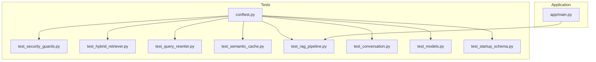
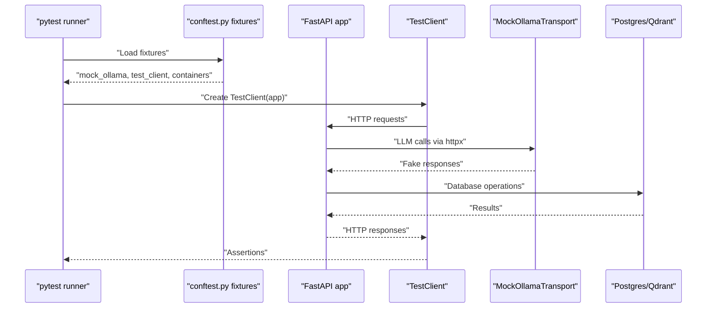
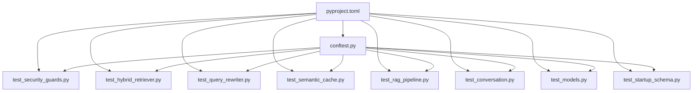

# Unit Testing Framework

<cite>
**Referenced Files in This Document**
- [conftest.py](file://safe4ai-pilot/tests/conftest.py)
- [test_security_guards.py](file://safe4ai-pilot/tests/test_security_guards.py)
- [test_hybrid_retriever.py](file://safe4ai-pilot/tests/test_hybrid_retriever.py)
- [test_query_rewriter.py](file://safe4ai-pilot/tests/test_query_rewriter.py)
- [test_semantic_cache.py](file://safe4ai-pilot/tests/test_semantic_cache.py)
- [test_models.py](file://safe4ai-pilot/tests/test_models.py)
- [test_rag_pipeline.py](file://safe4ai-pilot/tests/test_rag_pipeline.py)
- [test_conversation.py](file://safe4ai-pilot/tests/test_conversation.py)
- [test_startup_schema.py](file://safe4ai-pilot/tests/test_startup_schema.py)
- [main.py](file://safe4ai-pilot/app/main.py)
- [pyproject.toml](file://safe4ai-pilot/pyproject.toml)
</cite>

## Table of Contents
1. [Introduction](#introduction)
2. [Project Structure](#project-structure)
3. [Core Components](#core-components)
4. [Architecture Overview](#architecture-overview)
5. [Detailed Component Analysis](#detailed-component-analysis)
6. [Dependency Analysis](#dependency-analysis)
7. [Performance Considerations](#performance-considerations)
8. [Troubleshooting Guide](#troubleshooting-guide)
9. [Conclusion](#conclusion)
10. [Appendices](#appendices)

## Introduction
This document explains the Private AI system’s unit testing framework built with pytest. It focuses on the test configuration in conftest.py, including database fixtures, mock configurations, and dependency injection patterns. It also documents testing approaches for security guards, hybrid retriever, query rewriter, and semantic cache, along with strategies for mocking external dependencies like LLM providers and vector databases. Practical guidance is provided for writing effective unit tests, implementing fixtures, organizing test classes, assertion patterns, parameterized testing, and test isolation techniques. Specific examples are drawn from the codebase to illustrate AI components, database models, and utility functions.

## Project Structure
The testing suite resides under safe4ai-pilot/tests and uses pytest with asyncio support. The configuration is centralized in conftest.py, which defines shared fixtures for mocking LLM providers, vector databases, and FastAPI test clients. Additional test files validate components such as security guards, hybrid retriever, query rewriter, semantic cache, RAG pipeline, conversation management, database models, and startup schema initialization order.

**Diagram sources**
- [conftest.py:1-88](file://safe4ai-pilot/tests/conftest.py#L1-L88)
- [test_security_guards.py:1-305](file://safe4ai-pilot/tests/test_security_guards.py#L1-L305)
- [test_hybrid_retriever.py:1-169](file://safe4ai-pilot/tests/test_hybrid_retriever.py#L1-L169)
- [test_query_rewriter.py:1-53](file://safe4ai-pilot/tests/test_query_rewriter.py#L1-L53)
- [test_semantic_cache.py:1-107](file://safe4ai-pilot/tests/test_semantic_cache.py#L1-L107)
- [test_rag_pipeline.py:1-264](file://safe4ai-pilot/tests/test_rag_pipeline.py#L1-L264)
- [test_conversation.py:1-132](file://safe4ai-pilot/tests/test_conversation.py#L1-L132)
- [test_models.py:1-58](file://safe4ai-pilot/tests/test_models.py#L1-L58)
- [test_startup_schema.py:1-23](file://safe4ai-pilot/tests/test_startup_schema.py#L1-L23)
- [main.py:1-154](file://safe4ai-pilot/app/main.py#L1-L154)

**Section sources**
- [pyproject.toml:84-98](file://safe4ai-pilot/pyproject.toml#L84-L98)
- [conftest.py:1-88](file://safe4ai-pilot/tests/conftest.py#L1-L88)

## Core Components
- Test configuration and fixtures:
  - Mock Ollama transport returning canned responses without hitting a real LLM provider.
  - FastAPI TestClient fixture for unit tests that do not require a real database.
  - Docker-based fixtures for PostgreSQL and Qdrant containers for integration tests.
- Async testing:
  - Tests are marked with pytest-asyncio to support async components such as retrievers and caches.
- Shared constants and helpers:
  - Fake embeddings and responses are reused across tests to simulate vector and LLM interactions.

Key fixtures and their roles:
- mock_ollama: Provides an httpx.Client transport that simulates Ollama endpoints for generate, embeddings, and tags.
- test_client: Creates a FastAPI TestClient bound to the application instance.
- pg_container and qdrant_container: Spin up real containers for integration tests requiring Postgres and Qdrant.

**Section sources**
- [conftest.py:10-88](file://safe4ai-pilot/tests/conftest.py#L10-L88)
- [pyproject.toml:50-57](file://safe4ai-pilot/pyproject.toml#L50-L57)

## Architecture Overview
The testing architecture separates concerns into:
- Unit tests: Use mocks and the TestClient to isolate components and avoid external dependencies.
- Integration tests: Use Docker containers for Postgres and Qdrant to validate end-to-end behavior.
- Mock transport: Centralized HTTP mocking for LLM providers to ensure deterministic and fast tests.

**Diagram sources**
- [conftest.py:35-88](file://safe4ai-pilot/tests/conftest.py#L35-L88)
- [main.py:63-154](file://safe4ai-pilot/app/main.py#L63-L154)

## Detailed Component Analysis

### Security Guards Testing
Security guards include InputGuard, ContentFilter, OutputFilter, and UploadValidator. Tests validate:
- InputGuard behavior for length limits, prompt-injection patterns, and HTML stripping.
- ContentFilter behavior for PII detection, blocked terms, and default filtering.
- OutputFilter behavior for PII leakage prevention and long-answer warnings.
- UploadValidator behavior for file extension, content-type, magic bytes, and size checks.

Mocking strategies:
- patch external libraries (e.g., magic.from_buffer) to control file type detection.
- Use local helper functions to construct RankedChunk instances for consistent inputs.

Assertion patterns:
- Assert allowed flag and reason strings.
- Validate that sensitive data is removed or blocked.
- Confirm safe filenames adhere to UUID4 format.

**Section sources**
- [test_security_guards.py:1-305](file://safe4ai-pilot/tests/test_security_guards.py#L1-L305)

### Hybrid Retriever Testing
HybridRetriever tests focus on:
- Retrieval with reciprocal rank fusion (RRF) combining sparse and dense signals.
- Filtering by document IDs and routing to specific collections.
- BM25 index updates and payload handling.
- Empty collection scenarios.

Mocking strategies:
- Patch QdrantClient and internal embedding calls to return fake vectors.
- Use MagicMock to simulate Qdrant responses and payloads.
- Reuse FAKE_EMBEDDING constant for deterministic embeddings.

Assertion patterns:
- Verify RetrievedChunk types and chunk IDs.
- Inspect query filters and collection routing arguments.
- Confirm payload fields and doc_id filtering.

**Section sources**
- [test_hybrid_retriever.py:1-169](file://safe4ai-pilot/tests/test_hybrid_retriever.py#L1-L169)
- [conftest.py:25-31](file://safe4ai-pilot/tests/conftest.py#L25-L31)

### Query Rewriter Testing
QueryRewriter tests validate:
- Successful rewrite using mocked HTTP responses.
- Fallback behavior when LLM provider is unavailable.

Mocking strategies:
- Patch httpx.AsyncClient to return controlled responses or raise connection errors.
- Use AsyncMock for context manager methods (__aenter__/__aexit__) and HTTP calls.

Assertion patterns:
- Compare rewritten output against expected text.
- Verify fallback returns the original query on failure.

**Section sources**
- [test_query_rewriter.py:1-53](file://safe4ai-pilot/tests/test_query_rewriter.py#L1-L53)

### Semantic Cache Testing
SemanticCache tests validate:
- Lookup behavior with cache hits and misses.
- Storage of responses, citations, and source identifiers.
- Invalidating entries by document ID.
- SQL vector casting for similarity comparisons.

Mocking strategies:
- Patch the embedding method to return FAKE_EMBEDDING.
- Use MagicMock to simulate database operations (execute, fetchone, add, commit).

Assertion patterns:
- Verify returned response and citations on hits.
- Confirm database calls for add/commit and invalidate operations.
- Inspect SQL statements for explicit vector casting.

**Section sources**
- [test_semantic_cache.py:1-107](file://safe4ai-pilot/tests/test_semantic_cache.py#L1-L107)
- [conftest.py:25-31](file://safe4ai-pilot/tests/conftest.py#L25-L31)

### RAG Pipeline Testing
RAG pipeline tests validate:
- Query flow: retrieval, reranking, generation, and citation construction.
- Ingestion of PDFs: native text vs. OCR paths, page metadata, and status transitions.
- Payload construction for Qdrant including OCR quality indicators.

Mocking strategies:
- Patch PdfReader, convert_from_path, OCR, embedding batch, and QdrantClient.
- Use AsyncMock for async operations and MagicMock for sync collaborators.

Assertion patterns:
- Verify answer text, citation types, and scores.
- Confirm database commits and status updates during ingestion.
- Validate Qdrant payload fields such as ocr_quality.

**Section sources**
- [test_rag_pipeline.py:1-264](file://safe4ai-pilot/tests/test_rag_pipeline.py#L1-L264)

### Conversation Management Testing
ConversationManager tests validate:
- Session creation, loading, saving, and recent message retrieval.
- Error handling for missing sessions and invalid state JSON.
- Safe serialization by stripping unsafe control characters while preserving newlines.

Mocking strategies:
- Use MagicMock to simulate database rows and operations.

Assertion patterns:
- Verify session IDs, state dumps, and error types.
- Confirm control character removal and newline preservation.

**Section sources**
- [test_conversation.py:1-132](file://safe4ai-pilot/tests/test_conversation.py#L1-L132)

### Database Models and Startup Schema Testing
Model and schema tests validate:
- Isolation of PrivateAIState defaults across instances.
- Presence of expected database tables and column sets.
- Settings parsing for allowed origins.
- Startup schema initialization order: pgvector extension before table creation, and schema creation before job recovery.

Mocking strategies:
- Import and inspect application code without running services.

Assertion patterns:
- Use set membership to verify tables and columns.
- Parse and compare settings lists.

**Section sources**
- [test_models.py:1-58](file://safe4ai-pilot/tests/test_models.py#L1-L58)
- [test_startup_schema.py:1-23](file://safe4ai-pilot/tests/test_startup_schema.py#L1-L23)
- [main.py:35-40](file://safe4ai-pilot/app/main.py#L35-L40)

## Dependency Analysis
The test suite relies on:
- pytest and pytest-asyncio for async test execution.
- httpx for mocking LLM provider HTTP endpoints.
- testcontainers for Postgres and Qdrant integration tests.
- FastAPI TestClient for application-level tests.

**Diagram sources**
- [pyproject.toml:48-98](file://safe4ai-pilot/pyproject.toml#L48-L98)
- [conftest.py:1-88](file://safe4ai-pilot/tests/conftest.py#L1-L88)

**Section sources**
- [pyproject.toml:48-98](file://safe4ai-pilot/pyproject.toml#L48-L98)

## Performance Considerations
- Prefer unit tests with mocks over integration tests to reduce runtime and resource usage.
- Use deterministic fake embeddings and responses to avoid flaky timing-dependent tests.
- Limit the scope of patches to minimize overhead and improve readability.
- Group related tests to reduce repeated fixture setup costs.

## Troubleshooting Guide
Common issues and resolutions:
- Docker not available:
  - pg_container and qdrant_container skip tests when Docker is not present. Install Docker or run unit-only tests.
- LLM provider unavailability:
  - mock_ollama ensures tests succeed even if the real provider is down. Verify that AsyncClient is patched correctly.
- Async test failures:
  - Ensure tests are marked with pytest-asyncio and use AsyncMock for async collaborators.
- Database fixture failures:
  - Confirm Postgres and Qdrant containers are reachable and initialized. Check network and port exposure.
- Assertion failures on vector casting:
  - Verify SQL inspection logic and ensure the embedding method is patched to return FAKE_EMBEDDING.

**Section sources**
- [conftest.py:64-88](file://safe4ai-pilot/tests/conftest.py#L64-L88)
- [test_semantic_cache.py:96-107](file://safe4ai-pilot/tests/test_semantic_cache.py#L96-L107)

## Conclusion
The Private AI system’s pytest framework emphasizes isolation, determinism, and clarity. conftest.py centralizes shared fixtures and mocks, enabling focused unit tests for AI components, database models, and utilities. By leveraging AsyncMock, MagicMock, and containerized integration fixtures, the suite validates both behavior and correctness across the stack. Following the patterns documented here ensures reliable, maintainable, and efficient unit tests.

## Appendices

### Writing Effective Unit Tests
- Use helper factories to construct test inputs consistently.
- Prefer AsyncMock for async collaborators and patch external HTTP clients.
- Keep assertions precise and focused on observable behavior.
- Avoid global mutable state; rely on fixtures and local mocks.

### Implementing Test Fixtures
- Define reusable fixtures in conftest.py for shared mocks and clients.
- Scope fixtures appropriately (session vs function) to balance speed and isolation.
- Use patch context managers to limit the scope of mocks.

### Organizing Test Classes
- Group related tests in separate files per module (e.g., security guards, retriever).
- Use descriptive function names that state the scenario and expected outcome.
- Add markers for integration and smoke tests to control execution.

### Assertion Patterns
- Assert allowed/reason tuples for security components.
- Validate types and field presence for AI outputs (e.g., RetrievedChunk, Citation).
- Inspect SQL statements and call arguments for database and vector operations.

### Parameterized Testing
- Use pytest.mark.parametrize for multiple inputs and expected outcomes.
- Combine with fixtures to vary model names, thresholds, and payloads.

### Test Isolation Techniques
- Use MagicMock/MagicMock to replace collaborators and avoid side effects.
- Patch imports at the boundary of the module under test.
- Reset state between tests and avoid relying on shared mutable fixtures.