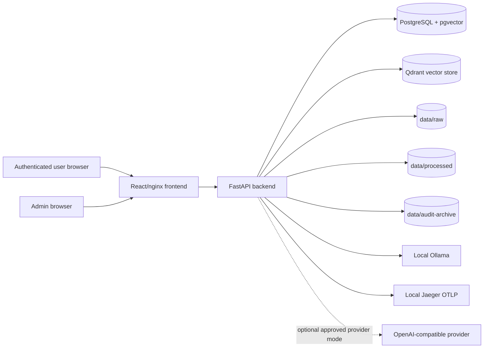

# Data-Flow Diagram

Date: 2026-06-12
Audience: customer security reviewers

This diagram shows the default local/on-prem Safe4AI deployment. Hybrid or
cloud provider modes add an approved outbound path from the backend to the
configured OpenAI-compatible provider.

## Ingestion flow

1. User uploads a document through the frontend.
2. Backend validates MIME type and size.
3. Backend stores the original file in `data/raw`.
4. Background ingestion parses/OCRs the file, chunks content, embeds chunks,
   writes metadata to PostgreSQL, and writes vectors to Qdrant.
5. Ingestion status is visible to admins.

## Query flow

1. User sends a question through the frontend.
2. Backend authenticates the session, enforces CSRF and quota/tier checks, and
   records a chat session.
3. Backend rewrites/routes the query, retrieves chunks from Qdrant and
   PostgreSQL-backed cache, reranks, generates an answer, filters output, and
   returns citations.
4. Backend writes `audit_logs`, `agent_runs`, feedback/cost metadata, and
   updated session state to PostgreSQL.
5. OpenTelemetry spans are exported to the configured local OTLP collector.

## Data leaving the customer environment

Local mode:

- No prompts, answers, documents, audit rows, users, or vectors leave the
  customer environment.

Hybrid or cloud provider mode:

- Prompts and selected context sent to the configured provider leave the local
  environment.
- Provider API keys are stored as secrets and are never written to audit logs.
- This mode must be approved in the customer data-flow review.

## Storage responsibility

PostgreSQL, Qdrant, raw files, processed files, audit archives, backups, and
WORM/immutable retention are customer-owned storage-layer controls.
